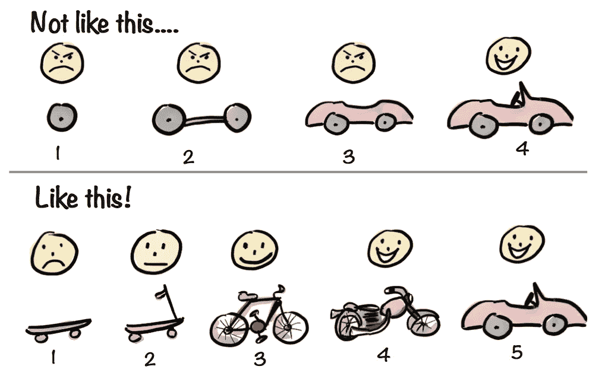

# 简而言之敏捷:执行概述

> 原文：<https://medium.com/hackernoon/agile-in-a-nutshell-an-executive-overview-db19f3400c1a>

Harold Campbell, Shane Ferley and Brain Leke

# 目前的问题是什么？

> 非敏捷交付方法是昂贵的、缓慢的，并且经常交付需要昂贵的返工的软件。此外，这些交付方法通常不能交付预期的客户和业务价值。真扫兴。

一些影响使用非敏捷交付方法的组织的常见问题包括:

*   昂贵的项目交付成果
*   昂贵的返工
*   延迟的项目
*   错过的市场机会
*   无法为客户提供有意义的价值
*   许多“意外”的复杂性
*   成本的膨胀
*   固有的“浪费”根植于僵化的流程中，并通过组织文化得到强化
*   孤立的团队
*   团队之间协作不佳
*   交付的“编码然后修复”方法
*   难以“快速”应对市场变化
*   产品交付和预期客户价值之间的长期反馈循环
*   分阶段 SDLC
*   很少或没有可预测性(例如，质量、进度、风险、成本、价值等。)
*   强烈关注过程和工具，而不是交付“实际的”业务和客户价值

# 什么是敏捷？

嗯。那么这个[敏捷](https://hackernoon.com/tagged/agile)是什么东西呢？

> 敏捷是一组有效交付软件的交付方法、原则和实践，利用协作和客户反馈。

有各种各样的敏捷交付方法，比如:

*   经验值
*   scrum/看板/Scrumban
*   安全/不安全/爸爸
*   频分复用
*   透明的
*   适应性[软件开发](https://hackernoon.com/tagged/software-development)
*   精益软件开发

然而，敏捷的核心实际上是四件事:

1.  **交付**:关注收入和学习
2.  **协作**:关注信任和团队协作
3.  **反思**:关注洞察力、改进(和庆祝成功)
4.  **改进**:关注实验和*实际*变化(包括数据驱动的决策和假设验证)

阿利斯泰尔·考克伯恩(《敏捷宣言》的合著者)将这四个原则称为敏捷的核心。

参见:[http://heartofagile.com/expanding-the-diagram/](http://heartofagile.com/expanding-the-diagram/)

此外，当使用敏捷交付方法时，我们使用迭代过程来以短而有规律的间隔交付小的价值增量(也称为冲刺，或者迭代)。这些迭代通常持续 2 或 4 周。

Steven Thomas: Iterative Incremental

参见:[http://its adeliverything . com/revising-the-iterative-incremental-Mona-Lisa](http://itsadeliverything.com/revisiting-the-iterative-incremental-mona-lisa)

然而，仅仅有短的迭代，在每个迭代结束时没有业务或客户价值被交付，真的没有帮助。

我们两者都需要:迭代过程*和*价值的增量交付。

Henrik Kniberg: Iterative Incremental

另见:[https://www . mountaingoatsoftware . com/blog/agile-need-to-be-both-iterative-and-incremental](https://www.mountaingoatsoftware.com/blog/agile-needs-to-be-both-iterative-and-incremental)

**交付团队是什么样子的？**

简短的回答:这取决于你正在使用的敏捷的“味道”。

例如，看板是结构不可知的。而另一种流行的方法 Scrum 有如下结构:

*   1 名产品负责人
*   1 个 Scrum Master
*   开发团队(生产实际产品的人):QA、分析师、UX、开发人员等。

回到那个迭代过程，坚持使用 Scrum，他们的过程可能如下图所示。

Scrum’s delivery process

# 为什么是敏捷？

> 保持相关性、创新和增加股东价值是公司利用敏捷进行交付转型的一些关键原因。好处是相似的，但范围更广。

采用敏捷交付方法的其他好处包括:

*   更快乐、更高效的员工
*   “更健康”的交付团队和工作环境
*   客户的快速反馈
*   业务和市场假设的早期验证
*   增加创新
*   更可预测的产品交付成本
*   更短的交付周期
*   风险较低的产品交付
*   更可预测的周期/节奏(例如发布、检查和调整等。)
*   持续关注改进

# **敏捷交付价值观**

> 只有四个价值观指导着敏捷交付方法。

这四个值是:

1.  专注于交付**工作软件**
2.  关注**客户协作**
3.  关注**个人及其互动**
4.  关注**应对变化**

参见:[http://agilemanifesto.org](http://agilemanifesto.org)

这四个价值与敏捷的四个核心原则直接相关(如上所述)。

Scrum，看板，XP，SAFe，*insert-shiny-new-agile-thing-here*，(等等。)都只是建立在这四个价值观上的框架/方法。不同的方法(或各种组合)将更适合不同类型的团队或组织——没有一种真正的方法！

一旦你的交付方法基于以上四个价值观，*和*有意识地关注交付、协作、反思和改进， ***你就会变得敏捷*** 。

# 对高管的要求是什么？

> 组织的转变需要思维的转变，最有可能的是组织结构和流程的改变。

高管需要引领变革。这通过以下方式实现:

*   改变心态
*   从命令和控制转向相互学习
*   勇敢(脆弱)
*   采用敏捷价值观和原则
*   关注交付价值与满足截止日期和计划
*   保持透明
*   从“短暂”失败中学习
*   接受这样的事实:采用一些敏捷交付实践 ***将*** 需要组织内的结构变化(例如 DevOps)。

# 你如何在你的组织中采用敏捷方法？

同样，和大多数敏捷的事情一样，这要视情况而定。

> 采用可以被看作是一个双管齐下的转型计划——它需要改变文化原则和交付实践。

## 文化原则

文化是一种无形的东西，它会阻碍公司内部的变革。正是*这个*东西体现了这个组织的精神。因此，采取由内而外的系统方法来改变文化规范、假设和信仰至关重要。这就是“彻底转变”需要发生的地方。

为了实现这一点，有一些核心原则应该在公司内部采用和推广。具体而言，这些包括:

*   服务型领导
*   辅导—流程、技术、领导和行为
*   持续学习——在组织、团队和个人层面推广；并且在计划期间被编入预算和考虑在内
*   频繁的反思——回顾、冲刺/迭代评审等。
*   个人反馈——有效/影响反馈、速配反馈等。
*   作为指南而非承诺的评估—从日期驱动的计划转变为价值驱动的计划。工程工作量估算*应该被*视为指南，而不是不可更改的“神圣”承诺。这促进了透明度，并确保了事实、假设和依赖性，或者知识和经验(例如，团队的变化)的任何变化，只要知道它们，就会被共享

Harold Campbell and Brain Leke: All Estimates are lies!

*   数据驱动的决策—PDCA/构建、测量、学习/OODA 模型
*   价值的增量交付—见上文

## 交付实践

另一个极端是交付实践。这些变化直接涉及到我们交付软件的方式。

这些实践通常包括:

*   工程实践——采用测试驱动的开发，结对，拥有一个代码库，开发人员经常提交代码(例如，每天或者每周)等等。
*   devo PS——专注于获得快速构建反馈、报告、自动化测试、提高代码质量、持续集成和持续软件交付的实践
*   同处一地——尽可能让开发团队在一起，或者能够轻松地协作
*   队列中的小批量
*   在制品限制
*   自组织团队
*   持续的团队/自我评估
*   透明而不遮掩
*   迭代软件开发——见上文
*   交付团队提供对工程工作的评估——做这项工作的人进行评估
*   经验主义—使用假设验证的数据驱动决策(例如，计划-执行-检查-行动/构建-测量-学习)

# 后续步骤

> 选择一种方法并开始。无论你是从 Scrum 还是看板开始，都没有关系。简单地开始。

然而，不管你的组织是否成熟，重要的是你有一个持续改进你的交付、协作和反思过程的过程。

特别感谢谢恩·菲利和布莱恩·乐可为创作这篇文章做出的贡献和反馈！