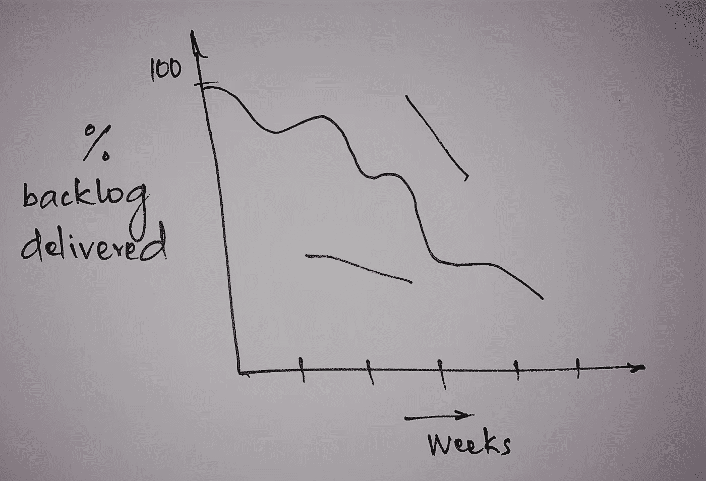
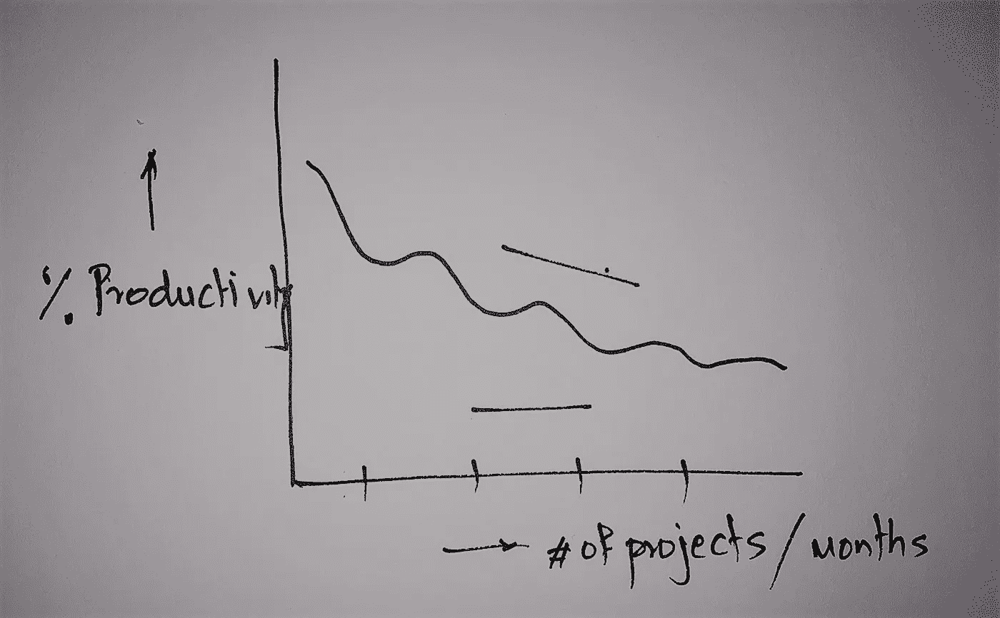

# 敏捷不适

> 原文：<https://medium.com/hackernoon/agile-malaise-e52b8c6dc5ff>

你们中有多少人经历过*冲刺耗尽*？这是我最大的挑战。不是消耗图表，而是每天冲刺消耗对我来说是一个更大的问题。

你如何实现**可持续的**敏捷实践？

可持续，这样我就有了**可预测的**成果。Dilbert fame 的 Scott Adams 说[系统比目标](http://blog.dilbert.com/2013/11/18/goals-vs-systems/)运行得更好。这是转述他的话，但是问问你自己，你见过多少次，即使是你最聪明的程序员，经历生产力下降？如果你管理过一个项目，你会受到这些看似随机的生产力打击。

盯着快速逼近的项目结束日期，这种情况太常见了。作为回应，我们设置了更加严格的冲刺周期。更糟糕的是，试图延长故事点(*或一些类似的度量*)。有些东西必须放弃。

在 ***萎靡不振*** 之后，项目开始看起来[像这样](https://www.mountaingoatsoftware.com/blog/should-companies-measure-productivity-in-story-points-ideal-days):

Sprint 倦怠在一个项目中很常见，更不用说跨几个项目了。

这种*倦怠*很可能源于简单的**人类行为**。一连串连续的目标使头脑变得迟钝。迟钝的头脑等于迟钝的表现。

养成终身健康的习惯更容易，比如晨跑，然后是 20 磅的减肥目标。那么短跑能更像是一种习惯吗？编码会变得像喝咖啡一样正常吗？我可以使用恰尔迪尼的 [*预劝说*](https://www.forbes.com/sites/danschawbel/2016/09/06/robert-cialdini-how-to-master-the-art-of-pre-suasion) 技巧来提高效率吗？

> 向客户交付价值能够变得自主吗？

在未来的博客中，我会写一些我们已经实现的对敏捷的*预先调整*。早期结果很有希望。

与此同时，我希望收到你的来信。我的情况很独特吗？你如何处理这个？