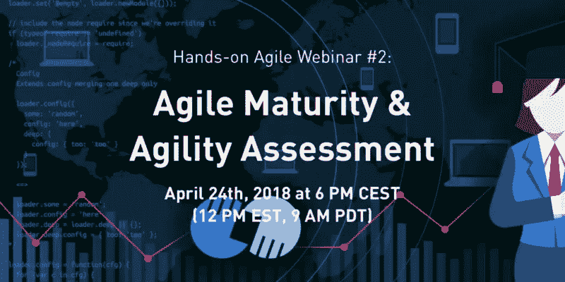

# 敏捷成熟度和敏捷性评估(网络研讨会#2 重播)

> 原文：<https://medium.com/hackernoon/agile-maturity-51c2908cf3e0>

敏捷成熟是一种时尚还是一种趋势？在开始转换之前，组织如何做出一个明智的决策，来决定什么样的敏捷水平是可以实现的？

我们的第二次网络研讨会讨论了敏捷成熟度的问题，并详细介绍了表明敏捷组织的调查结果。此外，我们引入了“敏捷评估框架”开源项目，旨在为敏捷实践者提供回答这些问题所需的工具。

**注意**:如果浏览器不能自动播放视频，点击这里直接在 Youtube 上观看[网上研讨会敏捷成熟度和敏捷评估的重播。](https://www.youtube.com/watch?v=XtESMQ2wcm8)

## 如果你喜欢这篇文章，帮我一个忙👏👏 👏多次—您的支持对我来说意味着一切！

***如果你更喜欢邮件通知，请*** [***注册我的每周简讯***](https://age-of-product.com/subscribe/?ref=Food4ThoughtMedium) ***，加入 18683 位同行。***

# 网上研讨会敏捷成熟度相关文章

[如何衡量组织和团队的敏捷性——敏捷成熟度调查的结果](https://age-of-product.com/measure-agility/)

敏捷审计:你的敏捷转变进展如何？

# ✋不要错过:加入 3750 多人的强大的“动手敏捷”Slack 团队

我邀请你加入[“手把手的敏捷”Slack 团队](https://goo.gl/forms/LObbRtSF9vvxN3CL2)，享受来自世界各地的敏捷实践者的快速增长、充满活力的社区带来的好处。

如果你现在想加入，你现在所要做的就是通过谷歌表格提供你的证书，我会帮你注册。对了，**免费的。**

# 🎓你还想这样多读书吗？

好吧，那么:

*   📰*加入 18683 同行和* [*报名我的每周简讯*](https://age-of-product.com/subscribe/?ref=Food4ThoughtMedium)
*   🐦*关注我的* [*推特*](https://twitter.com/stefanw) *订阅我的博客* [*产品时代*](https://age-of-product.com)
*   💬*或者，免费加入* [*Slack 团队的 3750 多名同行“手把手的敏捷”*](https://goo.gl/forms/XIsABn0fLn9O0hqg2) *。*

# 抄本在线研讨会敏捷成熟度和敏捷性评估

欢迎参加关于敏捷成熟度和敏捷评估框架的第二次实践敏捷网络研讨会。所以，在 Zoom 崩溃之前，我们在讨论我深入挖掘这个话题的动机。

我已经厌倦了听人们告诉我，“敏捷在这里行不通。我们尝试过，但失败了，”不管是什么原因。“这是个骗局。这是一种时尚。我为什么要这么做？”我相信这与敏捷工业咨询联合体有很大关系，因为敏捷已经成为一个非常有利可图的行业。我一直在追踪 scrum 联盟的数量，认证的 Scrum 培训师，以及 Scrum 联盟成员的数量。如果你算一下，成为一名认证的 Scrum 培训师应该可以通过认证研讨会获得大约每年 50 万美元的收入。我们有像来自 SAFe 的好人一样的人，他们非常成功地销售某种敏捷软件包。

所以，这是一个有利可图的行业。你在咨询公司学到的第一件事是，当你开始向你的客户销售东西时，你销售的是你已经从抽屉里拿出来的东西。所以，基本上你喜欢模式、框架、方法——甚至更好，因为你可以拿出清单，你确切地知道你可以向客户收取多少费用，以及这一切是如何进行的。我认为这是错误的方法。我们需要为每一个组织找出长期可行的方法，公司可能达到的目标。一刀切是不行的。

让我们从头开始。为什么组织想要变得敏捷？我不知道你们中有谁读过杰夫·萨瑟兰的理论，在一半的时间内做两倍的工作，我相信这仍然是一个非常有问题的标题。当你问他们为什么想变得敏捷，他们想变得更有效率时，结果是来自高层的答案。他们希望物有所值。他们希望以更好的可预测性交付更多、更快的产品。

我的问题是，你想成为一个敏捷的组织，因为你想学习。理想情况下，你希望比你的竞争对手学得更快，对吗？你想给为你工作的人提供自主权、掌控力和目标，因为这不仅仅是挑战世界中的一个优势。这也是必要的，因为只有当你缩小组织规模时，扩展敏捷才有效。你需要把它弄平。你需要去掉一部分等级制度。你需要将决策权下放给最接近要解决的问题的人，对吗？因此，这一方面是为了降低风险，另一方面也是为了提高投资回报。成为一个学习型组织是一件非常有利可图的事情。想想亚马逊，或 Semco，或所有其他想到的公司。

所以，但是从我的角度来看，我们仍然停留在一个惊人的水平上，我想称之为 21 世纪泰勒主义。泰勒先生以及在一定程度上亨利·福特先生应用了 100 多年前的科学管理规则，这导致了职能孤岛、项目、预算和计划，以及所有这些我们必须一直处理的事情，主要是在较大的公司。以我的经验来看，这不仅仅局限于大公司。即使你在一家快速发展的初创公司工作，也不意味着它保留了精益、吝啬和快速的原始文化。

你发展得越快，雇佣有经验的人的压力就越大，这通常意味着你通过雇佣大量有咨询或大公司背景的人，将这种企业文化引入到你快速发展的初创企业中。它不止于此。

因此，变得敏捷，当我们看一看组织正在走的典型旅程时，肯定不缺少任何方式的敏捷实践。我们都知道 Lynn 画的这幅关于 40 多岁的敏捷实践的草图。我对其中一些很熟悉，包括 XSCALE 或大规模 Scrum。这就是我目前正在练习的。当然，我在 Scrum 和看板方面也很有经验。

敏捷性正在扩展到业务中，我认为这是一件非常好的事情。如果您有兴趣了解更多关于业务敏捷性的知识，我推荐业务敏捷性网络。这是埃文·莱伯恩的杰作。你会在展示笔记中找到相关链接。我们之前提到过打包敏捷的方法——其中 SAFe 是最流行的。我不知道你已经看过了 VersionOne 最近的“敏捷状态”调查。据说，至少在参与调查的人中，有近 30%的人使用 SAFe。我怀疑 SAFe 一点也不灵活。他们没有缩减组织规模，而是在其中加入了更多的流程和角色。

我们每个人更熟悉的可能是敏捷洋葱，它很好地向很多人解释了为什么做敏捷而不是变得敏捷如此简单。如果你从过程和工具开始，并在此之上加入一些实践，这并不意味着你变得敏捷了。墙上有白板和站立并不意味着你是敏捷的。这需要更多的时间。

已经有很多测试主要针对团队层面。举个例子，一个非常著名的例子是亨利·克尼伯格的 Scrum 测试。这是一个简单的测试，我也喜欢和新团队一起测试。如果你经常这样做，或者每隔几周就这样做一次，然后你回头看看，你越向右移动，一切都变得越绿，那么你的团队实际上是在正确的轨道上。但是，再说一次，这主要是在团队层面。

因此，在更精细的模型中，有一个是由詹姆斯·肖尔，戴安娜·拉森所做的敏捷流畅项目，它再次关注团队，而不是组织，但是它很好地涵盖了团队的发展和各个阶段。

他们还有敏捷流畅团队诊断工具，很有意思。我刚刚参加了一个关于这方面的主持人研讨会，我尝试了，我和我目前的团队一起运行了它，这很有趣。再一次，举例来说，这是你想要有规律地做的事情。然而，它不适合，也不打算弄清楚，了解现有组织的现状，并弄清楚该组织可能的发展方向。但是它比其他方法有趣得多。

因此，当我们看到一个组织成为一个学习型组织，一个敏捷组织的道路时，通常在任何给定的时刻都会有许多令人困扰的问题。最有趣的一个，敏捷是目的地还是旅程？敏捷成熟听起来像是一个目的地，这就是我不喜欢它的原因。这在某种程度上意味着你达到了一定的水平，然后你就可以走了。相反，我认为这是一个旅程，需要为每个组织精心定制。我们在正确的路线上吗？我们是在走弯路，还是走进死胡同？或者我们在哪里？这很难理解，尤其是如果你有一个 500 人或更多的组织。

你可以很快发现这一点——无论是 50 人还是 100 人的创业，但超过 500 人，就变得非常非常棘手了。我们如何知道我们正在取得进展？您应该跟踪哪些指标？这是什么？是速度吗？当然不是。同样，你需要自己找到北极星。我相信这对于每个组织来说都是一项不同的工作。

最后，投资回报会是多少？我的意思是，我们谈论投资一大笔钱来改变一个组织。这就是它——这就是变化。我们不只是在谈论雇佣一些教练，但我们也必须考虑到我们需要进行大量的投资来实现这一目标。从办公室开始。我认为，在一个有小隔间的开放空间里，你不可能变得敏捷。这种方式根本行不通。

你还必须解决很多人都有的恐惧。你会注意到典型的方法是说，“好吧，你有工作保障，但没有角色保障。”然而，没有角色保障意味着你必须培训员工，给他们时间去适应新的角色，并理解这是如何运作的。这是一项意义重大的投资，问题总是，好吧，我们应该投资多少，投资回报是多少？每个试图成为敏捷组织的组织都应该成为 holacracy 或类似的组织？最好我不这么认为。也许，工程组织中的快乐敏捷岛是一个很好的目标。谁会否认呢？

所以这些都是我们在开始做任何预测或陈述之前必须考虑的问题。所以，如果你不确定你是否掌握了所有的信息，你是否完全理解了这个问题，你该怎么办？你可以写一份调查。这是我去年年底做的，大约在 11 月。我问了四个问题:什么因素促使你的团队越来越成熟？你认为团队的成熟度如何？哪些因素有助于成为敏捷或学习型组织？在组织层面上，你注意到什么样的成熟度水平？

现在，最棘手的事情是开放式问题，这使得创建一种分类法成为一项有压力的工作。于是，我翻遍了这 86 个人的所有回答。事实证明，我们可以将这些指标分为三大类。这就是人们在沟通、组织和技术方面的卓越表现。让我向你们介绍一下我们能够识别的指标。所以自我组织，授权给团队。人们想要做决定，他们接受责任。关注结果而不是产出。尊重 Scrum 价值观，所以承诺、专注、开放、尊重、信任以及提出和讨论问题的安全性是首要关注的问题，也是大多数人的重要指标。

团队可以处理他们的问题。人们不想让 scrum 妈妈或 scrum master 做所有的事情。所以表现得像教官的 scrum master 不是首选角色，对吗？相互支持，相互问责，指出人们将敏捷理解为一项团队运动。这不是个人可以处理的事情。

好吧。例如，人们想要选择他们的工具和设计。举例来说，这将有另一种方式来阐述它在后来的技术优势，人们希望选择他们的技术堆栈。一个典型的回答是，如果我被迫使用某种技术，我不能接受对某事的责任。让我选择我的工具，我们准备好了。

人们希望有短的反馈循环，所以用户测试不应该是仅限于 UX 部门的事情。工程师们也想和用户交流。所以传统的客户开发方法非常非常重要。人们希望进行有意义的回顾，建立在心理安全的基础上，他们可以解决对他们来说有问题的问题。

持续的团队辅导:人们希望花时间在他们所做的事情上变得更好。这意味着如果你有不止一个团队，你必须投入时间在分会，公会和部落上，你需要考虑如何建立一个内部学院来分享每个人每天获得的知识。期望利益相关者履行他们的职责，并且实践经验比资格主义更有价值。所以人们没有兴趣看到其他人挥舞着他们的证书。对人们来说，更重要的是某人有实践经验，仅仅是他或她以前经历过这种特定的情况，知道如何处理它们。

能力:敏捷组织的一个指标是塑造人。所以你擅长一件事，真的擅长一件事，但你在许多其他事情上也很好，同样，这要求你在团队和组织内部不断学习。它还要求你积极分享知识。所以是关于持续的知识。这也是因为你不再鼓励组织隐瞒知识。

人们希望看到通过分享知识做出贡献的人得到回报，而不是相反。同样显而易见的是，人们希望有预算来参加会议，结识新朋友，与同龄人见面，并向其他人学习。没有必要一遍又一遍地重复发明轮子。我认为这也是为什么，例如，国际实践敏捷 Slack 社区如此成功的原因，因为你可以提出问题，并且你可以在短时间内由知识渊博的人得到体面的回答。

所以精通团队建设，跨职能团队，人们希望对他们交付的东西负责，这要求你不仅被允许选择你的工具，而且你在你的团队中拥有所有必要的技能，你可以交付端到端的稳定，长期存在的团队。在项目之间调动全职员工是一个疯狂的想法。职业军人如此专注于保持团队团结是有原因的，因为否则你怎么能达到对其他人技能的这种理解水平？不管怎样，我想你知道我的意思。

好吧，有经验的 Scrum 大师的支持，是的，但不是以教官的形式。更重要的是有一个导师，有一个教练或在某些情况下你可以与之交谈的人，并指导我们如何解决问题。

目标:目标是围绕包容而建立的。它从产品发现、创建产品路线图和发布计划开始。我猜我们大多数人都在软件领域工作。因此，利益相关者在晚上将需求文档扔过围栏，然后工程师开始编码的想法已经完全过时了。我的经验是，越早让工程师参与进来越好。我在让工程师进行用户访谈方面取得了巨大的成功，这比其他任何形式的交流或知识传播都要成功得多。

沟通和控制，信任和尊重——我们都在同一个团队，对吗？我们希望诚实，我们欣赏坦诚的反馈，所以不要出现有人理直气壮地说:“你为什么不告诉我？”如果你能安全地交流这一点，你就能解决让每个人都感到麻烦的问题。

解决冲突:人们同意英特尔/亚马逊的“不同意但承诺”方法并不意味着没有冲突、沟通或讨论，让我这么说吧。但最终，每个人都希望团队能够团结一致，不要妥协。我得检查一下。它指的是，好吧；我们坚持我们的价值观。我们没有犹豫不决。这就是我们所做的，在我们的价值观上没有妥协。如果我们的价值观之一是交付体面的代码质量，我们不会在这方面做出任何妥协。

非暴力沟通，这在我看来是显而易见的。如果沟通的水平和方式不是非暴力的，你如何创造一个让人们感到安全的环境来解决关键问题并给出坦诚的反馈？合作:对政治游戏零容忍。因此，产品构建者社区中的每个人都受够了这一点，我认为这是任何一个崭露头角的敏捷组织的领导层需要解决的最重要的问题之一。所以没有照本宣科的合作。

人们也厌倦了将这些价值观印在海报上，然后贴在墙上。文化和价值观是在你不注意的时候发生的事情。没有隐瞒知识的动机——这是另一个问题。所以这整个政治游戏，“我不会告诉你我所知道的，所以你会失败，”是不可接受的。我们都是团队合作。我们希望为客户提供价值，这就是我们的组织。没有指责，没有责备。没用的。如果有问题，解决它，但不要开始对一个可能被拘留或可能被指责为整个问题的人进行政治迫害。

有趣的是，人们想要一种拥抱失败、赞美失败的文化。我发现这很有趣。我不确定庆祝失败是什么意思。可能只是把一件 t 恤送给一个成功打破管道的人。另一个有趣的观点是好奇心是一种常态。所以，再一次，它更像是这种孩子般的学习方法，全身心投入，充满好奇心，不害怕离开你的舒适区。弄清楚什么对你的组织有效，不要成为教条主义者，坚持某种神圣的书籍。

透明度:人们需要各个层面的信息和数据。他们想结束这种获取信息或在管理层中雇佣信息经纪人的习惯。这是大多数人的痛苦。领导应该关注创新、质量和商业价值，它需要完全支持敏捷的工作方式。

与此同时，如果每个人都意识到，好吧，我们需要改变我们的工作方式，那么如果敏捷能够成为组织的核心，人们会很感激。这种方式已经行不通了。当然，他们希望角色、原则和流程得到尊重。所以我认为我们大部分时间面对的最突出的受害者是 Scrum 中的产品所有者角色，它很容易被降级，从而变得越来越低效。

人们期望经理成为仆人式领导。所以，把一个知道如何解决每个问题的人换成一个支持团队解决问题的人。人们期待并相信团队会享受怀疑的好处，他们会交付他们想要交付的东西。他们还期望提供变得敏捷所需的工具和设施。

所以不要让我写一份状态报告，然后把它放在邮箱里。如果你想知道是怎么回事，亲爱的经理，我们每天 11:15 左右有一个标准，邀请你加入。好吗？我们有很多白板，我们会向您解释一切。请到我们创造价值的地方来。

当然，就组织设计而言，大多数为首实体都有功能孤岛。人们还希望看到多余的中层管理人员被移除。当然，商品控制也是一个问题。我的意思是，如果你不相信最接近问题的团队能找到解决问题的方法，你怎么能变得敏捷呢？

此外，人们指出人力资源，新的人力资源需要与自组织团队的新需求保持一致。例如，头衔在某些组织中是一个问题。如果你给某人一个高级开发人员的头衔，而这个人表现得像一个高级开发人员或者 Scrum 团队中的技术领导，那么确实有问题。理想情况下，组织应该演变成一个团队的团队。

人们希望有明确的目标。因此，所有参与者都有一个共同的愿景，一个明确的战略，明确的优先事项。这是爱丽丝梦游仙境的应用，如果你不知道你要去哪里，我们会带你去的。这是注重价值的。是的，我们不是在真空中行动。我们应该为我们的客户提供价值，从而也为我们的组织创造价值。高需求是从项目预算转移到产品团队，所以这是一种实际组织一切的不同方式。

工程水平:我们有通常的嫌疑人，内在质量，代码审查，测试和开发，XP，结对编程。对于很多人来说，这个世界是一个敏捷组织的标准指示器，也是一个定期发布的节奏，并且这个组织设法找到了合适的度量标准，例如，周期时间或交付时间，或者类似的东西。

因此，基于这些指标，我在今年早些时候开始在柏林举办一些研讨会，并询问当地的敏捷社区，“好吧，我们能做些什么呢？我们能不能想出一个敏捷评估框架，我们可以开源，为每个人提供一个工具集，开始评估一个组织成为敏捷、学习型组织的潜力？”

所以问题是:“敏捷适合每个组织吗？”如果没有，或者可能只有在一定程度上，提前知道这一点会很好吗？当时，InfoQ 还更新了 2018 年 Q1 的文化方法图。正如你所看到的，许多敏捷实践，比如 Scrum，同时也是后来者居上。如果你进一步向左移动，我们会遇到更令人兴奋的事情，如跨职能团队，或行为驱动的设计，或团队有选择，全栈产品团队，业务敏捷性，仍处于创新者水平，如在 holacracy 或无估计，以及其他有趣的事情，我们大多数人可能都热衷于体验和尝试自己。

因此，敏捷评估框架背后的想法是，你是一名教练，你空降到一个组织，因为该组织的领导层希望成为。组织想要成为一个敏捷的组织，想要知道去哪里和做什么。它不只是愿意与众多顾问中的一个签订合同，例如，请麦肯锡介绍这种水平的东西。

所以问题是:组织能够提前做出关于变得敏捷的明智决定吗？这就引出了我们能否回答某些问题的问题。例如，组织是否能够并愿意改变？组织大概能去哪里？组织需要在哪些方面做出改变？敏捷性评估框架需要弄清楚这是如何工作的。

这里有一些人。柏林的 ThoughtWorks 目前正在赞助一切。所以他们给我们提供了一个可以见面和工作的房间。天啊，你不会相信这花了两天时间才创造出来。所以，我可以告诉你，创建一个由高度驱动的个人组成的委员会，他们习惯于自己做这件事，这是非常具有挑战性的。但是我们在前进。

我们的想法是，我们有一个多步骤的过程，我们提供了一个工具箱，你可以用它来真正地把事情做好。我将负责的部分是一组问卷，它可以让你在一开始就获得关键问题的答案，从而对组织进行评估，评估组织目前的现状，以及它可能的发展方向。例如，为什么和谁？

为什么组织决定要变得敏捷？典型的回答是:我们想变得更有效率。我们想活得更多更快。我们希望提高可预测性。我认为，这个问题更好的答案仍然是“我们希望通过比竞争对手学得更快来超越他们。”我们想创造一种伟大的文化，我们想最小化风险，提高投资回报。

如果 C 级暂时不愿意接受一个结局下跌，那么这对于整个过渡过程来说，无疑是一个可怕的指标。另一个关键问题是:“谁是决策的发起者？”以我的经验，如果基础想变得敏捷，那是徒劳的。如果领导层想要变得敏捷，但组织的其他部分不想，这将只是下一份财务报告的一部分。

你需要的是一方面来自领导层的支持，清楚地表明组织必须改变。此外，敏捷需要成为组织的 DNA 的一部分，以及来自基地的支持，在战壕中实际工作的人；否则就没用了。

组织背景。当然，你需要了解你所说的是什么样的组织，规模，历史。这是什么文化？这是一个销售驱动的组织还是一个非营利组织？市场至关重要。我们是在谈论传统产品吗？这是一棵垂死的摇钱树吗？我们谈论的是组织或多或少面临创新者困境的情况吗？摇钱树的生命周期状态是什么？接近日落了吗？初级产品是否背负着技术债务，无法解决？公司有哪些客户群？是 B2B，还是 B2C？主要是卖给公共组织吗？法律规范这个行业吗？

就转型而言，如果你将 B2C 公司直接向客户销售任何东西与制药公司试图开发新药进行比较，情况就完全不同了。根据我的经验，一个关键但经常被低估的方面是预算。该组织目前的产品开发资金是如何筹集的？是建立临时项目或计划的传统方法，还是组织已经建立了某种形式的长期产品团队来解决某些问题？

下一个问题是什么样的审批流程？他们是否使用了某种阶段门模式或计量资金，我认为这是一种委婉的说法。或者是产品团队在今年剩下的时间里预先获得资金，我们期望我们在这方面进行投资回报？

下一个问题是谁来控制过渡期的预算？是首席执行官、首席技术官还是首席财务官？预算有多大？产品团队在组织内的协作发展如何，例如，与商业利益相关者、客户、管理层、领导层的协作？他们在实践中是如何做到这一点的？他们如何通过战略、产品组合和产品路线图来实现愿景，并最终交付产品？这是怎么回事？

同样，有人在晚上抛出需求，并期望接收端的产品团队交付吗？我不知道。这是最重要的，因为你会从不同的角度得到很多不同的见解。该组织中团队的性质是什么？比如外包水平如何？有内部团队成员吗？团队里的每个人都是自由职业者还是合同工？或者开发外包给，例如，新的离岸或离岸设施？

团队长寿呢？人们被转移了吗？人们同时在做几个项目吗？是否有一些管理实体可以在任何给定的时间将人们从产品团队中拉出，并将他们放在其他地方？例如，我们有孤立的团队，还是跨职能的团队？例如，许多大型组织仍然运行 QA，这是一个有一定交接的筒仓。当然，如果您想随意部署并拥有一个完全集成的部署管道，您就不能拥有一个测试某些东西的 QA 筒仓；它根本不工作，但团队共同定位它。

另一个大问题是，团队成员是否分散在各处，如果他们不在同一地点，他们是否定期会面？没有什么比面对面的会面更有效率了。如果这是不可能的，你可以马上说，“好吧，这是一个负面指标。”组织是如何雇佣新人的？它始于多样性水平，并不以我们是否在实践团队成员的同伴招募这样的想法而结束。团队是否最终决定谁在团队中工作，谁在后期阶段也对团队可能做出的承诺做出贡献？还是人，新的团队成员是 HR 或者某些领导强加给团队的？是团队自己选择还是有人把他们放在一起？

我们已经讨论过了，这是人力资源在追求老派的职业发展。但是自治主人目的呢？还是说都是为了头衔和证书？团队之间或组织内部的波动率是多少？从这个角度来看，Semco 有一个长达十年的波动率，大约是每年 2%，而不是一个月——一年。如果你考虑一下柏林一家初创公司的员工流动率，我可以说它肯定至少在 30%到 40%左右，也许是每年 50%。这是完全不同的东西。

自由职业者和雇员的关系如何？这两者之间有任何形式的区别吗？或者，从技术上讲，报酬如何处理原则上并不重要？自由职业者和员工的比例是多少？例如，在 20 世纪 90 年代，许多组织、大型组织重视 IT 或软件开发的外包，以专注于核心竞争力。而现在他们明白了，如果组织想要生存，就需要开始拼命开发软件。他们发现很难雇佣到有才华的工程师，因为他们没有这方面的文化。

团队管理:如何管理团队？组织是否以某种方式激励个人而不是团队，这一点至关重要？他们是如何处理失败的？你在我们的交付管道中发现了这个问题，这是不是更像是一种感谢？是的，它使应用程序离线了三分钟，但这很有帮助。现在我们修好了，我们想给你一件 t 恤之类的东西来庆祝一下。

激励机制是另一个有趣的问题，尤其是在销售驱动的组织中。组织是否计划改变激励方案？因为有时候“我有什么好处？”综合症就是反对组织在其他问题上应该有的兴趣。个人激励经常与团队的目标相冲突，产生个人议程和局部最优。所以这是一个问题。

敏捷工作空间。我认为对于任何团队的生产力来说，一个真正被低估的因素是，我们实际上有一个空间可以让团队以敏捷的方式工作吗？我不知道你怎么想，但就我而言，我们非常需要白板。我们需要它们，因为我们喜欢为利益相关者的沟通可视化几乎一切。不仅仅是冲刺板；我们还可视化路线图和积压，技术债务，等等，所以如果你没有墙，你可以把白板，这是棘手的。

你必须找到团队空间，让整个团队坐在一起。你有没有小的临时协作空间，可以坐下来和几个人一起工作？你有没有一些领域，人们真的可以关闭三个小时，专注于做正确的事情，这需要他们的注意力？此外，是否有走出办公室舒适区的异地工作预算？所以很多问题。

对技术，许诺云。我能带上我的技术设备吗？我可以选择自己的工具和软件吗？如果人们被迫在微软的技术平台上工作，他们不会高兴的，对吗？这在今天真的不常见。如果你强迫他们开发某种敏捷应用程序或类似的东西，就可以指望雇佣顶尖的工程师。

同样重要的是理解一个组织到了什么程度，即使它还没有正式敏捷化或者从未开始敏捷化，敏捷实践已经在组织内部使用到了什么程度。很可能，他们是以一种游击模式或一种“我不在乎公司说什么；我们只是这样做。所以问“你用的是什么？”所以你开始，你问设计思维，Scrum，看板，XP，无论你想到什么。

目前，我正在努力把这些问卷弄对。有一件事驱使我去问，我想听听你对此的建议，如何将它传递给社区的其他人？拥有谷歌表单当然很容易，但谷歌表单可能不是问卷的最佳交付模式，例如，因为周围有一些公司，防火墙阻止谷歌应用程序，因为谷歌是邪恶的。那么，如何做到这一点？我不知道。也许有一种方法可以使用 GitHub 来提供源代码。您可以下载然后上传到 Typeform。所以我们还在努力。

好吧。非常感谢你花了一个小时来讨论这个问题，我希望我能给你提供一些想法，告诉你在你的职业生涯中，事情会怎样发展，下一次的转变会是怎样的。如果你想参加，请给我发电子邮件，我们可以稍后再聊。我当然会和你们分享这段录音，我也打算把它转录下来，所以也会有文本。好吧。非常感谢。希望您有兴趣在两周后和我一起学习产品积压反模式，或者在周五和我一起学习 XSCALE 产品管理模式语言。非常感谢。

*原载于 2018 年 8 月 18 日*[*【age-of-product.com】*](https://age-of-product.com/webinar-agile-maturity/)*。*