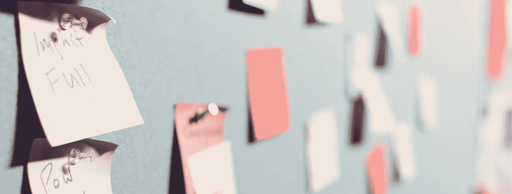

# 敏捷剧场比瀑布造成的伤害更大。

> 原文：<https://medium.com/hackernoon/agile-theatre-is-doing-more-damage-than-waterfall-ever-did-20cb783ccd1b>

每一个从瀑布驱动的过程转向敏捷思维的公司都有一个过渡期。这是必然的。这个过渡期通常被困惑、愤怒和许多错误打断，自封的公司敏捷爱好者大喊“不要惊慌！这就是它应该如何工作！”。

这个时期将以两种方式中的一种结束。

首先，该公司成功地拥抱了敏捷的思维模式，每个人都很高兴，并生活在他们承诺的梦想中，便利贴从 wazoo 出来，白板点缀着风景。

第二个阶段是被称为“敏捷剧场”的漫长时期。这是敏捷思维的一种仪式化的、货物崇拜式的实现，要么加入一些[瀑布](https://hackernoon.com/tagged/waterfall)来填补空白，要么只是一个充满了酝酿中的混乱层的空白。

这不是更好。这比你以前吃的更糟。

在最好的情况下，这只是一个立着的瀑布和一个 trello 板。这不是特别有害，但绝对是浪费每个人的时间。

在最坏的情况下，你已经移除了瀑布的所有安全措施，并继承了所有的风险，这些风险最终会以与西装革履的男人进行一些严肃的谈话而告终。

让我们快速浏览一下敏捷宣言中表达的四个原则:

# **个人和互动**超过**流程和工具**

除非你对个人和互动很认真，否则你不能删除“过程和工具”。你是如何组建你的团队的？它们是跨职能的吗？问题是聚集在一起的，还是项目领域局限于个人？

# 综合文档之上的工作软件

这个软件真的有用吗？它是否通过一套全面的自动化测试进行了全面测试？这不仅仅是放弃对文档的需求。**文档好。**这是关于发货工作的**和完全测试的**软件，不考虑它是否已经完全记录在案。

# 合同谈判中的客户协作

您的客户真的在合作吗？你们定期会面并讨论变化吗？在没有明确替代方案的情况下放弃严格的合同谈判可能是你的企业做过的最危险的事情。

# 响应变化而不是遵循计划

你的成本结构是否允许客户改变主意？如果他们的需求得到满足，他们可以提前终止合同吗？客户对将要交付的东西有一套现实的期望吗(也许是与他们最初设想完全不同的东西？).

如果你想知道你每天做的这些“仪式”有什么该死的意义，也许后退一步，想一想这一切是否只是作秀。

如果你喜欢这篇文章，请记得给它一些掌声，以确保更多的人阅读它！

Steven Poulton 是一名居住在英国曼彻斯特的网站开发人员和技术架构师。在业余时间，他喜欢制作独立音乐，制作独立游戏，和他的独立猫玩耍。