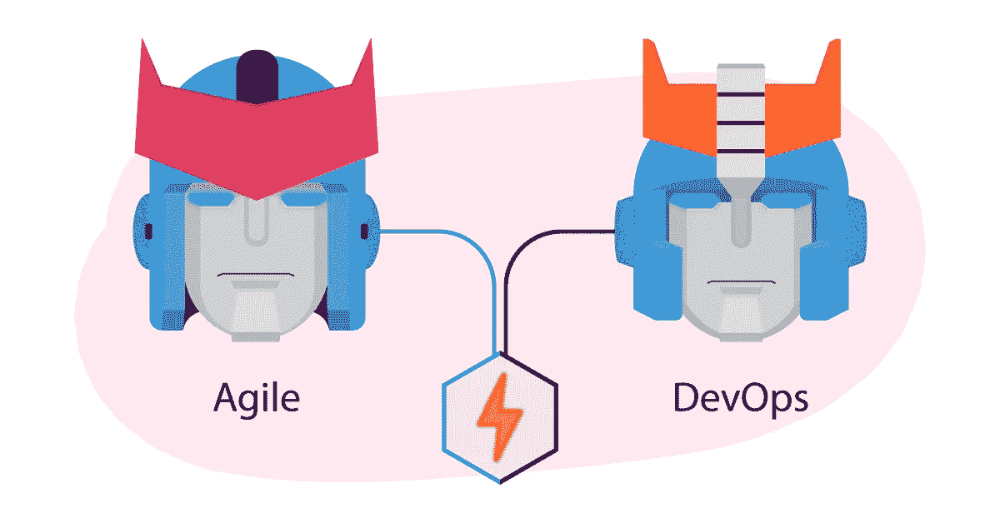
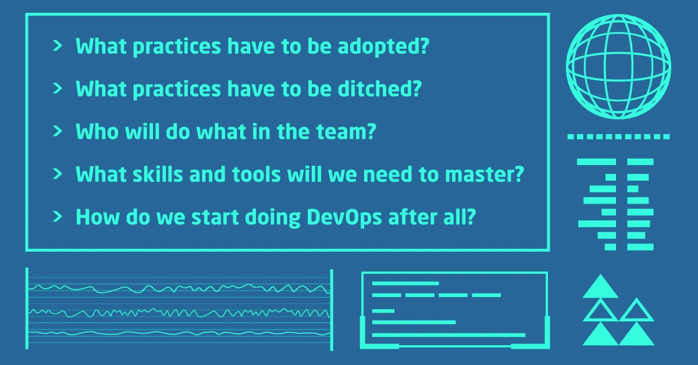

# 敏捷 vs .开发运维:将快速敏捷与精心规划的开发运维结合起来

> 原文：<https://medium.com/hackernoon/agile-vs-devops-merging-fail-fast-agile-with-well-planned-devops-bbf364264656>

故障快速敏捷和计划良好的开发运维是一枚硬币的两面，尽管它们本质上并不相同。通过理解它们的核心价值和实践，合并它们是可能的。

很久以前，敏捷就已经采用了快速失败的方法。这意味着开发人员在试图达到期望的结果时倾向于自由试验，但是他们也很快放弃不能带来期望结果的开发路线。这样做允许最小化客户和软件开发团队的风险，同时确保更可预测的软件交付过程。这也增加了客户在预计的预算和时间范围内得到他们所期望的东西的机会。

另一方面，不建议在 DevOps 中进行此类实验，因为运营基础架构的成本每天可能高达数万美元，而且为了实验而摆弄生产环境是不合理的。这就是为什么在提供基础设施之前，DevOps 团队必须定义项目的结构、范围、主要需求、可能的可伸缩性问题以及确保弹性和不变性的方法。

所有这些对于按时交付软件和确保之后的积极客户体验都是至关重要的，因为与传统的敏捷开发人员不同，DevOps 工程师负责整个软件生命周期，从设计到维护和最终退役。因此，如果不回答几个棘手的问题，将这两种方法结合起来是不可能的:

*   必须采取哪些做法？
*   哪些做法必须摒弃？
*   谁将在团队中做什么？
*   我们需要掌握哪些技能和工具？
*   我们到底如何开始做 DevOps？

这些问题有长有短的答案。短的是“[左移](https://itsvit.com/blog/news/10-devops-trends-need-know-part-3/)”。长的在下面。

# 如何将敏捷与 DevOps 融合

要记住的主要事情是，这两种方法不能以纯粹的形式结合起来，这意味着敏捷实践必须更新。

*   采用的最重要的**实践是 DevOps 的三个基石:**将新代码批次的持续集成**到一个集中的主线中；**向测试环境持续交付**新的构建，并通过滚动更新将它们推向生产环境；以代码**的形式构建**基础设施，其中容器化的应用程序可以部署到用清晰的声明性语言描述的生产环境中，服务器通过代码命令进行供应、配置、管理和退役，而不是手动进行。最后，但并非最不重要的实践是从一开始就构建自动化单元测试，而不是将测试留在软件开发生命周期的预发布阶段。**
*   要放弃的最重要的**实践**是遵循多种敏捷方法，比如 **Scrum 项目管理**。Scrum 是关于微观管理的，每个团队成员宣布自上次 Scrum 以来做了什么，以及是否有任何超出其职责范围的前进瓶颈。真正的 DevOps 工程师很少关心范围，因为这些是跨职能团队，所以每个团队成员都致力于克服手头的挑战，心中有一个清晰的整体图景。此外，每个瓶颈都被视为提供改进空间的系统缺陷，而不是团队成员的错误。
*   如上所述，开发运维团队中没有严格定义的角色，因为同一个人可以构建基础架构、配置 CI/CD 渠道和处理客户的支持请求。这意味着在通往 DevOps 即服务世界的道路上，他们必须学会使用多种工具完成多种任务，并组建全能团队。
*   显然，Dev 和 Ops 工具必须对每个团队成员可用，并且他们必须能够使用它们。跨团队培训和学习对于掌握用于项目管理、沟通和协作的全套 [DevOps 工具](https://itsvit.com/blog/must-devops-tools-make-things-right-get-go/)至关重要；软件开发、测试、部署和监控；基础设施设计、扩展和维护；客户反馈的收集和应用。
*   合并敏捷和开发运维的关键点是接受不同的思维模式。 [DevOps 文化](https://itsvit.com/blog/devops-culture-huge-step-mankind/)是围绕“您构建它，您运行它”的范例构建的，这意味着 DevOps 团队负责所有与软件交付相关的流程和任务。这种[向 DevOps](https://itsvit.com/blog/transition-devops-5-sure-ways-fail/) 过渡的业务工作流程方法必须得到从基层到最高管理层的全心支持，否则肯定会失败。

# 敏捷与开发运维融合的结论

敏捷作为一种软件交付的方法论很久以前就已经转变成了与[的《敏捷宣言](http://agilemanifesto.org/principles.html)中解释的核心价值观和原则大相径庭的东西。然而，这种项目管理方法仍然比瀑布和其他老派方法好得多。接受“快速失败，经常失败”的心态确保了软件交付的迭代方法，其中快速的客户反馈循环帮助开发人员更好地指导他们的工作，并交付客户真正期望的特性。

根据 2017 年 devo PS 采用状况[报告，通过 CI/CD，这种相同的迭代方法得到了极大的增强，其中代码批量构建、测试和推向生产的自动化确保了不间断的客户体验、更少的错误和更短的恢复时间。](https://itsvit.com/blog/2017-in-review-state-of-devops-adoption/)

合并这两个范例并不容易，但是如果应用正确，您的敏捷开发团队可以通过在我们生活的快节奏的商业世界中变得更有能力和竞争力而受益匪浅。我们希望这篇文章对你有用，如果你想让我们探索一些其他的话题，请在下面的评论中列出它们，我们将在以后的文章中涉及它们！

*最初，我在我公司的博客上发布了这个故事—*[https://it svit . com/blog/agile-vs-devo PS-merging-fail-fast-agile-with-well-planned-devo PS/](https://itsvit.com/blog/agile-vs-devops-merging-fail-fast-agile-with-well-planned-devops/)