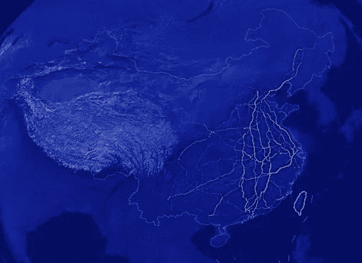
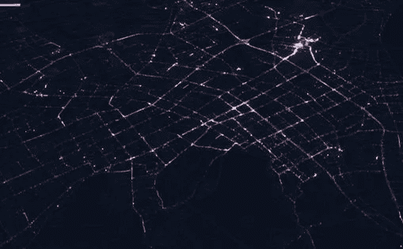
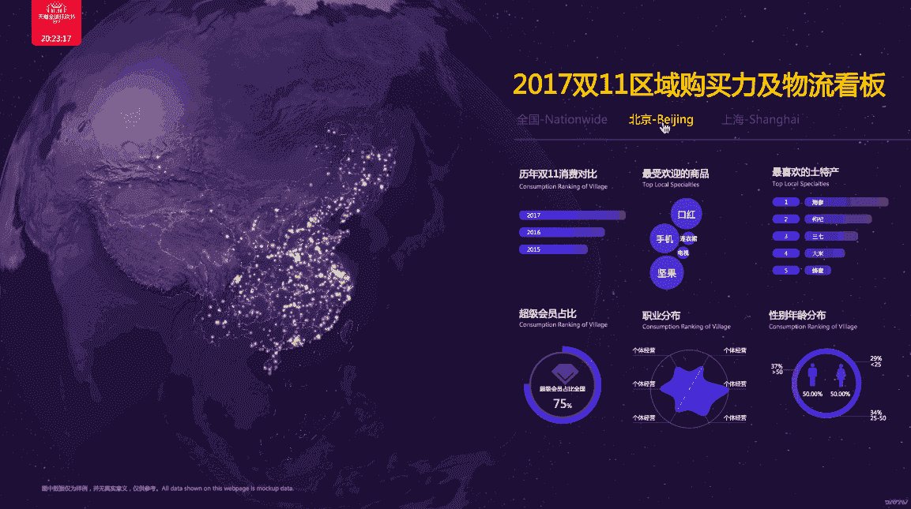
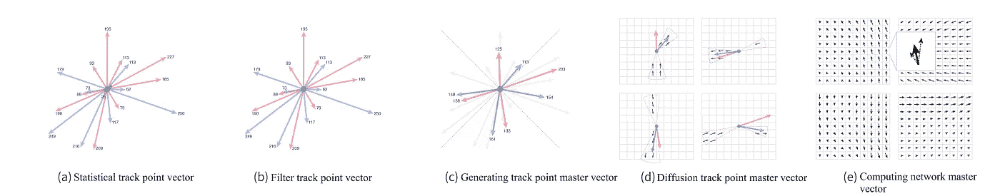
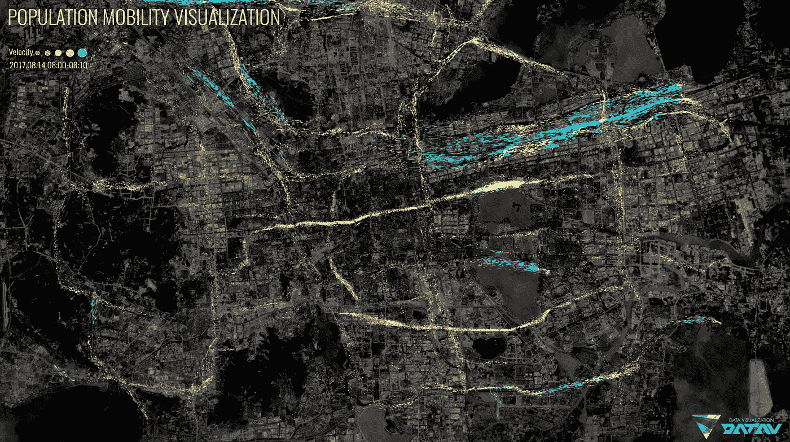

# 走在人群的前面:用 DataV 可视化轨迹数据

> 原文：<https://medium.com/hackernoon/ahead-of-the-crowd-visualizing-trajectory-data-with-datav-13112b07bcf9>

## 阿里巴巴强大的数据可视化工具 DataV 帮助您快速解读数据，并让您更好地了解数据关系、模式和趋势。这在城市治理中特别有用，因为官员可以利用对人员和车辆移动的分析来减少交通，更有效地应对紧急情况，并使城市更加智能。

从你的机器人吸尘器在你的公寓导航时所走的短距离自动路线，到长时间的国际旅行，轨迹数据在今天的生活中发挥着比你想象的更大的作用。无论是短至一分钟的共享自行车骑行，还是长达 10 年的基站记录，挖掘人们的运动模式，以及车辆的运动模式，都可以帮助城市治理官员减少交通，确保公共安全，应对紧急情况，并使城市更加智能和高效。

为了改进传统的可视化方法，阿里巴巴集团最近推出了一种新的矢量场生成算法，旨在改善对城市人流和车流关键数据的分析。在里面，我们详细探讨了这种新方法以及以前的可视化方法，最后是一个案例研究的结果，证明了它减少视觉重叠的能力，并揭示了人们在城市环境中的运动趋势。

# 经典轨迹呈现模型及其局限性

轨迹数据描述了在时空维度中运动的物体的空间位置和属性随时间的变化。当人和物体移动时，他们的位置和其他属性会被他们携带的设备(如手机、传感器等)定期记录下来。这些记录的数据点可以用来形成样本点，然后可以按时间顺序排列这些样本点，以构成移动物体的轨迹。

然而，在这个过程中的一个不便之处是，轨迹数据的来源有很多，包括但不限于手机信号数据、车辆 GPS 数据、Wi-Fi 嗅探数据、值机数据。更重要的是，新的数据不断产生。因此，通常会有大量这样的数据，这会导致严重的视觉混乱和渲染压力。借助可视化分析技术，通过将轨迹数据转化为矢量场数据，不仅保留了轨迹数据的主要特征，而且数据量也大大减小。这让我们能够更好地观察人群中的运动模式。

当使用可视化分析技术来分析和挖掘轨迹数据时，在交互界面上可视化轨迹是很重要的，因为这为用户提供了观察和探索的空间。受到该领域专家关注的轨迹表达模型包括表达法、飞线法和路径连接法。最后一种是轨迹显示的最直观形式，它按时间顺序连接每个对象的轨迹数据中的所有采样点，然后使用其他视觉通道，如编码对象的属性，如颜色、宽度和线形。它还清楚地展示了移动物体路径的空间位置，因此它被用作 DataV 的基础平面图和 3D 图的线性热层子组件中的可视化手段。

飞线方法与路径连接方法类似，但有一个主要的不同点:它以动画的形式模拟移动对象的运动。通常，使用带箭头的线段对移动线进行编码，该线段在采样点之间按时间顺序移动。这种方法清晰地反映了运动物体的方向，具有更高级的视觉效果。DataV 地图组件中的飞线图层，以及 3D 地图中的弧线图层、轨迹图层、路网轨迹图层都使用这种可视化方法。去年阿里巴巴 11/11 全球购物节期间首次亮相的闪电图中的闪电效果也是通过这种方法实现的。

*Path connection: China’s logistics network visualized with DataV’s line thermal layer component*

*Flying line: a day of taxi journeys in Hangzhou, visualized with DataV*

*Flying line: DataV’s logistics board for the 11/11 Global Shopping Festival. Each lightning simulates goods being shipped from a seller to a buyer*

以上可视化是可视化轨迹数据的经典模型，但并不完美。当应用于大量数据时，看似简单的可视化变得模糊不清，充满了障碍和重叠。如果处理不当，这可能会影响用户观察和探索它们的能力。此外，数据量的增加给图形质量带来了压力。为了应对这种压力，必须不断提高硬件设备的性能，从而提高轨迹分析的门槛。因此，对于海量的轨迹数据，需要一种更有效的可视化方法来洞察城市中移动对象的运动模式。

# 介绍一种矢量场生成算法

经过对该主题的广泛研究，阿里巴巴团队现在提出了一种针对海量轨迹数据的矢量场生成算法，可以将特定时间段的轨迹数据转换为矢量场数据，从而实现对“人流量”和“车流量”的表达和表征。这种方法的定义特征是，它不直接可视化海量的轨迹数据，而是聚合这些数据，提取其主要特征，将其转换为矢量场数据，然后选择合适的可视化方法来呈现。由于矢量场数据保留了轨迹数据的主要特征，大大减少了数据量，在消除视觉障碍、减轻图形质量压力的同时，清晰直观地反映了城市区域内运动物体的运动规律。

以下部分按顺序讨论了算法的组成步骤，如下图所示。

## 统计运动点向量

轨迹数据由多个采样点组成，包括位置、时间和运动点的其他属性。阿里巴巴团队首先根据所有样本点计算出移动点的位置。然后，他们根据轨迹数据中每两个样本点之间的流入和流出，计算每个移动点的进入和离开向量的方向和大小，其中大小包括轨迹的数量和移动对象的速度。

## 过滤运动点向量

根据轨迹的自定义阈值对上一步得到的所有运动点的进出向量进行过滤，得到每个运动点的进出主向量。

## 生成运动点主向量

在该步骤中，根据定制矢量场的方向，对上一步骤中获得的所有运动点的所有入口和出口主矢量进行分类和聚合。每个方向最多产生一个入口主向量和一个出口主向量。同时，需要计算每个方向上矢量的平均速度、平均移动距离和平均差角。

## 扩散运动点主向量

接下来，将一个 n*m 的网格平铺到用户指定的区域中，将每个方向上每个运动点的主向量按照一定的条件和规则扩散到 n*m 的网格中。其中，在扩散中，网格中扩散的矢量保持相同的方向和速度，轨迹数量较少。仅当满足以下条件时，栅格才会受到主向量辐射的影响:

扩散网格的中心与移动点之间的距离不大于移动点的平均移动距离。

如果扩散矢量是入口矢量，扩散网格中心与移动点形成的矢量与扩散主矢量的夹角应在[180 —平均差角，180 +平均差角]之间。如果向量是退出向量，那么这样的角度应该在[-平均差角，+平均差角]之间。

## 计算网络主向量

上一步，同一个网格可能受到多个矢量的辐射影响，产生多个扩散矢量。因此，在这一步中，必须计算每个网格中每个方向上的聚合矢量(包括矢量场方向、移动速度和轨迹数量)，以获得最终的矢量场数据。

在这种方法中，必须定义轨迹的阈值，以及矢量场的方向和网格的数量。轨迹的阈值主要用于过滤运动点向量，以便保留主轨迹并防止“噪声”干扰结果的准确性。计算不同方向上的矢量场，以避免运动在相反方向上偏移，从而保留更多细节并获得更精确的最终结果。在定义网格数时，需要平衡过大的数带来的计算压力和过小的数带来的粗糙效果。

为了使这种方法更具适应性，阿里巴巴团队在矢量扩散中没有使用固定的角度和距离。相反，他们使用所有方向的平均移动距离和平均差异角度，允许扩散适应不同的矢量分布，结果更合理。

# 应用算法

下图是 2017 年 8 月 14 日上午 8:00-8:10 之间某城市手机信号数据的可视化。

在这种情况下，阿里巴巴团队使用粒子流来表示矢量场数据。网格中粒子的数量代表轨迹的数量(即运动物体的数量)；粒子的运动方向代表运动物体的运动方向；而且粒子的颜色和速度都代表运动物体的速度(速度越高颜色越接近蓝色，速度越低颜色越接近红色)。同时，已经提供了用于调整交互式查询的参数的控件，例如向量场方向、轨迹阈值和网格数量。通过这种方式，对图像质量的压力大大降低，视觉重叠被消除，使人们在城市中的活动易于观察。

*(Original article by Guan Huihua 关会华)*

# 阿里巴巴科技

关于阿里巴巴最新技术的第一手深度资料→脸书: [**“阿里巴巴科技”**](http://www.facebook.com/AlibabaTechnology) 。推特: [**【阿里巴巴技术】**](https://twitter.com/AliTech2017) 。