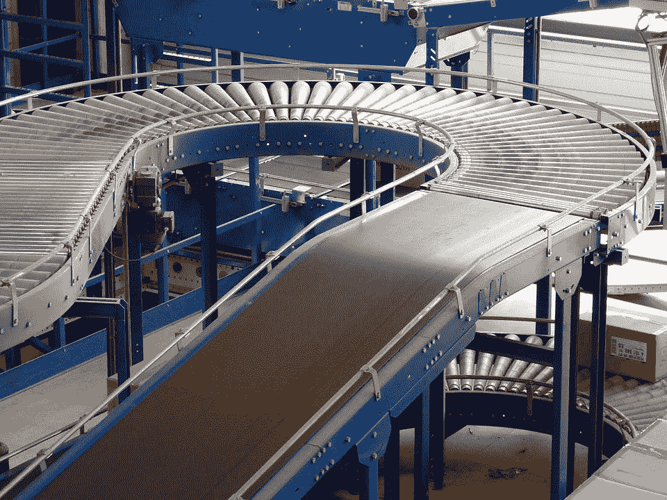
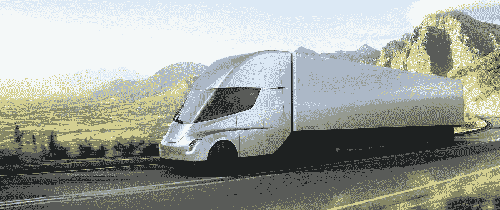
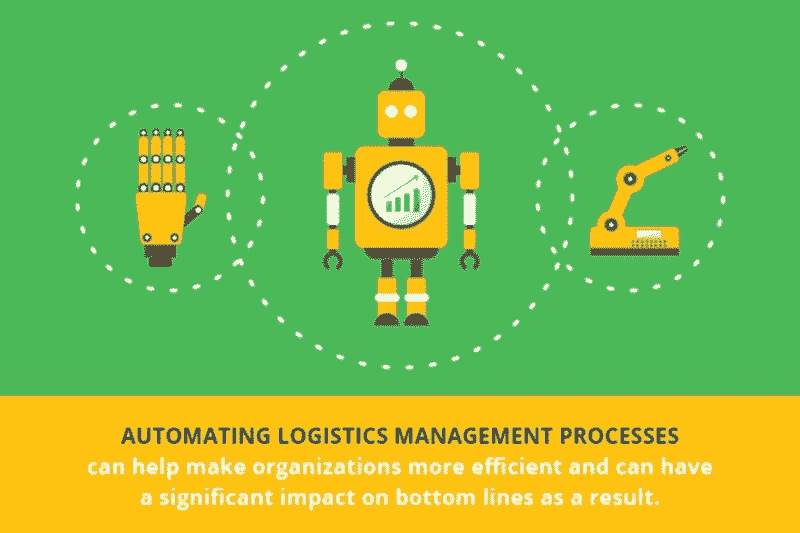

# 物流系统中的人工智能和自动化

> 原文：<https://medium.com/hackernoon/ai-and-automation-in-the-logistic-systems-c07b6e7ed39b>

Elon’s Semi Truck

在未来几年内，供应链管理部门统一实施**人工智能**和**自动化**有望将生产率边际提高到一个全新的水平。这两种高端技术的融合不仅为无摩擦运输系统铺平了道路，还将为不同人群带来**无差错**和**快速**服务。

为了适应与其他行业形成对比的新技术，物流系统毫无歉意地落后的日子已经一去不复返了。今天，情况发生了变化。本质上，人工智能和自动化二人组正在将供应链管理和物流领域转变为自动化和高度可扩展的领域。

**提示**:信息管理系统和生产力是供应链管理行业的两个关键因素。

## **通过人工智能和物流自动化实现敏捷性**

[Image Source: Pixabay](https://www.google.co.in/search?q=automation+in+logistics&rlz=1C5CHFA_enIN769IN771&tbm=isch&source=lnt&tbs=sur:fmc&sa=X&ved=0ahUKEwiktZm-rM_ZAhXFfLwKHRroAuUQpwUIHw&biw=1440&bih=739&dpr=1#imgrc=Cn9bRs6hyEJW2M:)

将人工智能和自动化引入供应链管理和物流领域，可以在很大程度上帮助实现整个供应链处理的精确性和有效性。在此之前，物流限制新兴技术早期采用的主要原因是人的数量。事情已经发生了变化，我们现在看到物流从标准物流系统向预期物流转变的方式有了显著的改善。

通过实施**预期物流系统**，品牌可以轻松识别需求的峰值或下降，并有效管理生产量。考虑到预期物流的历史，当客户开始失去耐心并希望比以往任何时候都更快地交付订单时，它就出现了。

根据研究，人工智能也可以作为供应链风险管理的**。如通过数据驱动的机器了解客户需求，公司可以立即启动实质性的生产流程。在这种知情的情况下，即便是制定营销计划也会变得不那么容易预测。因为大多数数据都被人工智能机器有效地处理了。**

## ****劳动力自由运输系统****

****

**[Image Source: techspot.com](https://www.google.co.in/search?q=elon+semi+truck&rlz=1C5CHFA_enIN769IN771&source=lnms&tbm=isch&sa=X&ved=0ahUKEwj3lKf-rM_ZAhXCyrwKHTfLCXoQ_AUICygC&biw=1440&bih=739#imgdii=OxDz0liY73V-LM:&imgrc=f_JFI-xbG5TMHM:)**

**如果你偶然发现了**埃隆的**全新创造，一个电动玩具——一辆全电动半挂卡车，此时你可能已经有了自动化车辆将在物流和供应链管理领域产生多大影响的想法。这种现代且最费力的自动驾驶车辆系统也许是智能自动驾驶汽车的结果。接下来是空中投送系统的即兴表演。**

****例如，**在过去的几年里，无人机送药已经在医疗行业大规模推广。**

**虽然我们看到许多关于人类失业的疑问，但无人机和自动驾驶汽车的使用对任何特定行业都不仅仅是至关重要的。准确地说，自动驾驶汽车可以满足来自偏远地区和山区的需求。**

> ****关于半决赛:****
> 
> **“我们出售的每辆卡车都将自动驾驶作为标准配置，”**马斯克**在谈到将于 2019 年投产的 Semi 时说。“这是安全性的巨大提高。”**

## ****将物流与大数据融合****

****

**[Image Source: Samsung Business Insights](https://www.google.co.in/search?q=logistics+and+big+data&rlz=1C5CHFA_enIN769IN771&source=lnms&tbm=isch&sa=X&ved=0ahUKEwjc74HBrc_ZAhXMI5QKHVBQC98Q_AUICygC&biw=1440&bih=739#imgrc=KqfTwRIgWeezoM:)**

**因为物流系统的顶点部分仍然在筒仓中，人工智能和自动化系统的入侵似乎更有益。根据最近由**Fleetowner**—“**第 21 届年度第三方物流研究**”进行的一项研究， **93** %的第三方物流表示，数据驱动的决策对于未来的供应链计划和活动至关重要。**

**从优化路线到简化工厂运营，大数据可能是最可靠的来源。为了进一步获取物流/供应链管理系统内部和外部自主运营的数据，以下方面可能是最佳选择。**

*   **来自传感器、监视器和预报系统的交通和天气数据**
*   **车辆诊断、驾驶模式和位置信息**
*   **金融业务预测**
*   **广告响应数据**
*   **社交媒体数据**
*   **网站用户行为数据**
*   **传统企业数据**

**也许，有几种方法可以获得数据，这些数据将被输入到我们的整体数据系统中。DHL 在最近的谈话中提到，利用大数据可以让我们在制造和物流领域实现前所未有的优化水平。**

## ****自学习物流系统的好处****

****

**[Image Source: True Activist](https://www.google.co.in/search?q=self+learning+ai&rlz=1C5CHFA_enIN769IN771&source=lnms&tbm=isch&sa=X&ved=0ahUKEwjJoJ_0rc_ZAhXBGJQKHR9eDhoQ_AUIDCgD&biw=1440&bih=739#imgrc=dzNUnKWuivgN-M:)**

**自学系统通常通过从大量数据中学习来获得相关的潜能。随着时间的推移，提供给他们的数据越多，他们的性能就会迅速提升到更高的水平，在某些情况下甚至无法控制。**

> **具体来说，物流中的自学习系统获取信息，即**数据**，对其进行分析，以找到特定输出背后的原因，然后根据每种输出的较高成功率发布适当的解决方案。**

**人工智能和人工智能在物流中的使用已经达到了这样一个水平，即联邦快递和联合包裹目前正在向他们的学习系统输入信封上常见的难以辨认或潦草的笔迹。然而，最近以来，人工智能和人工智能大量应用于仓库。**

**其中，机器识别**重复趋势**，识别模式，将收集到的数据链接到选择的实体，然后发出预包装指令。人工智能和机器人扮演重要角色的其他操作是检查库存水平。以便根据需要增加新订单或重新进货。**

## ****人工智能供应商库存管理****

****

**[Image Source: Inspirage](https://www.google.co.in/search?q=automated+supply+chain+management+system&rlz=1C5CHFA_enIN769IN771&source=lnms&tbm=isch&sa=X&ved=0ahUKEwiMppSXrs_ZAhUFp5QKHSADD5wQ_AUICigB&biw=1440&bih=739#imgrc=HpWk0RGz5AtO_M:)**

**通过坚持运输公司货运管理的数据集，人工智能和自动化系统可以及时评估和报告每个运输公司提供的货运类型。以及费用明细。**

**这使得中介可以快速交叉引用**类型的供应商**，并更新他们的价格细节、事故报告、货物安全等等。这让公司能够管理**智能供应商库存**。**

## ****人工智能和机器自动化伦理制度的重要性****

****

**[Image Source: Slide Share](https://www.google.co.in/search?q=ai+ethics&rlz=1C5CHFA_enIN769IN771&source=lnms&tbm=isch&sa=X&ved=0ahUKEwiRzP_Yrs_ZAhVDzLwKHfrwDywQ_AUIDCgD&biw=1440&bih=739#imgrc=-rUDgslRSbF41M:)**

**尽管上述进步非常有价值，并且对于物流和供应链管理功能的所有方面都是必要的，但每个人工智能和自动化系统都应该遵守某些**道德规范**。根据**人工智能伦理** — [维基百科页面](https://en.wikipedia.org/wiki/Ethics_of_artificial_intelligence)中给出的指导方针，我们以一切可能的方式保持透明度至关重要。在物流领域，人工智能和自动化的明确存在将显著增强系统预测和执行操作的方式。**

> **最初发布于 ThinkOwl**