# 人工智能和区块链:简介

> 原文：<https://medium.com/hackernoon/ai-blockchain-an-introduction-d75bf7a7b63>

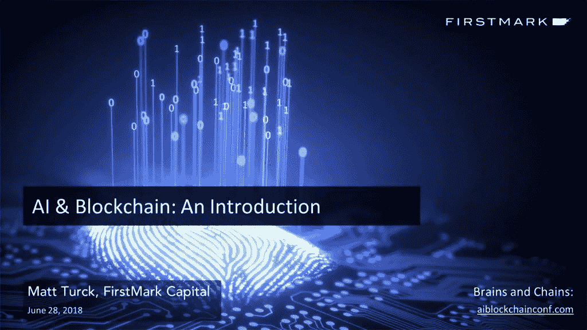

应 Rob May 和 Botchain 团队的邀请，我最近有机会在纽约举行的一次有趣的会议上发表主题演讲 [Brains and Chains](http://aiblockchainconf.com/) ，探索人工智能和区块链的交集。

这是一个既令人兴奋又富有挑战性的话题，我演讲的目标是提供一个广泛的介绍来启动事情，并为当天余下的讨论提供框架:首先讨论为什么这个话题很重要，并重点介绍该领域一些有趣公司的工作。

下面是演示文稿，并在相关时添加了一些评论。如果您想浏览幻灯片，请滚动到 SlideShare widget 的最底部。

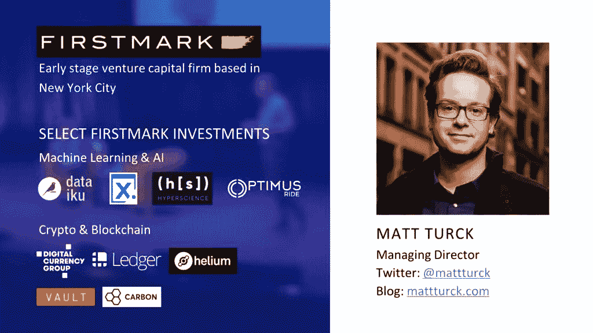

我是从一个风险投资者的角度来谈这个话题的。我的公司 FirstMark 在人工智能和加密/区块链领域都很活跃。

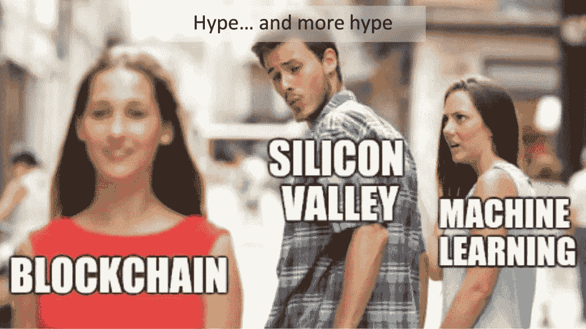

拿这个话题开玩笑当然很容易。人工智能(机器学习)和区块链都是实验性的，而且非常热门。人工智能在 2016-2017 年达到了炒作的高峰，区块链在 2017-2018 年达到了高潮。每一种趋势都很可能以令人失望而告终，在两者交汇处的探索可能会被证明是徒劳的。

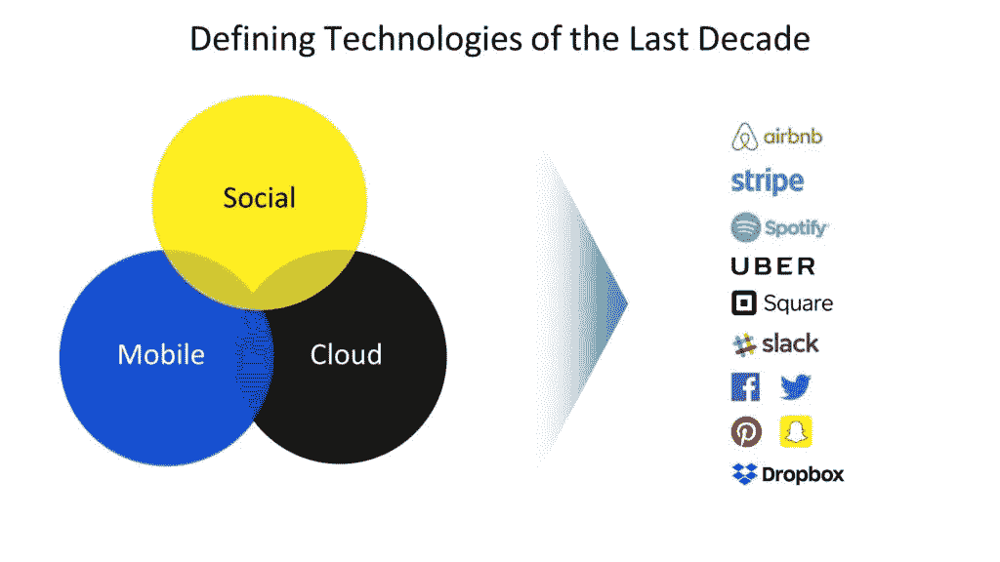

但是如果你回顾计算的历史，一个巨大的新趋势似乎每 10 或 15 年就会出现——硅芯片、个人电脑、互联网、Web 2.0 等等。

我们可能处于当前趋势的末端，这是由三个并发现象推动的:社交、移动和云。

我们今天所知道的许多巨人都是从那里诞生的。

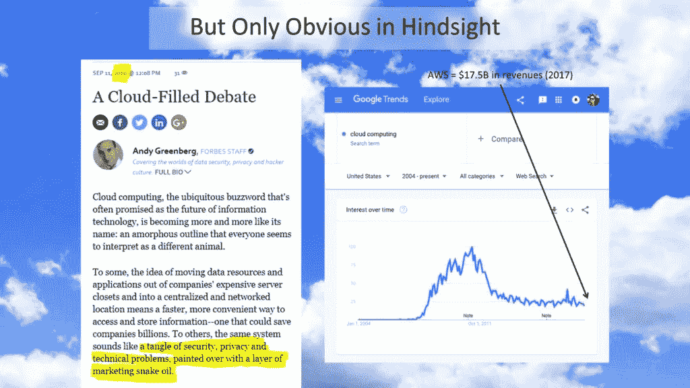

当然，这些趋势的幅度并不总是显而易见的。

例如，云计算现在似乎显而易见，但如果你回到 2008 年，它是有争议的，被一些人称为“营销蛇油”。总而言之，它花了十多年才成为今天这样的大规模产业。

起初，新趋势往往看起来既高度实验性又被过度炒作，但随着时间的推移，它们开始扎根，吸引越来越多的资本和人才，并逐渐成为新的范式。

根据阿马拉定律，新技术的影响在短期内往往被高估，而在长期内则被低估。

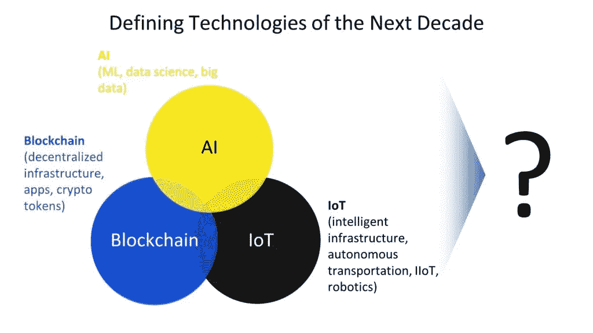

一种新的技术范式出现的时机似乎已经成熟。什么将定义和推动下一波计算创新浪潮？

“人工智能、区块链和物联网”是新的“社交、移动和云”的论点是有道理的。这些趋势仍在不断涌现，但它们的潜在影响是巨大的。

从这种范式中会涌现出哪些新的巨头？

就像社交、移动和云互相促进一样，这三种趋势有非常有趣的重叠领域。我已经讨论了至少一个物联网和区块链之间的[交集的例子，但还有许多其他例子。](http://mattturck.com/intelligent-infrastructure/)

今天，我将关注人工智能和区块链的交集。

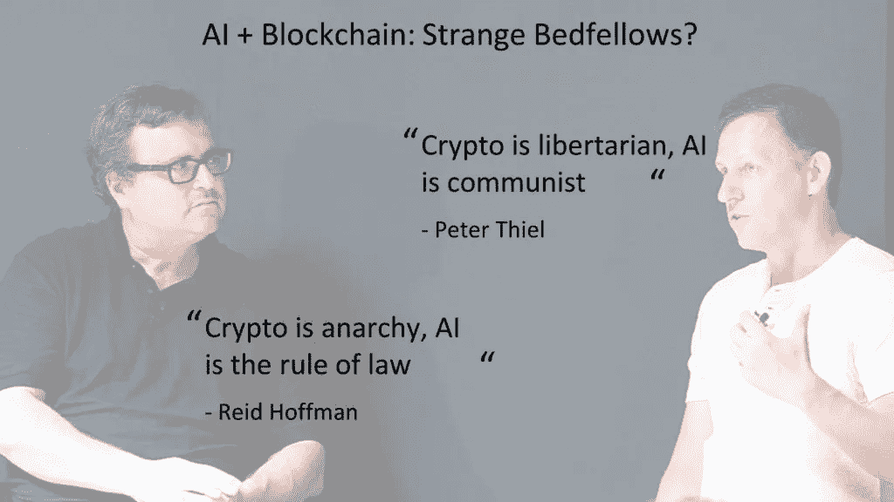

一个真正有趣的起点是观察艾和在哲学上在许多方面是对立的，正如和在最近的一次谈话中很好地表达的那样。

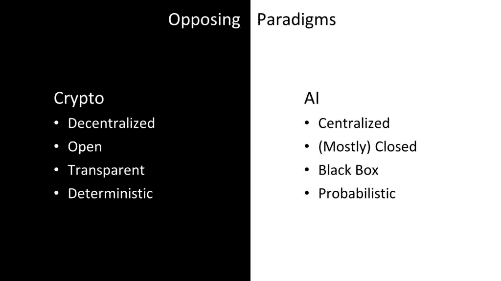

例如，人工智能非常集中——集中在少数几家公司，主要是谷歌、苹果、脸书和亚马逊(“GAFA”)以及大型中国互联网公司阿里巴巴、腾讯和百度。虽然一些人工智能研究是通过学术论文开源的，但这些公司已经能够吸引全球顶尖的人工智能人才，最重要的是，他们可以获得前所未有的大量数据来训练他们的人工智能算法。这些数据集是一个巨大的竞争优势，并且不对外开放。

人工智能的集中化为各种滥用打开了大门。关于中国政府监控的报道比比皆是，这些监控是由计算机视觉和人脸识别技术驱动的。

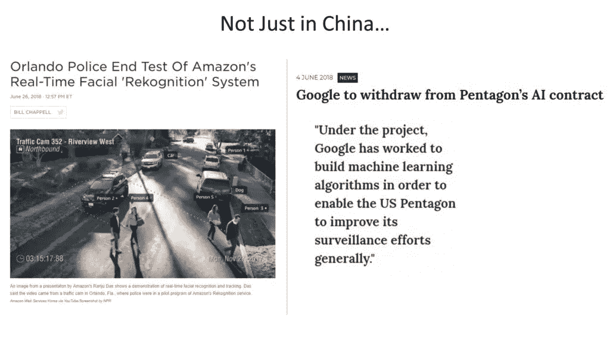

但就在过去几个月里，美国出现了一些与对中国的担忧相呼应的故事，表明这是一个全球性的担忧。

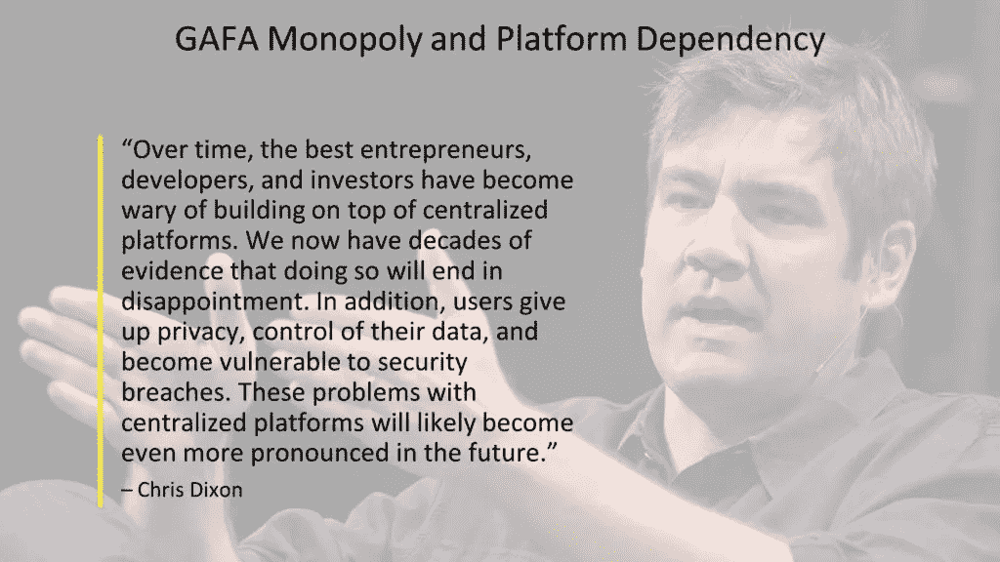

除了政治问题，集中式平台往往会与围绕它们出现的生态系统竞争。读一读克里斯·迪克森的精彩文章“[为什么分权很重要](/@cdixon/why-decentralization-matters-5e3f79f7638e)”。

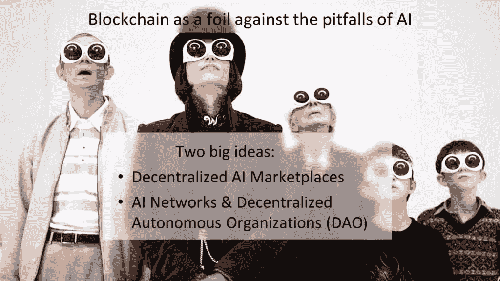

区块链是对政治和组织问题的有力回应，而不是纯粹的技术问题。

既然我们讨论的许多问题本质上都是政治和组织性的，那么它能被用来对抗人工智能的陷阱吗？

区块链也能帮助创造更好的人工智能吗？

该领域的先驱们一直在探索各种想法，从创造人工智能的分散方式到机器人网络和由人工智能运营的完全自主的组织。

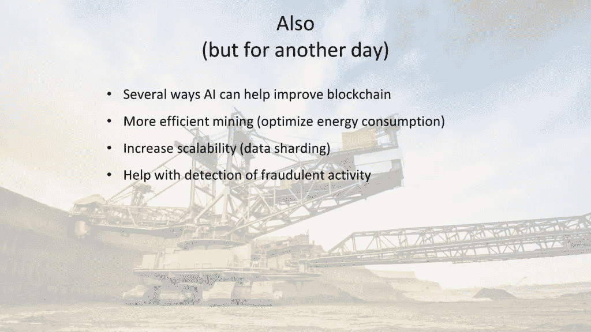

我们今天将谈论区块链如何帮助人工智能，但值得注意的是，人工智能可以在许多方面帮助区块链——这是另一个有趣的讨论。

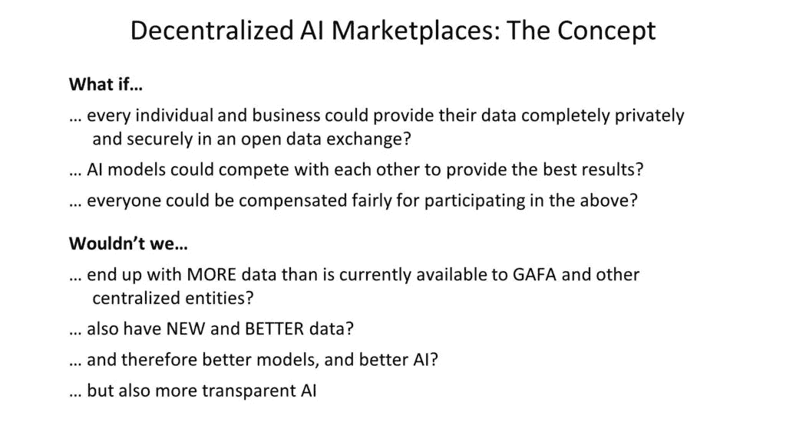

第一个大想法是创建一个分散的市场，这将有助于创造更好的人工智能。

高层次的想法如下:我们所有人(个人，机构)将在经济上被激励提供我们的个人和专业数据。知道它将被完全安全和保密(通过去中心化和安全计算)，我们会对共享敏感数据(支出、健康信息)感到更舒服。随着时间的推移，市场将积累比 GAFA 所能获得的更多、更高质量的数据。在数据之上，机器学习专家将受到激励去竞争，最高性能的模型将获得不成比例的奖励。

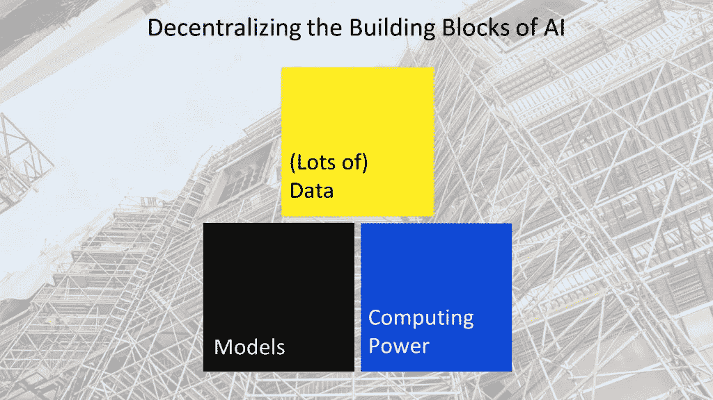

为了探索如何建立这样一个去中心化的市场，让我们谈谈如何去中心化人工智能的三个关键组成部分:数据、模型和计算能力。

在演示的这个阶段，我们将开始提供一些公司在人工智能和区块链的交叉点上做令人兴奋的工作的例子。这个领域充满活力，发展迅速，无论如何，这并不意味着是所有伟大公司和项目的详尽清单。

同样值得注意的是:该领域的许多公司都有雄心勃勃的计划，要构建生态系统的许多部分，而且许多听起来有点相同。这些项目中的大多数都是预发布的，所以尘埃落定还需要时间，看看谁真正认真地做了什么。

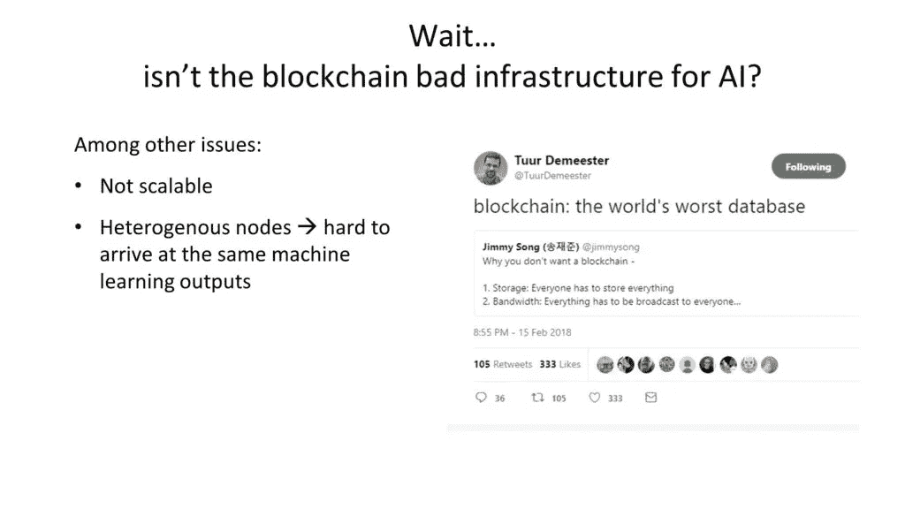

先说数据。重要的一点是:如果我们要使用区块链存储海量数据，它需要成为一个比现在好得多的数据库。

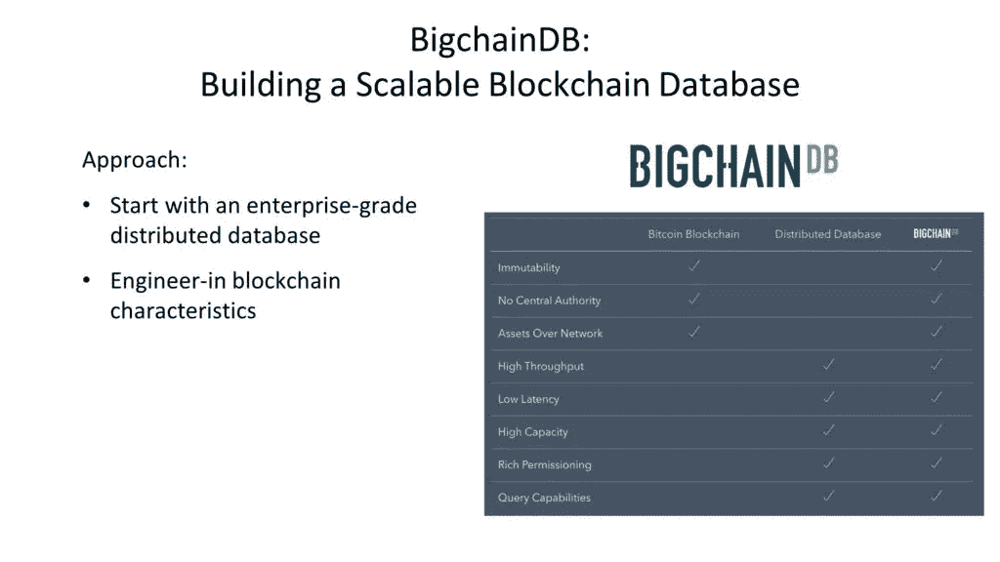

这是柏林的 BigChainDB，正在建立一个可扩展的区块链数据库。这个图表很有趣，因为它显示了分布式数据库和区块链技术之间几乎没有重叠。因此，构建一个真正的数据库级区块链是一个具有挑战性的项目。

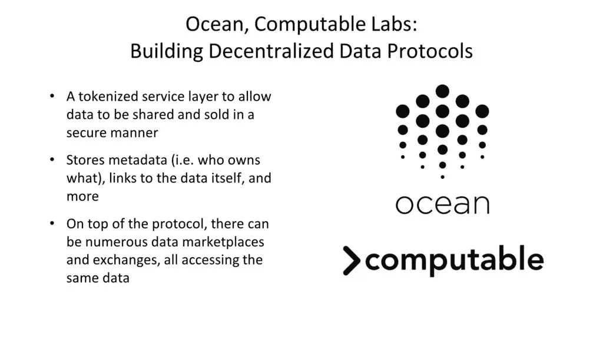

为了帮助共享数据，另一个关键的基础设施组件是协议。

《海洋协议》一直在该领域做着开创性的工作，对于任何有兴趣深入研究的人来说，它的创始人 Trent McConaghy 就人工智能和区块链的一般主题写的所有东西都值得一读。

Computable Labs 也在致力于建立一个数据市场协议，其首席执行官 Roger Chen 的这篇伟大的[文章](https://www.computable.io/blog/introducing-computable-labs)也很值得一读。

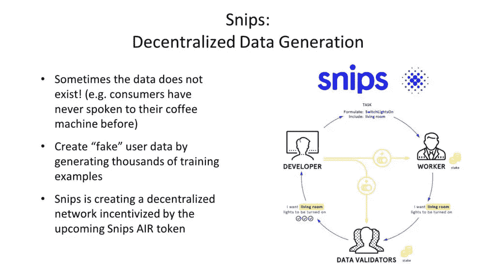

有时候，你需要为人工智能训练创建自己的数据——要么是因为你无法访问正确的数据集，要么是因为你训练人工智能的用例太新，数据根本不存在。

巴黎的 Snips 正在使用加密经济学来激励参与合成数据生成的工人网络。

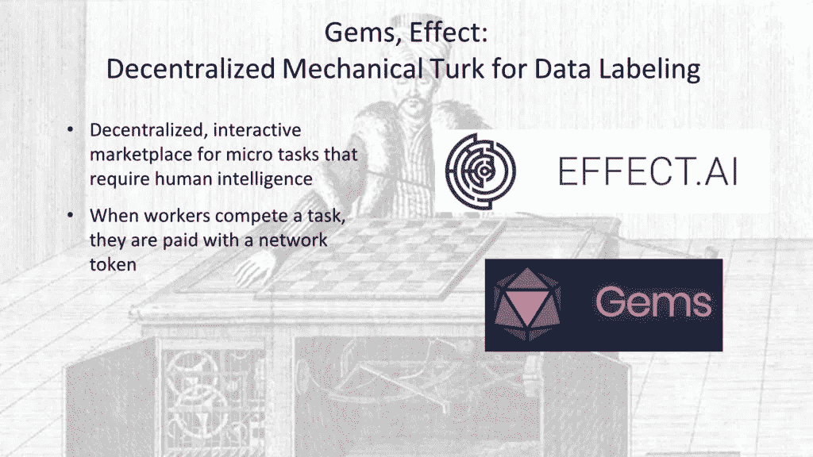

先说 AI 的第二个积木:模型。

对于一个去中心化的人工智能市场来说，你需要能够保证个人和公司提供的任何数据都是以完全保密的方式处理的。进入安全计算。

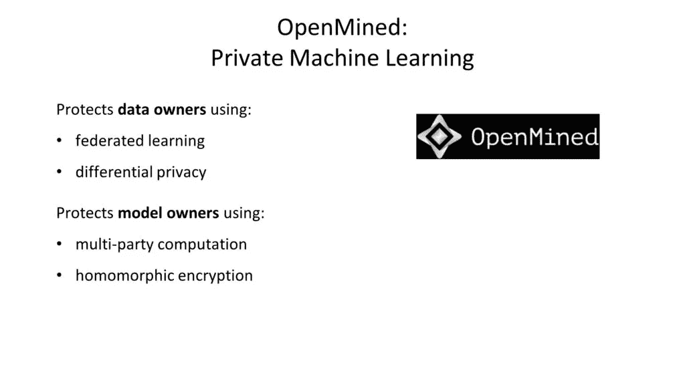

一个很好的例子是 OpenMined 项目，它包括对私人机器学习的重点关注，利用各种安全计算技术，包括联邦学习(由谷歌倡导)和差分隐私(由苹果倡导)。

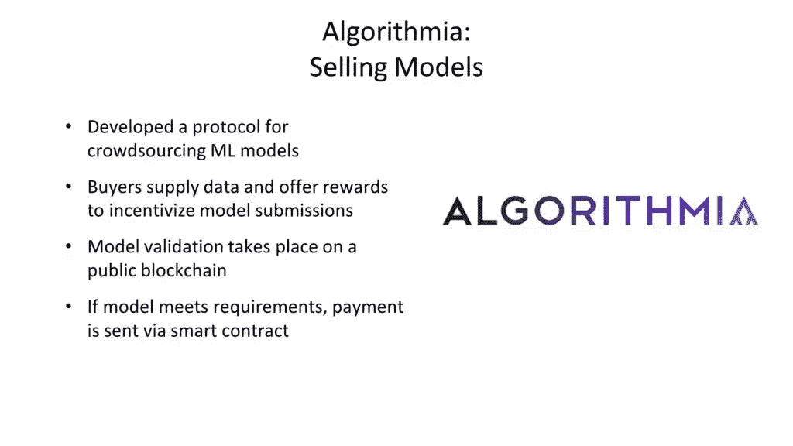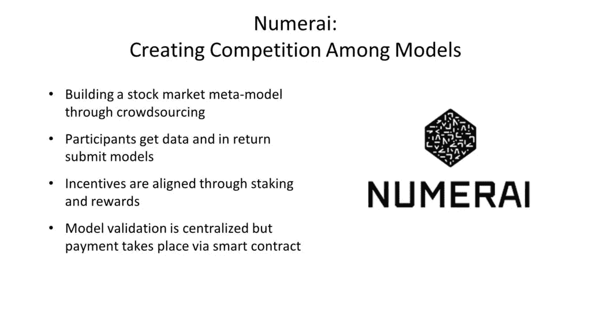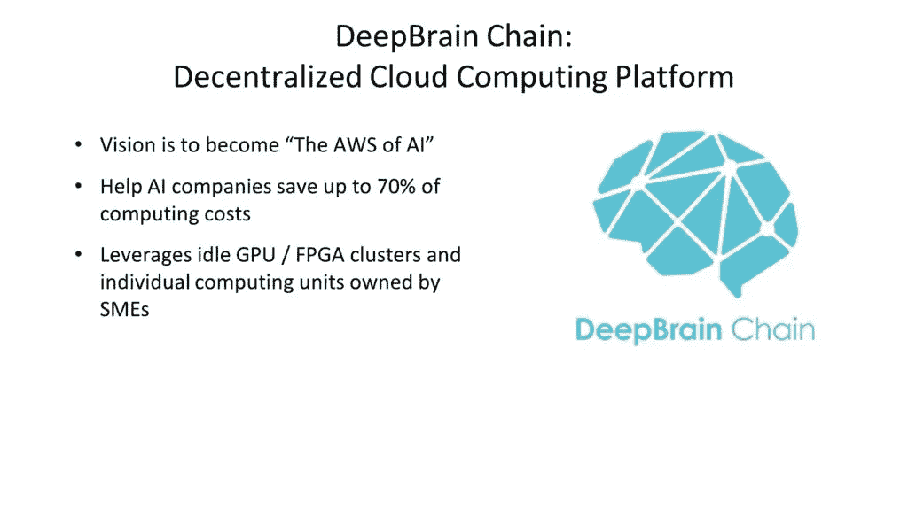

让我们切换到 AI 的第三个组成部分:计算能力。人工智能领域最近的许多进展都是由计算能力的大规模提升推动的，这既源于更好地利用现有硬件，也源于专门为人工智能构建新的高性能硬件(谷歌 TPUs 等)。

DeepBrain Chain 是一个有趣的项目，旨在共享全球闲置的计算资源。其总体理念与其他项目如 Coronai、强子、假人或 Hypernet 相当，但 DeepBrain Chain 更具体地专注于人工智能特定要求所必需的计算能力(和相关硬件)的类型。

总而言之，你可以想象一个完全去中心化的人工智能市场，人们提供他们的数据，开发者竞相提供最好的机器学习模型，整个系统作为一个自我强化的网络，吸引越来越多的参与者，创造越来越好的人工智能。

这里的秘密武器实际上是秘密经济学:创造一个迷你经济的能力，参与者通过代币积累和交换价值。由于令牌鼓励人们尽早加入网络，因此有助于解决冷启动问题，这个问题在过去一直困扰着许多网络建设工作。

幻灯片中显示的图表摘自 Fred Ehrsam 的优秀 Medium 帖子:[基于区块链的机器学习市场](/@FEhrsam/blockchain-based-machine-learning-marketplaces-cb2d4dae2c17)。这篇文章很好地描述了一个分散的人工智能市场是如何工作的。

当然，任何市场的典型机遇和挑战都适用于这种讨论。分散的市场可能是创造人工智能的一种非常新颖的方式，但无论它产生什么，都需要达到产品/市场匹配，并解决一个真正的问题，才能获得商业成功。从这个角度来看，垂直化的方法(工业、基因组学、金融等。)都特别有意思。

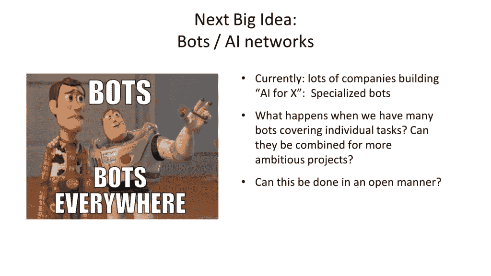

现在让我们进一步讨论这个问题。让我们假设，部分通过去中心化的人工智能市场，人工智能继续繁荣和加速。我们将有能力为每项任务创造许多许多类型的人工智能。这会是什么样子，它是如何工作的？区块链可以提供一个有趣的组织模型，以帮助各种人工智能机器人以透明的方式合作。

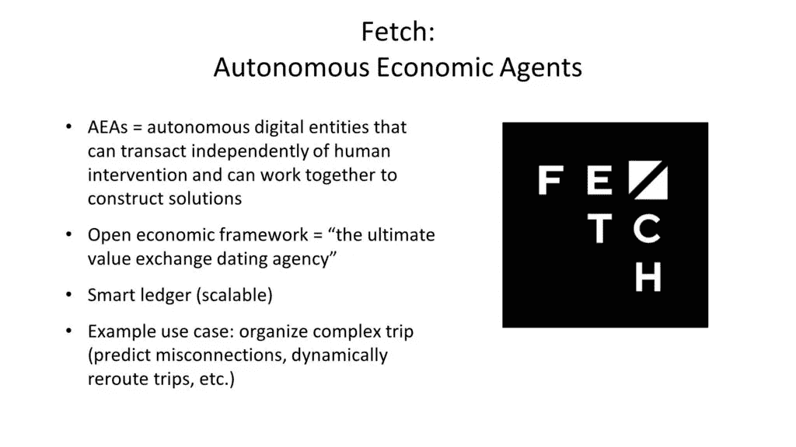

[Fetch](https://fetch.ai/) 是一家公司致力于建立网络以构建机器人并让它们以有组织的方式合作的例子。

机器人合作的一个例子可能是一次旅行:你让一个机器人买机票，如果有延误，另一个机器人可以预测错误连接的可能性，建议另一条路线，第一个机器人可以改变预订。所有这些都将在幕后实时自动发生，并彻底消除我们人类的摩擦。

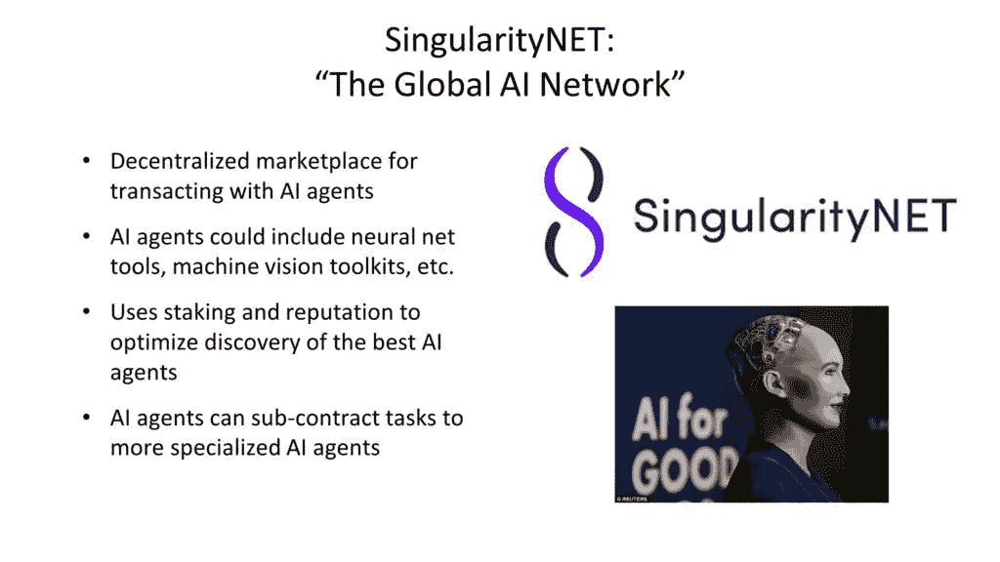

SingularityNET 是另一个有趣的例子——一个雄心勃勃的复杂项目，有许多可移动的部分。作为展示不同人工智能如何合作创造单个大脑的展示，他们开发了 Sophia，这是一个由奇点网提供动力的 Hanlon 机器人。解说者[视频](https://www.youtube.com/watch?v=LZkADy2RRoA)相当狂野(让人想起西部世界)。

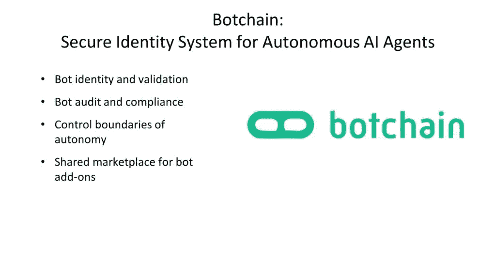

如果我们要有一个依靠一群机器人来执行各种任务的世界，就需要有一个基础设施来保持事情的透明和可控。这是由 Rob May 创建的新公司 [Botchain](https://botchain.talla.com/) 的使命，Rob May 也是 Talla 的首席执行官和本次大脑与链条会议的组织者。

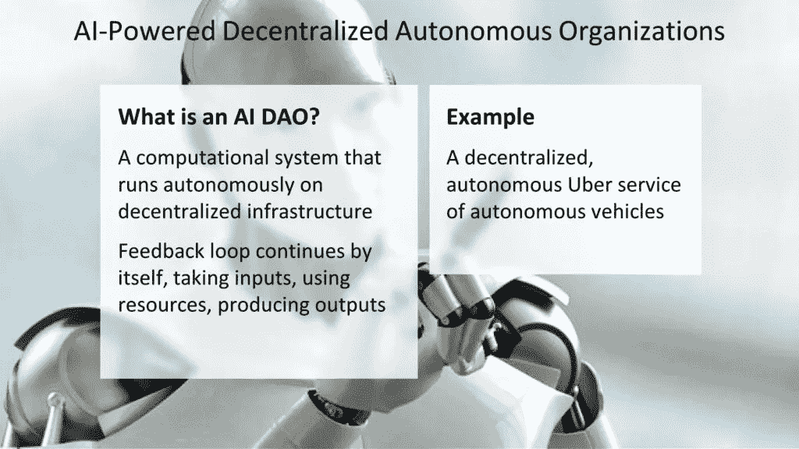

除了机器人合作，你可以想象整个系统如何在人工智能的驱动下完全自主运行。这就是分权自治组织或“道”的思想。

许多人听说过“道”，这是一只臭名昭著的投资者导向的风险投资基金，在 2016 年遭到黑客攻击。

“人工智能道”的概念超越了“道”的概念，因为它可以是一个完全由机器运行的去中心化的组织，没有或只有有限的人工干预。例如，快进到未来，你可以想象一个完全分散的优步版本，由人工智能驾驶自动驾驶汽车。这将是一个巨大的反馈回路，系统将不断学习如何调度汽车，高效运输人员和处理所有物流，将许多技能和复杂性结合到一个自动运行的体验中。

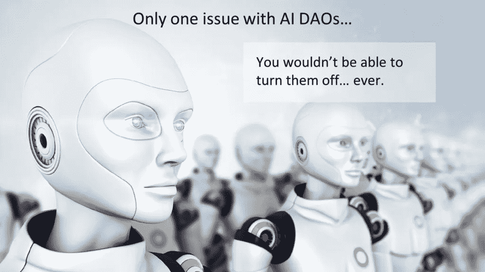

这个 AI DAO 概念的一个可怕的想法是，如果它是真正分散和自治的，在它失控的情况下，你如何能阻止这样一个组织是不清楚的。这不像是你可以拔掉一个插头就可以关掉电脑…

总之，上面的很多内容都很吸引人，但是实验性很强。我提到的大多数项目都是预发布的，还不清楚他们是否能够实现他们所追求的宏伟目标。

与此同时，许多基础工作正在进行，人工智能和区块链的结合可能会创造出非常强大的技术，其速度难以完全预测。其中一些进步可能会产生不良后果，所以现在无疑是开始思考其影响的好时机。

*感谢 Multicoin Capital 的 Kyle Samani 和 Computable Labs 的 Roger Chen 为本演示提供反馈；罗布·梅邀请我在大会上发言；FirstMark 的黛米·奥巴约米在演示中举足轻重。*

这是幻灯片分享: