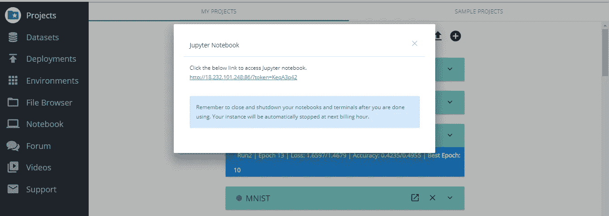

# 人工智能可以预测你是否处于抑郁状态

> 原文：<https://medium.com/hackernoon/ai-can-predict-if-youre-in-depression-2042c06e08f7>

## 麻省理工学院的研究人员已经能够使用人工智能来检测你是否患有抑郁症。

嘿，大家好！你们都好！太好了。—

> 你是⚡️⚡️国王/王后

*   **我们要做什么**:了解人工智能如何被用来预测抑郁症。
*   **如何:**利用长短期记忆细胞
*   **研究论文:**[http://groups . csail . MIT . edu/SLS/publications/2018/Alhanai _ Interspeech-2018 . pdf](http://groups.csail.mit.edu/sls/publications/2018/Alhanai_Interspeech-2018.pdf)
*   **代码**:[https://github.com/talhanai/redbud-tree-depression](https://github.com/talhanai/redbud-tree-depression)
*   **数据集:**[http://dcapswoz.ict.usc.edu/](http://dcapswoz.ict.usc.edu/)
*   **平台培训(针对我们):** [深度学习工作室](https://app.deepcognition.ai/app/projects)

我们现在潜水吧！

筛查和诊断抑郁症的标准方法是美国心理协会设计的患者健康问卷(PHQ)。该问卷将 DSM-IV 抑郁标准打包成一个简短的自我报告工具，该工具询问个人是否在做事中找到乐趣、感觉沮丧、疲劳、食欲不振、注意力难以集中、缓慢或烦躁和/或难以入睡。‘’

患有抑郁症的人会有某些共同特征。他们中没有一个人会热衷于做他们的工作。这样的人大部分时间情绪低落。与正常人相比，他们的回答方式通常有点低沉。

那么我们需要帮助他们！

这篇论文能有什么帮助？

患有抑郁症的人会被令人虚弱的悲伤困扰数周甚至数年。要治疗抑郁症患者，首先必须对他们进行诊断。为了获得诊断，抑郁症患者必须积极寻求心理健康专家的帮助。事实上，由于流动性、成本和动机的限制，抑郁症患者很难获得专业关注。人类交流的被动自动监测可以解决这些限制，并提供更好的抑郁症筛查

本研究论文中检测抑郁症的过程如下:

*   从[http://dcapswoz.ict.usc.edu](http://dcapswoz.ict.usc.edu/)收集抑郁症患者和正常人的数据
*   我们通过一个人控制的虚拟代理人，利用了 142 名接受抑郁症筛查的个体的音频和文本转录。虚拟代理向每个人提示 170 个可能查询的子集，包括直接问题(例如，“你好吗？”、‘你认为自己是内向的人吗？’)，以及对话式反馈(如“我明白了”、“听起来很棒”)。该数据来自公开可用的苦恼分析和访谈语料库(DAIC)，包含口头互动的音频和文本转录。数据被分为训练集(57%，107 名受试者)、发展集(19%，35 名受试者)和测试集(25%，47 名受试者)，如所述。DAIC 公开发行版中没有提供测试集注释，因此所有模型都在开发集上进行评估。' '

**深度学习模型:**

本文讨论了三种方法:

实验 1:上下文无关建模

实验二:加权建模

**实验三:序列建模**

我们将本文仅限于序列建模。

由于数据集是一组序列，研究人员利用了 LSTMs(长短期记忆网络),它在任何类型的序列相关任务上都具有最先进的性能。

他们训练了两个 LSTMs，即一个从文本中提取分类，另一个从视频中提取信息。

来自两个模型的输出被连接并传递给前馈神经网络。

**model architecture**

 [## 用代码从零开始理解 LSTM 细胞的结构。

### 在数据序列很重要的情况下，包括 CNN 在内的普通神经网络表现不佳。比如说…

hackernoon.com](https://hackernoon.com/understanding-architecture-of-lstm-cell-from-scratch-with-code-8da40f0b71f4) 

# 特征

这些特征或者是音频的片段级统计，或者是单词在片段中的 doc2vec 嵌入。使用语料库中提供的 COVAREP 和 FORMNAT 特征提取更高级别的音频特征(均值、最大值、最小值、中值、标准差)，并使用[该脚本](https://github.com/talhanai/sweet-wrapper-embeddings)生成 doc2vec 嵌入。我使用二元结果和多级结果进行训练。

让我们在 DLS 训练模特。

你需要把下载的数据集上传到 DLS。如果您不熟悉，请查看以下内容:

 [## 鸢尾属分类|DeepCognition| Azure ML studio

### 界:植物界分支:被子植物目:天冬目:鸢尾科亚科:环烯醚萜族:环烯醚萜属:鸢尾

towardsdatascience.com](https://towardsdatascience.com/iris-genus-classification-deepcognition-azure-ml-studio-4b930f54435a)  [## 主页

### 我们想邀请您在 3 月 26 日至 29 日的 GPU 技术大会上加入 Deep Cognition 的团队，展位号为 1035…

deepcognition.ai](http://deepcognition.ai) 

**Jupyter notebook in Deep Learning Studio.**

**这篇论文的成果是什么？**

[**Source**](http://groups.csail.mit.edu/sls/publications/2018/Alhanai_Interspeech-2018.pdf)

所以伙计们。这就是人工智能如何被用来预测一个人是否患有抑郁症。这种模式可以部署在任何 Android/IOS 应用程序中，因此任何有手机的人都可以诊断自己。

特别感谢本文的作者😃

感谢大家阅读。如果你喜欢这篇文章，请👏以至于其他人也能偶然发现它。

谢谢！

订阅我的 YouTube 频道，了解更多精彩内容！

Youtube Channel!

在 linkedin 上关注我:

 [## Manik Soni -机器学习实习生-Ace2three.com 印度信息技术有限公司负责人| LinkedIn

### 查看 Manik Soni 在全球最大的职业社区 LinkedIn 上的个人资料。Manik 有 3 个工作列在他们的…

www.linkedin.com](https://www.linkedin.com/in/maniksoni)