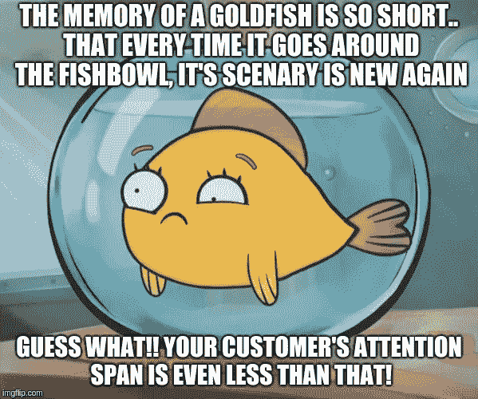

# 人工智能聊天机器人——人工智能从新手走向主流

> 原文：<https://medium.com/hackernoon/ai-chatbots-artificial-intelligence-goes-from-newbie-to-mainstream-f24b18ddbb6f>

当我们周围的每个人，从蹒跚学步的孩子到老年人，都依赖于 Alexa、Siri 和客服聊天机器人时，难怪人工智能可能很快就会开始感觉像是旧闻——至少对主流用户来说。它已经迅速从科幻小说转向现实，增强了业务流程。[仅在 2017 年，美国经济就见证了 27 个有记录的行业中 120 亿美元的人工智能相关投资](https://www.mckinsey.com/~/media/McKinsey/Industries/Advanced%20Electronics/Our%20Insights/How%20artificial%20intelligence%20can%20deliver%20real%20value%20to%20companies/MGI-Artificial-Intelligence-Discussion-paper.ashx)。一个最大的优势是，AI 的应用不仅仅是少数大公司的应用，它可以被中小型组织采用，以取得优异成绩。

Acc。到 [**波士顿咨询集团**](https://www.bcg.com/publications/2017/strategy-technology-digital-is-your-business-ready-artificial-intelligence.aspx) ，84%的受访者表示人工智能将使他们获得或保持竞争优势。83%的人认为人工智能是他们当今业务的战略重点。75%的人表示，人工智能编程将允许他们进入新的业务和风险投资。

人工智能在 2018 年成为主流的旅程中最引人注目的应用之一是“更加关注消费者对人工智能的采用”，并确保它可以被更广泛的人群所接触，用一个词来概括——“T8”聊天机器人。

什么是聊天机器人？—具有人类对话能力的计算机生成的程序。聊天机器人现在如此受欢迎，因为它们容易访问，使用速度快，还因为人们可以将它们嵌入网站，以方便客户互动。**甲骨文**进行的一项调查表明，80%的首席执行官和高级营销人员已经在他们的运营中实施了聊天机器人，或者计划到 2020 年这样做。无论如何，我们都知道，消费者需求和技术创新携手为聊天机器人让路以吸引潜在客户和提高销售额只是时间问题。

**让我们探索一下通过这个正在席卷行业的对话平台可以实现的几种可能性？**

**重新定义客户体验**

人类的平均注意力持续时间为 8 秒，比金鱼短(大约 9 秒)，人工智能驱动的机器人通过从对话中获取线索，为它们提供问题的实时解决方案，并向它们提供建议和论点，满足它们的偏好和需求。在这种情况下，对品牌和顾客来说都是明显的双赢。

**语音机器人**

与朋友和同事在移动屏幕上打字很方便，但与聊天机器人进行基于文本的交互，我不这么认为。与机器人交谈是一种非常人性化的体验，感觉就像与另一个人互动。因此，双向的、有情境意识的对话让日常任务变得快速而容易完成。此外，语音命令在任何地方都很有用。无论是家里的谷歌语音还是购物时的亚马逊助手，类似的命令都是一种福气。不仅仅是在个人生活中，它也会给我们的工作生活增添价值。语音机器人可以帮助我们安排会议，共享文件，还可以绘制报告，如:“我们上个月的电子邮件活动做得怎么样？”。[点击这里查看我们的人工智能相关体验。](https://www.youtube.com/watch?v=HE2YDrnAPh4&feature=youtu.be&utm_source=hackernoon&utm_medium=social&utm_campaign=contentmarketing_nov_2018)

**数据分析和人工智能**

长期以来，分析在改变商业底线方面一直发挥着巨大的作用。越来越多的公司正在通过分析和数据可视化获得竞争优势，并希望实施人工智能(AI)来分析更复杂的数据，获得更准确的结果，并实现更全面的分析策略来实现业务目标。如果我们谈论客户参与行业，通过这些机器人的对话可以进行分析，并确定导致销售的语言，并实现销售预测。

**区块链与 AI**

[区块链](https://hackernoon.com/tagged/blockchain) ( [此处查看我们的一个区块链项目](https://www.youtube.com/watch?v=r_5f6TEf3Gs&utm_source=hackernoon&utm_medium=social&utm_campaign=contentmarketing_nov_2018))是一个数字信息的归档系统，它与准确性、认证和执行有关，并且是防篡改的，健壮的数据库只能由那些有权限的人更新。另一方面，人工智能通过评估模式和数据集来帮助决策，并最终触发自主交互。考虑到大量的数据，人工智能通过评估大量的因变量和自变量做出的决策有时对人类来说可能是复杂的。但是，如果决策被记录在区块链上(一个数据点接一个数据点),分析起来就容易多了。这也增加了对记录从一开始就没有被篡改的信心。

每个人都非常确定的一件事是，人工智能正在重塑各地的商业，并导致新的商业创新和新的竞争形式的出现。现在，行业影响者应该密切关注这一趋势，并制定战略，将人工智能纳入日常商业活动，使现有技术更加智能，并释放所有可用数据的力量。[欲了解更多信息，请联系我们。](https://www.binaryfolks.com/contactus?utm_source=hackernoon&utm_medium=social&utm_campaign=contentmarketing_nov_2018)

*最初发布于:*[*binary 乡亲*](https://www.binaryfolks.com/blog/ai-goes-from-newbie-to-mainstream)