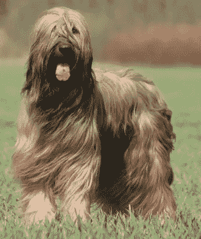
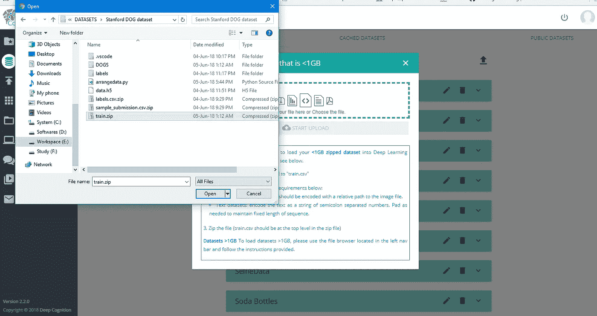
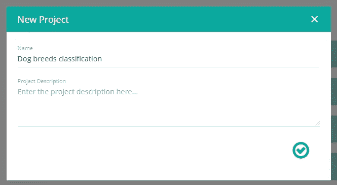
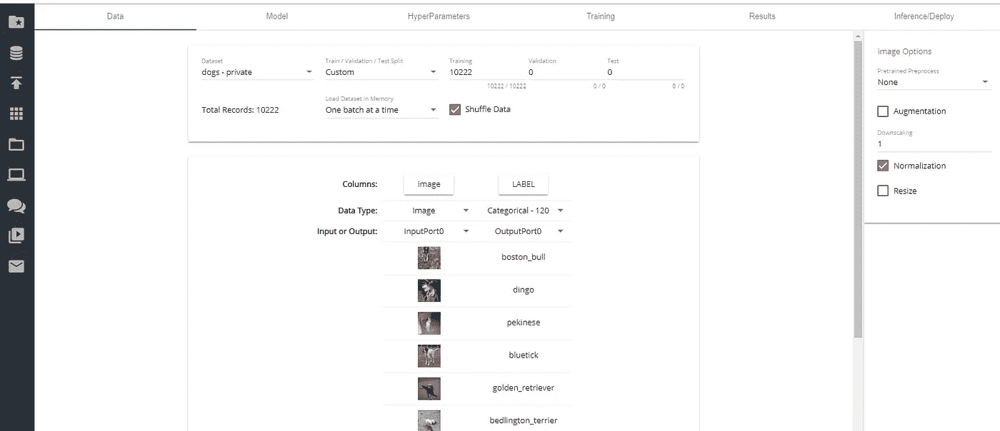
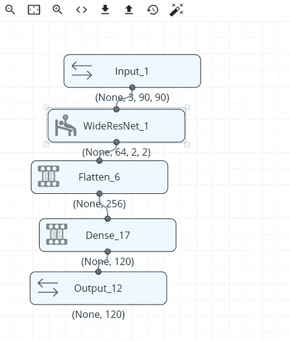
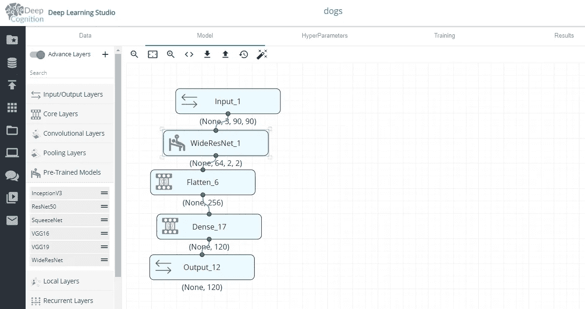
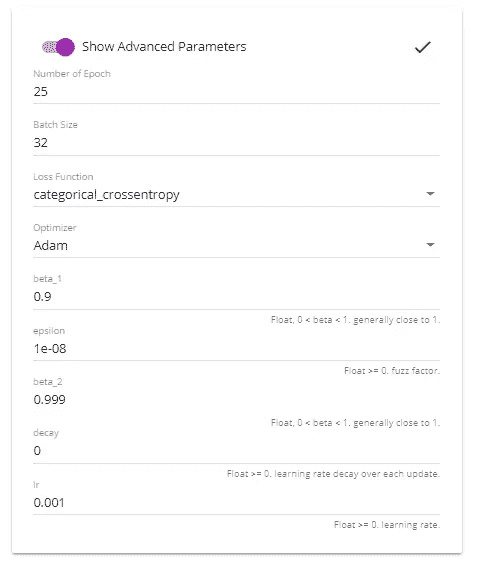
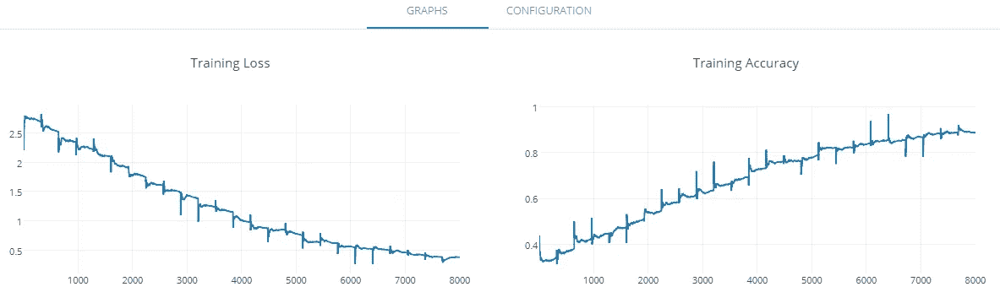
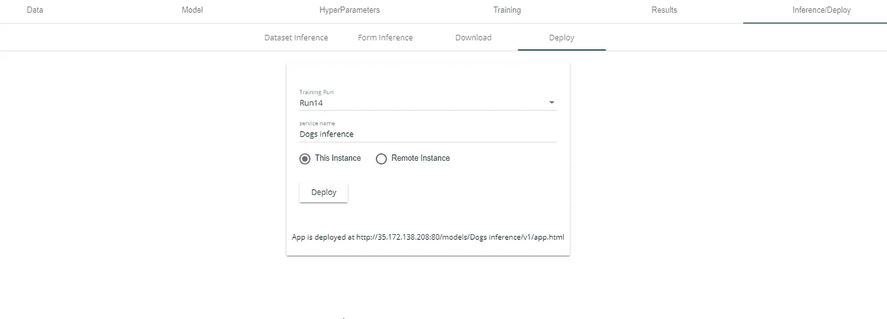
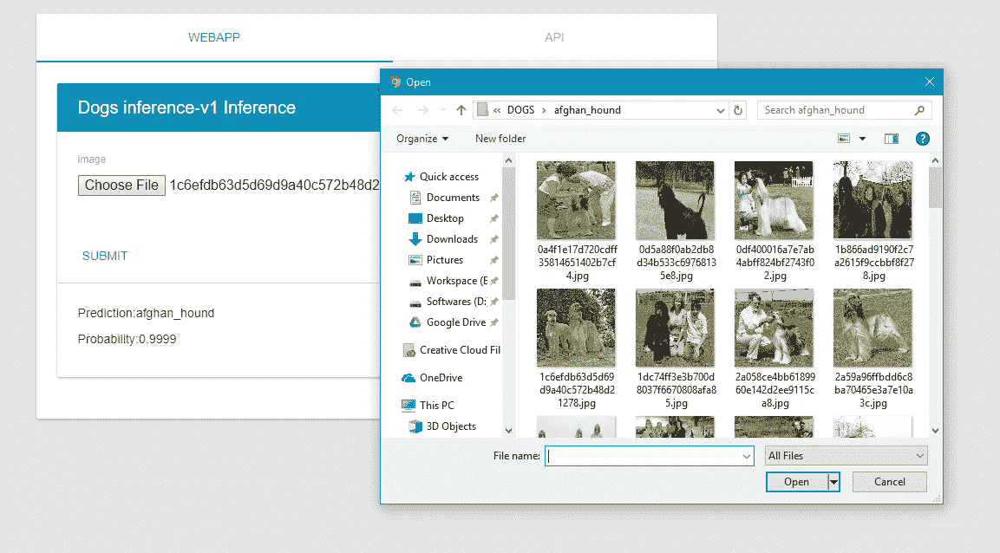

# 如何做出给狗品种分类的 AI

> 原文：<https://medium.com/hackernoon/ai-classifies-15000-years-old-animal-dog-the-easiest-way-cd6619cd4d59>

## 爱狗？

**界** : [动物群](https://en.wikipedia.org/wiki/Animal)，**门** : [脊索动物](https://en.wikipedia.org/wiki/Chordate)，**纲** : [哺乳动物](https://en.wikipedia.org/wiki/Mammal)，**目** : [食肉动物](https://en.wikipedia.org/wiki/Carnivora)，**科** : [犬科](https://en.wikipedia.org/wiki/Canidae)，**属** : [*犬*](https://en.wikipedia.org/wiki/Canis) *，*

***人和** [**狗**](http://news.discovery.com/dogs/) **的关系至少可以追溯到 15000 年前，**使得[狗](http://news.discovery.com/dogs/)有可能成为第一种被驯化的动物。在那段时间里，狗扮演了许多角色，为它们的人类[伙伴](https://animals.howstuffworks.com/animal-facts/guide-dog.htm)做了许多[工作](https://animals.howstuffworks.com/animal-facts/sar-dog.htm)。狗有令人吃惊的各种各样的形状和大小，但是从巨大而高贵的大丹狗到微小而顽强的吉娃娃，它们都是一个有着一个基本历史的物种。*

*在这篇文章中，我们将探索如何使用人工智能以最简单的方式对不同品种的狗进行分类，从高到矮，从可爱到好斗。*

*我们将使用深度学习工作室对不同品种的狗进行分类。如果你不知道深度学习工作室，请检查我的媒体文章…*

* [## 鸢尾属分类|DeepCognition| Azure ML studio

### 界:植物界分支:被子植物目:天冬目:鸢尾科亚科:环烯醚萜族:环烯醚萜属:鸢尾

towardsdatascience.com](https://towardsdatascience.com/iris-genus-classification-deepcognition-azure-ml-studio-4b930f54435a) 

> **数据集**

我们将使用斯坦福狗数据集，其中包含 120 种不同品种的狗的图像。该数据集包含 10222 张狗的整体图像。你需要在根据深度学习工作室修改后上传你账户中的数据集。别担心，我已经为你做了。从 [**my github repo 和**](https://github.com/Manik9/Dogs-Breed-Classification) 下载数据集，直接上传到你深度认知的账户。

我们数据集中的一些图片:

Left:**Afghan Hound**, Right:**Briard**

让我们从上传数据集开始:

**Uploading the dataset**

> **创建新项目:**

创建一个新项目，并将其命名为“犬种分类”。

Create new project

Choose the uploaded the dataset in ‘**Datasets’** tab

> **型号**

现在，这个项目的核心来了。但是有了深度学习工作室，这是最容易的部分。我们将使用 4 层来分类狗的品种，并达到 88%的准确率。让我们看看如何！

Left:**Model Architecture**, Right:**Complete view**

我们将使用 WideResNet 对数据集进行分类。您只需从左侧窗格中拖放预训练的 WideResNet 模型，就大功告成了！！你看到那有多简单了吗！？

> **超参数:**

对于任何深度学习模型，超参数都起着主要作用。对于这个问题，我们将 Adam 优化器与分类交叉熵作为损失函数。

我们使用分类交叉熵作为损失函数，因为我们有 25 个时期的分类输出(120 个品种中的任何一个)。

**Hyperparameters**

> **培训**

让我们开始训练模型:

按下'**开始训练'**按钮开始训练。深度认知为您提供 2 小时的免费 GPU 使用。启动任何一个 GPU 实例来训练模型。GPU 有助于更快地训练模型。

Left: **training loss,** Right:**Training Accuracy**

你看到使用深度学习工作室创建一个人工智能有多容易了吗？

想在市场上部署它吗？！没问题！让我们转到 DLS 的部署选项卡来自动生成一个 WebApp。

**Deploying our model for usage**

> **让我们用任何输入来检查我们的模型**

让我们从数据集中选择一张**阿富汗猎犬的**照片，看看我们的模型预测是否正确。

**Model correctly predicts Afghan Hound with an accurcay of 99.99%.**

哟！所以我们的模型工作得非常好。我们仍然可以提高我们模型的准确性，但这只是为了演示的目的。尝试不同的模型架构和超参数。

感谢阅读！如果你喜欢这篇文章，请鼓掌👏在 LinkedIn 和 Medium 上关注我。谢了。

 [## Manik Soni -机器学习研究员-自雇| LinkedIn

### 查看 Manik Soni 在全球最大的职业社区 LinkedIn 上的个人资料。Manik 有 2 份工作列在他们的…

www.linkedin.com](https://www.linkedin.com/in/maniksoni)  [## 马尼克索尼培养基

### 阅读媒介上的 Manik Soni 的作品。机器学习研究员。每天，Manik Soni 和成千上万的其他人…

medium.com](/@maniksoni653) 

**快乐深度学习。***