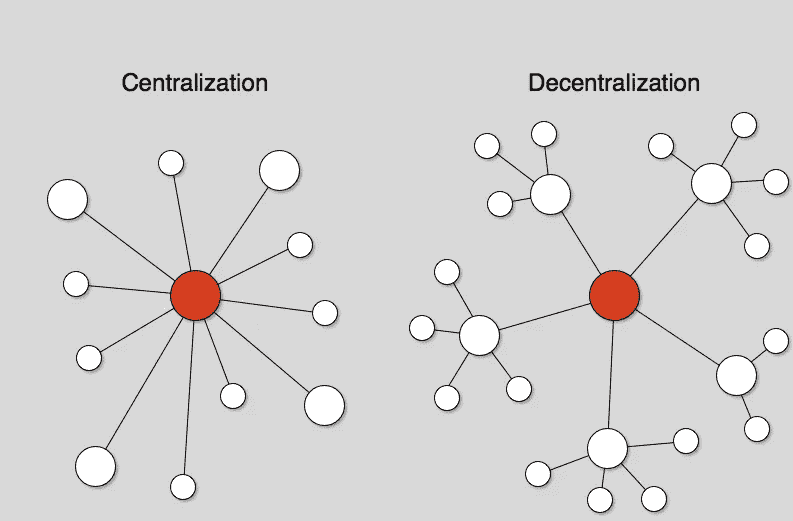
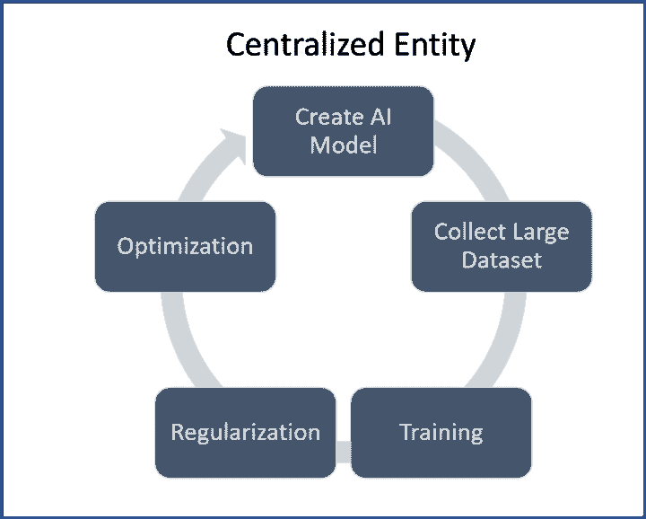
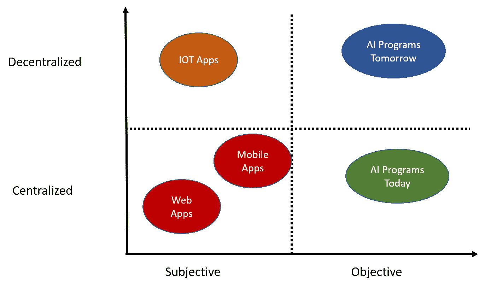
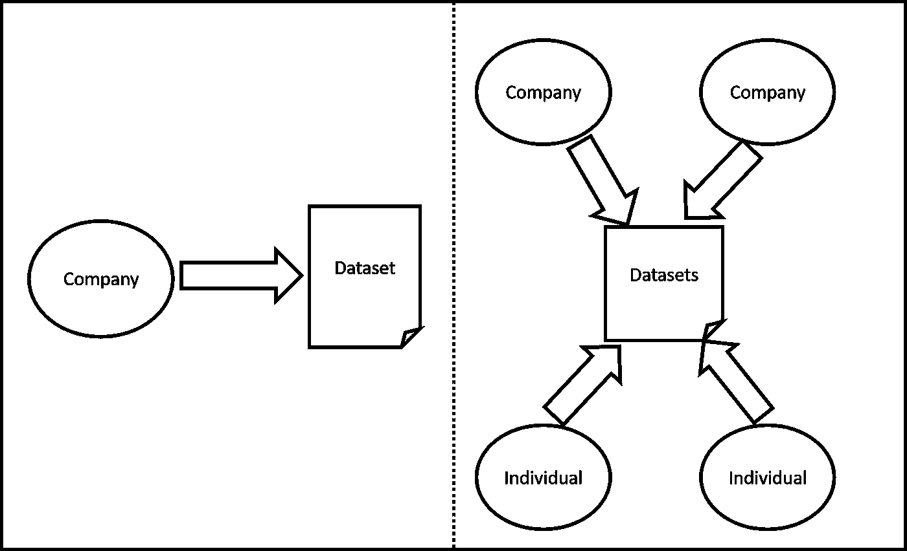
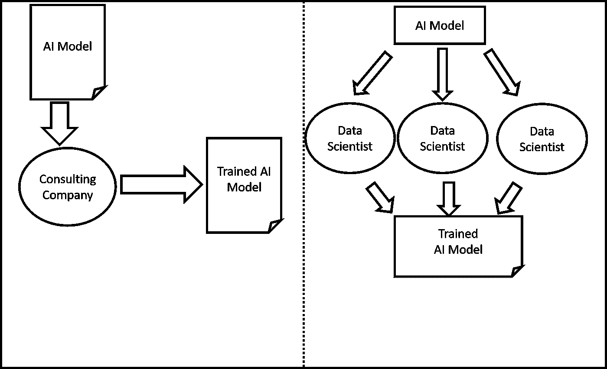
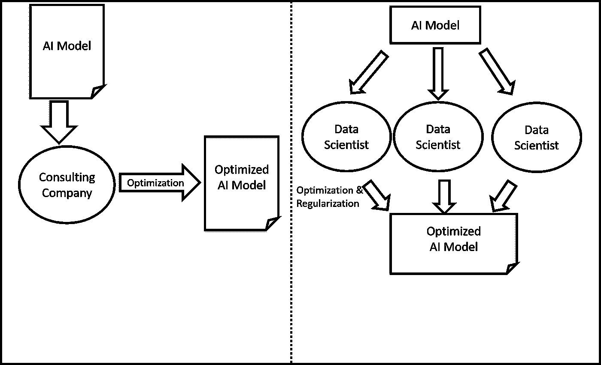

# AI 不是一个，不是两个，而是很多中心化的问题

> 原文：<https://medium.com/hackernoon/ai-has-not-one-not-two-but-many-centralization-problems-a5f0664361ed>

几个月前，我写了一个关于人工智能(AI)去中心化的三部分系列。在那篇文章中，我试图涵盖证明去中心化人工智能运动的主要因素，从[经济因素](/datadriveninvestor/why-decentralized-ai-matters-part-i-economics-and-enablers-5576aeeb43d1)到[技术推动者](/datadriveninvestor/why-decentralized-ai-matters-part-ii-technological-enablers-a67e3115312e)以及[开发去中心化人工智能平台的第一代技术](/datadriveninvestor/why-decentralized-ai-matters-part-iii-technologies-930c3c9d10d)。我的文章中的论点基本上是理论性的，因为我们都知道，事实仍然是今天的人工智能是完全集中的。然而，随着我在现实世界人工智能问题上的工作越来越多，我开始意识到集中化是一个不断阻碍人工智能解决方案进展的方面。此外，我们应该开始将人工智能中的集中化视为一个单一的问题，而是在人工智能解决方案生命周期的不同阶段出现的许多不同的挑战。今天，我想更详细地探讨一下这个想法。

我说 AI 有很多中心化问题是什么意思？如果我们将人工智能解决方案的传统生命周期可视化，我们将看到一个连接不同阶段的循环图，如模型创建、训练、正则化等。我的论点是，所有这些阶段都是概念上分散的活动，由于当今技术的限制，这些活动被打包成集中的过程。然而，我们应该问自己，如果按需软件开发传统上是一种集中的活动，那么是什么使人工智能如此不同呢？通过分析人工智能不同于传统软件应用的两个主要领域，或许可以找到答案。

# 主观静态与客观动态

让我们看一个场景，一个大型机构正在开发一个 web 或云应用程序。项目团队将从最初的一组需求开始，并将这些需求提交给他们信任的机构或开发小组。该团队将概念化一个适合需求的架构，并开始一个有希望的迭代开发过程。在整个过程中，解决方案将经历一系列测试，直到它符合功能要求，并最终部署在由原始公司或他们信任的第三方控制的基础架构上。

这种集中的生命周期非常适合传统的软件应用程序，因为它们本质上是主观的和静态的。我们为一个功能性问题选择一个架构和技术堆栈，但是我们没有客观的方法知道我们的架构是否是这个问题的最佳解决方案，或者它比备选方案好多少。我们遵循主题专家创建的方法和最佳实践，但是我们没有客观的方法来知道是否有最适合我们问题的方法。类似地，我们的解决方案的结构在本质上是静态的，不一定会根据其环境改变行为或规模。

在人工智能解决方案的情况下，当选择一个模型来解决一组需求时，我们仍然依赖主观意见，但是我们有客观的方法来评估该模型相对于备选方案的性能。同样，我们可以客观地评估训练、正则化和优化方法，并为我们的解决方案选择最佳性能选项。就程序结构而言，随着处理更多数据和获取更多知识，人工智能模型将随着时间的推移而变化和增长。

这一切与集权有什么关系？事实证明，主观和静态结构本质上是集中的，而客观和动态模型更适合去中心化。政府结构是主观的(我们依赖于我们领导人的意见和判断),本质上是相当静态的(我们不会每天更换内阁职位),而民主结构本身是非常客观的(我们投票)和动态的(选举结果会根据人口统计数据等随着时间的推移而变化)。).在人工智能的例子中，人工智能程序的主观和动态本质是一个朝向去中心化的进化方面。下图可能有助于说明这一概念。

我在这篇文章的开头提到，人工智能没有单一的中心化问题，而是有很多。让我们用我们的主观性和动态性的论点来探索一些我最喜欢的。

## 数据集中化问题

AI 不仅仅是一个智力问题，还是一个数据问题。今天，与人工智能问题相关的大型数据集由少数大型组织控制，并且没有与数据科学社区共享这些数据的良好机制。想象一个医疗保健人工智能场景，其中任何实验参与者都可以贡献自己的数据，并提供正确的安全和隐私保证。分散数据所有权是 AI 进化的必要步骤。

## 模型中心化问题

你最喜欢的咨询公司为一个特定的问题选择了一系列人工智能算法，但我们如何知道它们是那个场景的最佳算法？他们是否跟上了大学和研究实验室不断涌现的人工智能研究？如果世界各地的数据科学家社区可以为您的场景提出并客观地评估不同的模型，会怎么样？那不是很好吗？在我看来，随着时间的推移，分散模型和算法的选择将大大提高人工智能解决方案的质量。

## 培训集中化问题

现实世界中人工智能解决方案的一个主要问题是，模型的训练是由创建模型的同一批人完成的。不管你喜不喜欢，这种动态引入了极大程度的偏差，并促使模型非常频繁地过度拟合。如果我们可以将模型的训练委托给一个分散的数据科学家网络，该网络将在正确的激励下提高质量，情况会怎样？培训是人工智能解决方案的另一个方面，它经常受到集中化的伤害。

## 正则化优化中心化问题

我们将我们的人工智能模型部署到生产中，但是我们如何知道它是否正确执行呢？随着时间的推移，它的行为是在改善还是在恶化？可以通过不同的方式调整超参数来提高性能吗？矛盾的是，我们依赖于集中的过程来优化和调整 AI 模型，这些模型经常使用创建模型的同一批数据科学家。想象一下，如果我们可以使用一个分散的人工智能专家网络来尝试找到错误-漏洞，并尝试不断改进我们的模型。人工智能正则化和优化本质上是分散的方法，今天被迫进入分散的过程。

# 不是一个而是许多集中化挑战

正如你所看到的，我们不应该用一个单一的、通用的术语来谈论人工智能的集中化，而应该是许多相互冲突、阻碍人工智能发展的挑战。区块链技术的发展以及联邦学习等范式正在慢慢打开更加分散的人工智能模型的大门，希望我们能够通过解决这些问题中的一个或多个来实现这一目标。