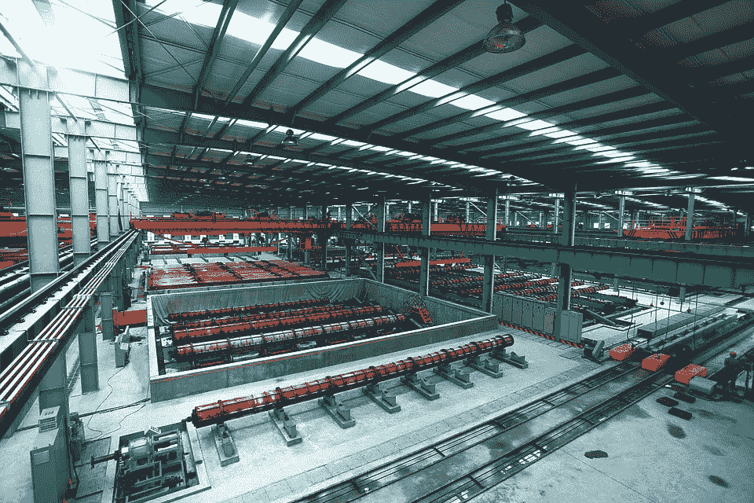

# 人工智能在行动:制造与分销

> 原文：<https://medium.com/hackernoon/ai-in-action-manufacturing-distribution-a9aeaf345426>

A factory is full of places to apply AI

这是一系列强调人工智能众多应用的文章中的第四篇。

制造和分销，即供应链，并不总是像最新的技术趋势或最新的金融工具威胁到全球经济一样受到关注。尽管如此，它仍然是经济的支柱。这个领域有一些最性感的公司——特斯拉是制造商，亚马逊是分销商。制造和分销也是 AI 发展的温床。在供应链上，人工智能可以增加价值的地方数不胜数。这里有几个例子:

# 预测性维护

二十年前，我与一家预测建模公司合作，该公司拥有专有的神经网络解决方案。我们的一个客户是一家全球半导体制造商。他们告诉我们，在他们的芯片制造过程中，每一小时的停机时间都要花费他们 25 万美元。这是一个昂贵、高度复杂的制造系统。另一方面，我在一次交易会上遇到了一位紧固件制造商的工程师。他告诉我，他们以十分之一美分的价格出售紧固件，但他们生产紧固件的速度“比机关枪发射的速度还快”。这不是 25 万美元，但在一个小时的过程中，他们最终产生了一定数量的具有重大价值的库存。

不管你从事哪种类型的制造，停工期都是你生存的祸根。几十年来，制造系统都装有传感器来监控设备的状态。随着“物联网”的到来，这些传感器的复杂性以及它们通过从网络获取数据来辅助诊断的能力呈指数级增长。

过程控制中人工智能驱动的预测建模正在超越“信号健康”，进入更复杂的“系统健康”。系统健康与模式识别有关—可能有一组传感器读数作为历史上导致停机事件的事件的前兆。如果一个神经网络能够识别这种模式，就可以安排维护，从而最大限度地减少或消除停机时间。

> 系统健康与模式识别有关—可能有一组传感器读数，这些读数是历史上导致停机事件的事件的前兆。

像神经网络这样的机器学习解决方案非常适合这种类型的预测建模。由于制造停工期带来的巨大成本，人工智能可以对效率产生巨大影响，并最终影响利润率。

# 销售和运营规划(销售和运营)

销售和运营规划是艺术和科学的神秘混合体，是预言家们负责的吃力不讨好的工作领域，将销售预测与制造产出相匹配。能够理解你的供应和需求的涨落是可持续生产运作和有效供应链管理的核心。

如果你只有一种产品，销售和运营就相当复杂。对于大多数企业来说，有许多 SKU，在某些情况下有数千个。你不必成为脑外科医生或火箭科学家来运行这些多变量预测模型，但这并无大碍。

AI 是来帮忙的。当涉及到这些复杂的系统时，神经网络可以非常有效。一个训练有素的神经网络有可能比传统的统计技术(如多元回归)提供更好的结果。微调供应以满足需求可以降低库存的持有成本。这种改进的计划和预测可以在整个供应链中节省数百万美元。

# 重复性任务

强大的供应链依赖于一群紧密合作的制造商、合作伙伴、分销商和客户。为了让产品及时到达正确的地方，需要进行大量的沟通。必要的通信类型通常围绕着查询和工作流。像这样的查询:

*   “我的订单状态如何？”
*   “请寄给我一份销售收据”
*   “请发给我一个 RMA 号，以便我可以退回订单”
*   “我想取消我的订单”

这些类型的重复问题堵塞了呼叫中心，经常占用呼叫中心 50%以上的可用时间。幸运的是，它们也有助于自然语言处理——聊天技术。聊天代理可以部署在外联网上，允许您的供应链成员提交他们的查询。该查询可以触发聊天代理中的工作流。代理将向供应链成员提问，以收集解决查询所需的信息。无需任何干预，就可以更新订单状态、发布 RMA 编号、通过电子邮件发送收据，还可以解决查询。

将这些重复性任务和工作流程从您的联络中心转移到自助式对话代理，可以让您的人工代理将更多时间花在供应链每天必须处理的更具挑战性的问题上。它还为您的会员提供全天候服务。这种新发现的效率和改进的客户体验将加强您的供应链社区，并最终提高盈利能力。

这些只是人工智能投资如何为制造和分销公司带来丰厚回报的几个例子。无论你居住在供应链的哪个地方，你都应该研究这种新的人工智能技术的价值。

[人工智能在行动:医疗保健](https://hackernoon.com/ai-in-action-healthcare-79efd8ca3b14)

[人工智能在行动:金融服务](https://hackernoon.com/ai-in-action-financial-services-13910a484c7a)

[人工智能在行动:娱乐和媒体](https://hackernoon.com/ai-in-action-entertainment-media-13ac3b7124a3)

Ken Tucker 是一名专门从事人工智能和分析的商业顾问。