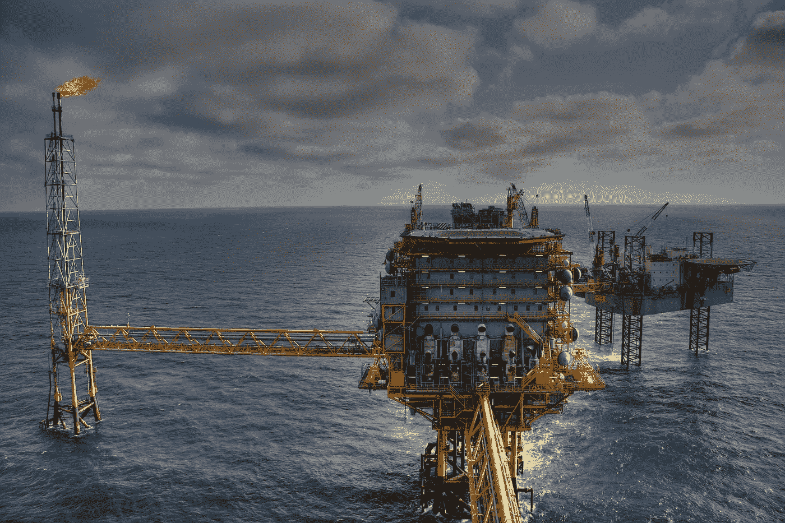

# 人工智能在行动:采矿和能源

> 原文：<https://medium.com/hackernoon/ai-in-action-mining-energy-940a42c5cb0a>

这是一系列强调人工智能众多应用的文章中的第五篇。

有时被称为“采掘业”的矿业和能源业是第一个真正的全球垂直行业，并继续在全球范围内寻求自然资源。在这个领域，人工智能可以在许多方面发挥巨大作用。这里有几个例子:

# 风险管理

去年我和一家管道公司谈论风险管理。当时我正在销售一种基于平板电脑的检测系统。“数据收集不是我们的问题”我被告知。“我们有大量通过 SCADA 自动收集的数据——我们需要有效地解释这些数据。”他们沿着数百英里的管道收集了大量的数据，但是很难以有效的方式处理这些数据。

这是人工智能的一个伟大应用，特别是预测建模。管道的主要风险是泄漏或溢出。为了将此类事件的风险降至最低，管道运营商在维护时必须保持高度警惕。强大的预测模型对有效部署维护资源非常有帮助。该模型可以解释数据，并帮助确定维护计划的优先顺序。根据维护工作的重要程度，项目可以在时间表中上移或下移。有些任务可以等一周，有些可以等一个月——有些必须尽快解决。有效管理该维护计划可以将风险降至最低，并将维护费用的效率最大化。在这个过程中，人工智能可以发挥不可估量的作用。

现代炼油厂配备了包括数千个传感器的生产设备。这些传感器通常会提供数字读数以及颜色读数，通常为绿色/黄色/红色。例如，气体压力读数可能是 102.7 千帕，显示为黄色。自动化系统在管理这条传感器数据河流方面非常有效。他们不太擅长的是识别多个传感器读数的更复杂模式，这可能是问题的前兆。尽早发现问题对于实施预测性维护至关重要——基于神经网络的预测模型非常适合这一目的。

# 探测

在上个世纪，采矿和石油勘探已经从一门艺术发展成为一门科学。个人搜索全球的形象可能更加浪漫，但今天的现实是，大多数探索工作是由工程师、数据科学家和开发人员团队在办公大楼中完成的。在董事会会议室研读卫星数据不能与詹姆斯·迪恩在喷油井下跳舞相提并论，但这就是 2018 年的工作方式。

在这种以科学为导向的探索方法中，人工智能可以提供很多服务。有一种称为 GANS 的神经网络类型，代表生成对抗网络，可以提高图像质量，包括卫星图像。在将卫星图像输入预测模型之前，通过 GAN 处理器运行卫星图像，可以在识别资源丰富且值得进一步研究的位置时产生出色的结果。在这一点上，所有资源的现场测试成本都非常高——如果你能提高上游的命中率，就能大大提高整体勘探生产率。

# 公用事业

勘探业务的另一端是通过电网分配电力。人工智能有助于提高电网的效率和响应能力。把电力的需求和电力的供给匹配起来，和其他行业没什么区别。电源管理实际上是一种专门的销售和运营规划。人工智能可以更准确地衡量商业和消费者需求，还可以帮助提高发电效率，包括太阳能和风能。

采矿和能源是全球最大的行业之一，也可能是所有行业中最“全球化”的——没有一个大陆、国家或地区的行业不会评估其资源潜力。这些只是人工智能可以让采矿和能源受益的几种方式。人工智能在该领域的真正应用范围与其运营规模相当。

[第一部分:人工智能在行动:医疗保健](https://hackernoon.com/ai-in-action-healthcare-79efd8ca3b14)

[PartII: AI 在行动:金融服务](https://hackernoon.com/ai-in-action-financial-services-13910a484c7a)

[第三部:人工智能在行动:娱乐和媒体](https://hackernoon.com/ai-in-action-entertainment-media-13ac3b7124a3)

[第四部分:人工智能在行动:制造和分销](https://hackernoon.com/ai-in-action-manufacturing-distribution-a9aeaf345426)

*Ken Tucker 是一名专注于人工智能和分析的商业顾问。*