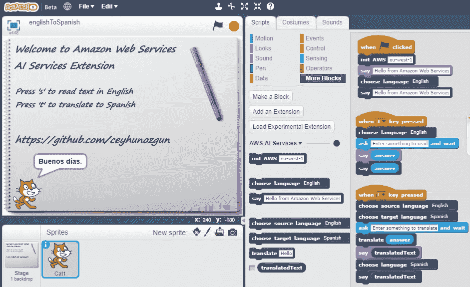
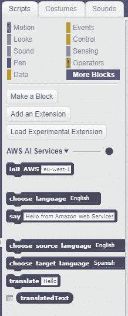

# AI 难？使用这个 AWS 人工智能服务 Scratch 扩展简直是小菜一碟

> 原文：<https://medium.com/hackernoon/ai-is-hard-its-child-s-play-with-this-aws-ai-services-scratch-extension-32bed8669d36>

AWS AI Services Scratch Extension

在我之前的[帖子](https://hackernoon.com/you-cant-fail-to-learn-a-new-language-with-these-aws-ai-services-translate-rekognition-polly-caa5807dec36)中，我提到过我们应该让我们的孩子为未来做好准备。在未来，为了成功，我们的孩子应该具备创造性思维和解决问题的能力。STEM 教育可以提高这些技能。

根据麻省理工学院教授[米切尔·雷斯尼克](http://serious-science.org/coding-as-new-literacy-1546)的说法，编码是一种新的文化。一种名为 [Scratch](https://scratch.mit.edu/) 的可视化编程语言可以激发好奇心，我们知道这种好奇心从孩子出生的那一天起就存在。你可以在这里[这里](/scratchteam-blog/healing-with-code-8fcb38900d8b)和[这里](/scratchteam-blog/meet-the-scratcher-katie-scheutzow-18464f757f64)阅读关于它如何改变孩子生活的故事。

当我在与人工智能服务公司合作时，我一直在想我们如何才能轻松地把人工智能教给我们的孩子。然后我遇到了 [ScratchX](https://scratchx.org/) ，一个 Scratch 的扩展框架，用于向 Scratch 添加新功能。使用 ScratchX，您可以编写扩展来将 Scratch 与您想象的任何东西集成在一起。有[乐高 WeDo](https://scratch.mit.edu/wedo) 、 [Arduino](http://khanning.github.io/scratch-arduino-extension/) 和[树莓 Pi](https://www.raspberrypi.org/blog/scratch-2-raspberry-pi/) 的扩展示例。

然后我想我可以为使用像 Polly 和 Translate 这样的 AWS AI 服务做一个 Scratch 扩展。而且这里是[这里是](https://github.com/ceyhunozgun/awsAIScratchExtension/wiki)。

您可以在这里尝试示例项目[使用 Amazon Polly 以您选择的语言朗读您输入的文本。此外，您可以在语言之间翻译文本，并以目标语言朗读翻译的文本。](https://scratchx.org/?url=https://ceyhunozgun.github.io/awsAIScratchExtension/englishToSpanish.sbx)

下面是样本项目的视频记录。

# 开发扩展

如果你想知道扩展是怎么开发的，那我们就一步一步来开发扩展吧。

创建一个最小的临时扩展，如下所示。在创建扩展对象之后，我们应该通过调用 ScratchExtensions.register 用扩展的名称和定义将要创建的块的描述符来注册它。关于制作 Scratch 扩展的更多信息，请参见[这里](https://github.com/LLK/scratchx/wiki)。

我们可以分三步开发我们的扩展:

1.  创建描述符
2.  实现这些方法
3.  尝试 ScratchX 中的扩展

我们开始吧。

1.  **创建描述符**

描述符定义了扩展注册后将创建的块。创建的块将显示在 ScratchX 的“更多块”部分。

我们的扩展块定义如下。

第一个块用于在浏览器中初始化 AWS JavaScript SDK。

亚马逊波利街区是接下来的两个街区。最后一块是亚马逊翻译服务。

块的参数被定义为“比如%s”。我们可以通过“%m.sourceLanguages”语法使用列表来选择参数，其中“%m .”表示我们希望使用列表，sourceLanguages 显示列表的名称。在 ScratchX 中，列表被称为菜单，菜单由“菜单”字段定义。

我们的扩展块如下所示。

Blocks are shown in ‘More Blocks’ section

**2。实现方法**

在我们定义了我们的块之后，我们将实现在使用块时将被执行的方法。

关于方法细节的更多信息，可以查看[扩展 JavaScript 文件](https://github.com/ceyhunozgun/awsAIScratchExtension/blob/gh-pages/awsAiServicesScratchExtension.js)。在我之前的博文**中详细解释了 AWS 服务在带有 AWS JavaScript SDK 的浏览器中的用法。**

****3。尝试 ScratchX 中的扩展****

**为了尝试我们的扩展，我们应该从一个 URL 加载它。为此我推荐 [MiniWeb HTTP 服务器](https://sourceforge.net/projects/miniweb/)。**

**在您可以在 8080 端口的目录中运行服务器之后，您可以通过访问下面的地址在您的浏览器中尝试它。我推荐谷歌 Chrome 浏览器，ScratchX 在火狐上不行。IE 不会从 http: url 加载扩展，尽管它通过 https: url 工作。**

**[https://scratchx.org/?URL = http://localhost:8080/awsaiservicesscratchextension . js](https://scratchx.org/?url=http://localhost:8080/awsAiServicesScratchExtension.js)**

**当 ScratchX 警告你时，点击“我理解，继续”来加载并尝试扩展。**

# **摘要**

**在这篇文章中，我展示了如何在 Scratch 中使用 AWS AI 服务轻松创建 Scratch 扩展。你可以在这里找到代码。关于制作 Scratch 扩展的更多信息，请点击查看[。](https://github.com/LLK/scratchx/wiki)**

**你可以在这里试试样例项目[。](https://scratchx.org/?url=https://ceyhunozgun.github.io/awsAIScratchExtension/englishToSpanish.sbx)**

**有关如何在使用 AWS JavaScript SDK 的浏览器中使用 AWS AI 服务的更多信息，请参见我之前的博客文章:**

**[*有了这些 AWS AI 服务，你一定能学会一门新语言:Translate、Rekognition、Polly*](https://hackernoon.com/you-cant-fail-to-learn-a-new-language-with-these-aws-ai-services-translate-rekognition-polly-caa5807dec36)**

**此外，你可能会喜欢我的另一篇文章，关于创建一个无服务器应用程序，用于保存儿童照片的过敏信息，并在以后使用亚马逊 Rekognition 的人脸识别方法搜索儿童照片的过敏信息:**

**[*带亚马逊 Rekognition、Lex、Polly、DynamoDB、S3 和 Lambda*](https://hackernoon.com/serverless-allergy-checker-with-amazon-rekognition-lex-polly-dynamodb-s3-and-lambda-35fd215b51b0) 的无服务器过敏检查器**

**我会继续写 AWS AI 服务的不同用例。我将使用 Amazon Rekognition 在扩展中添加对象和文本检测特性。**

**我正在开发一个 Chrome 浏览器扩展，用于使用 Amazon Polly 读取您正在查看的页面上的选定文本，并使用 Amazon Rekognition 从相机中检测 Authy 认证码。请继续关注或关注。**

**如果你喜欢这个帖子，请分享、鼓掌或关注。**

**感谢阅读。**