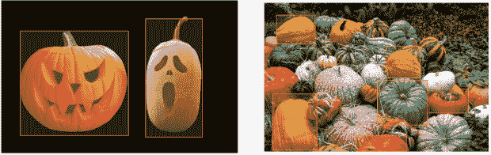
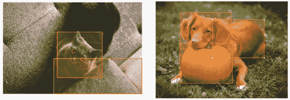
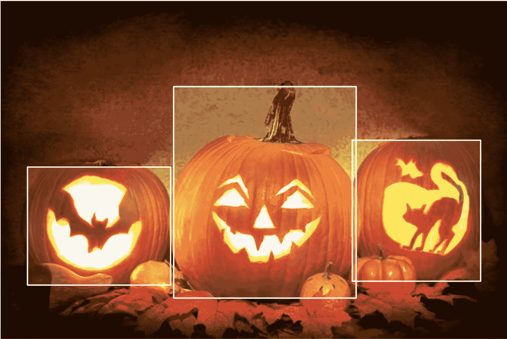
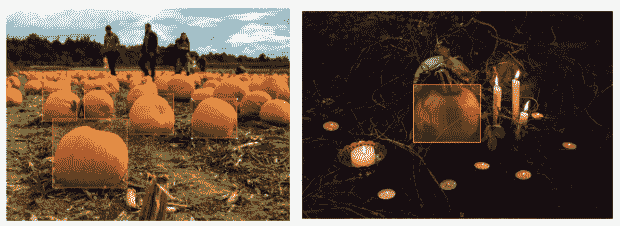
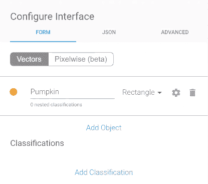
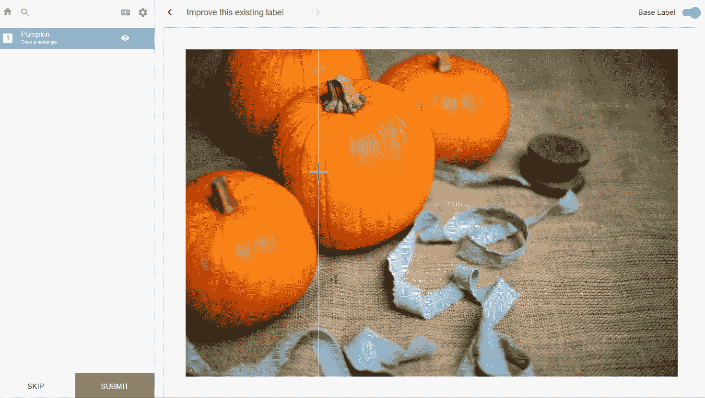
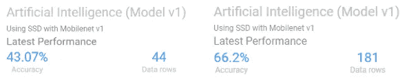
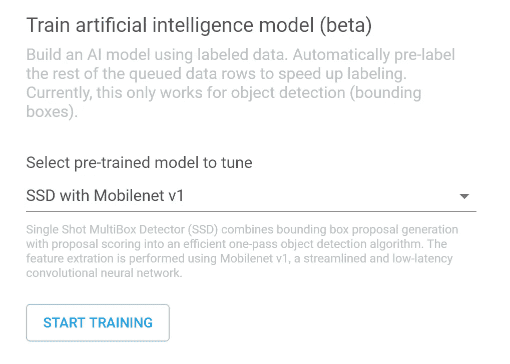

# 人工智能比你想象的更容易接近

> 原文：<https://medium.com/hackernoon/ai-is-more-accessible-than-you-know-2d65ea206052>

准备好学习如何在不到一天的时间内不用写一行代码就能训练你的 AI 了吗？如果你正坐在一堆数据上，你想让它们变得有用，但 AI 似乎是一项太艰巨的任务，无法开始，那么这篇文章就是为你准备的。或者，如果你已经经历了人工智能的战壕，并准备让模型训练过程变得更加简单和快速，你也会发现这篇文章令人大开眼界。

现成的算法已经变得如此之好，以至于它们在机器学习中引入了一种新的可访问性范式。机器学习的对话已经从如何构建预测模型的技术架构发展到如何在特定的业务应用程序上最有效地训练现成的最新模型。为了向您展示训练现成模型的简单性和有效性，并庆祝秋季， [Labelbox](https://labelbox.com/) 将教您如何训练一个名为 SSD MobileNet V1 的深度卷积对象检测模型来识别南瓜。

**南瓜是什么？**

如果你能回答这个问题，那么你也可以训练一个模型。

我们没有从头开始标记图像，而是利用现成的模型来完成类似的任务。SSD_mobilenet_V1 是一个对象检测模型，我们针对客户特定的对象检测应用进行了微调。能够在 Labelbox 中可视化并纠正模型的错误初始预测不仅节省了时间和金钱，还教会了模型培训师更好地定义他/她的目标并更好地控制数据质量。

视觉检查模型对我们的南瓜数据的初始预测迫使我们更深入地思考南瓜是什么，以及我们希望我们的模型识别哪些南瓜。

Pumpkins, squash, and gourds, oh my!

在美国，南瓜通常是指圆形的橙色南瓜，在万圣节被雕刻成南瓜灯或在感恩节被烤成馅饼。事实证明，南瓜的质量，如形状、大小、质地和颜色，变化很大，这使得识别南瓜比我们最初想象的要复杂得多。我们开始质疑我们是否真的知道南瓜是什么，以及如何将它与南瓜或葫芦区分开来。

False positives in the initial prediction

在上面的并排图片中，SSD MobileNet V1 模型错误地将猫的橙色眼睛和狗的橙色皮毛识别为南瓜。这种对橙色的偏好表明，我们数据集中的南瓜不成比例地呈橙色。在下图中，模型正确识别了雕刻的南瓜，但未能识别未雕刻的较小南瓜，这表明我们数据集中的南瓜不成比例地是南瓜灯。

False negatives in the initial prediction

我们需要更深入思考的不仅仅是我们自己对南瓜的概念，还有我们希望我们的模型能够在多大程度上识别南瓜。例如，最初的预测模型能够识别卡通人物南瓜灯，但不能识别南瓜的黑白素描。这个草图是一个错误的否定还是它正确地解释了这个草图不是一个南瓜？这两幅图像在大小、形状、棱纹上相似，但在颜色和雕刻上不同。没有着色，素描是南瓜还是葫芦就模糊不清了。

除了数据集中的潜在偏差，我们还注意到标注过程中的偏差。标签的缺失会使这些区域的预测成为假阳性，使模型偏离检测这些区域。例如，我们标记前景中的南瓜，忽略背景中的南瓜，我们标记焦点中的南瓜，忽略模糊的南瓜，我们标记明亮的南瓜，而不是黑暗阴影中的南瓜。在决定是否标记一个、另一个或两个选项时，没有好或坏的选择，这取决于你想要的结果。关键是要保持标签选择的一致性。

**分三步打造你自己的人工智能**

通过以下步骤，你可以在 24 小时内构建自己的人工智能。

第一步。输入数据

第二步。配置接口

第三步。迭代:标签-训练-评估

Interface Configuration

Labeling Environment

设置(步骤 1 和步骤 2)只需几分钟。我们首先在 Labelbox 中创建了一个新项目，并上传了 500 张南瓜图片。接下来，我们通过键入分段标题“南瓜”并选择“矩形”作为边界几何类型来配置标签界面。我们需要使用矩形，而不是像多边形一样的其他边界选项，因为 SSD_mobilenet_V1 是在矩形边界框上训练的。

微调阶段(步骤 3)是标记、训练和审查的迭代过程。只需点击一个按钮，我们就可以在 44 张图像上训练该模型，结果初始预测准确率为 43%。我们纠正了模型的初始标签错误，并对 181 张南瓜图像进行了重新训练，将准确率提高到了 66%。这个过程可以继续下去，以进一步提高模型的准确性。

First and second iteration of the Automatic Model Builder

**自动模型生成器**

One-Click Model Training with the Automatic Model Builder

Labelbox 即将发布智能贴标辅助(ILA)功能，该功能在幕后运行，不需要任何技术背景就可以开始。ILA 有两个关键组件:自动模型构建器(AMB)和预测 API(T1)。从本质上讲，AMB 执行迁移学习来微调特定于您的特定项目的数据和本体的深度神经网络。换句话说，ILA 自动定制预先训练的最先进的计算机视觉模型，以适应您的商业应用的特殊需求。ILA 分为两个部分，这样 Labelbox 可以在你自己的模型上支持与现成模型相同的预测功能。

AMB 通过在比赛前给你一个起点来加速你的训练过程。当您导入数据时，自动模型构建器工具将生成一个预测模型，该模型会立即预先标记您的数据。无需在基本要素提取图层上从头开始训练模型(例如区分前景和背景或理解对象边缘),从而减少了在迭代标注和训练过程中所花费的总时间，以便您可以更快地启动和运行模型。

通过让模型进行初始预测，您可以量化和可视化模型的初始准确性，并通过跳过初始培训工作直接进入微调来更有效地花费时间和预算。您的模型将正确地处理您的数据集的明显用例，减轻您的领域专家的基本标记，并释放他们的时间用于更复杂或模糊的情况。能够在训练过程中可视化模型如何解释数据将有助于您做出所需的修正，以获得想要的结果。有关如何确保高质量培训数据的更多信息，请查看我们的文章[，这一切都归结于培训数据](/labelbox/it-all-boils-down-to-the-training-data-393376f24e6a)。

我们将发布 AMB，其“单次多盒检测器(SSD)和 MobileNet”用于视觉对象分割。这只是开始。敬请关注，我们将扩展我们的 AMB 功能，以纳入更多来自 [Tensorflow 检测模型动物园](https://github.com/tensorflow/models/blob/master/research/object_detection/g3doc/detection_model_zoo.md)的预训练尖端模型。

**商业应用**

总之，您可以在一天之内将这个自动模型构建工具应用到您的业务中，而无需编写任何代码。我们只用了 2-3 个小时就让我们的人工智能以 66%的准确率识别出了南瓜。只要多一点时间和更多的数据，你就可以快速训练你的人工智能，得到一个极其准确的结果。无论你是试图识别肿瘤还是让你的自动驾驶汽车识别障碍，Labelbox 的 AMB 功能都将通过自动将学习从预先训练的最先进的模型转移到你的商业应用中来节省你的时间和金钱。

访问[www.labelbox.com](http://labelbox.com/)免费探索 Labelbox，或[与我们的团队成员之一](https://labelbox.com/sales)谈论适合您业务的企业解决方案。

*原载于 2018 年 11 月 20 日*[*medium.com*](/labelbox/ai-is-only-a-click-away-bf0b09a82c36)*。*