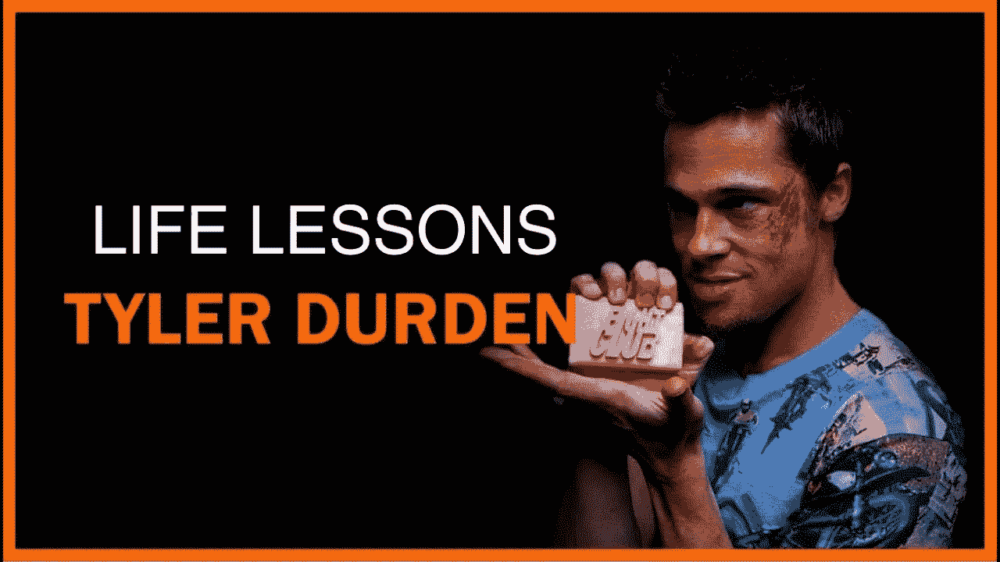
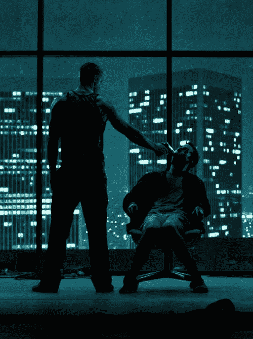

# 艾，乔丹·彼得森的搏击俱乐部和另类右翼。

> 原文：<https://medium.com/hackernoon/ai-jordan-petersons-fight-club-and-the-alt-right-ff366fa736e8>

多伦多大学的临床心理学教授乔丹·彼得森(Jordan Peterson)是一名分裂和有争议的政治活动家，他希望利用人工智能的力量来控制和恐吓他的意识形态对手。这个受欢迎和两极分化的 YouTuber 每月筹资 5 万美元以上，以创建一个人工智能系统，该系统有可能在互联网上搜索与自己相反的意识形态观点。根据彼得森扭曲的逻辑，这是对抗后现代新马克思主义者迫在眉睫的威胁所必需的，他认为并认为后现代新马克思主义者有可能创造另一个毛泽东主义-斯大林主义国家支持的杀人机器。你可能认为彼得森听起来过于多疑，但再想想。这个家伙的家位于多伦多一个安静的街区，贴满了斯大林和毛运动的宣传海报。这位父亲和祖父声称，他们提醒人们这种威胁是无处不在的。我不知道你是怎么想的，但我认识的大多数父亲和祖父都用家庭照片和孩子的画来装饰他们的墙壁，在他们的车库或工作室里放着奇怪的嵌入式日历。因此，在这位临床心理学家转变为政治活动家的表象下，显然还有其他事情在发生。

## 彼得森在另类右翼成员中的号召力

他在另类右翼成员中的吸引力是显而易见的:从提到疯女人劫持政治议程，到他偏执地推断毛主义激进左翼分子尚未杀害数百万人。再加上他对心理特质理论的执着引用，该理论与指导纳粹意识形态为大屠杀辩护的优生学有着共同的哲学根源，对于一个右翼同情者来说，这看起来相当有吸引力。为了建立自己的军队，他在布道坛上大肆宣扬，激进的女权主义者和跨性别活动家通过他们的身份政治宣传，正在接管世界，并在此过程中阉割了无数迷失和被疏远的年轻男性。总的来说，彼得森的剧本听起来像极右翼运动的泰勒·杜登斯的梦遗。

## 彼得森和男子气概

彼得森再一次敲响了男性的鼓点，重新唤醒了泰勒·杜登斯，这个世界是罗伯特·布莱在 1990 年随着他的书《钢铁约翰》的发布而诞生的。《搏击俱乐部》的作者恰克·帕拉尼克在 1995 年写下他的神秘小说并非偶然。像所有有洞察力的艺术家一样，他抓住了这场被误导和冲突的运动的脉搏。

我之所以知道，是因为我在那里，亲眼目睹成年男子将他们的西装换成部落战争服装，用一元店的面部颜料在他们的身体和脸上涂色，同时拿着手工雕刻的长矛在森林里奔跑，寻找难以捉摸的男性战士。赤脚在森林里跑了几个小时后，布莱的杂牌军(包括学者、技术人员、商人和木匠)会回到篝火旁，又冷又饿，遍体鳞伤，最终失望而归。夕阳西下，吃着汉堡，喝着啤酒，喝着约翰尼·沃克，抱怨会开始了。他们对被激进女权主义者劫持的法律体系的不公正的愤怒会达到土狼的程度，因为他们用他们错位的愤怒和愤怒敲打桌子。在篝火周围的凌晨时分，随着约翰尼·沃克的生效，他们开始讲述他们真实的不公正故事:虐待，不在的父亲，在学校的欺凌，拒绝和欺凌兄弟姐妹，以及年长男子实施性虐待和身体虐待的可怕故事。然后诚实的醉酒眼泪会流，真诚的醉酒拥抱提供。第二天早上，喝着咖啡，吃着烤焦的篝火烤面包，暴露太多脆弱的羞愧感油然而生，男人们又开始抱怨他们的前任，被洗脑的疏远的孩子和那些接管世界的血腥激进的女权主义者。

## 了解你要关在笼子里的动物

罗伯特·布莱和乔丹·皮特森的区别在于意识。与皮特森不同，罗伯特·布莱不是《搏击俱乐部》中矛盾的叙述者；他是一个诗人，邀请人们去体验他生命中缺失的东西。而彼得森，作为政治活动家，邀请易受影响的年轻人，用可疑的科学与模糊的荣格形而上学混合，并误导法律结论，为他表演他的内心冲突。希望在他的老大哥人工智能机器出现之前，彼得森会用原型枪指着他的头，结束我们的痛苦。然后用这些免费的钱为所有他声称非常关心的年轻人提供意识形态中立的社区外展项目。