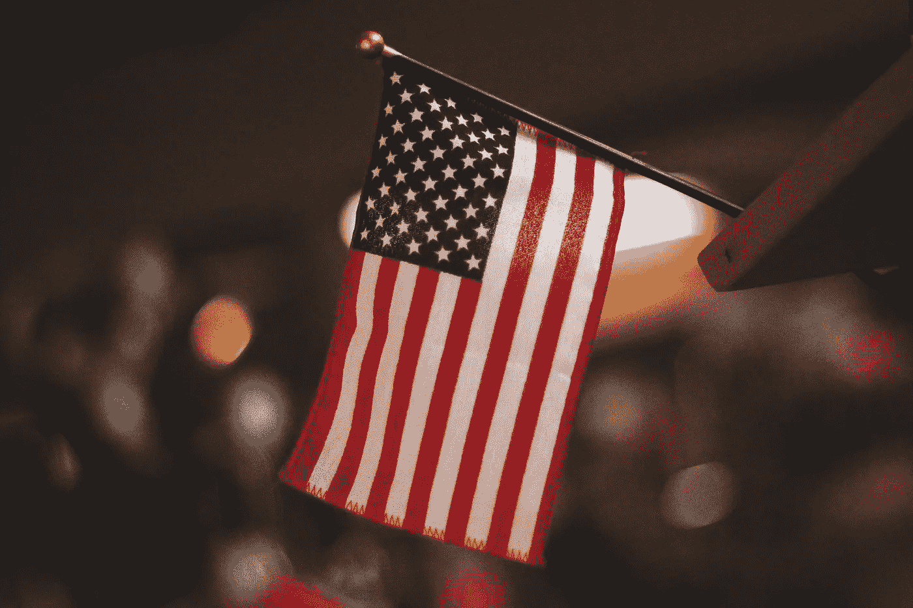

# 艾:新的政治足球

> 原文：<https://medium.com/hackernoon/ai-the-new-political-football-58d9879d812a>

Photo by [Raúl Nájera](https://unsplash.com/photos/TAqspfWom04?utm_source=unsplash&utm_medium=referral&utm_content=creditCopyText) on [Unsplash](https://unsplash.com/?utm_source=unsplash&utm_medium=referral&utm_content=creditCopyText)

大多数人认为，美国的政治环境正在以惊人的速度变化。让我们感到惊讶的不仅仅是共和党的变化，还有新的触摸纸话题，税收总是自由派/保守派对话中的一个来回话题，但除了这个话题，还有一个话题，即将登上舞台的人工智能。那么你在人工智能大分水岭中处于什么位置呢？

去年，Space X 和特斯拉首席执行官埃隆·马斯克(Elon Musk)在全国州长协会发表了一场特别令人振奋的演讲。“我一直在敲响警钟，”他宣称，“但直到人们看到机器人在街上杀人，他们才知道该如何反应。”这篇演讲有点反动。人们退缩了。这真的会发生吗？脸书的首席执行官马克·扎克伯格不同意。他对艾的感情过去是，现在仍然是，绝对积极的。但这让我们可以选择相信谁。这一选择不仅仅是基于专业知识和权威，在未来几年，它还可能取决于我们的政治观点。马斯克和扎克伯格与 AI 的商业关系都不一样。马斯克仍在决定它的定义和应用，而扎克伯格已经在脸书、Instagram 和 WhatsApp 上使用他对这个术语的理解。

这两位行业领袖完美地概括了我们的政治系统将如何(在某种程度上已经)与人工智能的概念打交道。保守的观点倾向于将人工智能视为邪恶的力量——窃取就业机会，以及其发展背后的公司，作为可以轻松击败美国的全球公司。他们这样做的同时并没有完全定义威胁。像扎克伯格这样的企业家往往更乐观，他们认识到人工智能在许多形式上已经逍遥法外，他们对它成为一种有益的力量充满热情。

**山谷中的最后一声呼唤**

但是对技术的政治态度已经发生了变化。新税法已经撼动了硅谷和整个科技公司，大多数人认为这是一件好事。如果你在赚钱，你需要交税。但其他许多人认为这是一种缠足手术。保守派限制他们的商业利益是因为他们想抑制 AI 的发展和保护美国的就业机会吗？

对此有几种看法。亚马逊、苹果和脸书都在慢慢爬上榜单，成为世界上最大的公司之一。你可能会想，美国的爱国主义会接受这一点。毕竟，亚马逊在美国雇佣了 50 多万美国人。至于苹果，尽管有中间人，这个计算机巨头是美国最大的就业创造者之一，负责所有 50 个州的 200 万个就业岗位。那么，为什么保守派会有如此强烈的感觉呢？

对许多人来说，这个话题只是一个更难的感恩节晚餐话题，象征着一个多面的美国。但也许我们可以把马斯克和扎克伯格的例子作为如何从我们自己的政治观点来看待这个话题的指南。

当技术主管们谈论人工智能时，他们不是在谈论机器人和超级计算机，而是在谈论定义和想法。他们正在概述他们的企业承诺和战略，并使用人工智能作为根基。马斯克和扎克伯格代表了同一枚科技硬币的两个截然不同的侧面。马斯克的冒险都发生在真实的物理世界——隧道、宇宙飞船、汽车和屋顶瓦片，而扎克伯格的冒险是虚拟的——友谊、照片和对话。这定义了他们两人理解 AI 的方式。马斯克看到了机器人，扎克伯格看到了算法。

这是因为我们都还处于人工智能的想法阶段。我们对它的理解决定了它会变成什么样。因此，尽管在未来十年或二十年，我们的政治家以人工智能为主题踢足球，但值得记住的是——迄今为止，我们都对人工智能将成为什么持有不同的想法。