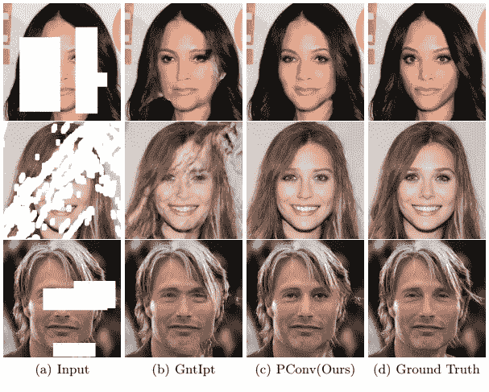
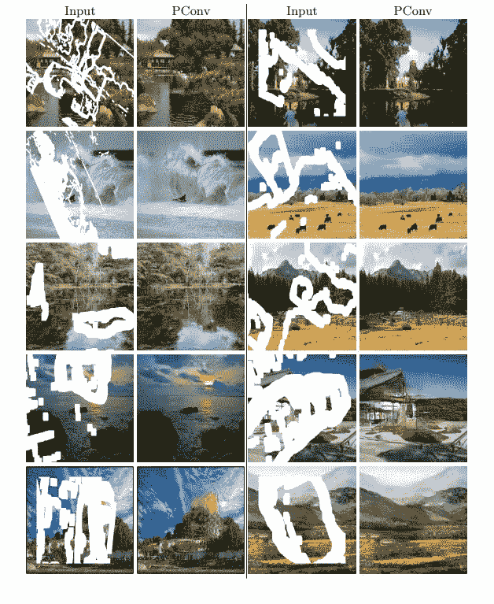
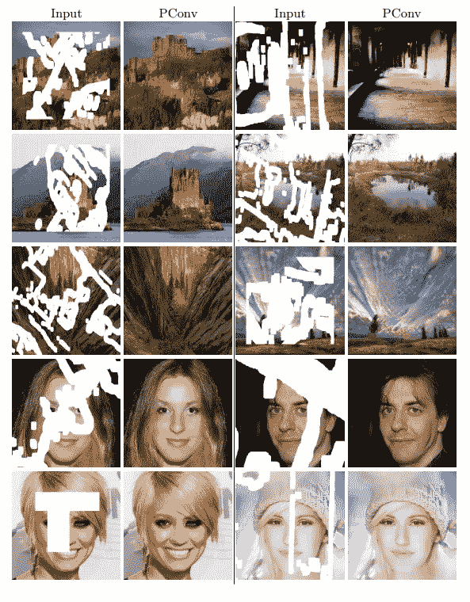

# 人工智能以惊人的精度重建部分擦除的图像

> 原文：<https://medium.com/hackernoon/ai-to-recontruct-partially-erased-images-with-mindblowing-accuracy-66999dbd1f8d>

Nvidia 本周公布了其最新的人工智能突破，其形式是一种令人兴奋的计算机视觉技术，可以“修复”图像中被删除或修改的部分。如果你认为 Photoshop 已经做到了这一点，请三思。这是你必须亲眼所见才能相信的事情。

Nvidia 的研究人员在本周早些时候发布的白皮书中解释了其利用深度学习修复图像的新方法与现有技术之间的差异:

> *以前的深度学习方法都集中在位于图像中心周围的矩形区域，并且往往依赖于昂贵的后处理。这项工作的目标是提出一种图像修复模型，该模型对不规则孔洞图案进行鲁棒操作，并产生语义上有意义的预测，该预测与图像的其余部分平滑地结合，而不需要任何附加的后处理或混合操作。*

正如你在上面的视频中所看到的，Nvidia 的技术没有像当前市场上的技术一样，在图像中填充缺失的空间。没有颗粒退化或模糊的边缘，这需要摆弄不同的笔刷和光滑度或不透明度的水平。

据研究人员称，他们首次成功训练了一个神经网络来处理图像中不规则形状的孔洞。

Nvidia 的人工智能几乎可以瞬间完成即使是经验丰富的平面设计师也需要几分钟甚至几小时才能完成的工作。它的工作方式使用深度神经网络来创建遮罩和部分卷积预测——本质上，它创建了一个看不见的层，它操纵它，直到它“感觉”图像是完整的。

这不是我们第一次被英伟达的人工智能项目的惊人成果震惊了。去年，我们对该公司创造不存在的人[的逼真照片的能力惊叹不已](https://thenextweb.com/artificial-intelligence/2017/11/01/nvidias-new-ai-creates-people-out-of-thin-air/)，甚至对其能够在视频中[改变天气或时间](https://thenextweb.com/artificial-intelligence/2017/12/04/nvidias-new-ai-creates-disturbingly-convincing-fake-videos/)的人工智能印象更深。

由于突破，现实变得更加主观。很有可能，在几年内，区分人工智能生成的图像和“真实”图片的唯一方法将是检查数字签名或让计算机评估单个像素。

> 下一届 Web 2018 大会还有几周就要召开了，届时🔥。点击这里了解我们所有的足迹[。这个故事是由](https://thenextweb.com/conference/tracks)[特里斯坦·格林](https://thenextweb.com/author/tristangreen/)写的，最初发表在 [The Next Web 上。](https://thenextweb.com/artificial-intelligence/2018/04/24/nvidias-ai-reconstructs-partially-erased-images-with-jaw-dropping-accuracy/)
> 
> **点击**[**【HackerNoon.com/TNW**](http://hackernoon.com/tnw)阅读更多下一个网络趋势报道