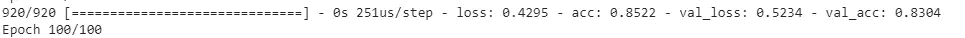

# 对声音进行分类的人工智能:代码

> 原文：<https://medium.com/hackernoon/ai-which-classifies-sounds-code-python-6a07a2043810>

我写过一些文章，可以对不同类型的图像进行分类，例如:

 [## 鸢尾属分类|DeepCognition| Azure ML studio

### 界:植物界分支:被子植物目:天冬目:鸢尾科亚科:环烯醚萜族:环烯醚萜属:鸢尾

towardsdatascience.com](https://towardsdatascience.com/iris-genus-classification-deepcognition-azure-ml-studio-4b930f54435a)  [## “你的”自拍有多好？

### 看看你的自拍有多棒吧！

medium.com](/coinmonks/how-good-is-your-selfie-26c173d84552)  [## 如何制作对狗品种进行分类的 AI，DeepLearningStudio

### 爱狗？

hackernoon.com](https://hackernoon.com/ai-classifies-15000-years-old-animal-dog-the-easiest-way-cd6619cd4d59) 

或者..比如使用 RNNs 生成故事…

 [## 使用 RNNs 生成故事|带代码的纯数学|:

### 嗨读者！

hackernoon.com](https://hackernoon.com/generate-stories-using-rnns-pure-mathematics-with-code-cb6f1e967b22) 

所以我想写一篇文章，解释如何使用人工智能对不同的声音进行分类。

在本文中，我们将了解如何为声音分类准备数据集，以及如何将其用于我们的深度学习模型。

> **数据集:**

我们将使用来自**城市声音分类挑战赛**的数据集。这个数据集**由来自 10 个不同来源**的 8700 多段声音组成。“wav”格式。

声音来源:

*   空调设备
*   汽车喇叭
*   玩耍的孩子
*   狗吠声
*   演练
*   发动机空转
*   枪击
*   手提气锤
*   汽笛
*   街头音乐

这个数据集的大小约为 5.6GB，这让我有点不愿意在其上训练模型。所以我写了一个 python 脚本，可以用来减少数据集的大小。基本上，该数据集包含来自每个来源的大约 600 个声音摘录。我已经将它们减少到 170 个，使数据集大约为 1.1GB。

 [## manik 9/城市声音

### 使用神经网络的城市声音分类

github.com](https://github.com/Manik9/Urban-Sound) 

> **训练程序的平台**

训练深度学习模型等需要高计算能力的程序，我更喜欢使用深度学习工作室(DLS)的 jupyter 笔记本。它为亚马逊深度学习实例提供了 GPU，可用于训练模型。

看看这里。

 [## 主页

### 我们想邀请您在 3 月 26 日至 29 日的 GPU 技术大会上加入 Deep Cognition 的团队，展位号为 1035…

deepcognition.ai](https://deepcognition.ai/) 

> **上传数据集**

**Upload the ‘Urban sound’ dataset in datasets folder**

> **启动 DLS 的 jupyter 笔记本**

> **音频处理**

对于图像，我们通常将像素值传递给模型。在音频的情况下，我们也需要传递某种代表音频的数值。

librosa 是 python 中的一个库，可用于音频预处理。

*   第 1 行:train.csv 包含每首歌曲的位置及其标签。
*   第 7 行:特定歌曲的文件名。
*   第 8 行:“x”是歌曲,“s”代表采样率，即 librosa 读取歌曲的速率。
*   第 9 行:多氯联苯:

source: **Wikipedia**

*   第 17 行:函数“parser”应用于“train”数据帧中的每一行，结果存储在“temp”中。
*   在所有上述步骤之后，我们有了一个数据帧‘temp ’,它用一些数值来表示我们的每首歌曲(逐行)。
*   将输出转换为一键编码

**Labels to One-Hot encoding**

> **模型架构**

每个示例包含 40 列，即(1x40)。所以 1150 的例子包含 1150x40。将此转置传递给模型。

**Architecture of our model**

我们得到一个 1x10 的输出，代表每个类的分数

## 下面的代码复制了上面显示的架构。

**model architecture**

*   第 26 行涉及不同声音类别的数量。

> **训练**

**Training the model**

100 个时期后:

**Training Results**

我们训练的模型在验证集上获得了 83.04%的准确率，这是非常好的，因为我们甚至将数据集的大小减少到(1/3)rd。我们仍然可以通过使用 CNN 来提高这个模型的准确性。我们将在另一篇文章中看到。

**感谢阅读**😄

如果你喜欢这篇文章呢👏分享这个。在 LinkedIn 和 Medium 上关注我

 [## Manik Soni -机器学习实习生-Ace2three.com 印度信息技术有限公司负责人| LinkedIn

### 查看 Manik Soni 在全球最大的职业社区 LinkedIn 上的个人资料。Manik 有 3 个工作列在他们的…

www.linkedin.com](https://www.linkedin.com/in/maniksoni)  [## 马尼克索尼培养基

### 阅读媒介上的 Manik Soni 的作品。机器学习研究员。每天，Manik Soni 和成千上万的其他人…

medium.com](/@maniksoni653/)