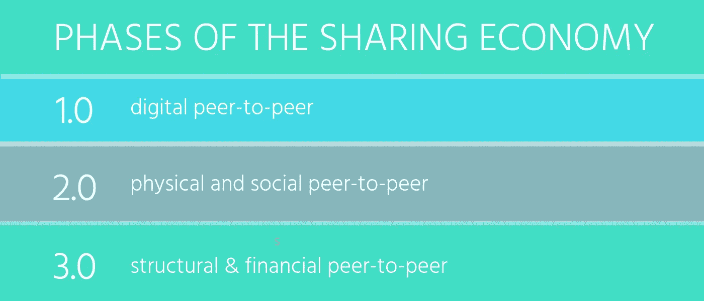
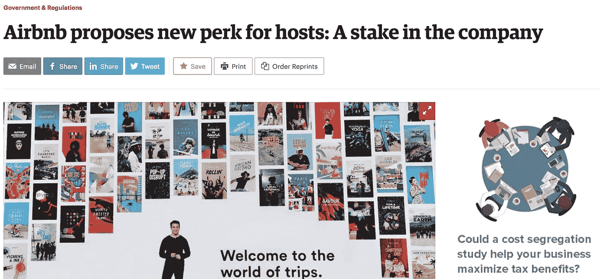
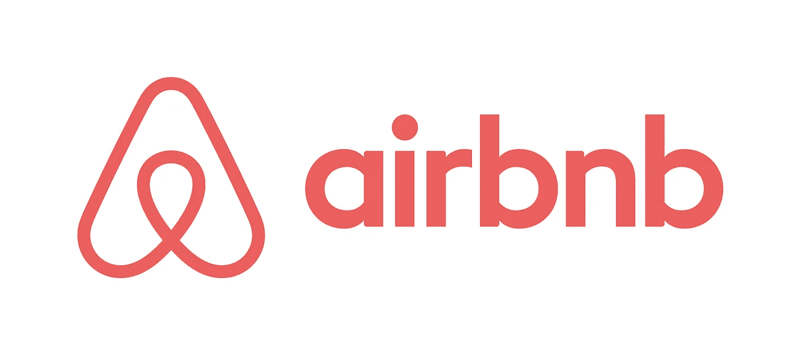
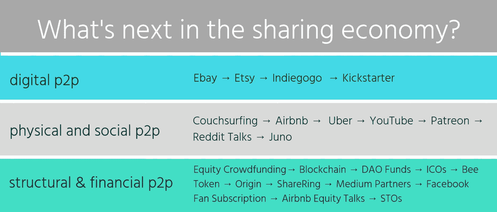
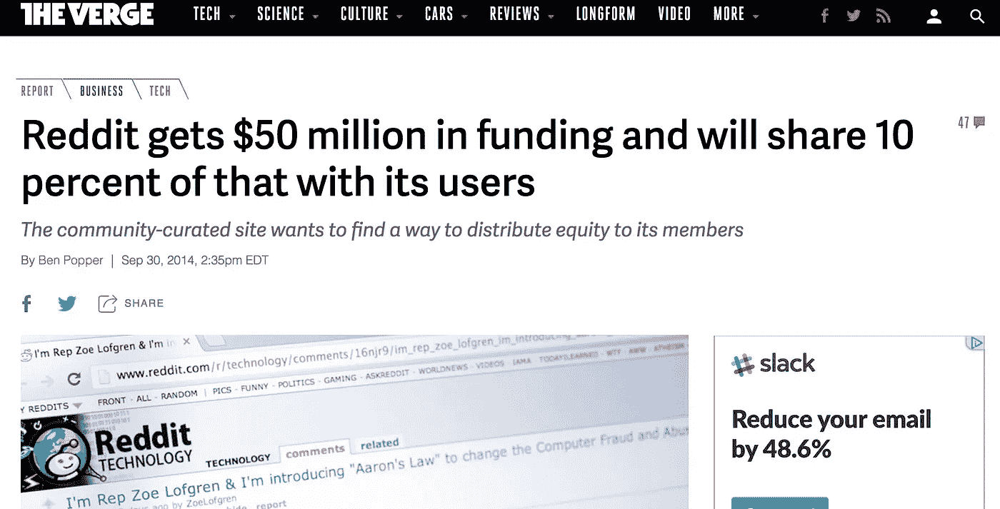
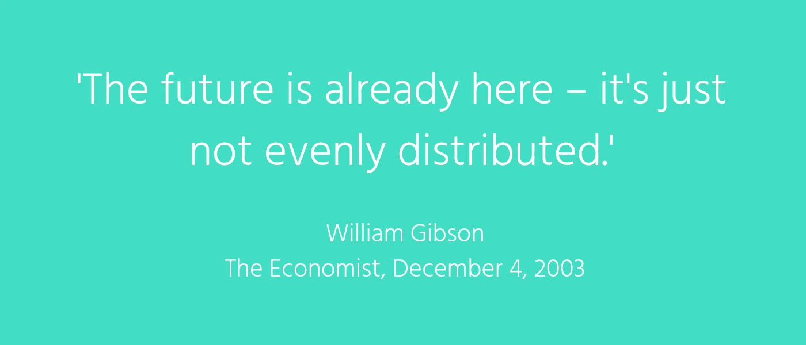

# Airbnb 正寻求为主机提供股权——共享经济的演变

> 原文：<https://medium.com/hackernoon/airbnb-is-looking-to-offer-hosts-equity-the-evolution-of-the-sharing-economy-d4e6638d1fac>

## 商业的未来是价值共享

时不时地，未来会到来。但是未来总是一点一点地到来，一点一点的微小碎片会导致更大的痕迹。我一直在追踪通往高速公路的线索。

几天前，有一个[公告称，Airbnb 正在请求 SEC 修改规则，允许他们向主机](https://www.bizjournals.com/sanfrancisco/news/2018/09/21/airbnb-hosts-ipo-sec-equity.html)提供长期所有权。我的感觉一直是，像这样的大规模变化将需要来自新的[【区块链】](https://hackernoon.com/tagged/blockchain) [技术](https://hackernoon.com/tagged/technology)平台的相当多的外部压力，这些平台通过更低的费用和向超级嘉宾和主持人提供所有权来竞争。由于计划在 2019 年进行首次公开募股，这对 Airbnb 来说无疑是一个有趣的时机。虽然 Airbnb 可能会放弃他们的计划，只是利用这个机会看起来像优步在 2017 年所做的那样无私[，但他们是第一批引领价值分配和共享所有权不可避免的大公司。](https://www.businessinsider.com/uber-met-sec-about-drivers-equity-in-company-2017-6)

> 布莱恩·切斯基在信中说:“Airbnb 认为，当所有利益相关者的利益一致时，21 世纪的公司最成功。”“对于 Airbnb 这样的共享经济公司来说，这包括我们的员工和投资者，也包括使用我们市场的主机。”

虽然美国证券交易委员会目前不允许这种类型的混合——也许他们会或有另一种黑客，这将允许现有机构使用加密货币将至少部分股票转换为证券。

进入 STO。与 ICO(首次发行硬币)不同，STO 代表了用资产、所有权等证券支持代币的机会，并向投资者提供公司的一些权利。根据 Polymath 的说法，[到 2020 年，通过将现有公司转变为这种模式，s to 可能达到 10 万亿美元。](https://steemit.com/polychain/@bertton/how-crypto-goes-from-less-than-usd1-trillion-to-usd100-trillion-with-polymath)

# **共享经济的演变**

随着共享经济的发展，价值共享变得越来越迫在眉睫。几年前，我想象着几家财富 500 强公司宣布他们希望给用户、主机、驱动程序、媒体创作者和其他提供商公平的头条新闻。这终于要开花结果了！

在我最近关于区块链未来的 TEDx 演讲中，你可以看到我在讨论其中的一些想法:

多年来，我知道压力要么来自内部(Airbnb 或其他更大的公司将行业推向新标准)，要么来自外部(新技术，使价值分配和网络业务更加自由和开放)。

> 股权众筹、区块链和 ico 的融合，价值共享是新公司获得竞争优势的一种手段，这些新公司有能力筹集大量资金，并以更灵活的方式运营。

分享 2.0 始于成立于 2004 年的 Couchsurfing——主要是因为 couch surfing 让互联网和全球文化对点对点联系的现实生活优势有了新的认识。在 Couchsurfing 出现之前，人们在交换文件、数字商品、拍卖物品和手工制品，但在度假、商务旅行、独自冒险或乘坐彼此的汽车穿越城镇时，他们不会出现在彼此的家中。

Airbnb 只是效仿 Couchsurfing 的做法，增加了价格标签。他们甚至使用了与 Couchsurfing 类似的口号，“属于任何地方”，而不是“分享你的生活”Airbnb 于 2008 年 8 月成立，优步于 2009 年 3 月成立。而且我们不要忘记，直到 2012 年，优步才创造了用于点对点版本的 UberX，而不仅仅是黑车，职业司机。到 2011 年，YouTube 创建了一个合作伙伴计划，为那些拥有视频频道的人提供分享广告收入的能力。2013 年 5 月，帕特里翁开始挑战媒体创作和作家、艺术家和创作者之间的价值分配现状，将剧本翻转到广告上。

2014 年 9 月， [Reddit 筹集了 5000 万美元，承诺与用户分享 10%的股权](https://www.theverge.com/2014/9/30/6874353/reddit-50-million-funding-give-users-10-percent-stock-equity)。虽然这从未发生过，但 Reddit 是第一批公开讨论这一想法的大公司之一。

2016 年，Juno 试图在纽约市与优步竞争，向司机提供股权。该公司后来在 2017 年出售，并且[正面临与他们的司机](https://www.forbes.com/sites/janetwburns/2017/06/20/ride-hail-drivers-in-nyc-are-suing-juno-for-securities-fraud/)的证券欺诈法律战。显然，他们在 2026 年之前向司机提供了 50%的股权，但很快就发生了清算事件，所以司机在他们是主要的价值创造者时带着几分钱离开了，出售给了更好的所有权结构。

**共享 3.0 正在进行中。这是事情真正混淆的地方。**

这是拥有证券的整个公司将进行重组的地方——现有公司将推动支持其用户的新政策，新公司将在社会激励的边缘发挥作用，而不是永无止境的增长导向型理想。

> 意识正在提高……正如“陌生人的危险”的面纱随着数字和点对点网络而转移，在创造价值的地方分享价值的想法也将成为一个公认的商业标准。

2016 年 5 月，SEC 正式允许公司不仅可以众筹资金，还可以与投资者分享所有权，投资者也可以是用户、爱好者、客户和任何其他对支持(通常较小的)公司增长感兴趣的人。它的革命性之处在于，没有最低投资额(除了那些由平台自己设立的投资)，而且你不必是合格的投资者才能参与。这一变化意味着，从本地啤酒厂到数字平台和社区，一切都可以自给自足，而不是寻求风险投资公司或主要银行的外部投资。换句话说，企业可以通过各自的社区形成，而不是以自上而下的等级组织为中心。

在所有这些变化的同时，甚至与之并行的是，区块链一直在获得主流的动力。中本聪撰写的比特币白皮书于 2008 年 10 月发布。虽然区块链科技还不是一个家喻户晓的术语，但 2016 年 4 月第一只道基金成立，吸引了多达 1.1 万名投资者，在短短一个月左右的时间里筹集了 1.5 亿美元。DAO(代表分散自治组织)在这种情况下，DAO 将作为一个投资于区块链技术公司的基金来运作。不幸的是，就在道形成一个月后，就发现了一个漏洞，一个黑客偷走了超过 30%的投资资金。

接下来，ICOs 占据了中心舞台——在 2017 年的大部分时间里颠覆了传统的风险投资。虽然 Mastercoin 的第一次代币销售发生在 2014 年，但代币销售直到 2017 年才普及，当时根据 Business Insider 的报道，他们共筹集了[56 亿美元，随后根据 Coindesk](https://www.businessinsider.com/how-much-raised-icos-2017-tokendata-2017-2018-1) 的报道，2018 年[的代币销售规模更大。一些试图对抗 Airbnb 等点对点平台的共享经济例子包括 Bee Token、Origin 和 sharing。这些公司正在试验共享经济平台创建的支付比例、所有权和流动性。](https://www.coindesk.com/6-3-billion-2018-ico-funding-already-outpaced-2017/)

在媒体部门， [Medium 启动了一项合作伙伴计划](https://blog.medium.com/expanding-the-medium-partner-program-3be09dd146e4)，根据特定文章的点击率，向贡献者支付一部分广告收入。

2018 年 3 月，脸书悄悄宣布，他们将让[的创作者每月收取 4.99 美元，用于选择访问粉丝内容](https://www.recode.net/2018/3/19/17137446/facebook-video-subscription-creators-youtube-tip-jar)，这实质上是与 YouTube 的合作伙伴计划竞争。

你看，这是数字资产、媒体创作、典型广告、资本形成、加密货币、技术的交织，正在动摇——价值共享是现在的话题，是对话的前沿。它跨越了鸿沟，从一个无政府主义的社会理想，发展到商业结构和社会期望的模式，在你创造价值的同时，为你创造的价值获得报酬——一路分享所有权。这模糊了价值提取经济的愿景，渗入了价值共享经济。

这种情况已经发生了十多年——迹象一直都在。所以你有它。未来已经在这里，但它不是平均分布的。

它来了！

切尔西·鲁斯特罗姆是 a [Blox 7](http://www.blox7.com) 的联合创始人，这是一家帮助区块链公司筹集资金和推出技术的新经济故事代理机构，也是《区块链造福人类》的创始人，这是一部关于区块链积极影响的社会和教育系列片，还是《这是一种可分享的生活》的作者，这是一本关于共享经济的实用指南。