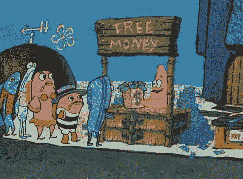
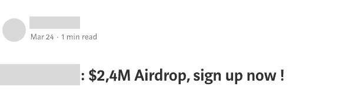
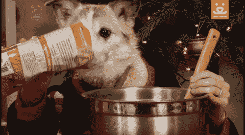
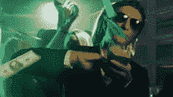
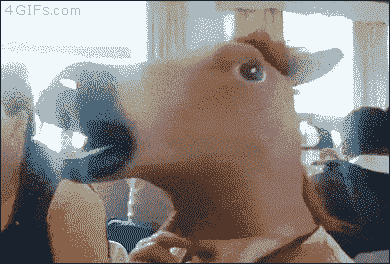

# 空投正在搅乱加密货币市场

> 原文：<https://medium.com/hackernoon/airdrops-are-screwing-up-the-cryptocurrency-market-8776b7148cfb>

## 没有免费的“钱”

Airdrop aren’t free and are intrinsically flawed

# 为什么会有人空投代币？

在 [ICO](https://hackernoon.com/tagged/ico) 利基市场空投，指的是向潜在用户和投资者免费发送一定数量的数字资产的做法。

它首先将代币分配到随机的以太坊地址。理论上，钱包所有者会注意到他们账户上的免费空投，有效地创造了对[加密货币](https://hackernoon.com/tagged/cryptocurrency)生态系统中一种新的数字资产的认识。

然而，这种技术并没有为寻求加密货币资金的项目带来任何切实的价值，因为很难评估其影响。

今天,“新一代”空投已经变得更加结构化，成为更全面的投资者收购战略的一部分。

因此，代币销售营销人员希望得到联系方式，尤其是电子邮件地址，以换取空投。

总体而言，空投可以提供四种理论价值主张:

1.  **潜在客户的产生**:收集联系信息是任何营销活动的关键，尤其是如果潜在客户“偷偷摸摸”。
2.  **病毒式营销**:大多数 ico 都将空投宣传为“免费的钱”——这显然会说服许多人注册销售，并开始推荐他们的圈子。
3.  **触发 FOMO** :由于空投通常发生在销售开始前几周，ico 通常会提供可观的折扣，以说服错过空投的投资者。
4.  **奖励忠诚度**:空投可能是留住回头客的有效策略——不幸的是，大多数通过 ico 筹资的产品都没有……用户。

# **1。空投不是免费的钱**

你真的认为在某个地方，有人在免费给钱吗？

Why would anyone give you free cash?

要贴上“货币”的标签，金融工具必须具备以下三种功能:

*   **交易媒介**，因为很少有人会接受即将到来的代币作为支付或价值转移的形式
*   **记账单位**，因为你无法用代币来评估产品或服务的价格。
*   **价值储存**，因为即将到来的数字资产是针对主流加密货币定价的，与法定货币相比，主流加密货币的波动性很大。

结果发现空投并没有抓住任何一个。它只不过是免费发放，一个没有现值，但在未来可能有价值的数字令牌。

这种令牌没有任何内在价值，只能与支持它的项目、产品和团队相关联。因此，产品上市前的空投没有任何价值。

# **2。价值 xxx 美元的代币空投还是价值 0 美元的代币？**

A couple of million of $ for free?

**想象一下这个:**

1.  一个面包师想出了一个革命性的饼干配方，并决定为第一批烘烤 100 块饼干。
2.  然后，面包师决定为他/她的家人保留 50 个，并计划在 6 个月内卖掉 49 个，那时他的生意已经建立。最后一块曲奇将成为他推销即将推出的品牌的样品。
3.  面包师在街上向 1000 名潜在的购买者赠送最后一块饼干的样品。饼干变成了一块饼干的 1000 个碎屑。
4.  在品尝活动中，面包师宣布他/她计划以每块一百万美元的价格出售最后 49 块饼干。

给你！这 1000 个面包屑每个标价 1000 美元。

现在，面包师可以在他的营销活动中宣布，他/她已经赠送了价值 100 万美元的饼干吗？

当然，但这完全没有意义。

**空投也一样。**

没有任何价值，因为发行者单方面决定价格，没有任何市场反馈。

# 3.空投是给机会主义者的

由于当今大多数 ico 在其令牌分发和促销活动中引入了空投，因此任何 lambda 空投者都很自然地开始累积多个令牌。

当无数 ICO 宣布 x 百万美元是免费发放的时候，谁不会呢？

*当每一个空投者都开始累积每一个可能的空投时，会发生什么？他们不是鼓励大规模堆积吗？*

ico 不再从空投中获得任何价值，因为它去除了这种营销刺痛的唯一目的。因此，空投只针对空投机会主义者，他们不忠于任何人。

此外，它还排斥错过空投的真正潜在客户:

*为什么他们有免费代币，我却要付费？*

# 4.白白泄露你的身份？

如前所述，ICO 在投放任何空投物资之前会要求提供电子邮件地址。这种做法本身没有问题，但是如果一个不太懂加密的人忘记为每笔交易创建一个新的公共地址，就会造成严重的安全漏洞。

此外，电子邮件地址经常被出售给第三方，在加密领域，这很有价值。从 ICO 寻找投资人，到恶意代理寻找黑客机会。

想想看，在你分享电子邮件地址以换取空投的那一刻，账户持有人显然是持有数字资产的投资者。

# 5.这是骗子和骗子的完美工具

空投代币有着在几周内建立一个秘密社区的良好记录。但是怎么做呢？

获得免费代币而没有任何当前价值，但预期未来价值的社区被激励来推广代币。因此，空投者希望他们的数字资产在未来有一个价格标签，因此将促进代币销售，并希望其成功。

如果 ICO 是严肃和专业的，这种现象是没有问题的。

然而，在欺诈项目的情况下，空投可以帮助骗子创建一个天真的空投者社区，这将促进他们的骗局——而没有意识到他们在做什么。

# 6.ICO 应该如何利用空投？

归根结底，区块链的创业公司和传统的创业公司有一个共同的目标:为他们的用户制造产品。

一旦你有了用户，是的，空投是一个很好的工具来回报你的用户的忠诚度并与他们互动。除此之外，仅仅通过空投就可以建立一个社区，这是最少的明智的用例。

空投者受到激励，尽可能多地堆积免费代币，在此过程中消除任何品牌或产品忠诚度。此外，骗子和 shitcoiners 利用空投来建立一个天真的空投人社区，激励推广欺诈性的 ICO。

当然，空投会帮助你宣传你的 ICO，但是记住我们的话:

由无产品 ico 发放的盲目空投是不可持续的，不合理的，迟早会消失。

*你对空投有什么看法？留言评论，* [*发微博给我们*](http://www.twitter/tropyc_crypto) *或者* [*加入我们的电报群*](http://www.t.me/tropyc) *。下面是* [*全文*](https://www.tropyc.co/pages/airdrops-screwing-up-cryptocurrency-market) *。*

# 关于我们

*Tropyc 是 crypto @*[*www.tropyc.co*](http://www.tropyc.co)

原载于[https://tropyc . co/pages/news/airdrops-screw-up-cryptocurrency-market](https://tropyc.co/pages/news/airdrops-screwing-up-cryptocurrency-market)

*我们列出了最初的硬币发行基础，并提供有价值的见解，以帮助像您一样的加密货币爱好者做出更明智的决定。*

*我们是“敏捷的”,所以希望实现更多的功能，但一次只能实现一个功能:)*

## 来加入 tropyc 吧！

 [## Tropyc

### 加密很难，Tropyc 让它变得简单。Tropyc 是加密货币新闻…

www.facebook.com](https://www.facebook.com/tropyc)  [## Tropyc (@tropyc_crypto) | Twitter

### 🌴加密货币的基础🎙️新闻，见解，ico-tokensale…

twitter.com](https://twitter.com/tropyc_crypto)  [## Tropyc

### 🔥www.tropyc.co🔥 🏝Tropyc🏝志趣相投的人组成的社区，对加密充满热情，并在此提供帮助

www.t.me](https://www.t.me/tropyc)