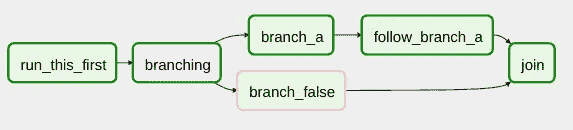
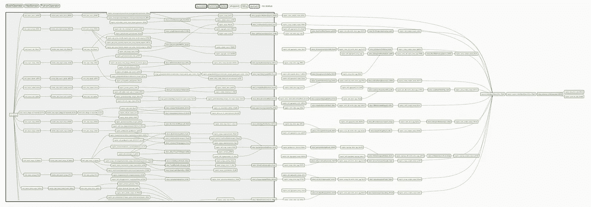

# 世界上最大的民主国家的气流、元数据工程和数据平台

> 原文：<https://medium.com/hackernoon/airflow-meta-data-engineering-and-a-data-platform-for-the-worlds-largest-democracy-3b49a3efd5e8>

> 我最初为 [SocialCops 工程博客](https://blog.socialcops.com/technology/engineering/airflow-meta-data-engineering-disha/)写了这篇文章。

Photo by [arihant daga](https://unsplash.com/photos/a9KHeyRyFJU?utm_source=unsplash&utm_medium=referral&utm_content=creditCopyText) on [Unsplash](https://unsplash.com/?utm_source=unsplash&utm_medium=referral&utm_content=creditCopyText)

在我们[关于 Apache Airflow](https://blog.socialcops.com/technology/data-science/apache-airflow-disease-outbreaks-india/) 的上一篇文章中，我们提到了它是如何席卷数据工程生态系统的。我们还讨论了如何使用它在我们的内部系统之间移动数据，并解释了我们创建内部工作流的步骤。ETL 工作流(e)从网站提取 pdf，(t)将它们转换为 CSV，以及(l)将 CSV 加载到商店。我们还简要介绍了使用 Airflow 平台可以解决的 ETL 用例的范围。

在本帖中，我们将讨论 Airflow 的“动态”原则之一如何提供[配置代码](https://confluence.atlassian.com/bamboo/what-is-configuration-as-code-894743909.html)作为自动化工作流生成的强大构造。我们还将讨论这如何帮助我们使用气流为 DISHA 供电，DISHA 是一个国家数据平台，印度[国会议员](https://en.wikipedia.org/wiki/Member_of_Parliament,_Lok_Sabha)和[国会议员](https://en.wikipedia.org/wiki/Member_of_the_Legislative_Assembly_(India))在这里监控 42 个国家级计划的进展。最后，我们将简要讨论我们对当今公共数据技术项目的一些思考。

# 为什么是气流？

回顾一下[之前的帖子](https://blog.socialcops.com/technology/data-science/apache-airflow-disease-outbreaks-india/)，Airflow 是由 Airbnb 的 Maxime Beauchemin 创建的工作流管理平台。一年多来，我们一直使用 Airflow 在生产中设置批处理数据工作流，在此期间，我们发现以下几点非常有用，其中一些也是其核心原则。

*   **动态**:工作流可以定义为 Python 文件(DAG 文件)中的[有向无环图](https://en.wikipedia.org/wiki/Directed_acyclic_graph) (DAG)，使得复杂工作流的动态生成成为可能。

An [Airflow DAG](https://airflow.apache.org/concepts.html)

*   **可扩展**:有很多开箱即用的操作符！操作符是工作流的组成部分，每个操作符执行特定的功能。例如，PythonOperator 允许您使用 Python 定义工作流中每个任务内部运行的逻辑！
*   **可伸缩**:您的工作流中的任务可以由多个 Celery workers 使用 CeleryExecutor 并行执行。
*   **开源**:该项目正在 Apache 软件基金会孵化，并被积极维护。它还有一个活动的 [Gitter room](https://gitter.im/apache/incubator-airflow) 。

此外，Airflow 还附带了一个 web 界面，为您提供工作流执行所需的所有上下文，包括每个任务的状态(运行、成功、失败等)。)到任务生成的日志！

# 静态代码的问题是

在 SocialCops，我们已经观察到了一个使用 web 服务从各种系统中提取数据的重复用例，作为我们 ETL 工作流的一个组成部分。推进这项任务的方法之一是编写 Python 代码，可以使用 PythonOperator 将数据集成到工作流中。让我们看一个非常基本的 DAG 文件来说明这一点。

正如您所看到的，`PythonOperator`可以通过使用`python_callable`关键字参数指定包含您的 Python 代码的函数的名称来实例化。然后可以使用 Airflow API 的`set_downstream`和`set_upstream`方法链接多个实例化的操作符。

在上面的 DAG 文件中，`extract`函数用一个查询参数向[httpbin.org](http://httpbin.org/)发出一个 GET 请求。Web 服务在请求限制(如果它们同时支持多个请求)、查询参数、响应格式等方面可能有所不同。因为为每个 web 服务编写定制的 Python 代码对于任何维护代码的人来说都是一场噩梦，所以我们决定构建一个 Python 库(我们称之为 magon，因为它是数据的磁石)，它接受描述特定 web 服务的 JSON 配置作为输入，并使用一组预定义的查询获取数据。但是这仅仅解决了我们问题的一半。

在我们的[上一篇文章](https://blog.socialcops.com/technology/data-science/apache-airflow-disease-outbreaks-india/)和上面的 DAG 文件示例中，我们可以通过编写对`set_downstream`和`set_upstream`方法的静态调用来将操作符链接在一起，因为工作流非常基本。但是想象一下定义了 1000 个操作符的 DAG 文件的可读性。你必须是一个专家才能推断出运算符之间的关系。此外，团队中的每个人(包括不以 Python 为主要语言的人)都不知道如何编写 DAG 文件，手动编写它们会重复且低效。

# 元数据工程

在他的演讲“[用 Apache Airflow](https://www.youtube.com/watch?v=23_1WlxGGM4) 推进数据工程模式”中，Airflow 的作者 Maxime Beauchemin 解释了数据工程师应该如何在他们的工作中找到共同的模式(动态构建工作流的方法)，并围绕它们构建框架和服务。他给出了一些这种模式的例子，其中之一就是 AutoDAG。这是 Airbnb 内部开发的一个 Airflow 插件，用于自动创建 DAG，允许只需要运行预定的 SQL 查询(而不想创建工作流)的用户在 web 界面上创建查询。

寻找模式包括识别工作流的构建块，并基于静态配置将它们链接起来。查看我们在上一节中展示的 DAG 文件，并尝试识别构造块。它只有三个组件，可以模拟成一个 [YAML](https://en.wikipedia.org/wiki/YAML) 配置。

这是一个很基本的例子。更详细的话，你应该看看 [Pachyderm](http://docs.pachyderm.io/en/latest/reference/pipeline_spec.html) 和 [Digdag](http://docs.digdag.io/workflow_definition.html) 是如何建模他们的工作流规范的，他们使用这些规范来动态生成工作流。

这使得我们现在可以轻松地编写一个*单个* DAG 文件，该文件可以接受一堆 YAML 配置，并通过链接具有相同标识符的操作符来动态构建 DAG(在本例中，为了简单起见，我们使用了数字 1)。此外，团队中任何想要创建工作流的人都可以编写一个 YAML，这使得人们可以很容易地定义机器可读的配置。一旦您找到了一种基于配置创建 DAG 的方法，您就可以构建一个界面，让用户无需编写配置就可以构建 DAG，这让任何希望创建工作流的人都很容易！

对于 DISHA，我们需要通过 web 服务从源系统中提取方案数据，然后使用 T 和 l 进行跟踪。在原子级别上，我们的工作流可以分为:

*   PythonOperator，通过使用 Magneton(我们开发的 Python 库)从源系统中提取数据。
*   BashOperator 对提取的数据运行基于 R 或 Python(T)的转换，如清理、整形和标准化跨数据集的地理。
*   PythonOperator 将转换后的数据加载到我们的数据仓库中， [Visualize](https://socialcops.com/visualize/) 可以在数据仓库中运行分析查询。
*   此外，我们使用 PythonOperator 添加了松弛时间和电子邮件提醒。

识别这种模式让我们能够自动创建 DAG。使用 web 界面，任何人现在都可以添加上述三个基本任务所需的配置。这有助于我们在我们的小团队中分配建立工作流的工作，他们中的大多数人只习惯于使用 R。很快，每个人都在编写 R 脚本并构建复杂的工作流，如下图所示。

Airflow web 界面使项目利益相关者可以轻松管理复杂的工作流(如上所示)，因为他们可以检查工作流的状态并准确定位失败的步骤，查看失败任务的日志，解决问题，然后通过重试失败的任务来恢复工作流。让任务[幂等](https://en.wikipedia.org/wiki/Idempotence)是处理重试的好方法。(注意:重试也可以在 Airflow 中自动进行。)

# 迪沙概述

> “迪沙是迈向良好治理的关键一步，通过它我们将能够集中监控一切。这将使我们能够有效地监控这个国家的每一个村庄。— 印度总理纳伦德拉·莫迪

地区发展协调和监测委员会于 2016 年成立[。目标是在中央、邦和地方行政委员会政府之间进行协调，以便成功和及时地实施关键计划(如国家农村生计任务、Pradhan Mantri Awaas Yojana 和 Swachh Bharat 任务)。为了监控方案并做出数据驱动的实施决策，利益相关者需要获得关于方案的有意义的见解。这需要集成包含方案数据的不同系统。](http://pib.nic.in/newsite/mbErel.aspx?relid=147922)

去年，我们与农村发展部(MoRD)和国家信息中心(NIC)合作创建了 DISHA dashboard，由总理于 10 月份在 T2 启动。DISHA 仪表板帮助议员、立法议会议员和地区官员跟踪不同中央部委在其各自地区和选区的旗舰计划的执行情况。

早在 2017 年 10 月，仪表板就有 6 个方案的数据，并于 2018 年 8 月更新，以显示总共 22 个方案的数据。在其最后阶段，仪表板将统一来自 42 个旗舰计划的数据，以帮助利益相关者找到生命、宇宙和一切的答案。来自 20 个部委的数据将第一次打破各自为政的局面，汇集到一个地方，为超过 20 亿卢比的政府预算带来问责。20 万卢比！

DISHA 会议每季度在[举行一次，委员会成员在会上确保所有计划都按照指导方针执行，调查执行过程中的违规行为，并密切审查分配资金的流向。如上所示的工作流已经自动地将数据从方案数据库流向 DISHA 仪表板，用方案的最新数据定期更新仪表板。这对委员会成员很有用，因为他们可以通过检查每个方案的性能并确定优先事项和差距领域来计划会议议程。](http://pib.nic.in/newsite/mbErel.aspx?relid=147922)

*观看总理讲述他如何使用迪沙仪表板监控普拉丹·曼特里·阿瓦斯·约纳* [*这里*](https://blog.socialcops.com/inside-sc/announcements/pm-narendra-modi-monitoring-pmay-disha-dashboard/) *。*

# 走向更好的公共技术

数据提取是一个更大的难题的一部分，叫做[数据整合](https://en.wikipedia.org/wiki/Data_integration)(从不同的系统，以你想要的方式获得你想要的数据到一个单一的地方)，人们从 20 世纪 80 年代早期[开始就一直在研究这个问题](https://dl.acm.org/citation.cfm?id=1500483)。由于系统是异构的，集成不同的数据系统可能相当复杂；这意味着它们可以在实现方式、数据存储方式以及与其他系统的交互方式上有所不同，从而形成信息孤岛。

为了成功地从另一个系统中提取数据，交易双方首先需要就如何共享数据的模式达成一致。正如我们发现的，考虑到不同数据系统的异构性，这可能是项目中最耗时的部分。尽管到目前为止，我们已经成功地将 22 个数据源集成在一起，但是如果有一个在所有部门之间存储和共享数据的标准，我们花费在获取正确格式的数据以及每个方案所需的变量上的时间就会节省下来。

在他的文章“[让华尔街和美国军队承担公共服务交付](/a-r-g-o/bringing-wall-street-technology-to-bear-on-public-service-delivery-26f8d794c1d5)”中，ARGO 实验室[的 Varun Adibhatla](http://www.argolabs.org/)谈到了“信息交换协议”。他称之为行话，能够在相当大的范围内共享标准化数据或说一种通用语言。他在这里进一步解释说，在 20 世纪 90 年代，华尔街的金融机构聚集在一起，同意用一种通用的交易语言进行交流。这导致了 FIX 协议的产生，它允许他们快速共享数据。他提到，像 FIX 协议这样的数据标准并不是华尔街独有的，而是存在于贸易和商业的几乎每个领域。

> **“一个由以目的为导向的公共技术专家组成的小团队，利用低成本设备、数据和决策方面的进步以及适当的支持，就可以构建和维护公共的数字基础设施。”—** Varun Adibhatla 在[“让华尔街和美国军队承担公共服务的交付。”](/a-r-g-o/bringing-wall-street-technology-to-bear-on-public-service-delivery-26f8d794c1d5)

随着我们向数字印度迈进，我们需要从根本上改变追求卓越的思维模式和当今公共技术的设置方式。我们需要一个跨越公共服务的标准化数据基础设施，帮助各部委和部门快速相互共享数据，并与公众共享数据。需要培训和雇佣具有硅谷级别技术才能的新一代公务员。印度央行已经有了一名政府首席经济顾问和一名首席财务官。是时候为印度任命一位首席数据官了！