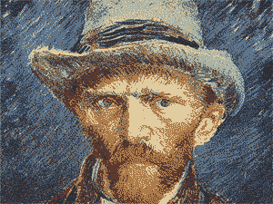

# 艾迄今为止最大的罪行——窃取人类表达的自由

> 原文：<https://medium.com/hackernoon/ais-biggest-crime-yet-stealing-the-freedom-of-human-expression-661826c29ed4>

理解艺术的构成，它对人类体验的意义，以及超智能对人类表达自由的影响。

艺术为两个实体而存在——创作者和接受者。对于前者，它是各种内在心理过程的有形结果，结合传达它们的意图，受到情感和经验的影响。它是艺术家感知和认知的物理表现。对于后者来说，它是一种与普遍真理相联系的媒介。这是一种终极的宣泄体验，意在通过简单地探索作品，让接受者充满创作时的情感。它不受时间、背景、社会结构的共同意义或对世界的理解的约束——它只是在某个时刻被一些自愿或不自愿地打开思维并成为接受者的观察者感觉到。

艺术不是科学或公式化的——它是由感觉和情感驱动的。然而，这并非没有技巧——艺术家必须符合与世界共享的某种程度的意义，调整形式、结构和形状，创造出能够被更广泛的观众理解的表现形式。然而，没有约束、限制或普遍法则来描述艺术家必须遵从这些框架的程度。因此，与科学、数学或任何逻辑不同，艺术是个人主义的，由艺术家的自由意志引导。这也许是人类拥有的最自由的 T2 表达形式——不受语言、逻辑或媒介的限制。

虽然艺术没有目的，但它有意图。艺术家的意图是传达最简单的真理；灵魂的现状；创作时他的存在的版本的写照。因此，构成艺术的不仅仅是一个人在充满情绪的精神状态下的行为后果，而是他将这些行为转化为交流工具的意图。

机器学习指的是向计算机输入海量数据，并为它们配备能够对信息进行分类、过滤和创建表示的算法。那么，一旦有了足够多的图片、绘画或艺术品，先进的图像识别软件应该能够使用规则、寻找模式、提取属性并进行归纳，制作出自己的艺术版本。但是为了什么目的呢？

有些人可能会说，艺术现象在工业世界中有着广泛的用途和影响。它可以与逻辑、语言、消费者行为统计以及对人类思维的理解相结合，创造出成功的广告和商业广告。艺术可以和空间一起用来创造雕塑、城市空间和公共区域。艺术可以与信仰相结合，产生有目的的建筑奇迹——小教堂、大教堂、清真寺和寺庙。诚然，艺术的一个后果是它可以用来赚钱。出于经济和政治动机的团体利用人类脆弱和情感的短暂时刻来推销一种体验并不罕见。由此诞生了科学的*设计*。

也许人工智能系统可以制造出有效的、迷人的*设计。或许公司将不再需要雇佣设计师来制作网站、海报和广告。或许政府将不再需要创意人员来策划政治活动。在获得各种绘画、风格、情感描述和对空间的理解后，人工智能可以使用人类提供的工具、框架和信息来创建表示。但随着时间的推移，他们变得越来越聪明，编程、维护和监控机器人所需的人类干预和影响将会减少。总有一天，机器人会变得足够聪明来维护自己。几天后，它会给另一台机器——其他几台机器——编写程序，让它们也能做出设计。*

声称机器人能够进行设计而不是艺术是理想化的——当我们思考我们最有机的交流形式之一的破坏、损失和腐败时，这是一个令人欣慰的想法。但是研究支持它吗？显然不是。

Lamus 是一台作曲和制作音乐的计算机。马拉加大学的研究人员进行了一项研究，要求包括专业音乐家在内的 250 名参与者区分人类创作的音乐和 Lamus 创作的音乐。

> 研究人员说:“电脑作品引发了与人类相同的感觉和情绪，参与者无法区分它们”。

自动艺术制作程序 AARON 已经向旧金山 MOMA、泰特美术馆和布鲁克林博物馆出售了画作。它不是用像素绘画，而是在实际的画布上绘画。Benjamin Grosser 的[交互式机器人绘画机器](https://newatlas.com/creative-ai-algorithmic-art-painting-fool-aaron/36106/)使用背景音频、对话声音和它自己的“内部机制”来创作绘画。因此，人工智能似乎满足了“唤起接受者的情绪和感受”的标准，从而被归类为艺术。然而，他们这样做是有意图的吗？

## 人工智能是无意识的——*一个无意识的实体能拥有意图吗？*

*意图的当前[定义](https://en.wikipedia.org/wiki/Intention#cite_note-Bratman-1)表明它涉及*计划&深谋远虑*听起来可疑地像认知的元素。因此，这表明一台机器必须有**思考**的能力才能创造艺术。*

## *那么如果一台机器*能*思考，它能创造艺术吗？*

*等等——你需要回答“机器会思考吗？”首先。*

## *机器会思考吗？*

*人类没有能力回答这个问题。我们并不完全了解人类的大脑是如何工作的，所以我们也不知道“思考”到底意味着什么。通过反复试验和大型数据集，我们也许能够创造出能够复制人类行为的机器人，这是“思考”的结果。但是如果我们不能操作或定义“思考”这个术语，我们就不能设计一个测试来衡量它。*

## *那我们怎么衡量机器智能呢？*

*理论计算机科学和人工智能之父艾伦·图灵(Alan Turing)说,‘机器能思考吗’这个问题太宽泛了，而且“太没有意义了，不值得讨论”。相反，他提出了一个模仿游戏——一个测试，看看机器模仿人类的能力有多强。任何能够欺骗法官相信他们正在与人类交流的机器都将通过这个“图灵测试”。*

*有一种普遍的误解，认为通过图灵测试就意味着机器是“智能的”——这是错误的。在他的论文中，图灵没有在测试的成功和机器智能之间建立任何直接的联系。然而，人们把这两者联系在一起，因为在人类中，认知引导行为。当行为发生变化时，我们通常能够将其归因于大脑功能的变化，即认知的变化。然而，机器的行为是它接收到的数据的函数。数据的变化导致行为的变化。因此，计算机在图灵测试中的成功不能归因于其内部机制*

## *好吧——如果我们发明一种测试来测量机器智能，并发现它在认知上与人类无法区分，因此能够表达意图，会怎么样？*

*那么，也许我们可以肯定地说，这些“普遍智能”的实体可以产生艺术。但值得深思的是——如果他们正在创造艺术，它属于谁——机器人，还是给它编程的艺术家？这些新的实体会学习培养情感吗，或者它只是反映了程序员在艺术上的偏见？从艺术作品中唤起的情感会是程序员想要传达的吗？*

*或者也许我们完全错了，太科学，太技术化了。也许机器*就是*艺术品——一种交流的工具，一层额外的复杂性，用来传达创造者的真理。*

*最早的智人在 42000 年前在洞穴的墙壁上画画。后来，我们的祖先发现了纸、帆布、雕刻材料和工具。多年后，平面设计诞生了。进化显示了一种发现、创新的模式，以及人类适应和采用这些新范式的能力，改变了我们在历史的每个阶段传达意义和与世界互动的方式。*

*也许拥抱这种新媒体只是人类适应的方式，让永恒的、流动的艺术概念在明天的世界中更有意义。*