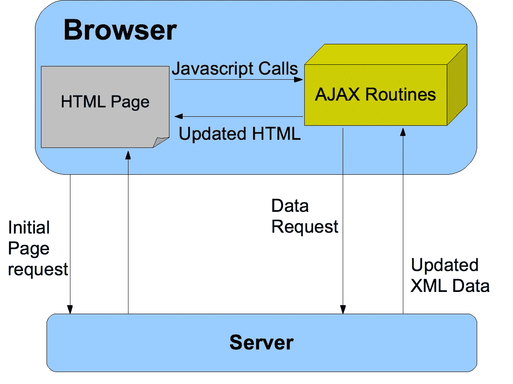

# 简而言之，AJAX

> 原文：<https://medium.com/hackernoon/ajax-in-a-nutshell-4770da7b16f3>

AJAX 代表异步 [JavaScript](https://hackernoon.com/tagged/javascript) 和 XML。AJAX 是实现异步 JS 请求的技术组合，异步 JS 请求可以同时执行(与基本上必须执行的同步相反)。构成 AJAX 的技术如下:

*   HTML 和 CSS 来标记和样式化信息。
*   用 JavaScript 访问的 DOM 可以动态显示信息并与之交互。
*   一种在浏览器和服务器之间异步交换数据的方法，从而避免页面重载。通常使用 XMLHttpRequest (XHR)对象，但有时也使用 IFrame 对象或动态添加的标记。
*   发送到浏览器的数据格式。常见的格式包括 XML、预格式化的 [HTML](https://hackernoon.com/tagged/html) 、纯文本和 JavaScript 对象符号(JSON)。这些数据可以由某种形式的服务器端脚本动态创建。

下图说明了该过程。

[https://blog.arvixe.com/opencart-create-ajax-function/](https://blog.arvixe.com/opencart-create-ajax-function/)

AJAX 的基本功能是创建快速和动态的网页。它通过向服务器异步发送 HTTP 请求来做到这一点，这意味着不需要重新加载整个网页来更新大多数内容。使用 DOM(文档对象模型)解析响应数据。返回 JSON(当今大多数 web 开发人员选择的数据格式)的 AJAX 正式名称是 AJAJ，但是这个术语并没有被广泛使用。我个人最喜欢的执行 AJAX 请求的方式是使用[承诺](https://davidwalsh.name/write-javascript-promises)。AJAX 的一些优点和缺点如下:

# 优势

*   它减少了客户端和服务器之间的流量，如果操作得当，例如使用延迟加载技术，有可能加速你的网站。
*   响应时间更快，从而提高了性能和速度。
*   您可以使用 JSON 代替 XML，因为 XML 更容易解析。
*   AJAX 通过 HTTP 协议进行通信，这意味着它可以访问 GET、PUT、POST、DELETE 和 HEAD 请求。

# 不足之处

*   它可能会增加应用程序的设计、开发时间和复杂性，这可能是不必要的。
*   您可能需要导入第三方库来方便 AJAX 请求，例如，如果您使用 Redux 进行状态管理，可以导入 Redux-thunk。
*   AJAX 应用程序的安全性较差，因为所有文件都下载到客户端。
*   AJAX 应用中的 SEO 可能会受到影响，因为浏览器不能索引 AJAX 页面。
*   如果你的用户使用的是禁用 JS 的浏览器(这年头不太可能)，那么你的应用就不会工作。更有可能的情况是，您的用户无意中在浏览器设置中禁用了 JS。
*   由于安全限制，你只能用它来访问来自提供初始页面的主机的信息，如果你需要显示来自另一个服务器的信息，在 AJAX 中是不可能的。

# 简而言之，AJAX:

下面是有趣的要点:

*   代表异步 JavaScript 和 XML。
*   使用 HTTP 协议进行通信。
*   不需要重新加载整个浏览器窗口来更改数据。
*   JSON 是当前为 web 选择的返回数据格式。

# 资源

 [## OpenCart -创建 Ajax 函数

### Opencart 在整个框架安装过程中很好地利用了 Ajax。也许有一天你会…

blog.arvixe.com](https://blog.arvixe.com/opencart-create-ajax-function/)  [## AJAX 是如何工作的？

### AJAX 的本质是什么？例如，我想在我的页面上有一个链接，这样当用户点击这个链接时，一些…

stackoverflow.com](https://stackoverflow.com/questions/1510011/how-does-ajax-work)  [## Lucy | JS:Ajax 是如何工作的？

### 关于编程的博客帖子，主要是 JS 和 frontend，但也有一些其他主题。

lucybain.com](http://lucybain.com/blog/2015/js-how-does-ajax-work/)  [## 什么是 AJAX

### 由于安全限制，您只能使用它来访问来自提供初始页面的主机的信息。如果…

www.pritambaldota.com](http://www.pritambaldota.com/what-is-ajax/)