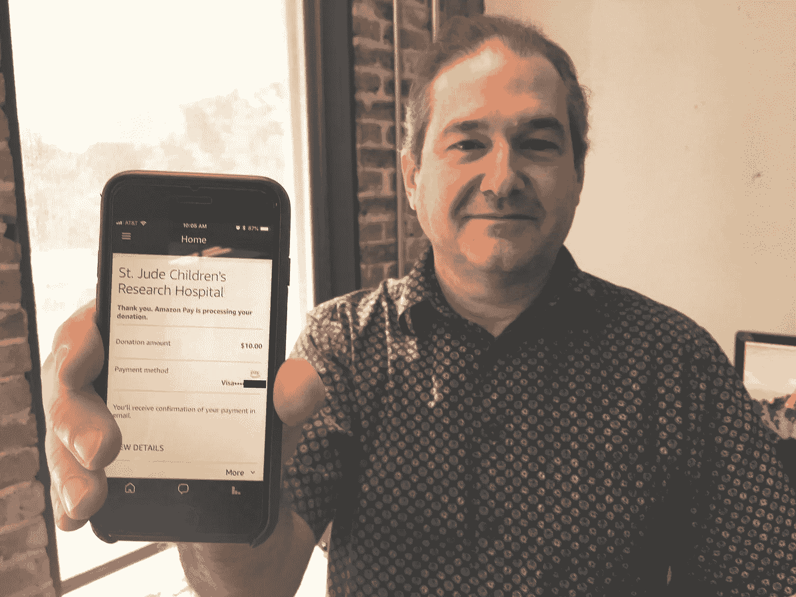
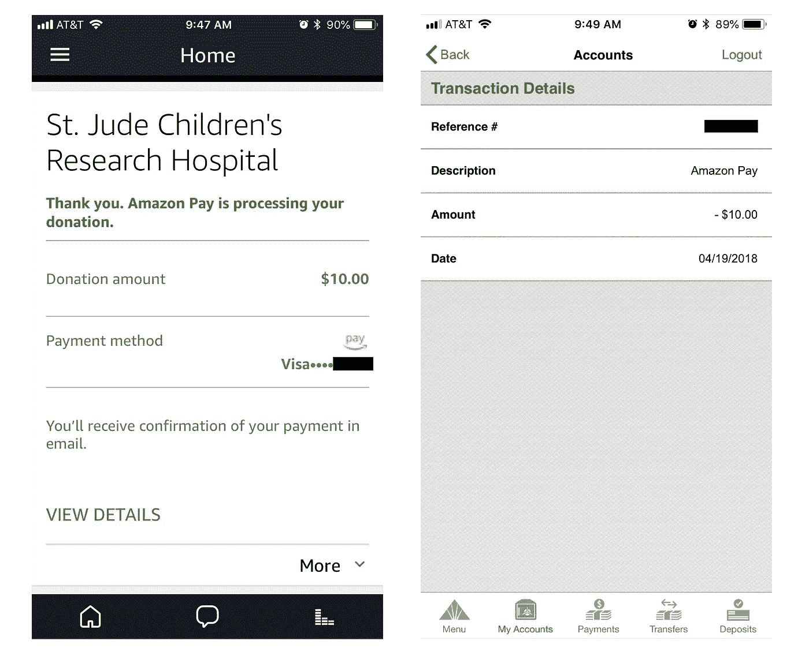
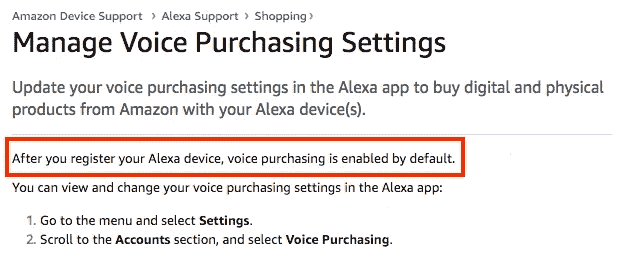
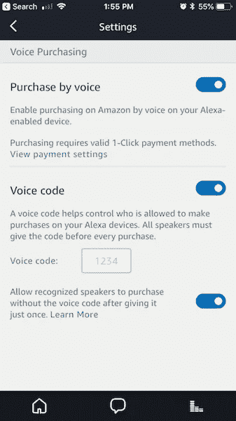

# “Alexa，给 St. Jude 捐 5000 美元”——和我同事的 Echo 聊天

> 原文：<https://medium.com/hackernoon/alexa-donate-5000-to-st-jude-a-chat-with-my-coworkers-echo-1814c5587a5>

## Alexa 让捐赠变得前所未有的简单。这是一件伟大的事情！但你也应该采取这些实际步骤来锁定你的 Alexa 帐户，以防止意外付款。

Mike with the donation confirmation, after I had used his Echo device to successfully donate $10 to charity.

# 真实生活测试

> 我:“Alexa，给圣裘德捐 10 美元”
> 
> Alexa:“你现在想捐 10 美元吗？”
> 
> 我:“是”
> 
> Alexa:“10 美元将使用亚马逊支付发送到圣裘德儿童研究医院。”

周四上午，10 美元从我同事的银行账户成功转账到了圣裘德儿童研究医院。别担心——我已经还他钱了……迈克和我一起在 [Vocool](https://vocool.co/) 工作，这是一家语音技术公司，帮助企业在 Alexa 上与消费者互动。正如你可能想象的那样，我们的办公室几乎堆满了每一台亚马逊 Alexa 和谷歌 Home 设备。我刚刚了解到 Alexa 推出的新功能，即[让用户只需通过语音就能向慈善机构](https://www.theverge.com/2018/4/2/17188168/amazon-alexa-echo-donate-charity-voice)捐赠 5 至 5000 美元。我在 Mike 的 Echo 上测试了这种互动(这显然与他的个人亚马逊支付账户有关)。令人惊讶的是，成功了！如果你很好奇想看看它的动作，请观看下面的视频了解完整的序列(警告:静音附近的 Alexas！).

**但为什么我从未被要求验证我是该设备的所有者？**

不久之后，我实际上又开始使用 5000 美元的金额，当 Alexa 要求我确认捐款时，我紧张地回答说“不”(默默地恳求她不要把我的回答误认为是“是”)。

> 我:“Alexa，捐 5000 美元给圣裘德”
> 
> Alexa:“你现在想捐 5000 美元吗？”
> 
> 我:“没有！”😬

# 挑战

语音平台为开发人员提供了创建简单而强大的应用程序的机会。使用语音向慈善机构捐款令人兴奋，易用性实际上可能会让我更经常这样做。但是，在一个缺少指纹识别器的开发环境中，我们如何才能构建在简洁性和安全性之间取得平衡的对话体验呢？

# 减少摩擦:什么是正确的平衡？

对于各种各样的设计师来说，找到简单和复杂之间的最佳平衡是一个关键问题。随着亚马逊的 Alexa 和谷歌助手等语音平台越来越受欢迎，对话软件设计师(VUI / VUX)的新兴角色尤其如此。(实际上，我们开始让英语专业的学生来领导语音设计。)从亚马逊的角度来看，创建一个额外的认证步骤会产生摩擦，可能会降低用户的速度，降低用户完成捐赠的可能性。然而，如果没有对话中的这一额外步骤，我们会看到这样的潜在风险。

> “当你增加技能时，确保不要引入不必要的痛点或摩擦。”——Alexa 技能构建者指南

# 更好的解决方案

有趣的是，*语音购买*在你设置 Echo 设备的时候**是默认开启的**。

鉴于此，如果能看到亚马逊就好了:

1.  调整默认值，提示用户在首次尝试支付时在 Alexa 应用程序中设置 pin 码。我的猜测是，大多数 Alexa 用户不知道他们的设备上启用了这个设置，他们更喜欢关闭它。在这一点上，额外的 10-15 秒的记忆密码的延迟看起来更像是一个功能而不是负担。另一方面，亚马逊——主要是一家在线零售商——希望尽可能简化通过 Alexa 的购物。我假设亚马逊愿意向发生意外付款的用户退款。
2.  像智能手机使用指纹识别器一样，增加采用每个人独特的[语音模式](https://www.amazon.com/gp/help/customer/display.html?nodeId=202199460)进行身份验证。亚马逊开始使用独特的语音配置文件，为多用户家庭提供更相关和个性化的体验。从长远来看，如果亚马逊能够可靠地通过语音验证用户和支付，我会很高兴抛弃 pin 码。

你还有什么想法可以改善这种体验？

# 收紧你的 Alexa 账户的实用步骤

如果你想锁定你的帐户，以防止意外访问，我建议导航到 Alexa 应用程序中设置的语音购买部分，并采取以下步骤:

1.  考虑你是否希望语音购买被允许。如果没有，请关闭此设置。
2.  更新您的[语音购买设置](https://www.amazon.com/gp/help/customer/display.html?nodeId=201952610)以添加一个 4 位数的“语音代码”。在 Alexa 上进行任何购买之前，将需要此代码。
3.  设置你的 [Alexa 语音档案](https://www.amazon.com/gp/help/customer/display.html?nodeId=202199460)，这样 Alexa 就能把你的声音和别人的区别开来。如果愿意，启用允许已识别的说话者只输入一次语音代码就可以购买的设置。

# 现在就捐！

在您添加了一些安全性之后，不要忘记在您自己的设备上尝试一下该功能(**)并捐赠！以下是目前支持的慈善机构列表。**

[https://pay.amazon.com/us/alexadonations](https://pay.amazon.com/us/alexadonations)

没有最喜欢的吗？试试我的:

## "阿利克夏，给圣裘德医院捐 10 美元"

 [## 给患有癌症的孩子带来希望

### 家庭永远不会收到圣裘德医院的治疗、旅行、住房或食物账单——因为所有的家庭都应该担心…

www.stjude.org](https://www.stjude.org/donate) 

**TL；博士:如果你在亚马逊账户上设置了一键购买，并且拥有一台 Alexa，你应该现在就在 Alexa 应用程序中更新你的** [**语音购买设置**](https://www.amazon.com/gp/help/customer/display.html?nodeId=201952610) **。否则，人们可以从您的帐户购买大量商品。**

我们全押在语音技术上。如果你对如何通过声音吸引观众感兴趣，请[联系](https://vocool.co)！

如果你喜欢这个，请随意鼓掌**👏
关注我** [**推特**](https://twitter.com/JakeAStanley) **。**