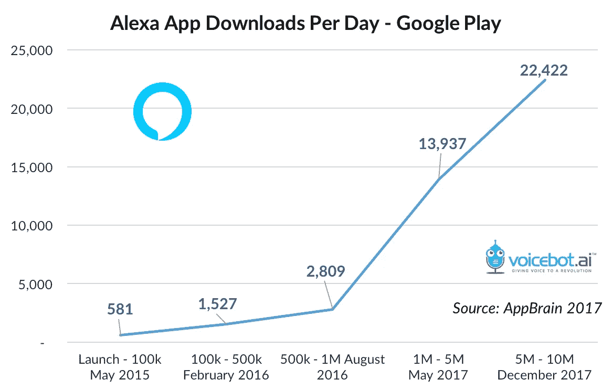
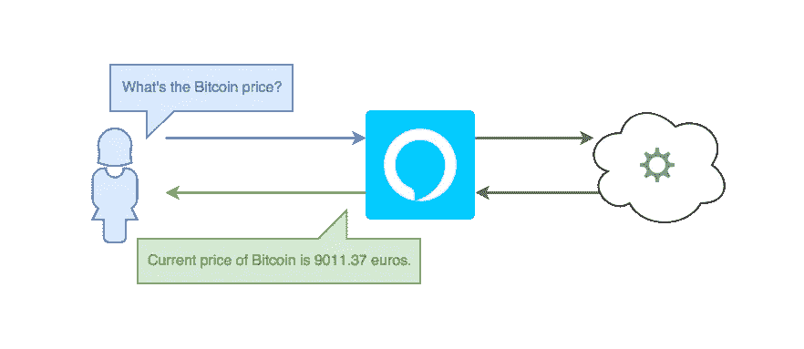
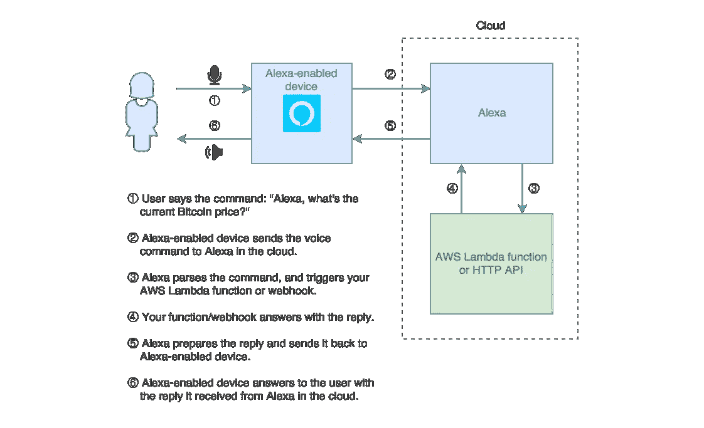
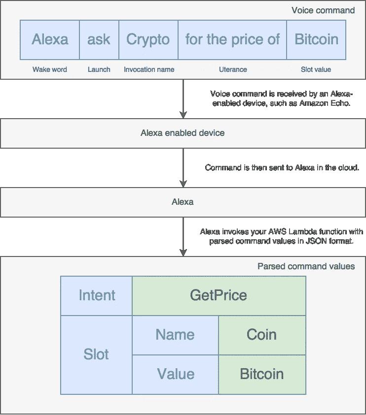
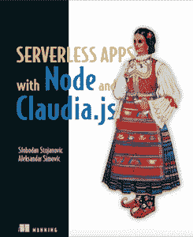

# 亚历克莎，告诉我如何建立一个技能

> 原文：<https://medium.com/hackernoon/alexa-tell-me-how-to-build-a-skill-1aefdabc279>

亚马逊 [Alexa](https://hackernoon.com/tagged/alexa) 是当今市场上最受欢迎的语音助手之一。建立 Alexa 技能是有趣的，它可以作为一个很酷的功能或另一个营销渠道有益于你的产品。

这篇文章是关于如何使用 Node.js 和 AWS Lambda[设计](https://hackernoon.com/tagged/design)和构建 Alexa 技能的教程。


Amazon Echo device

# 你为什么要建立一个 Alexa 技能？

据杰夫·贝索斯 [](http://phx.corporate-ir.net/phoenix.zhtml?c=97664&p=irol-newsArticle&ID=2311817) 称，截至 2017 年 9 月，已售出数千万台支持 Alexa 的设备，以及超过 25，000 种可用技能 [](https://arstechnica.com/gadgets/2017/11/amazon-echo-2017-review-better-price-better-alexa-just-ok-sound/) ，Alexa 是市场上最受欢迎的语音助手之一。

> 据杰夫·贝索斯称，截至 2017 年 9 月，亚马逊销售了数千万台支持 Alexa 的设备

Alexa 技能可以为你的产品增加价值，无论是作为新功能还是一个额外的营销渠道。它们也可以是一个有趣的周末附带项目，将赋予你的客厅超能力——想象一下在你的非程序员朋友面前告诉 Alexa 打开你的圣诞树灯。

支持 Alexa 的设备增长率的一个很好的指标是 Google Play 商店上 Alexa 应用程序 [](https://www.voicebot.ai/amazon-echo-alexa-stats/) 的日下载量，如下图所示。



Number of daily Alexa app downloads on Google Play store in 2017

# 让我们建立一项技能

因为你开始阅读这篇文章，“Alexa，告诉我如何建立一项技能，”我相信你对建立技能感兴趣的不仅仅是下载的数量，所以让我们跳到有趣的部分。

这篇文章是一个关于如何建立一个 Alexa 技能的教程，它将涵盖以下内容:

*   如何定义和设计一个简单的 Alexa 技能？
*   如何使用 Node.js 编程一个技能。
*   如何主持和连接你的 Alexa 的技能。

问题是:我们应该建立什么样的技能？

我知道你可以想出很多好主意，但因为加密货币可能是当今最流行的词，所以让我们创造一个简单的技能，它将能够告诉你加密货币的汇率。

它还应该能够告诉你，对于指定数量的欧元，你可以获得多少加密货币:例如，“1000 欧元我可以获得多少莱特币？”

## 认识加密，你的第一个 Alexa 技能

*Crypto* 是一个简单的 Alexa 技能，可以告诉你比特币、以太坊和莱特币的当前价格。



Crypto, an Alexa skill for current crypto currency exchange rate

# 技能设计

一个好的 Alexa 技能最重要的部分是它的交互设计。交互设计描述了你如何与技能交流，以及交流有多自然。

与网络或桌面应用相反，大多数 Alexa 技能(除了 Alexa 展示设备上的一些技能)没有视觉反馈来引导用户了解你的技能特征。相反，你需要使用语音来指导用户掌握技能。所有 Alexa 技能回复都需要明确告诉用户接下来的选项是什么。

对交互设计的详细研究超出了本教程的范围，因为它需要的不仅仅是一篇文章。好在网上有很多好的资源。作为一个很好的起点，阅读亚马逊在 https://developer.amazon.com/designing-for-voice/[的官方语音设计指南。](https://developer.amazon.com/designing-for-voice/.)

回到我们的加密技巧，我们要讨论两种不同的场景:

1.  询问当前加密货币的汇率。
2.  询问一定数量的欧元可以获得多少加密货币。

对于当前的加密货币汇率，我们需要在命令中输入加密货币的名称:

*   “Alexa，向 Crypto 询问比特币的价格”
*   “Alexa，问 Crypto 莱特币多少钱”
*   Alexa，向 Crypto 询问当前以太坊值

对于一定数量欧元的加密货币的数量，我们可以使用以下命令:

*   “Alexa，问 Crypto 1000 欧元能换多少比特币”
*   “Alexa，向 Crypto 索要 1500 欧元的以太币”
*   “Alexa，问 Crypto 我用 500 欧元能得到多少莱特币”

现在我们有了一个关于我们想要构建什么的想法，让我们看看 Alexa 技能是如何工作的。

# 技能是如何工作的？

一个 Alexa 技能基本上是一个通过 HTTP webhook 或 AWS Lambda 函数与 Alexa 交互的小应用程序。

Alexa 技能请求的流程包括以下内容:

*   支持 Alexa 的设备(例如 Amazon Echo 或 Amazon Echo Dot)。
*   亚马逊 Alexa，云端的智能个人助理。
*   你的 AWS Lambda 函数或 HTTP webhook，它接收来自 Alexa 的请求，并使用将被转换为语音、音频文件和 Alexa 显示内容的文本进行回复。

> 亚马逊 Alexa 不是一个设备，它是云中的智能个人助理，因亚马逊 Echo 和亚马逊 Echo Dot 设备而流行。

Alexa 命令的完整流程应该如下图所示:



Flow of the Alexa command

在本教程中，我们将使用 AWS Lambda，因为它不需要服务器设置，并且像这样的技能是免费的 [⁴](https://aws.amazon.com/lambda/pricing/) 。如果你想了解更多关于 AWS Lambda 和无服务器的优点和缺点，请参阅无服务器介绍 [here⁵](https://livebook.manning.com/?utm_source=twitter&utm_medium=social&utm_campaign=book_serverlessappswithnodeandclaudiajs&utm_content=medium#!/book/serverless-apps-with-node-and-claudiajs/chapter-1/) 。

## Alexa 技能调用剖析

亚马逊 Alexa 和语音助手的一些主要特征是:

*   Alexa 有一个内置的自然语言处理(NLP)引擎，它将解析请求并以 JSON 格式传递数据。
*   语音助手通常需要唤醒词或短语，这种声音会告诉他们在此之后会立即收到命令。

Alexa 是基于命令的，典型的命令包括以下内容:

*   *唤醒词*用来让 Alexa 进入专注状态。默认的唤醒词是“Alexa”，但它可以在设备设置中自定义。在撰写本文时，可用的唤醒词是“Alexa”、“Amazon”、“Echo”和“Computer”。
*   *启动短语*告诉 Alexa 触发某个技能。启动短语包括“询问”、“启动”、“开始”、“展示”和许多其他短语。
*   *调用名称*是你想要触发的技能名称。
*   *发声*告诉 Alexa 技能应该做什么(除非你的启动短语是“开始”或者“启动”)。这些指令被称为话语。拥有静态话语不会给你带来太多的灵活性，所以 Alexa 允许你给命令添加一些动态部分，称为*插槽*。

当用户调用技能时，Alexa 将其解析为 JSON，并将解析后的数据传递给 AWS Lambda 函数或 HTTPs webhook。

下图显示了 Alexa 技能调用的工作原理:



## 本教程的先决条件

除了技能想法和对该技能进行编程的良好意愿之外，您还需要一些东西来遵循本教程:

*   亚马逊账户(因为你需要在亚马逊的开发者门户上设置技能)
*   AWS 账户(因为你的 Alexa 技能会部署在 AWS Lambda 上)
*   已配置的 AWS 凭证(更多信息请参见[本 guide⁶](https://claudiajs.com/tutorials/installing.html#configuring-access-credentialsa)
*   Node.js(版本 4 或更高版本，推荐版本 6.11)，以及 Node.js 的基础知识(因为本指南使用它进行技能开发)

如果你有所有的先决条件，那么让我们跳到你的技能设置。

# 技能设置

下一步是创建和配置你的 Alexa 技能。

为此，去 https://developer.amazon.com/alexa-skills-kit，用你的亚马逊账户登录，点击“开始一项技能”按钮。

这将打开 Alexa 技能配置的“技能信息”部分。在此部分，将您的技能名称设置为“Crypto Bot”，调用名称设置为“Crypto”其余字段应保持不变(技能类型应为“自定义交互模式”，所有全局字段应关闭)。

然后保存并单击“下一步”按钮，转到“交互模型”部分。

*交互模型*是一组定义用户与你的技能交互方式的规则。作为交互模型的一部分，你需要定义意图模式，你的 Alexa 技能命令将被解析的意图列表，以及示例话语；也就是说，样本短语将匹配每一个意图。

intent 模式应该是 JSON 格式的，它应该定义一个 intent 数组，每个 intent 都有一个名称和一个可选的动态部分列表——slots。

我们的技能有两个意图:`GetPrice`和`AmountInfo`。这两个意图都应该有一个硬币名称作为插槽，我们称之为`Coin`，我们将其类型设置为`COIN_TYPES`(我们将在一分钟内定义它)。`AmountInfo`意向也应该有一个数字槽，金额为欧元。这个槽可以命名为`Amount`，应该使用`AMAZON.NUMBER`，这是内置槽类型之一。有关内置插槽类型的更多信息，请参见[文档](https://developer.amazon.com/docs/custom-skills/slot-type-reference.html)。

您的意图模式应该类似于下面的 JSON 代码片段:

```
{
  "intents": [
    {
      "intent": "GetPrice",
      "slots": [
        {
          "name": "Coin",
          "type": "COIN_TYPES"
        }
      ]
    },
    {
      "intent": "AmountInfo",
      "slots": [
        {
          "name": "Coin",
          "type": "COIN_TYPES"
        },
        {
          "name": "Amount",
          "type": "AMAZON.NUMBER"
        }
      ]
    }
  ]
}
```

因为投币口类型显然不是内置类型，所以您需要在“自定义投币口类型”部分将其添加为自定义投币口类型。将其命名为您在 intents 模式中命名的名称(`COIN_TYPE`)，并添加以下数据作为值(它们需要换行):

```
Bitcoin
Litecoin
Ethereum
```

添加自定义槽值后，单击添加按钮保存它们。

交互模型配置的最后一部分是示例话语。示例话语也是换行的。它们总是以意图名开始，后面是示例短语，不包括唤醒词和技能名。示例话语还应该包含槽，这些槽使用花括号中的槽名(来自您的意图模式)来指定，例如`{Coin}`。插槽类型区分大小写。

你应该为每种意图类型添加至少 2-3 个话语。

您的示例话语应该类似于以下文本片段:

```
GetPrice How much is {Coin}
GetPrice What is the price for {Coin}
GetPrice Current {Coin} value
GetPrice {Coin} valueAmountInfo How many {Coin} can I get for {Amount} euros
AmountInfo Amount of {Coin} for {Amount} euros
AmountInfo Number of {Coin} for {Amount} euros
```

现在您已经构建了交互模型，单击 Next 保存它。保存可能需要几秒钟，因为 Alexa 会自动用提供的交互模型训练自己。

保存模型后，您将被转移到“配置”部分。本节需要连接到您的 Lambda 函数或 webhook。但是因为你还没有 Lambda 函数，所以让我们先停在这一步，先为你的技能创建和部署代码。

# 编码你的技能

Lambda 函数的代码是一个简单的 Node.js 模块。这意味着您需要创建一个文件夹(例如`crypto-skill`)，输入您的新文件夹名称，并在其中初始化一个新的 NPM 项目。

因为这个技巧很简单，它可以放在一个文件中，所以在你的`crypto-skill`文件夹中创建`skill.js`文件。

这个文件是一个标准的 Node.js 文件，有一点很重要——在 AWS Lambda 上部署需要您的主文件做`exports.handler`而不是`module.exports`。因此，您的`skill.js`文件的基础应该是这样的:

```
'use strict'function cryptoSkill(event, context, callback) {
  // Do something with `event` and use `callback` to reply
}exports.handler = cryptoSkill
```

有许多方法可以培养技能，但是为了尽可能简单，我们将使用下面的 Node.js 模块:

*   `[alexa-skill-kit](https://www.npmjs.com/package/alexa-skill-kit)` —一个简单的 Node.js 库，简化了为 AWS Lambda 构建 Alexa 的技能。
*   一个创建丰富的 Alexa 回复的类，带有提示、卡片等。
*   `[cryptocompare](https://www.npmjs.com/package/cryptocompare)` —一个用于[https://www.cryptocompare.com](https://www.cryptocompare.com)的 JavaScript API。
*   `[node-fetch](https://www.npmjs.com/package/node-fetch)` —将`window.fetch`引入 Node.js 的轻量级模块。该模块是`cryptocompare`所必需的。

要安装所有依赖项，请运行以下命令:

```
npm install alexa-skill-kit alexa-message-builder cryptocompare node-fetch --save
```

下一步是将 Alexa 技能工具包模块集成到您的处理函数中。该模块接受三个参数:触发 AWS Lambda 的事件、Lambda 上下文和一个回调函数，该函数将被解析的事件调用。

你也可以使用 Alexa Message Builder 来创建漂亮的、可读的回复。完整文档见[https://github.com/stojanovic/alexa-message-builder](https://github.com/stojanovic/alexa-message-builder)。

在 Alexa 技能工具包回调中，你想检查事件是`GetPrice`还是`AmountInfo`意图，并为他们每个人做点什么。

你也应该检查一下这个活动是否是`LaunchRequest`，如果是，就给出你技能的初步指导。

`LaunchRequest`是 Alexa 请求类型之一(参见此处的完整类型列表[)。当用户调用你的技能而没有提供具体的意图时，例如说“Alexa start Crypto”时，它就会被发送](https://developer.amazon.com/docs/custom-skills/request-types-reference.html)

此时，您的代码应该如下所示:

```
function cryptoSkill(event, context, callback) {
  alexaSkillKit(event, context, (message) => {
    if (message.intent.name === 'GetPrice') {
      // Get the price for selected crypto currency
    } if (message.intent.name === "AmountInfo") {
      // Get an amount of crypto currency that user can get for specified amount of euros
    } if (message.type === 'LaunchRequest') {
      // Answer to `Alexa, start Crypto` commandreturn new MessageTemplate()
        .addText(`Hello from crypto currency bot.
                  I can give you the info about bitcoin, litecoin and ethereum prices.
                  How can I help you today? You can say:
                  What is the current Bitcoin price?
                  Or How many Ethereums can I get for 100 euros?
                 `)
        .addReprompt(`You can say:
                  What is the current Bitcoin price?
                  Or How many Ethereums can I get for 100 euros?
                 `)
        .keepSession()
        .get();
    }
  })
}
```

然后使用`cryptocompare`模块对`GetPrice`和`AmountInfo`意图进行编程。

例如，`GetPrice`意图的代码可以是这样的:

```
const token = message.intent.slots.Coin.valueif (Object.keys({
  bitcoin: 'BTC',
  litecoin: 'LTC',
  ethereum: 'ETH'
}).indexOf(token.toLowerCase()) < 0) {
  return 'I can give you the info only for bitcoin, litecoin and ethereum'
}return cc.price(tokens[token], 'EUR')
  .then(prices => `Current price of ${token} is ${prices.EUR} euros.`)
```

在添加了这两种意图的代码之后，您的 skill.js 文件最终应该是这样的:

skill.js

# 部署技能

我们将使用 [Claudia.js](https://claudiajs.com) 来部署技能。Claudia.js 是一个 Node.js 工具，它简化了 AWS Lambda 函数的部署。本节假设您已经全局安装了 Claudia.js，如本指南[⁶](https://claudiajs.com/tutorials/installing.html)中所述，但是您可以将以下每个命令放在 NPM 脚本中，并将 Claudia.js 作为开发依赖项安装。

要部署 Lambda 函数，请运行`claudia create`命令。该命令要求指定以下内容:

*   AWS 地区:Alexa 支持亚太(东京)、欧盟(爱尔兰)、美国东部(北弗吉尼亚)和美国西部(俄勒冈州)地区。我们将使用爱尔兰(`eu-west-1`)。
*   处理程序，它是您的处理程序文件的名称，不带。js 扩展名后跟`.handler`。在我们的例子中，它应该是`skill.handler`，因为处理程序文件是 skill.js，它导出`handler`。
*   版本，因为 Alexa 技能不允许使用默认的`latest`版本。你可以随意命名你的版本，但是我的建议是简单地命名为`skill`。

完整的命令应该如下所示:

```
claudia create --region eu-west-1 --handler skill.handler --version skill
```

当命令执行时，您的 Lambda 函数将被部署。下一步是让 Alexa 触发你的功能。为此，运行以下命令(只需确保您使用的版本与在`claudia create`命令中使用的版本相同):

```
claudia allow-alexa-skill-trigger --version skill
```

该命令将返回如下所示的 JSON:

```
{
  "Sid": "Alexa-1234567890123",
  "Effect": "Allow",
  "Principal": {
    "Service": "alexa-appkit.amazon.com"
  },
  "Action": "lambda:InvokeFunction",
  "Resource": "arn:aws:lambda:eu-west-1:123456789012:function:crypto-skill-medium:skill"}
```

这个响应中最重要的信息是“Resource”，它包含 Lambda 函数 *Amazon 资源名称* (ARN)，您需要在 Alexa 技能配置中完成它。

## 连接和测试你的技能

现在你有了 Lambda 函数 ARN，回到技能创建表单的“配置”部分([https://developer.amazon.com/alexa-skills-kit](https://developer.amazon.com/alexa-skills-kit))。

选择“AWS Lambda ARN”作为“服务端点类型”,并输入上一个命令中的 ARN 作为默认端点。

对“提供地理区域端点？”回答“否”问题，然后单击“下一步”按钮。

这将保存您的技能配置并带您到“测试”部分。在这一部分，您将看到“服务模拟器”，它可以用来测试您的技能。

键入“比特币价格是多少？”进入“服务模拟器”，你会看到 JSON 包含类似“比特币的当前价格是 9011.37 欧元”的文本在“服务响应”中

恭喜你，你已经成功建立了一个 Alexa 技能🎉

如果你的 Alexa 连接到同一个亚马逊账户，那么试着说:

> 阿利克夏，开始加密。

或者

> Alexa，问 Crypto 比特币价格是多少？

它应该用类似“比特币的当前价格是 9011.37 欧元”的文本来回答。

# 进一步的改进

现在你已经建立了一个初步的 Alexa 技能，以下是你可能想要尝试的几个后续步骤:

*   添加历史价格——Crypto skill 应该能够告诉你昨天或任何其他指定日期的比特币价格
*   通过将命令拆分到单独的文件中，添加更好的代码结构
*   将自动化测试添加到您的技能代码中
*   通过填写“发布信息”和“隐私与合规”部分向 Alexa 商店提交技能
*   培养另一种技能

我可能会在下一篇文章中涉及这些主题，但同时，您可以在[“使用 Node 和 Claudia.js 的无服务器应用程序”一书](https://effortless-serverless.com/book)中了解如何完成这些任务。

# Alexa 限制

在对 Alexa 技能做了一些实验后，你会意识到这个平台仍然有一定的局限性。

一些最重要的限制是:

*   您不能动态地或使用脚本来更新自定义槽或意图。这听起来很合理，但也有局限性，因为您不能从 API 中提取数据。例如，如果你想添加一个新的加密货币，那么唯一的方法就是在 Alexa 开发者仪表板中手动编辑自定义槽。
*   Alexa 不识别你的声音，这意味着任何可以和你的 Alexa 说话的人都可以触发你的所有技能。
*   您不能将特定会话中的意图现成地链接起来。例如，如果您有几个后面跟有是-否问题的意图，那么“是”和“否”都是您只定义一次的意图，然后您需要实现每个意图内部的逻辑，这些逻辑将根据存储在会话属性中的前一个命令做出响应。有关会话用法的示例，请参见本文 ⁷.

幸运的是，亚马逊正在不断改进平台，因此每次新的更新或设备都会减少限制。

该技能的初始版本是在博洛尼亚举行的 [NoSlidesConf 2017](http://www.noslidesconf.net) 现场编码会议的一部分。要观看我的“Alexa，开始演示”视频，请访问:【https://www.youtube.com/watch?v=D-eUnlaqUTw[。](https://www.youtube.com/watch?v=D-eUnlaqUTw)

*非常感谢我的朋友*[*aleks andar SIMO VI*](https://twitter.com/simalexan)*和*[*Milo van Jovi I*](https://twitter.com/violinar)*对文章的帮助和反馈。*

## 了解更多关于 Alexa 技能和无服务器



如果你想了解更多关于构建 Alexa 技能、多平台聊天机器人和无服务器应用程序的知识，你应该看看我和亚历山大·西蒙维克为曼宁出版社写的名为《Node 和 Claudia.js 的无服务器应用程序》的书。关于这本书的更多信息可以在这里找到:[https://www . manning . com/books/server less-apps-with-node-and-claudiajs](https://www.manning.com/books/serverless-apps-with-node-and-claudiajs)。

这本书会教你:

*   什么是无服务器，为什么它很重要。
*   如何使用 Node 和 Claudia.js 构建一个真实世界的无服务器 API。
*   如何连接你的 API 和无服务器数据库(AWS DynamoDB)并添加一个认证。
*   如何调试和测试无服务器应用程序？
*   如何为 FB，SMS(使用 Twilio)和 Alexa 技能构建聊天机器人？
*   还有更多…

第一章是免费的，你可以在这里阅读:[https://livebook.manning.com/#!/book/server less-apps-with-node-and-claudiajs/chapter-1/](https://livebook.manning.com/?utm_source=twitter&utm_medium=social&utm_campaign=book_serverlessappswithnodeandclaudiajs&utm_content=medium#!/book/serverless-apps-with-node-and-claudiajs/chapter-1/)

## 参考

新闻稿:Amazon.com 宣布第三季度销售额增长 34%，达到 437 亿美元([链接](http://phx.corporate-ir.net/phoenix.zhtml?c=97664&p=irol-newsArticle&ID=2311817)

亚马逊回声 2017 回顾:Alexa 不再是小众([链接](https://arstechnica.com/gadgets/2017/11/amazon-echo-2017-review-better-price-better-alexa-just-ok-sound/))

Alexa 应用下载次数([链接](https://www.voicebot.ai/amazon-echo-alexa-stats/))

⁴ AWS Lambda 定价([链接](https://aws.amazon.com/lambda/pricing/))

⁵无服务器应用与 Node 和 Claudia.js 图书，第 1 章:介绍无服务器与 Claudia ( [链接](https://livebook.manning.com/?utm_source=twitter&utm_medium=social&utm_campaign=book_serverlessappswithnodeandclaudiajs&utm_content=medium#!/book/serverless-apps-with-node-and-claudiajs/chapter-1/))

⁶安装和配置 Claudia.js ( [链接](https://claudiajs.com/tutorials/installing.html))

⁷用亚马逊 Alexa 技能会话的例子([链接](https://www.raymondcamden.com/2017/09/01/an-example-of-sessions-with-amazon-alexa-skills/))