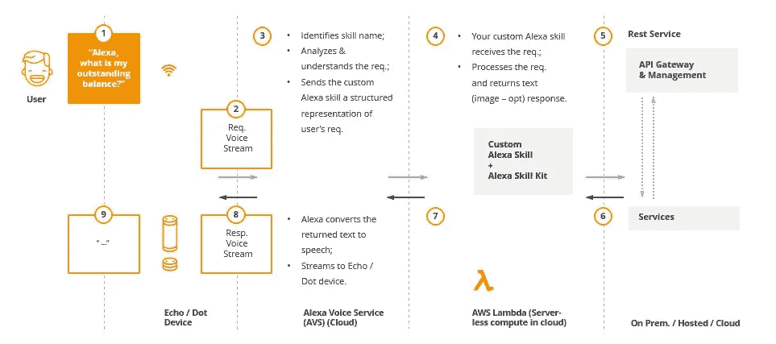
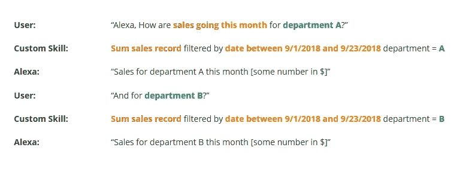

# Alexa 语音控制正在改变我们做生意的方式

> 原文：<https://medium.com/hackernoon/alexa-voice-control-is-changing-the-way-we-do-business-57b186769d8f>

语音控制设备为我们的家庭、汽车、企业，甚至当我们走在街上时，提供了极大的便利和更高的效率。毫不奇怪，这项技术越来越受欢迎。根据皮尤研究中心的一项调查，46%的美国成年人使用他们的声音与智能手机和其他设备进行互动，预计这一数字在未来几年将大幅上升。

Net Elixir 最近的一项研究显示，大多数(64%)使用语音助手的人是通过手机进行的。紧随这一数字的是 35%的受访者表示他们使用语音控制智能扬声器，而许多消费者在各种设备上使用这一技术，包括笔记本电脑、平板电脑和智能手表。而且功能范围广泛，比如查天气，打电话，问问题，听音乐，购物等等很多。

然而，语音个人助理的使用已经远远超出了我们的家庭。企业正在研究这种技术可以节省他们的时间和金钱，同时提高他们向公众提供产品和服务的能力的各种方法。自从我们讨论了语音技术的[潜力](https://www.itproportal.com/features/beyond-smart-speakers-what-can-voice-tech-really-do/)和[在音乐行业的未来](https://blog.dataart.com/will-the-music-industry-embrace-voice-controlled-technology/?utm_source=medium&utm_medium=social&utm_content=sbludov&utm_campaign=m-regular)以来，越来越多的企业已经采用它来改善他们的业务流程。例如，几家[医院正在进行语音助手和对话式人工智能技术的实验](https://www.wired.com/story/does-your-doctor-need-a-voice-assistant/)，以提高效率。酒店也是开发智能环境的语音控制服务的早期采用者之一。为了支持这种趋势，亚马逊刚刚宣布了他们的 [Alexa for Hospitality](https://www.amazon.com/alexaforhospitality) ，这是一种新的体验，酒店经营者可以使用亚马逊 Echo 来利用 Alexa 的简单性和便利性。

语音识别技术的广泛选择为改善各行各业的业务流程带来了巨大的希望。在这里，亚马逊和他们的 Alexa 助手出现在领导者中。

# 一些重要因素决定了 Alexa 对商业和企业的潜力。

1.Alexa 的灵活性非常棒，官方支持的设备越来越多，包括亚马逊 Echo、Echo Dot、Echo Spot 或亚马逊 Fire TV。

2.Alexa 语音服务(AVS)套件使开发人员能够将虚拟助手集成到自己的应用程序中，从而为所有连接的设备带来语音控制的便利，以提高工作效率。

3. [Alexa for Business](https://aws.amazon.com/alexaforbusiness/) 已经为企业带来了新的体验。Alexa 无疑为人们提供了专注于工作重要方面的能力，同时只需使用语音命令就可以快速完成繁琐的任务。这项技术可以节省大量的时间和精力，从而提高生产率和员工满意度。例如，Alexa 能够通过简单地说“Alexa，开始我的会议”来开始会议，而不是使用遥控器，手动拨入呼叫，并且在开始之前必须物理控制各种设备。

4.虽然苹果只是刚刚宣布了他们的计划，以增强 Siri 并允许用户在推出 iOS 12 时创建自定义命令，但亚马逊已经让开发人员能够建立自己的自定义技能，并将其作为组织内的私有技能。

5.AVS 支持用一系列语言和 web 堆栈编写的代码，包括 Java、Node.js、Python 和 C#。

6.Alexa 技能允许开发人员受益于在云端运行——该设备将命令传输到 Alexa 语音服务，在那里它被转换为请求，然后转发给特定的技能。

7.Alexa 正在学习识别用户的声音、语音模式、词汇和个人偏好，以便在用户使用越多的情况下更好地工作。此外，Alexa 能够保持上下文感知的对话，Alexa 技能允许更好的自然语言识别，理解复杂的问题，跟踪上下文，并支持对话。

我们生活在一个技术飞速发展的时代。想象一下，包括智能和直观的内容交付、对金融和市场分析的无缝访问、高速检索数据和统计数据、进行在线支付等等。**你所要做的就是问 Alexa！**

你对用于商业的 Alexa 语音控制有什么想法？请在下面的评论中分享你的观点。

*由* [***谢尔盖·布多夫***](https://www.linkedin.com/in/sbludov/) *高级副总裁* [*媒体与娱乐实践处* ***数据艺术***](https://www.dataart.com/industry/media-and-entertainment?utm_source=medium.com&utm_medium=referral&utm_campaign=m-regular&utm_content=sbludov-hn-alexamusic)