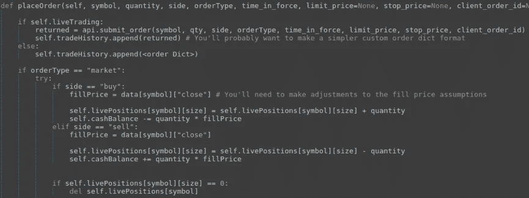

# 模拟算法交易——构建一个定制的回溯测试器(第三部分)

> 原文：<https://medium.com/hackernoon/algo-trading-for-dummies-building-a-custom-back-tester-part-3-1cc1318987e3>

# 自定义回溯测试和订单处理

虽然有许多简单的[回溯测试库](https://hackernoon.com/tagged/backtesting-libraries)可用，但它们可能非常复杂，难以有效使用——需要对数据集进行大量额外处理。编写一个[定制的回溯测试器](https://hackernoon.com/tagged/custom-back-tester)来满足你的需求通常是值得的。

这不仅能让你更深入地了解订单及其与市场的互动，还能为你的交易机器人的订单处理模块提供框架。

# 订单处理

主动交易策略的关键之一是处理更高级的订单类型，如**追踪止损**、**自动对冲头寸或条件订单**。

为此，在提交给交易所之前，您需要一个单独的模块来管理订单逻辑。如果平台本身不提供必要的类型，您甚至可能需要一个专用线程来主动管理提交的订单。

该模块最好保留每个头寸及其关联订单的内部表示，然后在订单执行时对其进行验证和修改。这意味着你可以对你的头寸进行计算，而不需要经常询问经纪人。它还允许您通过简单地修改订单填充检查来引用每个时间步的历史数据，从而轻松地转换代码以用于回溯测试。

(Code Snippet of an order handling function as part of a position handler — full script at end of article)

实现订单聚合和拆分算法也是值得的。例如，您可能想要一个函数将一个较大的限价单分割成多个价格水平，以对冲您对最佳填充的押注。或者，实际上，你可能需要一个系统来将多个同步策略的订单整合在一起。

# 回溯测试的假设和问题

除非你使用分笔成交点数据和买价/卖价快照进行回测，否则在模拟交易中，总会有一定程度的不确定性，比如是否会满仓，什么价格，什么时间满仓。如果每个数据点的周期超过交易机器人所需的轮询速率，也会导致问题。

随着每笔交易的平均持有期相对于数据分辨率的增加，这些不确定性会减少，但永远不会完全消除。建议在你的模拟中总是假设最坏的情况，因为对一个策略来说，准备过度比准备不足要好。

(Back-testing order processing logic implemented into position handler — full script at end of article)

例如，如果止损单在一根棒线的跨度内被触发，那么你需要在它的触发价格上增加一些滑点和/或使用棒线的收盘价。在现实中，你不太可能得到如此不利的填充，但如果没有更高粒度的数据，这是不可能的。

除此之外，模拟你的订单对市场运动本身的影响是不可能的。虽然这不太可能对大多数策略有明显的影响，但如果你在每次交易中使用极短的持有时间或大量的资金，这肯定是一个因素。

# 设计一个高效的回测器

当计算指标的下一个时间步长时，除非您已经存储了所有相关变量，否则您将重新计算回望期的大量信息。这在实时系统中是不可避免的，事实上，这也不是什么大问题，因为您处理数据的速度不会比数据到达的速度快。但是你真的不想等待一个模拟完成。

最简单和最有效的解决方法是在启动时计算整个数据集的全套指标。然后可以根据它们各自的符号和时间戳对它们进行索引，并保存起来以备后用。更好的是，您可以在同一个会话中运行一批回溯测试，而不需要在运行之间重新计算基本指标。

每次，您只需查询一组指数化指标，构建交易信号，并将订单推送到订单处理模块，在该模块中计算模拟头寸及其盈亏。您还需要存储仓位和订单执行信息，或者作为回溯测试的下标，或者直接集成到仓位处理模块中。

# 甚至改善你的背部测试

回溯测试的有用性取决于其统计数据提供的洞察力。常见的评审指标有**盈亏比**、**平均盈亏**、**平均交易时间**等。然而，您可能希望生成更有洞察力的报告，如头寸**风险:回报比率**或每个交易信号前后价格运动的汇总，这允许您微调算法。

一旦设计、实现和调试了完整的框架，你就应该开始寻找加速和升级回溯测试器(订单处理模块)内部循环的方法了。比起使用一个过度优化的程序并使其工作，使用一个工作程序并使其更快要容易得多。

*作者马修·特威德*

**满仓处理类框架:**

## 金融市场、算法交易、技术方面的新帖请关注[羊驼](/@alpacahq)和[自动化生成](https://medium.com/automation-generation)。

## 你可以找到我们[@羊驼 HQ](https://twitter.com/AlpacaHQ) ，如果你用 twitter 的话。

如果你是一名黑客，并且能够创造出在金融市场上运行的很酷的东西，**请查看我们的项目“** [**免佣金股票交易 API**](https://alpaca.markets/?utm_source=medium&utm_medium=blog&utm_campaign=strategy_list&utm_content=part1) **”，在这里我们免费提供简单的 REST 交易 API 和实时市场数据。**

经纪服务由 FINRA/SIPC 成员 Alpaca Securities LLC([Alpaca . markets](https://alpaca.markets/?utm_source=medium&utm_medium=blog&utm_campaign=strategy_list&utm_content=part1))提供。羊驼证券有限责任公司是 AlpacaDB，Inc .的全资子公司。