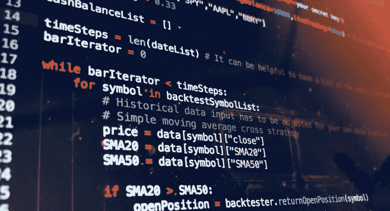
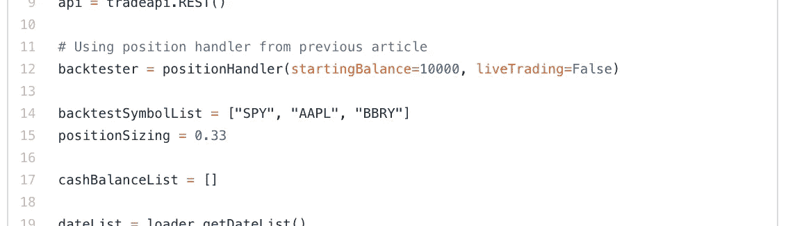

# 模拟算法交易——实施实际的交易策略(第四部分)

> 原文：<https://medium.com/hackernoon/algo-trading-for-dummies-implementing-an-actual-trading-strategy-part-4-acec5543052b>

# 战略制定和实施

虽然大多数长期成功的策略都是基于技术和基本因素的混合，但被利用的基本行为往往非常微妙，变化巨大，因此很难对一篇文章进行概括。因此，我们将更加关注基于技术分析制定策略的工具和方法。

# 视觉策略的创建和完善

有许多很棒的金融图表工具，有各种不同的专业，我个人最喜欢的免费选项是 tradingview.com。

 [## 免费股票图表，股票报价和贸易的想法

### 实时报价，免费图表和专家交易想法。TradingView 是一个面向股票交易者和投资者的社交网络

www.tradingview.com](https://www.tradingview.com/) 

创建[策略](https://hackernoon.com/tagged/strategy)最有用的特性之一是它简单的脚本语言，可以创建交易指标和回溯测试策略。虽然回溯测试工具的功能相当有限，但它可以作为良好的第一步健全性检查。

简单地创建交易指标，然后直接覆盖在图表上，可以快速测试和调试想法，因为创建脚本并根据市场直观地检查比完全实施和回测要快得多。

这种快速发展的过程是制定某种策略的良好开端，特别是对于一次只作用于一个符号的主动交易策略。然而，它对投资组合策略或那些包含高级对冲的策略没有任何好处。

为此，你需要创建自己的工具来可视化多个交易对的完整回溯测试。这就是回溯测试器的日志特性发挥作用的地方。最终结果在您选择的绘图工具中绘制，例如 [matplotlib](https://matplotlib.org/) (对于 [Python](https://hackernoon.com/tagged/python) )。

 [## Matplotlib: Python 绘图- Matplotlib 2.2.2 文档

### Matplotlib 是一个 Python 2D 绘图库，它以各种硬拷贝格式生成出版物质量数字…

matplotlib.org](https://matplotlib.org/) 

**全回测框架:**

(Simple example of a multi-symbol back-tester based on position handler from [previous article](https://blog.alpaca.markets/blog/2018/6/28/algo-trading-for-dummies-building-a-custom-back-tester-part3) — full script at end of this post)

 [## 模拟算法交易——构建一个定制的回溯测试器(第三部分)

### 例如，如果止损单在一根棒线的跨度内被触发，那么你需要添加一些…

博客.羊驼.市场](https://blog.alpaca.markets/blog/2018/6/28/algo-trading-for-dummies-building-a-custom-back-tester-part3) 

各种图，如散点图或层次聚类图，可用于有效地显示和对比回溯测试策略的不同变化，并允许对参数进行微调。

# 实施和回溯测试

任何预测系统的设计最容易陷入的陷阱之一就是过度拟合您的数据。如果一个策略被训练成完全符合测试数据，那么在回溯测试中很容易看到惊人的结果。然而，当对样本之外的任何东西进行测试时，该策略几乎肯定会在第一个障碍处失败，所以是无用的。

同时，在另一个极端，也有可能创建一个过于一般化的系统。例如，一个被认为是积极交易标准普尔 500 的策略，通过总是做多信号，可以很容易地实现长期盈利。但是这完全违背了最初尝试创建机器人的目的

对系统进行回溯测试的最佳实践:

1.  对照样本数据进行验证。如果策略已经针对一组数据进行了调整，那么它显然会表现得很好。所有回测都应针对不同的数据集进行，无论是同一资产类别中的不同符号还是不同时间样本中的相同符号。
2.  根据某种基准来验证所有策略。对于投资组合策略，你需要比较风险调整后的回报指标。对于积极的交易策略，你可以看看风险:回报和胜率。
3.  对任何通过回溯测试的策略进行健全性检查。在可能的情况下，回顾做出交易信号的具体步骤。它们有逻辑意义吗？如果这是不可能的(例如机器学习)，绘制一组样本外数据的信号。它们看起来一致且合理吗？
4.  如果策略已经到了这一步，运行现场测试。许多平台为策略测试提供纸上交易账户。如果没有，你可以调整你的回溯测试工具来接受真实的市场数据。

一旦你最终有了一个你满意的、经过充分测试的有效策略，你就可以用少量的资金在测试账户上运行它。虽然策略可能是完美的，但交易机器人本身总有可能存在漏洞。

# 最后的想法

创建任何有效的交易策略都是困难的，尤其是当你还必须用可以转换成代码的客观术语来定义它的时候。当看起来没有任何可靠的结果时，这尤其令人沮丧。然而，当涉及回测和改进策略的数据科学时，坚持良好的实践将比当策略在实际资金中表现不佳时学习相同的经验更有回报。

马修·特威德

**全回测框架:**

## 请关注[羊驼](/@alpacahq)和[自动化生成](https://medium.com/automation-generation)关于金融市场、算法交易、技术的新帖子。

## 你可以找到我们[@羊驼 HQ](https://twitter.com/AlpacaHQ) ，如果你用 twitter 的话。

如果你是一名黑客，并且能够创造出在金融市场上运行的很酷的东西，**请查看我们的项目“** [**免佣金股票交易 API**](https://alpaca.markets/?utm_source=medium&utm_medium=blog&utm_campaign=strategy_list&utm_content=part1) **”，在这里我们免费提供简单的 REST 交易 API 和实时市场数据。**

经纪服务由 FINRA/SIPC 成员 Alpaca Securities LLC([Alpaca . markets](https://alpaca.markets/?utm_source=medium&utm_medium=blog&utm_campaign=strategy_list&utm_content=part1))提供。羊驼证券有限责任公司是 AlpacaDB，Inc .的全资子公司。