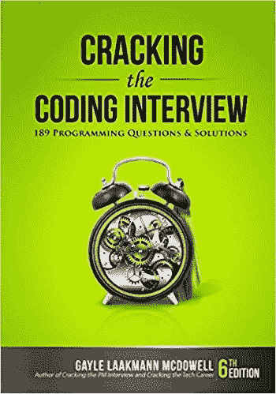
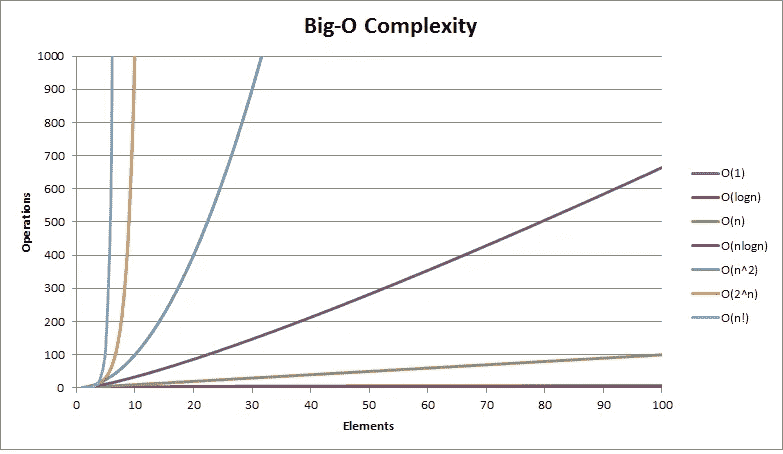

# 算法和数据结构面试准备和演练—第 1 部分

> 原文：<https://medium.com/hackernoon/algorithms-and-data-structures-interview-preparison-questions-part-1-a23aec17daaf>


Finding the first job for a new grad (Source: [Sparks Group](http://sparks.imageworksdev.com/author/rmradmin/))

许多应届毕业生都想敲开硅谷大公司的大门，比如脸书、亚马逊、苹果、网飞、谷歌和微软。然而，准备技术面试是一个漫长而令人厌倦的过程。我自己也是一名软件工程师，去过那里，做过，但仍然有一天我需要再次面对这个过程。所以我决定写一些文章来提醒我自己(和你)尽可能顺利地度过这个过程。

# 有用的资源

[算法，第一部分](https://www.coursera.org/learn/algorithms-part1)和[算法，第二部分](https://www.coursera.org/learn/algorithms-part2)是两个最著名的免费算法在线课程，如果你想刷新你的记忆。

我还推荐另外两本书给准备技术面试的人阅读:

1.  Adnan Aziz 的 [**元素编程访谈**](https://www.amazon.com/Elements-Programming-Interviews-Adnan-2015-10-06/dp/B01LP2O0BG/ref=sr_1_7?s=books&ie=UTF8&qid=1539797434&sr=1-7&keywords=elements+of+programming+interview) ，其中有 300 多个[编程](https://hackernoon.com/tagged/programming)问题和解决方案，它还附带一张问题和解决方案的电子版光盘，您可以使用 IDE 练习。


1.  [**破解代码面试**](http://www.amazon.com/Cracking-Coding-Interview-6th-Edition/dp/0984782850/?tag=javamysqlanta-20) **，由** [**格利·拉克曼·麦克道尔**](https://medium.com/u/e21bc4f4525e?source=post_page-----a23aec17daaf--------------------------------) 其中也有大量的编程问题和解答。



# 先决条件—时间和空间的复杂性

在我们深入一些基本的数据结构之前，我想谈谈另一个基本的先决条件——复杂性分析。

理解方法调用的时间复杂性很重要，尤其是那些使用数据结构执行操作的方法。但是我们为什么要在乎呢？当你开始在工业界工作时，复杂性分析将帮助你预先解决可伸缩性问题，做出更好的决策，找出效率和权衡，选择项目使用的数据结构，然后找到最优的解决方案。最重要的是，这是一个**常见的面试题目**。

说到空间复杂度，我们说的是辅助空间 vs 空间复杂度。辅助空间是执行算法所需的额外内存。空间复杂度是执行算法所需的内存，包括输入大小和辅助空间。当你被要求做空间复杂度分析时，通常人们问的是辅助空间(不考虑输入大小)。然而，**你有责任询问面试官是否对投入的大小也感兴趣**。

讨论时间复杂度和空间复杂度的一个简单例子:

```
**function** *printAndSaveAllNames*(array) { // Input size n
    // instantiate an empty array, constant space size
    var result = [];
    // instantiate a counter, constant space size
    **for**(**var** i =0; i < array.**length**; i++) {
        // push n items into the array, linear space size, linear time
        result.push("Name: " + array[i]);
    }
}
// Time: n * 1 = n, Linear time complexity: O(n)
// Auxiliary space : n + 2,
// Space complexity = input + auxiliary space = n + n + 2 = 2n + 2
// Drop coefficients and lower order terms ...
// Linear space complexity: O(n)
```

## 常见的大订单(和示例)

对于渐近符号，我们使用 Big-O 作为上限，Big-ω(omega)作为下限，Big-θ(theta)作为紧界。

●常数 O(1) —与输入大小无关

○在散列中查找关键字

○算术计算

○赋值

○更新数组中现有元素的值

●线性 O(n) —与输入大小成比例增长

○在链表或数组中查找项目

○遍历元素集合(for loop、while loop…等)

●二次 O(n^2) —与输入大小的平方成比例增长

○嵌套循环

○遍历二维数组

○插入排序

●对数 O(logn)-以对数形式增长到输入大小

○排序数组中某个值的二分搜索法

○在二叉查找树中插入值

●准线性 O(nlogn) —常用于比较排序算法

○快速排序

○合并排序

○堆排序

●多项式 O(n^c) — c 是常数幂

○深度嵌套循环

●指数 O(c^n) — c 是常数基数

○多种递归算法

●阶乘 O(n！)-与输入大小的阶乘成比例增长

○寻找排列



在我的 [**下一篇**](/@victorlin_38374/algorithms-and-data-structures-interview-preparation-walkthrough-part-2-array-and-string-80f28e095ca8) (我没想到已经花了 2 个小时写这篇文章……)中，我将开始谈论数组和字符串的数据结构，并希望涵盖一些常见的面试问题。

## 在你走之前—

没有比在 Medium 上给我一个 follow 更好的支持我的方法了( [**Victor Lin**](/@victorlin_38374) )。让我知道我应该多写！

你知道你可以放弃 50 吗👏通过按下👏按钮？如果你真的喜欢这篇文章，试试吧！

[https://upscri.be/hackernoon/](https://upscri.be/hackernoon/)