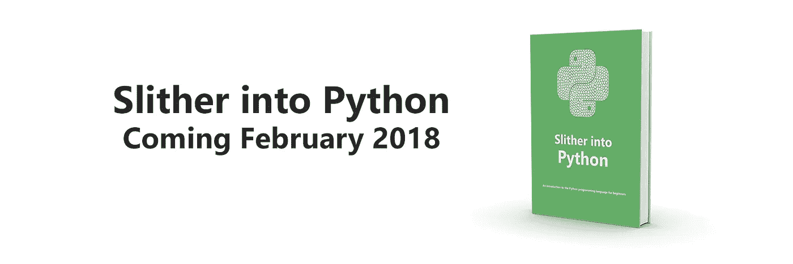

# 解释的算法:递归

> 原文：<https://medium.com/hackernoon/algorithms-explained-recursion-54831247dd85>

如果您刚开始编程，您可能听说过递归这个词。您甚至可能遇到这样的问题，上面写着“寻找递归解决方案来解决 X”等。

在我进一步说之前，我想说的是，编写递归解决方案在开始时很困难。不要指望它第一次就能起作用。编写递归解决方案涉及一种全新的思维方式，实际上可能会让新来的人感到很不舒服，但是坚持下去，你会想你怎么会发现它如此困难。

那么什么是递归呢？*递归*解是将问题的解表示为对*同一个*问题的*简化*版本的运算。

这可能没有什么意义，也很难解释它是如何工作的，让我们看一个简单的例子:

```
def reduce(x):
    return reduce(x-1)
```

那么这里发生了什么？我们有一个叫做 reduce 的函数，它接受一个参数' ***x*** *'* (一个整数)，我们希望它将其减少到' **0** 。听起来很简单，所以让我们在传递 5 作为参数时运行它，看看会发生什么:

```
>>> reduce(5)
RuntimeError: maximum recursion depth exceeded
```

错误？好吧，让我们仔细看看这里发生了什么:

*减(5)* 谓*减(4)* 谓*减(3)* ……因此，我们最初的调用 *reduce(5)* 是对 *reduce()* 无数次调用中的第一次。每次调用 *reduce()* 时，Python 都会实例化一个数据结构来表示对函数的特定调用。这种数据结构被称为*堆栈帧。*堆栈帧占用内存。我们的程序试图创建无限数量的堆栈帧，这将需要无限量的内存，我们没有，所以我们的程序崩溃了。

为了解决这个问题，我们需要添加一些被称为*基本情况*的东西。这只是我们添加的一个检查，以便我们的函数知道何时停止调用它自己。基本情况通常是原始问题的最简单版本，也是我们一直都知道答案的问题。

让我们通过添加一个基本案例来修正我们的错误。对于这个函数，我们希望它在我们达到 0 时停止。

```
def reduce(x):
    if x == 0:
        return 0
    return reduce(x-1)
```

现在，当我们运行程序时，我们会得到:

```
>>> reduce(5)
0
```

太好了，它起作用了！让我们再看看这次发生了什么。我们称之为减少(5 ),也称之为减少(4)……它调用 reduce(0)。好了，停在这里，我们已经击中了我们的基本情况。现在，函数将会做的是将 0 返回到之前的 reduce(1)调用，该调用将 0 返回到 reduce(2)…其返回 0 以减少(5 ),这返回我们的答案。给你，你的第一个递归解！

让我们看一个更实际的例子。让我们写一个递归的解决方案来寻找 N！(或 N 阶乘):

N 阶乘定义为:N！= N * (N-1) * (N-2)…… * 2 * 1。

例如，4！= 4 * 3 * 2 * 1

我们这个例子的基本情况是 N = 0 = 0！被定义为 1。所以让我们写我们的函数:

```
def factorial(n):
    if n == 0:
        return 1
    return n * factorial(n-1)
```

好吧，让我们看看实际情况。我们将调用我们的函数并为 n 传入 4:

factorial(4)调用 factorial (3) …..它调用 factorial(0 ),这是我们的基本情况，所以我们将 1 返回到 factorial(1)的前一个调用，它获取 1 并乘以 1，计算结果为 1，然后将其传递回 factorial(2 ),它获取 1 并乘以 2，计算结果为 2，然后将其传递回 factorial(3 ),再乘以 3 *2 得到 6，然后将其传递回 factorial(4 ),再乘以 4 * 6，计算结果为 24，返回我们的答案。

这些都是非常简单的例子，并不是非常有用，但是能够发现何时可以实现递归解决方案，然后实现该解决方案是一项技能，它将使你成为一名更好的程序员。对于某些问题，递归可能提供一个直观、简单和优雅的解决方案。

例如，您可以实现递归解决方案来查找树结构中的节点数，计算树中的叶节点数，甚至返回二叉查找树是否是 AVL 平衡的。这些解决方案往往非常简短和优雅，并且远离了您可能已经采用的长时间迭代方法。

正如我所说的，递归并不容易，但坚持下去，它会点击，看起来如此简单，你会奇怪你怎么会觉得它如此困难。


如果您对更多类似的教程感兴趣，请前往 [www.pyler.io](https://www.pyler.io) 网站，在那里您可以找到许多很棒的 Python 课程，这些课程将带您从初级到高级！

我们目前对[Python](https://www.pyler.io/courses/intro-to-python)入门课程有 20%的优惠(现在只有€39.99 英镑)，你将有一位导师指导你完成课程，如果你感到困难，他会伸出援助之手！

此外，当您注册任何课程时，都可以免费获得一本“Slither into Python ”!



‘Slither into Python: An introduction to the Python programming language’