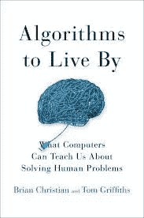

# 赖以生存的算法(书评)

> 原文：<https://medium.com/hackernoon/algorithms-to-live-by-book-review-77f53d63fa78>

## 布莱恩·克里斯蒂安和汤姆·格里菲思的书

无论你是计算机科学老手，还是只想尝试一下算法的奇妙世界，这本书都适合你。能够用简单的语言解释复杂的思想是掌握一门学科的标志，布莱恩·克里斯蒂安和汤姆·格里菲斯在本书中证明了他们的每一点。

*的《赖以生存的算法》带你踏上计算机科学的 11 个想法之旅，不管我们是否知道，这些想法每天都在我们的生活中使用。我很喜欢这本书，所以这篇评论会很长。*

## *1.最佳停止*

*想象一下下面的场景:你必须从一群固定的申请者中雇佣一名秘书。你必须一个接一个地面试候选人，并在每次面试后做出录用/不录用的决定。如果你离开了某人，你就不能回到他身边。如果你雇佣了一个人，这个过程就停止了，这个人就是你的新秘书。你如何最大化你在团队中找到最佳秘书的机会？这就是著名的秘书问题，T4，它构成了本章讨论的基础。*

*你可能不想雇佣你面试的第一个人，因为你不知道底线是什么。你也不想雇佣最后一个人:在这一点上，你几乎肯定已经错过了你最好的候选人。因此，最佳策略包括面试并拒绝最初的几个候选人，不管他们有多优秀:首先建立一个基准，然后雇佣你迄今为止见过的最好的。这个*最佳*点结果是`1/e`或大约 37%。拒绝 37%的申请人，然后雇佣下一个比你目前见过的任何人都好的人。这个*秘书问题*的变体和随之而来的 *37%法则*也适用于现实生活的广泛领域——从约会、停车到出售/购买房子:知道何时停止寻找至关重要。在你过于兴奋之前，这里有一个令人清醒的事实:这种最佳策略有 63%的几率会失败。*

## *2.探索/利用*

*今天是星期六，是你的作弊日。你是打开 Yelp 去探索一家新餐馆，还是回到你渴望了一周的三明治店？你会听 Spotify 的每日混音，还是继续听你最喜欢的专辑？换句话说，你是*探索*，还是*利用*？从 A/B 测试网站到通过临床试验对人类药物进行 A/B 测试，软件工程师和制药公司都在试图找到平衡点。除了讨论在赌场赢吃角子老虎机的许多策略，如"*赢-留，输-移"*(正式名称为 [*多臂强盗问题*](https://en.wikipedia.org/wiki/Multi-armed_bandit) )，本章将帮助你下次在最新或最棒的之间做出选择时更好地思考。*

## *3.整理*

*排序算法通常是任何计算机科学入门课程首先涉及的。这里讨论的主题从作为衡量算法性能标准的*大 O 符号*，到排序算法本身的花束:气泡*、*插入*、*合并*和*快速*排序。此外，分类是搜索的预防措施:如果你把你的收藏进行了分类，搜索就会变得容易得多。本章最后讨论了各种类型的锦标赛:*循环赛*、*阶梯赛*、*单淘汰赛*等等。毕竟，锦标赛只是另一个排序问题，动物(和人类)王国的尊卑次序和统治等级也是如此。保持事物有序只会让生活变得更容易。**

## **4.贮藏**

**或者，记忆的层次——什么是你最想记住的，什么是你最想记的，什么是你最想记的。任何关于缓存的讨论都需要研究各种策略来决定哪些内容保留在缓存中——像*随机驱逐*、*先进先出*、*最近最少使用的*等等帮助。这里我真正喜欢的一点是如何将*最近最少使用的*有效地应用于物理图书馆:图书馆可以使用它们来创建一个缓存区，而不是将归还的书放回书架上——毕竟，最近被借阅的书最有可能再次被借阅！**

## **5.行程安排**

**你是如何把事情做好的？你如何安排你的一天？你如何安排任务，以便在最少的时间内完成最多的工作？此外，当一个低优先级的任务阻塞了一个高优先级的任务，而你却陷入了一个*优先级反转*时，你该如何处理呢？这一章几乎就像是重访一群大学时代的老朋友:在你的日常工作中，你不会太多地考虑*抢占*或*击败*。**

## **6.贝叶斯法则**

**我假设你已经知道贝叶斯规则，但如果你不知道，这只是一个简单的方法来确定一件事`A`发生的概率，另一件事`B`已经发生，通常表示为`P(A|B)`。假设你对*先验*有很好的了解:这两件事独立发生的可能性有多大，你知道事情以另一种方式发生的可能性有多大:`B|A`我就把它写出来。要得到`P(A|B)`，将`P(B|A)`乘以`P(A)`，再除以`P(B)`。真的就这么简单。只要确保你的前科是好的:本章的一个很好的提醒是，只接触新闻而不接触其他太多会污染它们，使我们成为更糟糕的事件预测者。**

**哥白尼原理在这一章中再次出现:这也是我上个月回顾的《抗脆弱》[中的一个关键话题:它适用于抗脆弱的东西(比如书),不适用于不脆弱的东西(比如人的寿命)。](https://anantja.in/antifragile-things-that-gain-from-disorder-8a0e86257edb)**

**在这一点上，三个基本的概率分布:加法规则(*尔朗先验*)、乘法规则(*幂律先验*)和平均规则(*正态先验*)在这一章中以非常优雅和易读的散文进行了解释。跨课程写作真的应该被强制执行，我印象深刻的是读到这些想法时没有一个数学公式或图表。**

## **7.过度拟合**

**这一章的重点是反对复杂性，尽可能保持你的模型简单:不仅它们工作得更好，而且你可以说简单本身就是一个目标。机器学习领域的人们会喜欢围绕*交叉验证*的想法讨论(保留一些数据，以便稍后测试你的学习模型*是否能很好地概括*，它不仅仅是*过度拟合*你的训练数据)，*正规化*(惩罚你的模型的复杂性:因此简单是目标的一部分)，*提前停止*等等。**

## **8.放松**

**完美是好的敌人，所以偶尔放松一下，让它溜走也没关系。计算机科学中的一大类问题，被称为 *NP-Hard 问题，*是棘手的。对于任何现实的数据集，我们都没有办法在任何合理的时间内计算出完美的解决方案。这方面最著名的例子是*旅行推销员问题*:找出一条推销员应该走的路线，以最短的距离到达他的所有站点:这里的可能性太多了，无法一一考虑。放松约束，解决一个类似的，但更容易的问题似乎是解决方案。任何优化问题都有两个部分——规则和记分。只要能让你继续前进，有时违反规则并在分数上受到打击可能是值得的(这实际上被称为*拉格朗日松弛*)。**

## **9.随机性**

**随机性是另一种在其他东西都不起作用时起作用的东西。从*蒙特卡罗方法*开始，本章讨论*随机化算法*——你必须热爱计算机科学的这一部分，因为这是事情不再那么精确的地方。不仅如此，*随机性*可以在*优化*中拯救你，确保你在*爬山*时不会陷入*局部最小值*。我真的很喜欢这一章以关于随机性、进化和创造力的讨论结尾。毕竟，你可以证明所有的艺术都源于某种形式的随机性。**

## **10.建立工作关系网**

**分组交换、确认、三次握手、指数补偿和宽恕算法:网络是另一个充满宝石的话题。连接人们是计算机科学最基本和最有影响力的领域之一——我们在这里谈论的是互联网。如何控制流量，如何避免拥塞(*加法增加，乘法减少*)，如何建立反向信道(以及白噪声和少量确认在日常现实对话中的作用！)，以及如何避免*buffer loats*:这些是任何计算机网络课程的一部分，但以新的角度来看待它们是很棒的。**

## **11.博弈论**

**囚徒困境:两个人为了自己的利益而行动，却不会产生最佳结果的悖论。简而言之，想象两个囚犯被侦探审问:如果他们出卖彼此，他们都必须在监狱里服刑，但如果只有一个出卖另一个，他可以自由离开，而另一个进了监狱。如果他们都对彼此保持忠诚，他们都可以自由离开:但是如果两个囚犯都按照自己的利益行事，这将永远不会达到最佳结果——这是你期望他们做的事情。**

**这是用来向任何人介绍博弈论的核心问题:纳什均衡的美丽领域、优势策略、公地悲剧和进入对方思维的无限递归。灵丹妙药:如果你被困在一个自相矛盾的激励游戏中，改变游戏:制定规则，这样就没有任何其他方式的激励。让黑手党在监狱外面等着，这样告密的人第二天就会被当地湖底的鱼吃掉。从扑克到拍卖，尤其是构成当今互联网经济基础的广告拍卖(想想谷歌和脸书)，博弈论是另一个你不能错过的计算机科学/数学领域！**

**总的来说，我对作者们将计算机科学的思想浓缩到核心的能力感到惊叹。这本书是对这个广阔而美丽的领域的完美的第一次介绍，应该是任何 CS101 课程的必读。从某种意义上说，这也是对我的一次小小的再教育，教会了我很多关于如何谈论和教授计算机科学的知识。**

**如果这篇文章激起了你的兴趣，你想学习算法，我忍不住自我推荐这门课程:**

** [## 学习算法和数据结构|公共休息室

### 这门 26 部分的课程由算法和数据结构的教程组成。它在教程和…

www.commonlounge.com](https://www.commonlounge.com/discussion/d4a14f601eb44281b6c579e73d126cca) 

…而且，如果你喜欢*机器学习*部分的想法，并且想更深入地研究，看看这个:

 [## 学习机器学习| Commonlounge

### 这 29 部分的课程包括关于 ML 概念和算法的教程，以及端到端的后续 ML…

www.commonlounge.com](https://www.commonlounge.com/discussion/35ccdb70826e434a876d612504297232) 

*这是我每周写的一系列书评中的第 36 篇。其余的* [*你可以在这里*](https://anantja.in/tagged/books) *阅读。*

Sorting. Caching. By [Ugur Akdemir](https://unsplash.com/@ugur?utm_source=medium&utm_medium=referral) on [Unsplash](https://unsplash.com?utm_source=medium&utm_medium=referral)**