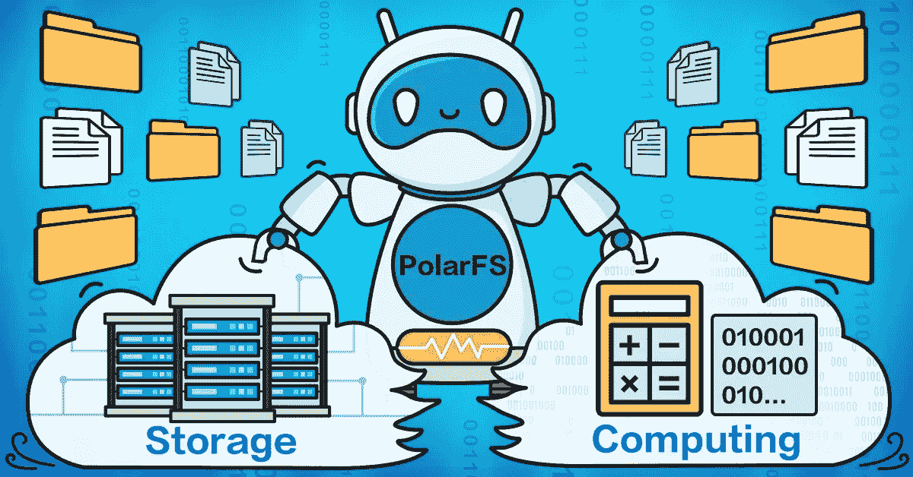
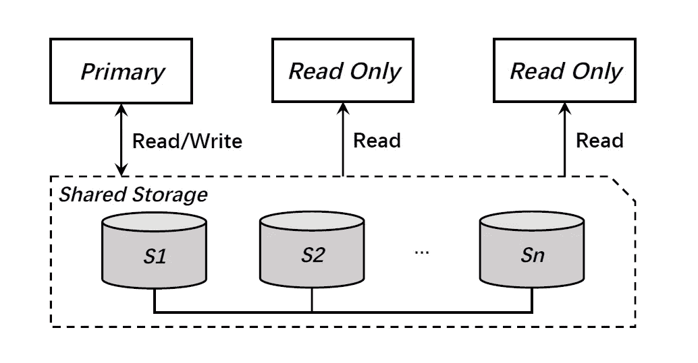
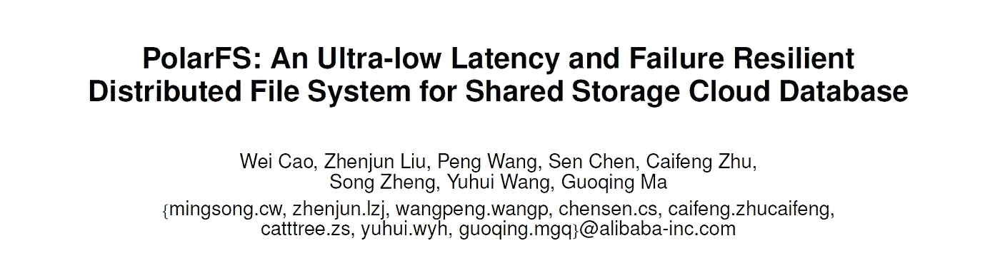

# 阿里巴巴为云计算发布 PolarFS 分布式文件系统

> 原文：<https://medium.com/hackernoon/alibaba-unveils-new-distributed-file-system-6bade3ad0413>

*本文是*[***Academic Alibaba***](/@alitech_2017/academic-alibaba-b56f4176a838)*系列的一部分，摘自 VLDB 2018 接受的题为“PolarFS:一种用于共享存储云数据库的超低延迟和故障弹性分布式文件系统”的论文。全文可以在这里阅读***。**

*最近，云计算服务越来越多地寻求将存储与计算功能分离。然而，尽管这样做有很多好处，但它也带来了一些与分布式文件系统和新兴硬件方法(如 RDMA、NVMe 和 SPDK)的使用相关的关键挑战。为了应对这种情况，阿里巴巴技术团队开发了一种新的定制分布式文件系统，名为 PolarFS，以充分挖掘这些新兴技术的潜力。*

# *脱钩的好处是什么？*

*分离式云架构更加灵活，允许利用共享存储功能，这有几个好处:*

*1.计算和存储可以独立定制，并使用不同类型的服务器硬件。*

*2.存储节点群集上的磁盘可以形成一个存储池，从而降低碎片、磁盘使用不平衡和空间浪费的风险。*

*3.存储集群的容量和吞吐量可以透明地横向扩展。*

*4.计算节点没有本地持久状态，因为所有数据都存储在存储集群上。因此，通过使用底层分布式存储系统的数据复制和其他高可用性功能，提高了数据可靠性。*

*云数据库服务也受益于解耦。解耦允许数据库构建在基于虚拟化技术(如 Xen、KVM 或 Docker)的更安全、更易扩展的环境上。此外，数据库的关键功能，如多个只读实例和检查点，可以在提供快速 I/O、数据共享和快照的后端存储集群的支持下得到增强。*

# *有哪些挑战？*

*随着数据存储技术继续快速发展，当前领先的云平台正在努力充分利用新兴的硬件方法，如 RDMA、NVMe 和 SPDK。某些广泛使用的开源分布式文件系统，如 HDFS 和 CEPH，比本地磁盘有更高的延迟。当与当前的 PCIe 固态硬盘一起使用时，这种性能差距会急剧增大。此外，直接在这些存储系统上运行的关系数据库(如 MySQL)的性能明显比那些在具有相同 CPU 和内存配置的本地 PCIe SSD 上运行的数据库差。*

*作为一种解决方案，谷歌云、AWS 和阿里云等供应商使用一种称为实例商店的系统。实例存储使用本地 SSD 和高 I/O VM 实例来满足客户对高性能数据库的要求。不幸的是，这个系统有几个缺点:*

*1.容量有限，不适合大型数据库服务。*

*2.数据库必须自己管理数据复制，以确保数据的可靠性。*

*3.通用文件系统(如 ext4 或 XFS)会降低 I/O 吞吐量，因为当与低 I/O 延迟硬件(如 RDMA、PCIe SSD)一起使用时，内核空间和用户空间之间的传递成本会降低。*

*4.不支持共享一切数据库架构，这是高级云数据库服务的一个关键特性。*

# *使用 PolarFS 增强性能*

*为了应对 instance store 的问题，阿里巴巴技术团队设计并实现了 PolarFS 分布式文件系统，该系统通过多种方式满足了客户对低延迟和高吞吐量的要求:*

*1.使用 RDMA 和 NVMe SSD 等新兴硬件，在用户空间中使用轻量级网络堆栈和 I/O 堆栈，以避免陷入内核和处理内核锁。*

*2.提供了一个类似于 POSIX 的文件系统 API，允许将整个 I/O 路径保存在用户空间中。*

*3.数据平面 I/O 模式消除了锁定，避免了关键路径上的上下文切换，并消除了所有不必要的内存拷贝，因此可以利用 DMA 在主内存和 RDMA NIC/NVMe 磁盘之间传输数据。*

*这些功能相结合，大大降低了 PolarFS 的端到端延迟，使其功能类似于 SSD 上的本地文件系统。*

*尽管 PolarFS 实现了性能提升，但在使用 Raft 开发的分布式系统下使用低延迟硬件时，其 I/O 可伸缩性受到了阻碍。为了应对这一挑战，阿里巴巴科技团队提出了增强共识协议 *ParallelRaft* 。该协议基于 Raft，允许无序的日志确认、提交和应用，同时使 PolarFS 符合传统的 I/O 架构，显著提高了并行 I/O 并发性*

# *在 PolarFS 上实现 POLARDB*

*作为该解决方案的补充，技术团队实现了一个名为 POLARDB 的关系数据库系统，该系统由 AliSQL 修改而来，AliSQL 是阿里云计算平台上新推出的数据库服务。POLARDB 使用共享存储架构，并支持多只读实例功能。它的数据库节点分为主节点和只读(RO)节点。主节点处理读写查询，而 RO 节点提供读服务。这两种类型共享 PolarFS 中同一数据库目录下的重做日志文件和数据文件。*

**

*POLARDB architecture*

*此外，PolarFS 支持 POLARDB 的以下特性:*

*1.将文件元数据从主节点同步修改到 RO 节点。*

*2.确保对文件元数据的并发修改被序列化，以便文件系统在数据库节点之间保持一致。*

*3.在网络分区的情况下，通过确保只有真正的主节点得到成功服务来防止数据损坏。*

# *结论*

*Polar FS 和 POLARDB 为寻求分离存储和计算架构的云服务供应商提供了显著优势。如本文所述，PolarFS 可以提供:*

*超低延迟*

*最大化 I/O 吞吐量*

*降低失败和其他错误的可能性*

**

**关于 PolarFS 及其支持系统的更多信息，可以在这里* *阅读* [*全文。*](http://www.vldb.org/pvldb/vol11/p1849-cao.pdf)*

# *阿里巴巴科技*

*关于阿里巴巴最新技术的第一手深度资料→脸书: [**【阿里巴巴科技】**](http://www.facebook.com/AlibabaTechnology) 。Twitter:[**【AlibabaTech】**](https://twitter.com/AliTech2017)。*