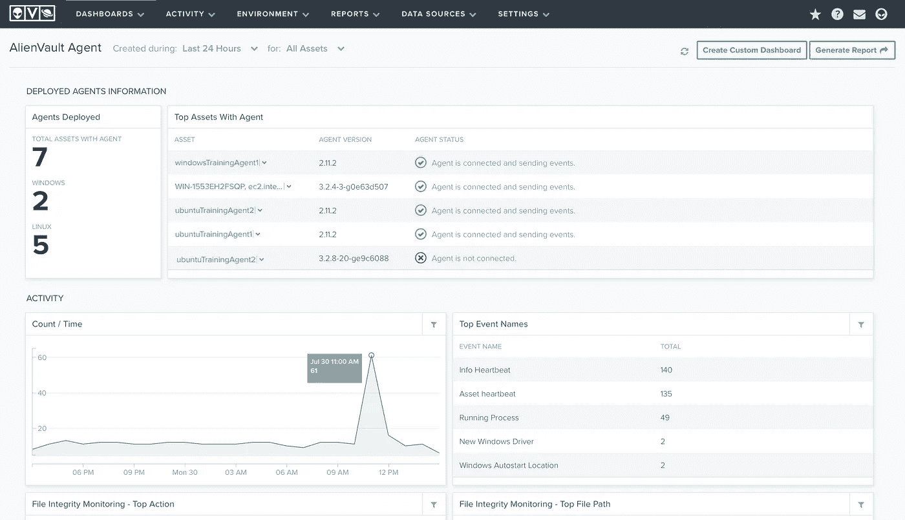
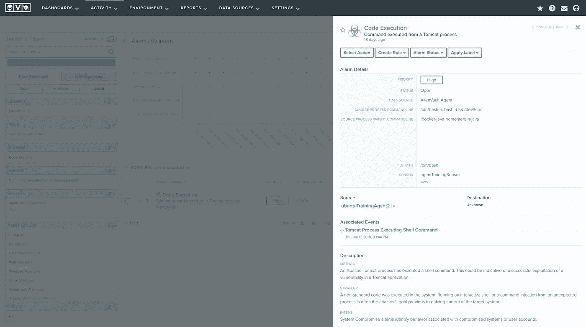
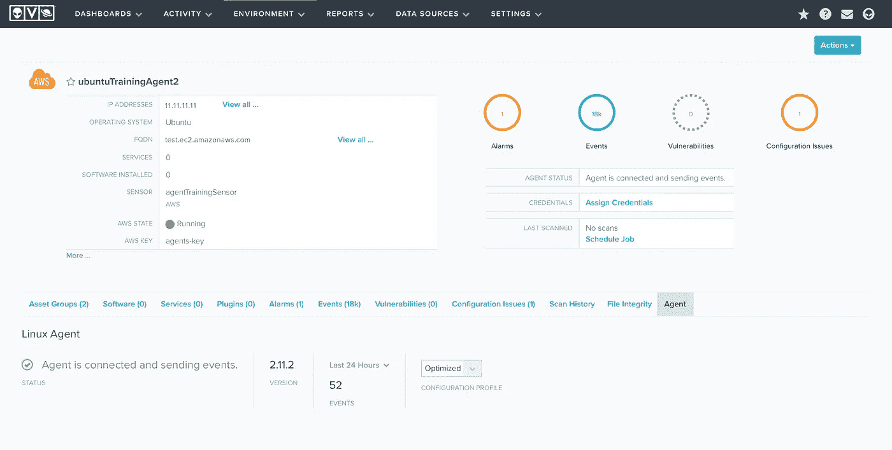
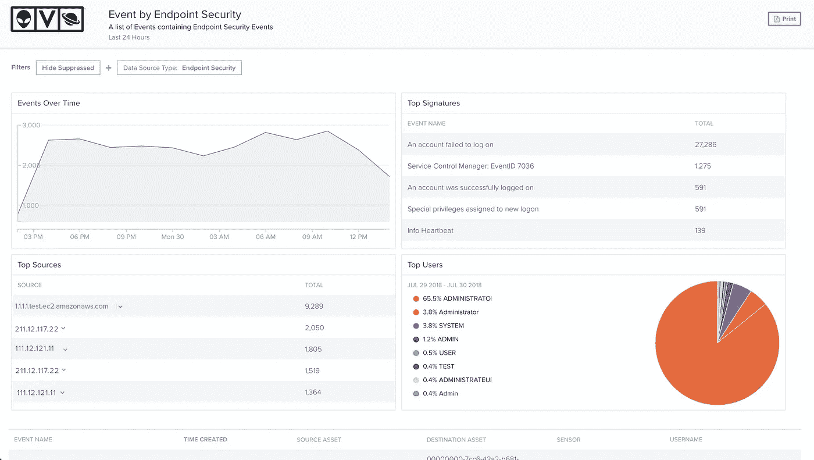

# AlienVault 将 USM Anywhere 扩展为包括端点检测和响应功能

> 原文：<https://medium.com/hackernoon/alienvault-expands-usm-anywhere-to-include-endpoint-detection-and-response-capabilities-4e698dee22b7>

> 唯一的安全解决方案，可从单一平台跨云和内部环境中的终端和网络自动执行威胁检测和响应

加利福尼亚州圣马特奥——2018 年 7 月 31 日——[alien vault](https://www.alienvault.com/?utm_source=PressRelease&utm_medium=PR&utm_content=EDR),[统一安全管理](https://www.alienvault.com/products?utm_source=PressRelease&utm_medium=PR&utm_content=EDR) (USM)和众包[威胁情报](https://www.alienvault.com/open-threat-exchange?utm_source=PressRelease&utm_medium=PR&utm_content=EDR)的领先提供商，今天宣布在 [USM Anywhere](https://www.alienvault.com/products/usm-anywhere/?utm_source=PressRelease&utm_medium=PR&utm_content=EDR) 中全面提供端点检测和响应(EDR)功能。请于 8 月 7 日至 9 日访问 AlienVault 的黑帽展位#528，观看 USM Anywhere 终端安全功能的演示。

AlienVault USM Anywhere 可从一个平台跨云环境和内部环境中的终端和网络自动检测和响应任何地方出现的现代威胁。该统一平台由来自 AlienVault 实验室安全研究团队的持续、可操作的威胁情报提供支持，使其能够检测攻击性威胁，尤其是那些旨在逃避传统外围安全和基于特征的检测技术检测的威胁。这使得安全团队的防御能够随着威胁的发展和出现而保持最新。通过智能地关联[网络](https://hackernoon.com/tagged/network)、云和端点上的活动，USM Anywhere 不仅可以更快、更准确地检测入侵，还可以提供详细、自动管理的数据，指导响应团队快速遏制整个网络环境中的威胁。其他功能包括内置文件完整性监控以加快合规性工作，主动查询以降低风险，以及日志聚合以简化安全操作。

企业终端是组织面临的最大安全风险领域之一，日益增长的移动性和云优先的工作场所加速了这一趋势。根据 Ponemon Institute 的[“2017 年终端安全风险状况”](https://cdn2.hubspot.net/hubfs/468115/Campaigns/2017-Ponemon-Report/barkly-2017-state-of-endpoint-security-risk-ponemon-institute-final.pdf?t=1515177513685)报告，四分之三的组织报告在管理终端风险方面存在困难。随着恶意行为者利用旨在规避传统端点防护和防病毒[工具](https://hackernoon.com/tagged/tools)的新型攻击来瞄准端点，安全团队需要额外的安全层。

AlienVault 产品高级副总裁 Russ Spitler 表示:“随着威胁形势的变化，我们将继续利用新的安全功能、集成和智能来适应和发展 USM Anywhere。" "端点对于全面的安全策略至关重要，但许多组织都在为 EDR 点解决方案的成本和复杂性而苦恼。我们将 EDR 功能作为威胁检测、响应和合规性统一解决方案的一部分，使各种规模的公司能够快速检测和响应威胁，同时消除了向其安全堆栈添加更多单点解决方案的需求。"

[Abacode](https://abacode.com/) 的安全运营技术负责人 Jorge Colon 表示:“USM Anywhere 的新 EDR 功能使我的安全分析师团队能够简化并经济高效地提供对所有终端设备的全天候监控，这是我们托管安全服务的一部分，让我们的客户更加放心。“USM Anywhere 不仅帮助我们更好地跟踪不同环境中的终端，而且内置的威胁情报可以自动检测威胁，因此我们可以专注于快速响应。”

USM Anywhere 在一个平台中结合了多种安全功能，包括 EDR、SIEM、IDS 和漏洞评估，以及来自 AlienVault 实验室的持续威胁情报。安全团队可以在单一控制台中监控其所有关键环境，大大减少了与安全性和法规遵从性相关的时间、资源和成本。

USM Anywhere 中的新 EDR 功能已完全集成并提供给每个客户；不需要对 USM Anywhere 进行订阅升级或更新。

## 额外资源

*   阅读我们关于[新 EDR 功能](https://www.alienvault.com/blogs/security-essentials/extending-threat-detection-to-the-endpoint-with-new-edr-capabilities-in-usm-anywhere)的博客
*   [探索](https://www.alienvault.com/products/usm-anywhere/demo?/utm_source=PressRelease&utm_medium=PR&utm_content=EDR)USM Anywhere 的在线演示
*   了解更多关于[外星人的信息](https://www.alienvault.com/?utm_source=PressRelease&utm_medium=PR&utm_content=EDR)
*   [订阅](https://www.alienvault.com/blogs?utm_source=PressRelease&utm_medium=PR&utm_content=EDR)艾伦沃的博客
*   在 [Twitter、](https://twitter.com/alienvault) [LinkedIn](https://www.linkedin.com/company/alienvault/) 和[脸书](https://www.facebook.com/AlienVault)上关注 AlienVault