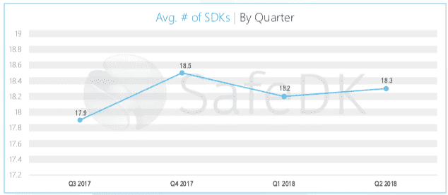

# 全在一处:2019 年最佳移动 SDK 工具

> 原文：<https://medium.com/hackernoon/all-in-one-place-the-best-mobile-sdk-tools-for-2019-23d76f49761e>

高质量的移动 SDK 工具是高质量移动应用程序的组成部分。根据来自 [42matters](https://42matters.com/app-market-explorer) 的统计数据，在苹果应用商店和 Google Play 排行榜上名列前茅的应用都使用了一些领先的移动应用 SDK:Firebase、AppsFlyer、Crashlytics、Adjust 和 AdMob，仅举几例。你会在这篇文章的底部找到一个很棒的免费资源，里面有所有的顶级工具。

然而，如今市场上有如此多的工具，移动应用程序专业人员经常遭受选择超载的困扰。 [SafeDK 称之为“SDK 疲劳”](http://blog.safedk.com/sdk-economy/sdk-fatigue-sdks-control-mobile/#more-1171)。尝试管理您、您的应用和您的团队需要的所有不同的 SDK 工具可能会让您有这样的感觉:

Image Source: Giphy

您如何在移动 SDK 购物之旅中幸存下来，而不失去理智，或者更糟糕的是，失去宝贵的时间？在构建或改进您的 SDK 工具堆栈时，请记住以下几点。

# 一起更好:通过集成增强您的移动 SDK 工具

[SafeDK 的 2018 年移动 SDK 状态报告](http://blog.safedk.com/sdk-economy/state-mobile-sdks-2018/)显示，SDK 应用发行商使用的数量稳步增长。2016 年平均每个 app 15 个 SDK。现在，应用发行商平均每个应用使用 18 个 SDK。2019 年，这个数字会增长到 19、20 甚至 25 个 SDK 吗？如下图所示，这个数字可能会趋于平稳，因为现有的 SDK 继续提高质量，合并以创建更强大的工具，或者提供集成以创建额外强大的组合，如[Mixpanel with branch](https://mixpanel.com/partners/technology/)、[optimized with Appsee](https://www.appsee.com/integrations?cpnid=701b0000000Wd7c&utm_source=medium&utm_medium=link&utm_campaign=sdk_guide_2019_medium&utm_content=integrations)，以及[AdColony](https://www.adjust.com/technology-partners/)Adjust。

Image source: [SafeDK](http://blog.safedk.com/sdk-economy/state-mobile-sdks-2018/)

如前所述，存在工具过多的情况。如果你犹豫要不要向你的堆栈中添加另一个 SDK，你没有错:这个决定需要考虑很多因素，从你公司的法律官僚主义和隐私政策到设置工具、技术同步和入职。

然而，这并不意味着您必须放弃添加一个可以帮助您摆脱困境的工具。相反，看看你是否能把新的 SDK 与你已经在使用或者想要使用的工具集成起来。集成意味着这些工具可以彼此同步，并为您提供应用状态的全面视图，通常在单个仪表板中。例如， [Crashlytics 与 Appsee](https://www.appsee.com/integrations/crashlytics?cpnid=701b0000000Wd7c&utm_source=medium&utm_medium=link&utm_campaign=sdk_guide_2019_medium&utm_content=crashlytics_integration) 的集成使您能够使用已经非常强大的 Crashlytics 工具，还可以使用 Appsee 的会话记录来重现崩溃。这两个市场领导者的强大组合确保了没有错误或崩溃会逃过您的防御。通过集成两个 SDK 工具，您无需从一个软件跳到另一个软件，就可以获得两个世界的优点。

# 选择适合您的移动 SDK 工具，而不是相反

你的工作是创建和发布用户喜爱的优秀应用。这是一项艰巨的工作，你需要尽可能多的时间来做好它。您购买移动 SDK 来简化这项工作，让您自己编码、设计、营销和管理您的应用程序，而他们则完成可以自动化的工作。

您选择的移动 SDK 工具应该为您工作，而不是让您为他们工作。他们应该为您提供尽可能最快的服务、最简单的设置和最易访问、可操作的数据。这就是为什么您选择的 SDK 应该直接使用[开箱即用](https://blog.appsee.com/how_to_succeed_mobile_app_analytics_without_really_trying/?cpnid=701b0000000Wd7c&utm_source=medium&utm_medium=link&utm_campaign=sdk_guide_2019_medium&utm_content=how_to_succeed_in_analytics_without_really_trying)，尽可能自动化，以便您可以在当天开始获得结果。

例如，如果一个工具要求你手动标记 UI 元素或本地应用程序事件，那将是一个令人疲惫和耗时的过程。这意味着你必须努力让这个工具为你工作，而且在你真正得到你所付出的成果之前，这需要时间和努力。一个为你工作的工具是一个可以做[自动事件标记](https://www.appsee.com/features/automatic-events?cpnid=701b0000000Wd7c&utm_source=medium&utm_medium=link&utm_campaign=sdk_guide_2019_medium&utm_content=features_automatic_event)和识别元素而不需要你做任何工作的工具。

如何知道该工具是否可以开箱即用？这里有一个线索:*寻找一个免费试用选项*。如果该公司没有免费试用，这是一个很好的迹象，表明该工具需要更多的手动设置，不能即时给出见解。

# 不要迷路。使用地图查找最佳的移动 SDK 工具

如果你小时候在购物中心迷路过，你可能会记得那是一次可怕的经历。(和你在一起的成年人可能更害怕。)购买移动 SDK 可能会让你迷失和困惑，在这种情况下，谷歌搜索只会导致一百个打开的标签，而没有实际的决定。

如果你想快速找到顶级的移动 SDK 工具，你需要的只是一个可靠的市场指南。毫不奇怪，移动行业中下载量最高的资源之一名为 [**移动应用终极 SDK 指南**](https://www.appsee.com/ebooks/sdk-guide?cpnid=701b0000000Wd7c&utm_source=medium&utm_medium=link&utm_campaign=sdk_guide_2019_medium&utm_content=sdk_guide_2019) ，你可以在这篇文章的底部找到它。现在发布了 2019 年的更新版本，它列出了每个类别中最好的移动 SDK 工具，为来年定下了基调。

**为什么要使用本指南？**

最好的理由:*这会节省你的时间*。该指南将把研究和选择新工具的工作从几个小时减少到几分钟，直接为您指出目前市场上最好的移动 SDK 工具。该指南包括 14 个特定类别的移动 SDK 工具:

*   定量分析
*   定性分析
*   属性
*   崩溃报告/错误报告
*   A/B 测试
*   营销和推送通知
*   Beta 测试/用户测试
*   顾客之声
*   货币化/广告
*   收购/重新定位
*   支付
*   地理定位
*   商业智能/应用商店智能
*   数据管理

**您可以在这里免费下载 2019 年移动应用移动软件开发套件指南:**

