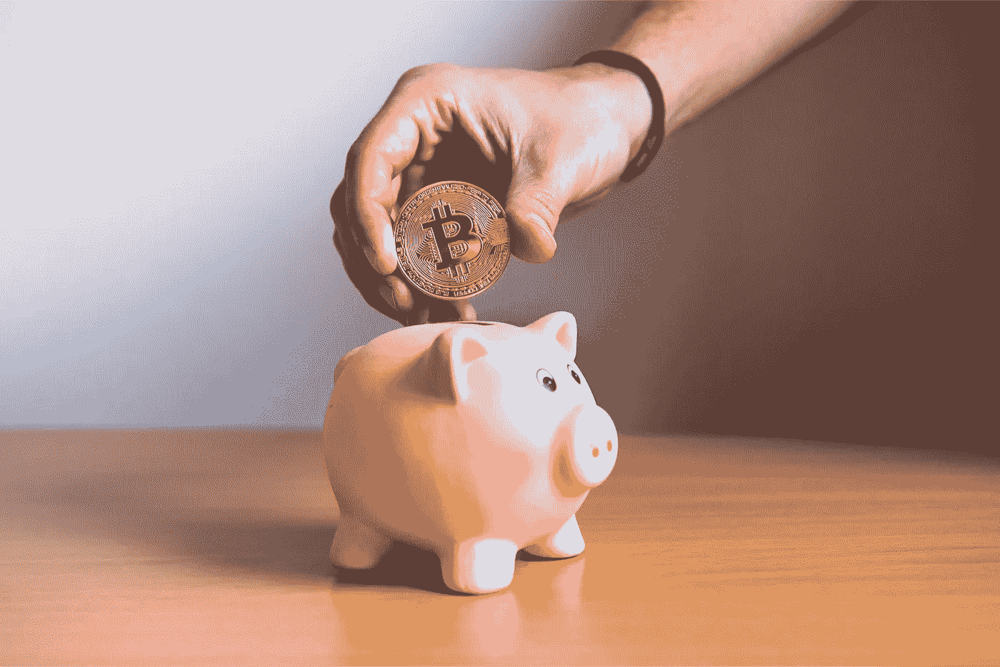
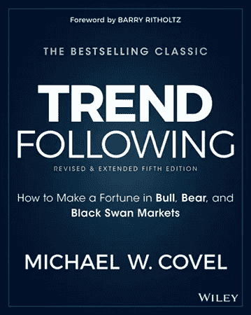
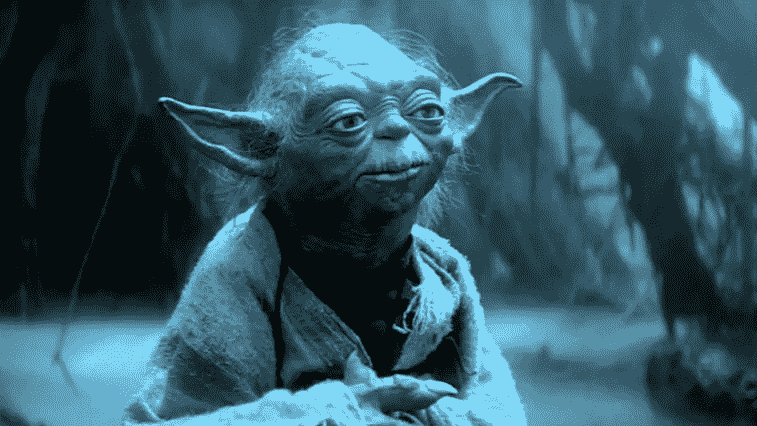
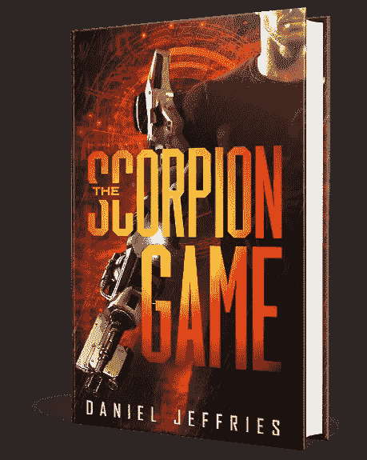
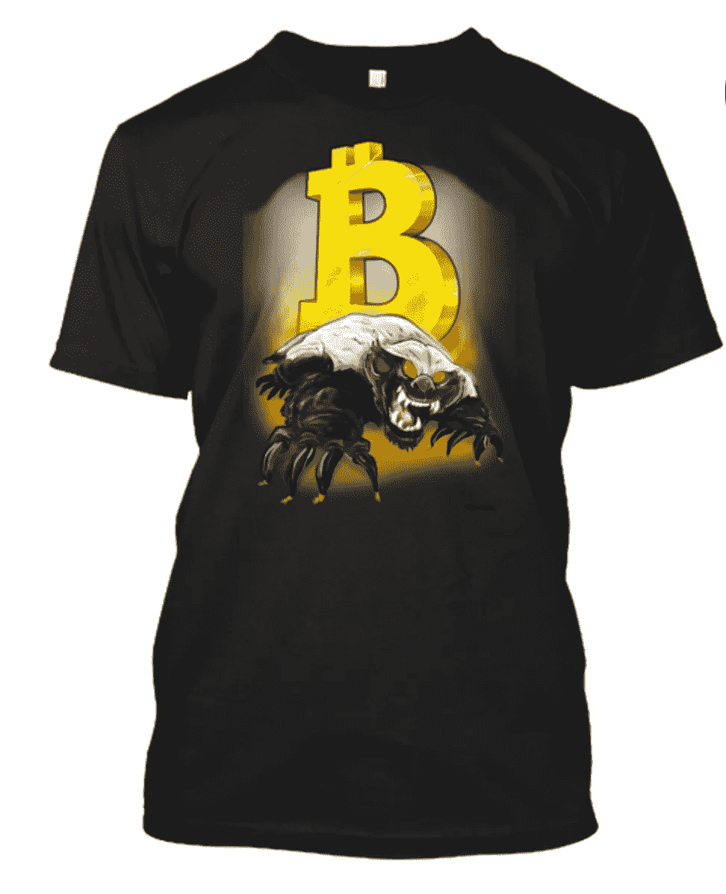

# 我所有可靠的加密交易智慧都集中在一个地方

> 原文：<https://medium.com/hackernoon/all-my-trusty-crypto-trading-wisdom-in-one-spot-d52f3413bca7>

似乎越来越多的人因为我的**加密交易文章**而收听我的频道。这既令人羞愧又令人兴奋。

也完全出乎意料。

虽然我努力提高我的交易技巧，但我只是开始分享我学到的东西，因为这是我喜欢做的，分享知识。我喜欢开源我的想法。我在开源软件世界中长大，现在我正尽我所能让知识开源。

这就是为什么我在这里分享我在**[**黑客正午**](https://hackernoon.com/) 和 [**战略币**](http://strategiccoin.com/) 中学到的一切。**

**为了让你更容易，我决定坐下来，把我最好的密码资源集中在一个地方来帮助你在交易中变得越来越强。**

**我们开始吧！**

# **精英中的精英**

****

**到目前为止，我的被广泛阅读的交易文章是《掌握 Shitcoins》，穷人致富指南 。**

**这个标题是我个人的最爱之一。这是对无与伦比的比特币大师安德烈亚斯·安东诺普洛斯所著的《掌握比特币 》一书的恶搞。**

**我认为这是最受欢迎的，因为每个人都希望有机会在加密热潮中赚钱，但不是每个人都有时间整天坐在显示器前。如果你有家庭、全职工作、宠物和孩子，你就没有时间呆在平板电视前。如果那是你，那么掌握狗屎硬币就是你想要的。这是我长期买入并持有策略的失败，也是忙碌生活方式的最佳选择。**

**我的最新文章 [**如何粉碎加密市场，辞职，搬到天堂，在你的余生做任何你想做的事情**](https://hackernoon.com/how-to-crush-the-crypto-market-quit-your-job-move-to-paradise-and-do-whatever-you-want-the-rest-27a4a3cc2bb1) ，一炮而红，并迅速蔓延到**掌握 Shitcoins** 。这可能与那篇文章完全相反，只关注于**粉碎抛物线摇摆交易，任何市场的终极交易**。如果你喜欢交易，喜欢看图表和白皮书，喜欢在不和谐和不景气的渠道中徘徊，那么这本书充满了辛苦赚来的智慧。**

**回溯一点，我们来看我写过的第一篇关于交易的文章， [**加密货币交易圣经**](https://hackernoon.com/the-cryptocurrency-trading-bible-43d0c57e3fe6) 。这仍然是一个很强的阅读，但如果我是诚实的，我仍然有很多要学习。我有正确的心态和心理，但我仍然过度交易，冒了太多愚蠢的风险，即使我真的不知道。**

**事实上，可以肯定地说，无论你在生活中做得多好，总有另一堂课在拐角处等着你。**

**有一句古老的禅宗谚语非常符合这一点:**

> **“学生是做什么的？劈柴和挑水。大师是做什么的？劈柴，提水。”**

**换句话说，仅仅因为你学到了一些东西并不意味着你可以停止工作。你必须不断努力，不断前进，变得更聪明、更快、更强。你必须努力看清自己，不带任何评判地看到自己的错误，并迅速改正。**

**该系列的第二篇文章， [**加密货币交易圣经之二:技术分析的七宗罪**](https://hackernoon.com/the-cryptocurrency-trading-bible-two-the-seven-deadly-sins-of-technical-analysis-cacd04f916b3) ，对我来说是一个助力。这标志着我个人突破的开始。我不再看我在各种 TA 书上学到的模式，开始寻找我自己的模式。我意识到很多模式都是胡说八道，几乎所有的东西都是向上、向下或横向的通道。**

**一旦你能开始看到你自己的模式，而不是依赖那些传给你的模式，整个市场就变了。**

# **书，书，书**

**一路上有很多书帮助了我。我打赌他们也会帮助你。培养对学习的终生热爱是让你在这一生中尝试的任何事情都变得更好的方法。**

****

**毫无疑问，我最喜欢的交易书籍是杰西·c·斯汀的《内幕交易超级股票:我如何在 28 个月内将 4.6 万美元变成 680 万美元(14.972%)的超级法则》 。这家伙在常规市场赚了数百万，带来了现代密码市场之外罕见的回报。这是我现在的圣经，也是任何好的交易教育的基础。想都别想，现在就抓住它。它会让你大吃一惊。**

**[**海龟之道，把普通人变成传奇交易者的秘密方法**](http://amzn.to/2CSuNeA) 由最初的海龟之一柯蒂斯·费思(Curtis M. Faith)所著，是理解市场心理的杰作。仅仅攻克进场和出场的基本面是不够的。更重要的是控制你的情绪和你以极大的耐心展望未来的能力。**

**要掌握交易，你必须掌握自己。**

**还有那本书的姊妹篇《完整的海龟交易者》,作者迈克尔·w·科维尔广泛研究了海龟和他们的故事。虽然《海龟之路》更多的是关于情感之旅，但 Covel 关注的是他们的机械交易系统，这是一套启发式规则，旨在消除交易中的情感，让统计数据对你有利。**

****

**Covel 是唯一一个在这个名单上有两本书的作者。他的另一本书《趋势跟随:如何在牛市、熊市和黑天鹅市场中发财》 [**】超越了海龟们，讲述了其他奇妙的趋势跟随者。趋势跟踪是一种非常特殊的交易方式，它不试图预测市场的反转。它只是看起来确认它们并运行它们。让别人去搞清楚比特币是要去 11000 美元、8000 美元还是 4000 美元。趋势跟踪者只是在火箭掉头后跳回去。**](http://amzn.to/2m4VWj6)**

# **我们要回到未来**

**但是我不仅仅关注市场。作为一名未来学家，我花了很多时间凝视着时间的迷雾深处，试图找出所有这些秘密的东西都去了哪里。**

**对世界意味着什么？好吃吗？是邪恶的吗？两者都是吗？这真的重要吗？为什么？**

**如果你不这样做，你怎么会知道哪些项目有很好的机会成功，哪些项目会比齐柏林飞艇崩溃得更厉害呢？**

**这就是为什么我把我所有的想法都倾注到一系列文章中，这些文章专注于比特币和加密在未来几年的演变和变化。这些文章在完全不同的层面上影响了许多人。因为我的这些小小的思考，我有幸见到了这个星球上一些最了不起的人，也有机会为一些不可思议的项目提供咨询。**

**这让我们看到了我写过的两篇阅读量最大的文章。这些真的是姐妹篇。它们一起构成了我未来理论的基础。**

**首先是 [**为什么大家都错过了最近五百年最重要的发明**](https://hackernoon.com/why-everyone-missed-the-most-important-invention-in-the-last-500-years-c90b0151c169) 。虽然看起来很奇怪，但历史上最具突破性的发明不是互联网、蒸汽机、汽车或智能手机。**

**信不信由你，这是一个会计上的突破，让商船在 16 世纪环游世界，从四面八方带来货物。**

**会计创新非常罕见。事实上，在这个星球的整个历史上只有两次。**

**直到现在。**

****比特币标志着会计新时代的开始:三重记账法。****

**每一次会计领域的突破，都伴随着创新、创造力和经济复杂性的激增。**

**数学推动文明。**

****

**那篇文章的后续， [**为什么每个人都错过了加密货币**](https://hackernoon.com/why-everyone-missed-the-most-mind-blowing-feature-of-cryptocurrency-860c3f25f1fb) 最令人兴奋的功能，是我最深远的一篇文章，理由很充分。在书中，我概述了我们不仅可以在没有中央权威的情况下印刷钞票，还可以用一种全新的方式分发钞票。表面上看起来很简单，但如果我们做对了，这是一个可以改变世界上所有问题的想法。**

**紧接着那篇文章，我列出了一个公司或项目如何通过**将资金的交付游戏化，在经济竞技场上广泛分配资金的实际步骤。这篇文章启发了几十个项目，它是**我们如何为世界建立一个并行经济操作系统**的基础，这个系统将大量新玩家带入经济和生活的伟大游戏，并将我们的文明提升到一个令人难以置信的新水平。****

****在撕扯完那个令人神魂颠倒的怪物后，你可能需要稍微休息一下来喘口气。当你准备好回来的时候，你可以看看 [**关于有史以来写得最好的区块链推文的思考**](https://hackernoon.com/reflections-on-the-best-blockchain-tweets-ever-written-d488af960d4f) 。****

********

****多年来，我一直关注海军拉维坎特的推文和演讲。他是我在这个领域和其他领域最钦佩的思想家之一。毫无疑问，他是个天才，尽管他太谦虚而不愿承认。在一场让我窒息的史诗般的推特风暴之后，我只知道我必须写一篇文章，反思他像俳句大师一样在不到 140 个字符内发出的所有智慧。****

****最后， [**比特币二十年后会是什么样子**](https://hackernoon.com/what-will-bitcoin-look-like-in-twenty-years-7e75481a798c) 是我对未来最全面的展望，里面充满了我对密码和技术的一切想象。这类文章在 20 年后看起来很有预言性或者非常愚蠢，但我抓住了机会，把自己放在那里，还是写了下来。****

# ****我写过的最重要的文章是没人看的那篇****

****老实说，我这辈子犯了很多错误。****

****一天，我的一个粉丝开玩笑地称我为尤达大师，但是当我回顾我的生活时，我发现我根本不是大师。我看到了一次漫长而奇怪的旅行，充满了挫折。****

********

****我花了生命中的很大一部分时间对这个世界充满愤怒和痛苦，我追逐虚幻的财富，投身于我讨厌的工作而不是专注于我喜欢的事情，浪费时间，金钱和关系，放弃无数的机会等等。****

****我知道我不是一个人。那是人生的旅程。****

****但我不再后悔回首。所有这些错误造就了现在的我，无论如何我都不会改变。****

****然而，这些天我有些不同。我享受生活和周围的人，专注于我喜欢的事情，并回报宇宙给我的一切。****

****当我回想起事情真正开始改变的时候，有一个时刻浮现在脑海里:****

****在那里，我终于意识到给予是获得的最好方式。****

****这是老生常谈，是那种你在寻找更复杂的东西时会忽略的东西。但这个简单的事实让我在经历了十年的失败、泪水和汗水后，一夜成名。****

********

****一旦我明白了生活中巨大的经济蛋糕是*根本没有固定的大小*，我们不必为每一个小问题而争斗，而且这个蛋糕会不断变大，那就是我开始真正改变我的生活的时候，也是人们最终倾听我所说的话的时候。****

****在过去，我只是想象我有一些东西可以分享，但实际上我被困在自己的自欺欺人和消极的信仰体系中，就像地球上每个角落的许多可怜的受苦人一样。只有当我放下这些无用的想法时，当我专注于毫无保留或无条件地放弃我所学的一切时，当我原谅自己和他人时，当我将他人视为人而不是物体或障碍时，生活才真正开始向我敞开大门。****

****这也可能发生在你身上，只要你改变看待世界的方式。****

****这就是 [**本文所讲的**](/the-mission/leveraging-the-network-effect-to-get-your-piece-of-the-pie-e859771a18a4) **，改变你的想法来改变你的生活。******

****媒体非常喜欢它，他们免费为我录制了它。链接就在最上面，如果你喜欢，你可以听听。****

****如果你只看一篇文章，那就看那篇。这与交易无关，但如果你想在这个叫做生活的疯狂有趣的房子里做任何你想做的事情，这是非常重要的。****

****感谢您的倾听。****

****############################################****

## ****如果你喜欢我的作品，请访问我的个人主页，因为这是我与所有粉丝分享特别见解的地方。顶级赞助人可以独家访问传奇的硬币表 Discord，在这里您可以找到:****

*   ******市场来电**来自我和其他专业技术分析大师。****
*   ****进入**投币人**专用**私聊**。****
*   ******幕后**看看我和其他专业人士是如何解读市场的。****
*   ****你还可以独家参加每月一次的虚拟聚会，在那里我会分享我正在做的一切，让你看看我的幕后工作过程。****
*   ****我会在每次谈话后进行问答。问我任何问题，我都会回答。****

****############################################****

****如果你和我一样热爱加密空间，那就来吧，加入 [**DecStack，这是一个虚拟的加密货币和分散式应用项目**](http://decstack.com/) 的合作场所，在这里你可以接触多个项目。永远完全免费。只是进来和社交，一起工作，分享代码和想法。通过反馈让你的想法更好。寻找新朋友。见见你的新家人。****

****############################################****

## ****对于我的一些最独家的故事和这个星球上最好的实用硬币研究，请查看[战略硬币](http://strategiccoin.com/category/news/)！****

****############################################****

********

****关于我:我是一名作家、工程师和连续创业者。在过去的二十年中，我涉及了从 Linux 到虚拟化和容器的广泛技术。****

## ****读者们称我的突破性纳米朋克小说[、蝎子游戏](http://amzn.to/2gNn04x)、“神经癌的第一次严重竞争”和“黑色侦探遇上约翰尼助记术”****

****############################################****

## ****最后，你可以[加入我的私人脸书小组，Nanopunk Posthuman 刺客](https://www.facebook.com/groups/1736763229929363/)，在这里我们讨论所有的科技、科幻、幻想等等。****

****############################################****

## ****你没有一件[金钱獾 t 恤是有原因的吗？你可能想要一个，因为它们比比特币便宜多了。](https://teespring.com/money-badger)****

********