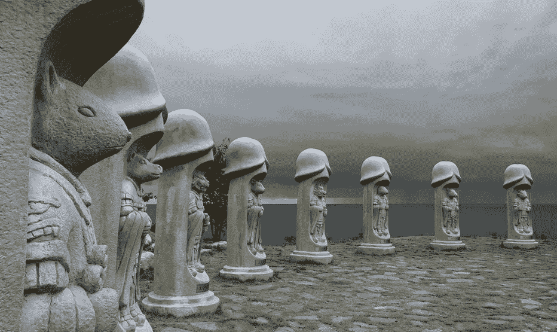

# 所有风投都是混蛋

> 原文：<https://medium.com/hackernoon/all-vcs-are-dicks-60afff5796ee>

## 几周前，我和一位从未谋面的风险投资家呆了 45 分钟。

会议以常见的“互相倾吐”式的聊天开始:共享联系人……最近的旅行……天气。

在“会见专业人士”这一唯一可能的努力下，我们过渡到了商业领域。

首先，概述他们的基金战略(fin tech)、投资阶段(seed/A)和资本结构(几只基金，1 亿美元)；然后，天衣无缝地，我现在的风险。我们谈了高水平的论文。我展示了我们的产品。

我们的谈话有节奏。我们有化学反应。我们既温暖又舒适；卡住了。

然后他俯下身子，双手交叉放在桌子上。他停下来，透过眼镜向外凝视——然后丢下了这颗宝石:

> “想知道这个行业的麻烦吗？
> 
> 所有的风险资本家都是混蛋。
> 
> 我们有资金和强烈的意见。
> 
> 但你知道比这更糟的是什么吗？
> 
> **所有企业家。他们很烂。"**

他的口音很重，我花了一会儿才听出来。

在写作中这似乎是显而易见的。但就我个人而言，我更多地反映了占领的破坏，而不是侮辱的明显联系。

他已经开始了新的生活，但意识到我可能没有把这些点联系起来，他退回去，开始了第二次思考:

> “说真的，我们都是混蛋。但是企业家…

然后，停顿…为了强调…

> 他们烂透了，”

会议的其余部分如你所料。我们继续讨论业务和他们的基金，以及是否有机会一起创造价值。

但这一切都是模糊的。这一切都与那短暂互动的沉重无关:

*   在# [metoo](https://hackernoon.com/tagged/metoo) 的时代，有没有一条线被跨越，如果有，是哪一条？*证据 1:* 两个家伙在一次秘密会议上开的一个口交玩笑。没有女性参与或被提及。但是……5 年前，这可能会被视为兄弟间无伤大雅的更衣室谈话而不予理会，但现在却意味深长。我的大脑被重新连接了吗？我的眼睛现在睁得更大了吗？
*   与此相关的是，风投和企业家之间的权力动态继续严重失衡。我们可能在性别界限方面取得了一些进步(我很确定这个特别的风投不会对一个女[企业家](https://hackernoon.com/tagged/entrepreneur)开这种玩笑)，但这并不涉及黄金法则(你知道:那些有黄金…法则的人)。更直白地说，如果我尝试过这种说法，结果可能会，嗯…限制我的职业生涯。

我带着微笑和握手离开了会议，并平等地承诺我们将继续对话。

我试着忘记它曾经发生过。毕竟，这只是在私人房间里说的话。

但是，几个星期后，我仍然发现自己在向别人讲述这个故事。事实证明，这是充满非凡时刻的旅程中最非凡的时刻之一。

我不知道我该有什么感觉。

如果有的话。