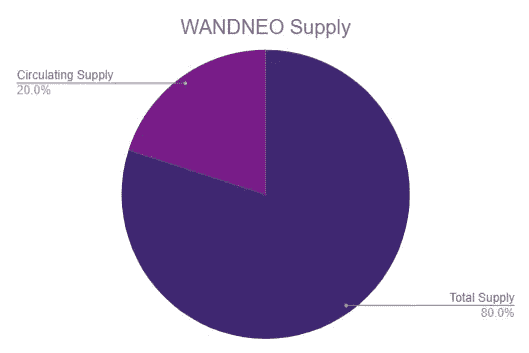
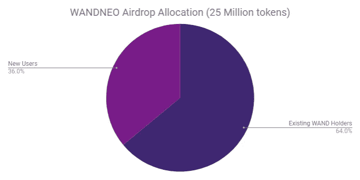

# 关于空投，你需要知道的

> 原文：<https://medium.com/hackernoon/all-you-need-to-know-about-airdrops-98b1b5af7941>

根据剑桥词典的解释，空投 *“是通过从飞机上空投物资或设备的行为”*。这种性质的空投可能不会让你赚到任何“免费的钱”，但是，在加密货币领域的空投会。

在这篇文章中，我将通过描述空投是什么，存在的不同类型，为什么会发生，以及过去发生的一些值得注意的空投，给你一些内幕。

## 什么是空投？

空投是加密货币项目决定向用户分发一些“免费”硬币/令牌的过程，前提是他们满足空投要求。

空投资格要求可能包括:

*   **持有某个硬币/代币** —这是一种非常常见的空投机制，根据用户是否已经拥有某个硬币/代币，向用户投射空投硬币/代币。这种空投的一个例子是 OmiseGo，他们向所有持有至少 0.1 ETH 的以太坊钱包空投 OMG 令牌。
*   **在社交媒体上发布/分享** —这种机制通常包括执行一些非常简单的社交媒体任务，如分享帖子、加入电报频道等。
*   **订阅时事通讯**
*   **注册他们的平台**

空投有两种不同的形式:

*   **突击空投**——在宣布空投之前，拍摄区块链(即每个钱包在特定日期&时间的余额)的快照。然后，例如，一个项目可以基于该特定快照发起*“持有某个硬币/代币”*空投。
*   **计划空投**——这些空投是事先宣布的，并附有具体的日期&时间，空投将在该时间发生。这种形式的空投通常由需要用户操作的空投来执行。

一个警告——如果你的硬币/代币在交易所(而不是在你的钱包里)，他们是否会分发空投的硬币/代币是由交易所决定的。一些交易所比其他交易所更适合空投。 [**币安**](https://www.binance.com/?ref=10881502) 通常用这个做一个[出色的工作](https://support.binance.com/hc/en-us/articles/360004750832-Notice-of-Binance-Support-for-EOS-Airdrops-IQ-DAC-and-EON)。例如，在他们的 [**币安**](https://www.binance.com/?ref=10881502) 账户中有 EOS 余额的用户自动收到他们的 IQ、DAC & EON 空投令牌。

## 空投的原因

你可能想知道，为什么项目会给出“免费的钱”。项目这样做有几个原因，如下所述:

*   **社区创建** —拥有项目硬币/代币的机构/个人通常来自预售、公开销售和团队。通过实施空投，拥有项目硬币/代币的人数显著增加。这有助于创建一个社区和网络。
*   **潜在客户** —在市场营销中，潜在客户*“是消费者对企业产品或服务的兴趣或询问的开始”。*空投是一种创造销售线索的神奇机制——你向用户询问基本信息，作为回报，你会奖励他们一些“免费的钱”。这产生了一个强大的线索数据库，有助于推动未来的营销活动。
*   **提高认知度**——脸书最近可能没有给自己带来荣耀，但它的模式一直是*“如果你不为产品付费，你就是产品”*。空投**创造意识**和**把没有听说过或拥有任何硬币/代币的人带上**。这不仅提高了知名度，还创造了一种**捐赠效应。**这是*“假设人们赋予事物更多的价值仅仅是因为他们拥有它们”*
*   奖励忠诚的追随者——这种空投形式通常被用作一种保留策略。有什么更好的方式来奖励忠诚的追随者，给他们一些免费的硬币/代币？

## 著名的空投

最近，空投变得越来越突出。不幸的是，坏演员正试图利用这一点，创造欺诈性或“毫无价值”的空投，所以在参与任何之前做好自己的研究。

说到这里，已经有许多由严肃项目执行的成功案例，包括:

*   [**法令【DCR】**](https://www.decred.org)——**法令**宣布他们在 2015 年 12 月空投。注册已经进行了近一个月，有超过 3000 名申请人。每个成功的参与者都获得了超过 **282 DCR** ，其中每个 **DCR** 一个月后价值**~ 2.45 美元**，而**目前价值~ 63 美元**。
*   [**【OMG】**](https://www.omise.co/)—2017 年 8 月， **OmiseGo** 宣布将空投 **OMG** 到**区块链以太坊**的每一个地址。OMG 总供应量的 5%被空投到在特定快照中余额超过 0.1 ETH 的钱包中。这导致超过 450，000 个地址收到了 **OMG** ，在当时价值**~ 11.50 美元**。
*   [**本体(ONT)**](https://ont.io/)——**本体**至今实际进行了 3 次空投；第一个是最重要的(也是最有价值的)。在决定**本体不会进行公开销售**后，他们决定空投**1000 ONT**给每一个 [**订阅他们简讯**](/ontologynetwork/ontology-finishes-collecting-email-addresses-for-the-first-round-of-its-reward-event-e6a617d2872e) 的人。**当 ONT 分发给用户时，ONT** 的价值为**~ 2**美元，一个月后达到**~ 10 美元**，潜在净得用户**~ 1 万美元**。
*   [**博学者(POLY)**](https://polymath.network/)——**博学者**空投**1000 万聚**给符合条件的参与者(已顺利通过 KYC)。有来自世界各地的 40，000 多份申请，每个用户得到了 250 多份。空投后不久，**聚**值**~ 1.60 美元**。

## 值得一提的即将到来的空投

> [**WandX**](https://www.wandx.co/)**是一款用于分散交易所(DEX)的 app，将与**以太坊**和 **NEO** 上的 **WandX DEX** 以及 **WandX Basket 协议**进行接口。**

**换句话说，[**WandX**](https://www.wandx.co/)**正在构建一个平台(可通过您的网络浏览器和/或移动应用程序访问)，该平台将允许在一个屋檐下访问不同区块链上的所有 dex。****

******WANDNEO** 是一个令牌，它将使用户能够根据 DEX 的交易量，以**气体**的形式接收**红利**(一旦这些红利被**下注**)。****

****[**WandX**](https://www.wandx.co/)**将空投 **WANDNEO** 给新的参与者，以及现有的**魔杖**持有者。现有的**魔杖**持有者拥有更大的份额，并将以 1:1 的比例空投 WANDNEO 代币(见下图)。******

****这一空投旨在提高意识，创造一个更大的社区，以及奖励忠实的追随者。你可以在这里找到他们最初的公告。为了获得资格，您需要在 8 月 10 日****之前按照以下步骤 **:** 注册********

1.  ******加入 [WandX 的电报组](https://t.me/wandxbeta)。******
2.  ******在 [Twitter](https://twitter.com/WandXDapp) 上关注 WandX。******
3.  ******[填表，这里](http://www.wandx.co/airdrop.html)。******

************************

******您可以点击链接[这里](http://www.wandx.co/airdrop.html)找到更多信息和注册详情。******

# ******这个帖子值得多少掌声？跟着来怎么样？******

******如果你喜欢这篇文章，请随意👏**鼓掌**👏很多次(你知道你想！)，给我的博客一个👣**跟随**👣**和**🤲**分享**🤲和你的朋友在一起。有一个限制👏50 拍👏你可以给每个职位，所以我劝你不要试图超过这个限度…你可能会打破中等！******

********

# ****说到这个…****

****如果你仍然关注我，请留下评论，让我知道你还想看到我写些什么。你可以找到我的社交媒体的链接，并在下面注册我的时事通讯。****

****************************

[ermos.crypto+medium@gmail.com](mailto:ermos.crypto+medium@gmail.com)**** 

****也可以捐款到以下地址以示支持:
**ETH/WAND**:[0x4c 7195 e 074 cf 0 ab 6 f 77 BDB 7 c 97 FD 2567066 bb 712](https://goo.gl/H8xSTn)****

****免责声明:这篇博文中的所有信息和数据仅供参考。我的观点是我自己的。我不提供个人投资建议，也不是合格的特许投资顾问。*我对任何信息的准确性、完整性、适用性或有效性不做任何陈述。我将不对任何错误，遗漏，或任何损失，或因其展示或使用引起的损害负责。所有信息均按原样提供，不提供任何担保，也不授予任何权利。*****