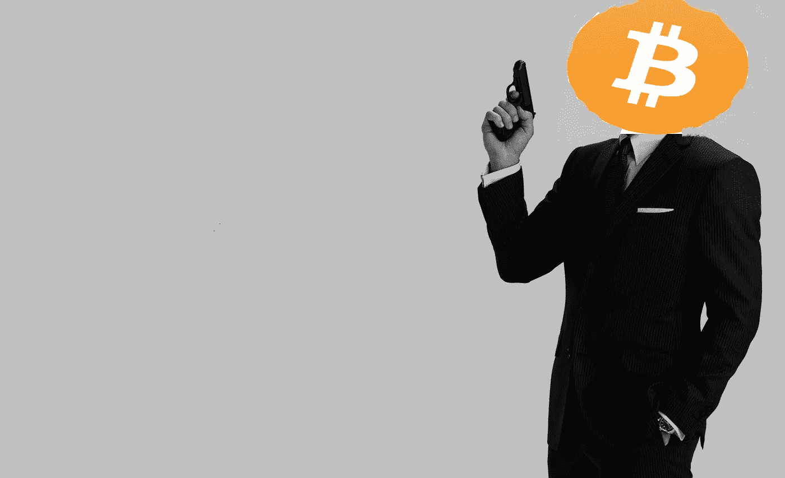
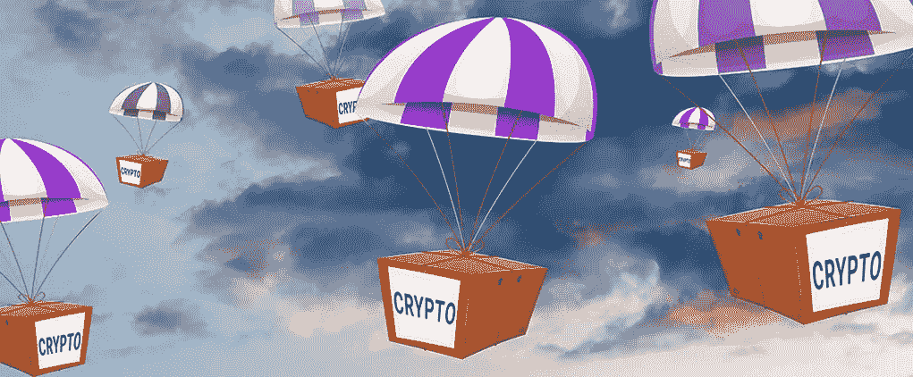
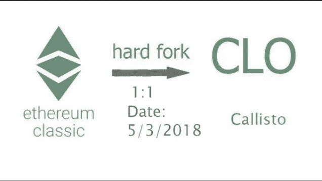
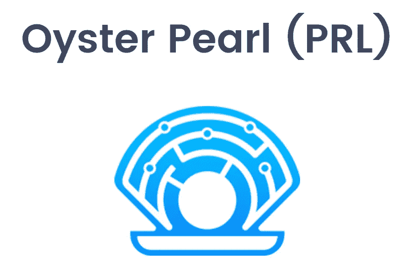

# 所有你需要知道的关于加密空投。又名免费的钱。

> 原文：<https://medium.com/hackernoon/all-you-need-to-know-about-crypto-airdrops-aka-free-money-243e60b22493>

## 另外-我期待着一些空投物资。

他们说世界上没有免费的午餐。

我发现单词 **Free** 是口语史上最讽刺的单词。任何免费提供给你的东西通常都附有条件，或者取决于你之前购买的物品，或者质量不合格，或者是我选择不列出的 100 个不同的理由。

因此，当有人向我推销“免费”产品时，我通常会选择另一个方向。

然而，密码世界对正常的、*传统的*世界的规则和标准化系统不屑一顾。

记得詹姆斯·邦德吗？

这种男人遵循自己的规则，有自我肯定的行为准则，有自己的一套道德规范，在当地的酒吧之夜，他可以在你的饮料里撒尿，然后带着你的女孩离开。

**Crypto 是金融界的詹姆斯·邦德。**

My terrible Photoshop.

Crypto 不遵循典型市场的规则、规定或结构。它有自己的思想，自己的系统，自己的一套伦理，自己的生态系统。

你猜怎么着，在加密的世界里，你绝对可以通过注册 ***空投***得到一顿免费午餐或者一杯咖啡或者一个玩具蓝宝。

“你一定是在跟我开玩笑。”

Something like this.

不久前，代币初创企业意识到，当他们的代币存放在尽可能多的钱包上时，会有更多的价值。更多的硬币导致更多的兴趣和曝光，这反过来大大增加了特定硬币在交易所上市时的交易量。

然后想出了一个土办法——**空投**。不，我不是指这里的软件更新。

参与空投很简单。你发现或者被告知有空投，填写一份电报表格，给出你的以太坊(或相关硬币)钱包地址，瞧！几周后你钱包里的免费代币。

它还在加密生态系统中创造了*营销浪潮*。人们开始发现和谈论“免费”代币，关于这个特定代币的消息在社区中传播开来。这个词影响了成千上万的人，而广告的成本是零。

相比之下，ICO 最初涉及私下销售(基本上是富人越来越富)，然后是公开销售，小投资者为 ETH 或 BTC 购买代币。空投取消了这一过程中的支付部分，而是赋予**更多价值**来告知人们他们的产品，并给每个人拥有一些代币的机会。

> 在空投(或硬分叉)中，代币被分配给特定链的现有持有者——通常是比特币或以太坊。没错，他们不是购买代币，而是简单地将代币赠送给另一枚硬币的持有者。

The Simpsons called it first.

# 空投 101

让我们深入了解这种方法的可行性，以及最重要的是，它对比特币和以太持有者的影响。

你可能在想——为什么一个项目会免费分发它的令牌而不是出售它们？在许多方面，分发令牌的空投(或硬叉)方法是实现 ICO 相同目标的更好方法，这些目标通常有三个方面:

1.  **提高知名度:**让尽可能多的钱包和人得到你的代币，建立一个强大的活跃用户群，这些人*可能*最终成为真正的顾客。**分布的广度**通常是重要的衡量标准，尤其是考虑到许多项目正试图启动网络效应。
2.  **提高知名度:**一旦代币进入交易所，就会产生大量的金钱利益。
3.  **筹集资金:**为项目的未来发展和扩建提供资金。

# **空投或硬叉的优势**

## **分布宽度**

早期的选择涉及 ICO，即首次发行硬币，参与者通过 BTC 或 ETH 购买代币。然而，代币最终落入了少数人手中，通常只有三四万人。虽然这里确实涉及到很多钱，但人们的意识却很少。

快速回顾一下，比特币和以太坊拥有数百万用户。空投有效地将你的代币交到数百万人手中。即使只有 1%的用户真正参与到你的项目中，你也可能比最成功的代币销售获得更广泛的传播和更多的参与。

## **意识**

代币销售的一个辅助但重要的好处是，它们有助于提高你的项目的知名度。

在任何时候，都会有一些有希望的 ICO 和硬币吸引你的注意力。生态系统并不是**设计的**来处理这个问题的，最终，最多只有几个项目以他们需要的曝光率结束。

然而，如果你的目标社区获得了股份，他们可能会更认真地看待你的项目，而不是承担做出购买决定的负担。

一个非常微妙但重要的区别。

当人们拿到股份时，他们的处境就不同了，他们必须决定如何处置(出售？保持？多买？).至少，这通常会鼓励社区的某些部分对你的项目进行自我教育。

从这个意义上说，在空投或硬叉子中赠送代币类似于游击营销活动。

## **资金筹集**

虽然少数最受瞩目的 ico 最终筹集了数亿美元，但大多数只筹集了其中的一小部分。

> 不幸的是，就像传统新闻一样，你最终只会听到成功的消息，而不会听到失败的消息。

同样，空投至少在这方面是成功的。在这里，一个项目可以采用许多潜在的方法。

一个简单的例子是向所有比特币(或以太坊)持有者空投 95%的代币，而项目本身及其背后的团队保留 5%的代币以资助未来的发展。

## **监管风险**

也许这是最重要的一点。当涉及到*冰冷、硬现金*的时候，很多监管者就会发生争执。

政府已经一次又一次地向我们展示了，当一个产品被卖出，收入被创造，资本被产生时，他们非常感兴趣并且突然受到影响。

消除这个风险很简单——进行空投，呵呵。

考虑到上述各点，空投可能是阻力最小(效果最大)的途径。

# 我正在看的两个空投-

作为一名全职的密码交易员，我会睁大眼睛和耳朵，留意任何新的空投、ico 或影响我投资组合的消息。

所以很明显，我的目标是投资我能找到的最好的技术，并增加我的持股。

(*附:前面没有附属链接。我在这里什么也赚不到。*)

## 木卫四

作为以太坊经典*硬分叉*，Callisto 是一项基于以太坊经典协议运行的区块链技术。Callisto 引入了一个冷赌注协议，奖励令牌持有者成为参与者。

冷赌注是一种激励 CLO 令牌持有者在特定时间内持有的方式，允许他们在不验证交易的情况下赚取利息，因为交易将通过工作证明算法实现。

Callisto 网络最近宣布,[这里](https://www.reddit.com/r/EthereumClassic/comments/7qs9ui/callisto_network_announcement/)Callisco 将很快推出。在启动时，拥有 5500000 块以太坊经典帐户余额的帐户将收到等量的 Callisto 代币，比例为 1:1。

**意思是 ETC 代币持有者每持有一个以太坊经典(ETH)将获得 1 个 Callisto (CLO)代币。**

事实上， **Crypto Disrupt** 的人有一本关于 Callisto 的精彩指南，我强烈推荐你去看看。

**你可以在这里** **查看 Callisto** [**的密码破解指南。**](https://cryptodisrupt.com/callisto-is-a-moon-and-the-airdrop-is-imminent/)

## 牡砺壳

shell 或 *SHL* 是一个**实用令牌**。贝壳用于支付牡蛎网状网络的连接和 Dapp 操作，而**珍珠(PRL)** 用于在缠结上静态保留数据。

*贝壳不像珍珠那样与储藏挂钩。*

在未来，你将能够使用 Shells 来访问分散的 web，完全绕过 ISP 和集中式基础设施的连接。

**要获得空投资格，您只需拥有牡蛎珍珠代币。**

这将是获得 SHL 的唯一途径，它不会以象征性销售的方式提供。区块链上的每一枚 PRL 将被空投 1 枚 SHL。SHL 的总供应量将与 PRL 的总供应量相匹配(在 1000 万枚 PRL 硬币燃烧事件之后)。

# **我正在寻找的 ICO+Airdrop-**

基于 NEO 平台，我对这个非常感兴趣。我非常看好中国的区块链项目，一旦主流采用开始，NEO 生态系统为增长和使用提供了一个高能量、高回报的平台。话虽如此，这个令牌最近引起了我的注意。

## 奥比斯（一个致力于为世界各国盲人和眼疾患者恢复光明的国际性慈善机构）

> Orbis 提供了一个安全的、全球性的、分散的、开放的蓝牙社区网络，任何人都可以参与其中。Orbis 旨在通过物联网、人群聚集数据、数字基础设施、物流和系统管理等实现，使第三方开发者能够轻松访问蓝牙网格开发。对于消费者来说，Orbis 应用程序将带来传统 WiFi 应用程序无法实现的独特功能。

这意味着，你可以用奥比斯——

1.  **IOT 工业**

智能家居、众包数据和自动化。使用 Orbis 应用程序控制您的灯光、灯罩和 HVAC，管理您的供应链，或查看实时等待时间。

**2。BTC 交易**

离线时使用 Orbis 网状网络发送和接收加密货币。在匹配的交易数据上传之前，资金将被托管。

**3。防御**

Mesh 在未开发的环境中提供可靠的离线通信。Mesh 可以协调士兵和系统监控和管理战场。

**4。电信**

互联网共享和网状信息。向 OBT 出售您的移动数据，并通过 mesh 向其他人发送消息。一种强大、廉价、便携的救灾解决方案。

**5。广告**

赞助地点和步行交通数据。在 OBT 访问并连接到受赞助地点的节点将获得奖励！

非常有趣的是，奥比斯还宣布了他们的空投计划，最近宣布将空投 100 万枚令牌，最多可空投 6 万个近地天体地址。

简单的数学告诉你，大约是每人 16.7 OBT 代币。

鉴于交易所将 OBT 的挂牌价格定为 0.70 美元，这比 11 美元多一点。

**足够吃一顿免费午餐了:)**

玩笑开大了。这个令牌看起来确实是一个有趣的持有，并且是一个强大的基本设置。

我主张投资生态系统代币和基本面强的代币。

**这里** **获取你的 OBT 令牌** [**。**](https://cryptodisrupt.com/orbis-airdrop/)

# 当东西免费时，你就是产品

现在，公司显然不会仅仅因为他们是好人就进行空投。这都是一个优雅的公关计划的一部分，最终将导致代币价值的增加。​

除了 airdrop 是免费广告之外，它还将已经在 crypto 社区中的人与您的项目联系起来，并给予每个人相同的激励:象征性的价格升值。

禀赋效应表明，个人拥有的东西价值更高。在最近的奥米塞戈事件中，突然有 50 万人认为奥米塞戈比其他代币更有价值，仅仅因为它被放进了他们的钱包。​

许多人还会继续积累货币，因为他们已经觉得自己是投资者了。规避风险、囤积和完全主义的基本倾向也可能发挥作用，一些人试图购买更多的 OmiseGO 以达到整数，并增加他们当前的筹码，而不是通过他们不知道的新代币进一步分散风险，因此认为风险更高。

展望未来，可能的 airdrop 发展可能是开始向用户赠送代币的项目，这些用户在与自己的项目重叠或有一些协同作用的项目中持有代币。我们还可以看到一些项目鼓励其他项目向它们的令牌所有者空投，并获得一些回报。

如果你是一个持有不同硬币组合的投资者，你可能会收到越来越多的免费资金，因为这个概念越来越受欢迎。

和往常一样，当你冒险进入神秘之地时，要小心试图窃取你的硬币的诈骗空投。不要泄露你的私人钥匙或钱包文件，也不要点击可疑的链接。

现在去检查一下你的钱包，里面可能有你不知道的上次空投的硬币。

## 干杯，感谢您的阅读。

对于你进入密码市场的第一步的终极资源，加上你在**的第一笔投资**，以及**如何投资**，以及**投资什么**，请查看我的指南

 [## 如何通过交易和投资加密货币赚钱？

### 比特币！莱特币！以太坊！—激动！不知所措！还有什么不可以。

medium.com](/@shauryamalwa/how-to-almost-make-millions-by-trading-cryptocurrency-2f7bd5c1cedd) 

这些步骤让我在几个月内从 1000 美元变成了 30000 美元。

让它变大的唯一方法是自己学习如何抓鳟鱼。另一边见。干杯！

****************************************************************

鼓掌 1 次或 50 次。它帮助我获得曝光率。谢谢大家！

_

阐述我多年来的想法，并超级热衷于写区块链、交易、加密货币和生活。

我的目标是以一种精致、易懂的方式将加密货币带给大众。复杂无助于任何人，有偏见的媒体也是如此。

是的，我认为这个系统是一个巨大的谎言，是时候改变它了。

_

#longlivecrypto。

***************************************************************