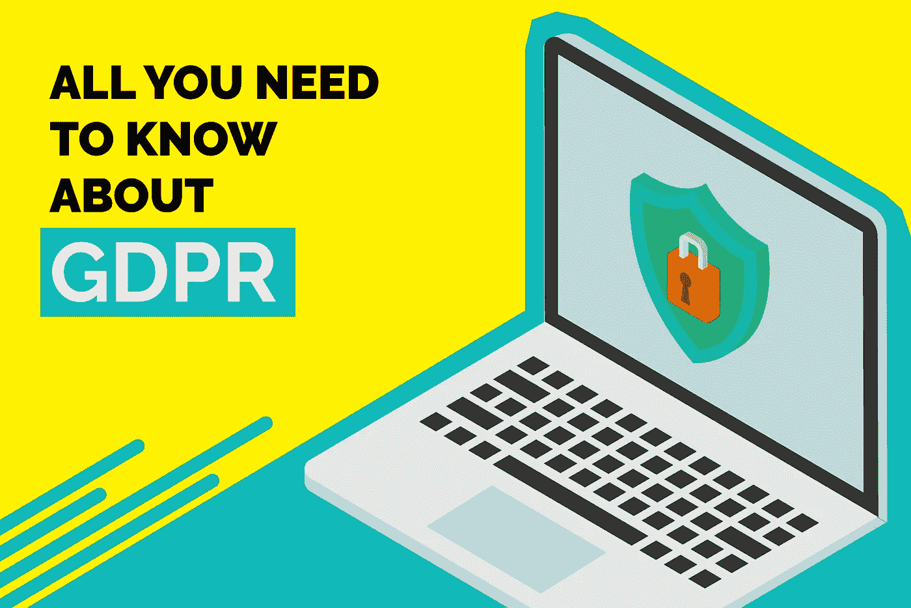

# 关于 GDPR 你需要知道的一切—已解释

> 原文：<https://medium.com/hackernoon/all-you-need-to-know-about-gdpr-explained-8e336a1987ea>

# 每个人都在谈论它——GDPR 到底是什么？

通用数据保护条例(GDPR)是新的欧盟隐私法，于 2016 年由欧洲议会、欧盟理事会和欧盟委员会联合批准。

GDPR 将取代现有的欧洲数据保护指令*(顺便说一句，该指令于 1995 年出现)*，该指令将于 2018 年 5 月 25 日生效。自该日期起，GDPR 将取而代之，所有与数据保护相关的法律将受 GDPR 管辖。

GDPR 的目标是通过实施单一的数据保护法，将所有欧盟成员国纳入一个保护伞之下。GDPR 计划对如何处理、使用、存储或交换数据制定指导方针和法规。

# 我应该担心吗——这是为了谁？

GDPR 适用于在欧盟注册或在欧盟设有机构或子公司的所有组织。它还适用于向欧盟公民销售商品或服务并处理或监控欧盟居民个人数据的组织。

*注:个人数据是指与已识别或可识别的自然人相关的任何信息*

简而言之，如果您的业务建立在欧盟或您的部分客户群位于欧盟，您必须遵守 GDPR。

要求组织遵守的具体标准是:

1.  在任何欧盟国家的存在。
2.  在欧盟没有存在，但该组织处理欧盟公民的个人数据。
3.  250 多名员工。
4.  员工不到 250 人，但该组织的做法会影响欧盟公民的权利和自由，或者包含某些类型的敏感个人数据。*这实际上意味着几乎所有的公司*。

> 普华永道的一项调查显示，92%的美国公司认为 GDPR 是数据保护的重中之重。

# 哪些党派参与了 GDPR？

这些法规涉及三个主要利益相关方，即:

1.  **数据控制者**决定处理个人数据的目的和方法——他们协调处理过程。
2.  **数据处理器**负责根据数据控制器的指令直接处理个人数据。例如，这可能包括分包商。
3.  **数据主体**是使用数据控制者提供的商品和服务的欧盟公民。

比方说，如果你是一家向欧盟公民(数据主体)销售 SaaS 产品的企业，并使用第三方工具 X 来分析你平台上的消费者行为。你是数据控制者，X 是数据处理者。

# 与以前有什么不同—有哪些关键变化？

GDPR 统一了所有欧盟成员国处理、使用、存储和安全交换个人数据的方式。

受到欧盟关注的组织必须证明它们正在处理的数据的安全性。他们还必须实施大量的技术和组织措施，以表明他们持续遵守 GDPR。

## 需要的安全措施

GDPR 对可能需要采取何种类型的安全行动有具体指示:

1.  个人数据的加密和假名化。
2.  组织应规定定期测试、评估和评价技术和组织策略的有效性，以确保数据的安全性。
3.  处理系统和服务的保密性、完整性、可用性和弹性的规定。
4.  在发生物理或技术事故时，组织有权及时恢复个人数据的可用性和访问权限。

## 个人资料

GDPR 打算保护欧盟居民的个人数据，被视为个人的数据是:

1.  基本身份信息，如姓名、电子邮件、地址和身份证号码
2.  位置、IP 地址、cookies 数据和 RFID 标签等 Web 数据
3.  健康、遗传和生物特征数据
4.  种族或民族数据
5.  政治观点
6.  性取向

## 惩罚

如果违反当局列出的条款，GDPR 当局将可以开出高达 2000 万欧元或全球年营业额 4%的罚款，以较高者为准。

# 数据主体的权利是什么？

## 违规通知

如果出现任何可能导致未经授权使用和分发数据的数据泄露，数据控制者必须在意识到该泄露的 72 小时内通知数据主体。

同样，数据处理者必须在规定时间内将违规行为通知数据控制者。

## 接触权

GDPR 为数据主体带来了获得关于他们的个人数据如何、在哪里以及出于什么目的被处理的信息的权利。

## 被遗忘的权利

也被称为数据擦除，被遗忘权赋予数据主体将其个人数据从数据控制者的日志中删除的权利。被遗忘权也使他们能够停止或终止第三方进一步分发和使用数据。

## 数据可移植性

GDPR 引入了数据可移植性——数据主体有权接收有关他们的个人数据，这些数据是他们以前以常用和机器可读的格式提供的，并且有权将这些数据传输给另一个控制者。

这实质上意味着，如果您想从一个服务提供商切换到另一个，以前的服务提供商应该以机器可读的格式为您提供完整的数据，这些数据可用于与新的服务提供商集成。

## 设计隐私

隐私设计在 GDPR 正式引入，以促进与数据保护最佳实践相呼应的系统的有效设计。控制者应以设计有效的方式实施适当的技术和组织措施，以满足该权利的要求并保护数据主体的权利。

控制者应仅保存和处理完成其职责绝对必要的数据，并限制数据处理者对个人数据的访问。

# 数据保护官员(DPO)

应指定一名 DPO 来促进某些组织中数据保护的顺利运行。

这些组织包括控制者和处理者，其核心活动包括处理操作，这些操作需要对大规模的数据主体或特殊类别的数据或与刑事定罪和犯罪有关的数据进行定期和系统的监控。

## 我的企业需要任命 DPO 吗？

在以下情况下必须任命 dpo:

1.  政府当局
2.  从事大规模系统监控的组织
3.  从事大规模敏感个人数据处理的组织

如果您的组织不属于这些类别之一，那么您不需要任命 DPO。

# 它将如何影响我的云数据存储实践？

如果您计划使用公共、私有或混合云数据存储，则存在 GDPR 合规性问题。这些影响列举如下:

1.  在私人托管的云存储中，您将完全控制数据，并可以采取适当的措施来保护数据。
2.  如果您使用公共或混合云数据存储，您的云存储服务提供商应该在策略和程序方面采取足够的安全措施。确保提供商实施的责任措施符合政策。

GDPR 是一个新的改革，在古老的隐私和数据保护法的企业有关居民的欧盟，这是一个主要的客户群，很多企业。GDPR 打算在所有欧盟国家推行统一的法规。

第一次浏览 GDPR 的官方政策和商业社会中产生的议论可能会令人生畏。但是这篇文章和互联网上的其他支持文件将指导您调整您的政策和实践，以轻松遵守 GDPR。

感谢 Kommunicate 首席执行官 [*【德瓦希什】*](https://www.linkedin.com/in/devashish-mamgain-1a639320/) *】帮助我做关于 GDPR 的研究和笔记。*

> 我在现代客户支持平台[komunicate](https://www.kommunicate.io/)工作。文章原载[此处](https://blog.kommunicate.io/all-you-need-to-know-about-gdpr-explained-a4083e294a8f)。
> 
> 如果你喜欢读这篇文章，请鼓掌，分享或评论下面的进一步讨论。