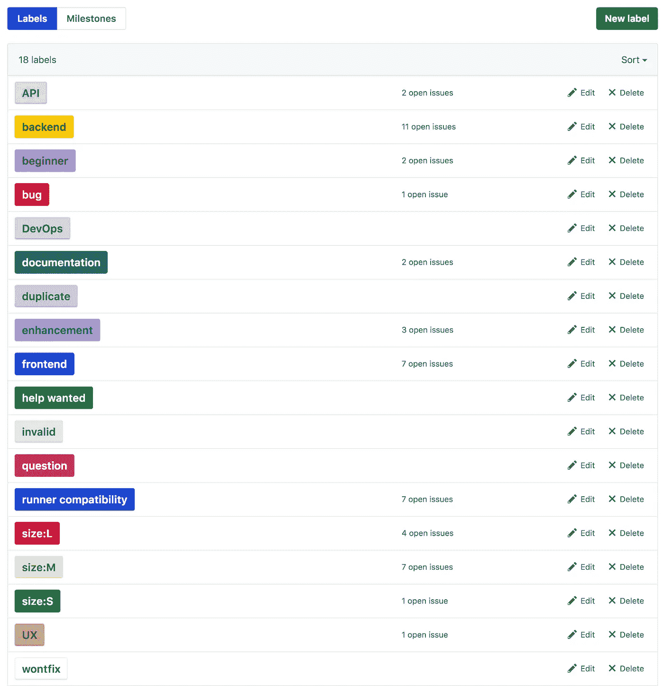
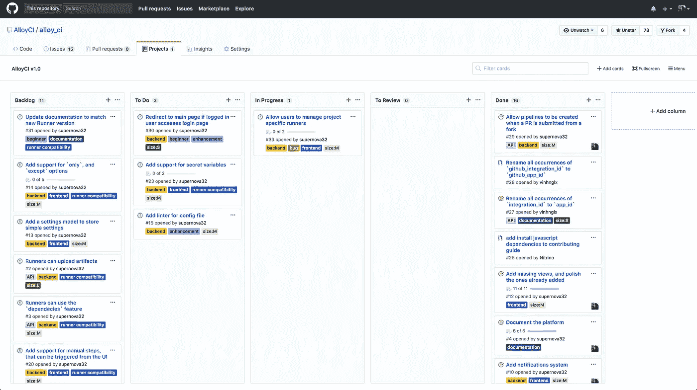
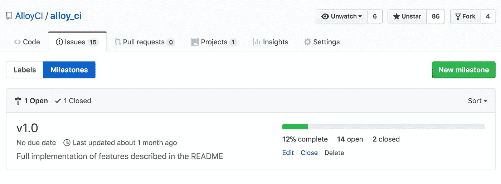

# 合金开发日记—第三部分

> 原文：<https://medium.com/hackernoon/alloyci-dev-diary-part-3-4c454d82cd69>

## 使用 GitHub 问题和公告板进行项目管理

Photo by [Todd Quackenbush](https://unsplash.com/photos/IClZBVw5W5A?utm_source=unsplash&utm_medium=referral&utm_content=creditCopyText) on [Unsplash](https://unsplash.com/search/photos/management?utm_source=unsplash&utm_medium=referral&utm_content=creditCopyText)

这篇博客文章是详细描述 AlloyCI 的[开发](https://hackernoon.com/tagged/development)过程的系列文章的一部分。之前的条目有:

*   [第一部分:开始一个新项目](https://hackernoon.com/alloyci-dev-diary-part-1-8ae564fce9f3)
*   [第二部分:构建新凤凰项目](https://hackernoon.com/alloyci-dev-diary-part-2-6a61b02faca8)

既然我们已经开始了一个新的项目，我们肯定有很多关于需要做什么的想法。我们可能已经知道从哪里开始，接下来是什么，以及如何到达那里，或者我们可能不知道。

如果我们已经知道我们想要什么，那么把它写下来，给它一个形式，并扩展我们想要解决的想法和用例是非常有意义的。

如果我们不这样做，那么写下我们想要完成的目标很可能会照亮道路。一旦我们写下了主要目标，下一步就是把它分解成更小的目标，再把这些目标分解成我们可以轻松完成的更小的任务。

在这两种情况下，我们都需要一种方法来跟踪我们需要做的工作。对于一个软件项目来说， [GitHub](https://hackernoon.com/tagged/github) issues 是一个很好的工具。

## 组织

您可以为每个需要解决的任务创建一个问题，保存它们，使用标签进行组织，例如，为用户相关或前端相关的任务创建一个标签，并记录您的进度。

AlloyCI’s Issue Labels

从很早开始，我就用它们来制作 AlloyCI。该项目有不同的标签来组织不同的问题，并对它们进行过滤。即使现在只有我在 AlloyCI 上工作，拥有所有需要解决的任务，以及已经完成的工作的历史，将真正帮助任何想要开始这个项目的人。

如果只有你一个人在一个项目上花费如此多的时间，这可能看起来很乏味，但是这真的会有帮助。一旦你在几个月不做这个项目后回来，看到要做的事情的清单，你很可能是受益最大的人。如果你没有把它们写下来，你很可能会忘记你想添加的这个小功能，它看起来不重要，但会大大增加用户的快乐。

## 规划

如果你想更进一步，跟踪正在处理的问题，它们的状态，以及下一步是什么，你可以使用 GitHub 的问题板。这些板允许你创建代表开发过程阶段的栏，比如“进行中”、“等待评审”、“待部署”等。它们给你一个项目进展情况的即时的可视化概述。

AlloyCI’s Issue Board

## 设定目标

为了让自己保持动力，我还在问题上添加了里程碑。第一个里程碑是 v0.1，换句话说，AlloyCI 成为 CI 协调者所需的最少功能。我为它设定了一个日期，作为我想完成第一部分的暂定目标。我没能保持它(我至少推迟了两次，超过了两个月)，但是它给了我一些目标。

AlloyCI’s current milestones

对于 1.0，我还没有设定日期，这是一个开放的里程碑，因为有一些相当复杂的问题分配给它，但我仍然把它作为一个目标。这就是我希望 to 项目所在的位置。可能是几个月后，也可能是明年，但我知道我会到达那里。

有很多工具可以帮助你进行项目管理，但是对于一个小团队(或者一个人的团队)来说，GitHub 免费提供给你的工具足够让你到达你需要的地方。