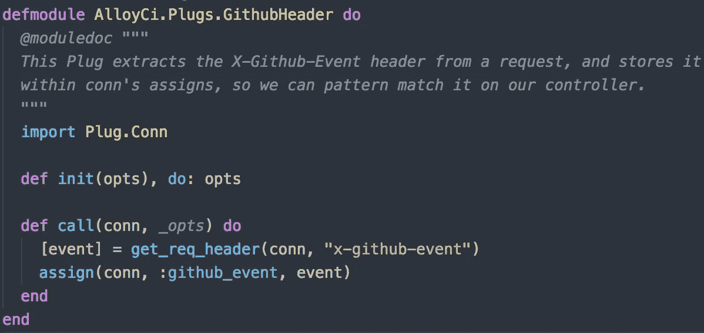
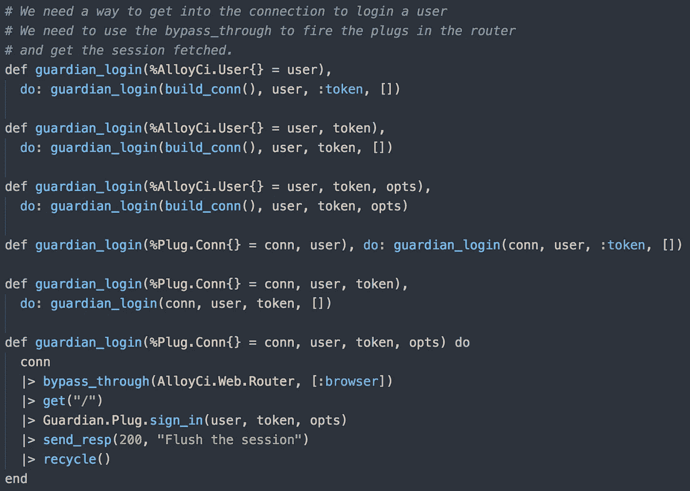

# 合金开发日记—第四部分

> 原文：<https://medium.com/hackernoon/alloyci-dev-diary-part-4-4656ceed60a5>

## 通过 Guardian &über auth 进行用户验证


Photo by [Matt Artz](https://unsplash.com/photos/pY_AZJfdbHQ?utm_source=unsplash&utm_medium=referral&utm_content=creditCopyText) on [Unsplash](https://unsplash.com/search/photos/security?utm_source=unsplash&utm_medium=referral&utm_content=creditCopyText)

这篇博客文章是详细描述 [AlloyCI](https://hackernoon.com/tagged/alloyci) 的[开发](https://hackernoon.com/tagged/development)过程的系列文章的一部分。之前的条目有:

*   [第一部分:开始一个新项目](https://hackernoon.com/alloyci-dev-diary-part-1-8ae564fce9f3)
*   [第 2 部分:构建新的 Phoenix 项目](https://hackernoon.com/alloyci-dev-diary-part-2-6a61b02faca8)
*   [第 3 部分:GitHub 问题的项目管理&板](https://hackernoon.com/alloyci-dev-diary-part-3-4c454d82cd69)

对于一个重要的 web 应用程序，首先需要做的事情之一是用户管理和认证。

AlloyCI 需要连接到 OAuth 服务，比如 GitHub，但也让用户用邮箱和密码注册。在 Rails 生态系统中，我们已经[设计了](https://github.com/plataformatec/devise)。Devise 负责用户管理的繁重工作，它加密密码，使恢复密码变得容易，你可以在用户使用他们的帐户之前验证他们的电子邮件，等等。这也使得与 OmniAuth 的集成变得非常容易，omni auth 允许用户通过实现 OAuth 的服务注册和登录。

我的第一反应是搜索一个类似的库，比如 Devise，但是是 Phoenix/Elixir 生态系统。当我找不到像 Devise 这样功能丰富的东西时，我很惊讶。在 [ElixirForum](https://elixirforum.com/t/user-authentication-in-phoenix/118/7) 上有一场关于人们使用什么来认证用户的大讨论。这是我的第一个信息来源。

该讨论的第一个要点是， ***是*** 一个非常类似于 design 的库，那是斯蒂芬·帕伦的 [Coherence 项目](https://github.com/smpallen99/coherence)，但它仍处于早期开发阶段，不支持 OAuth。这对我来说是一个障碍，因为 OAuth 是 AlloyCI 与 GitHub 正确通信所必需的。

第二点是，对于许多开发人员使用什么来进行身份验证，似乎有一些共识，但是对于初学者来说，没有多少资源可以正确入门。最常用的方法似乎是混合了 [Guardian](https://github.com/ueberauth/guardian) 和[über auth](https://github.com/ueberauth/ueberauth)。两个项目都由同一组人维护，因此集成它们并不复杂。

## 监护人

Guardian 使用 JSON Web 令牌来认证用户并授权他们的操作。它提供了创建、加密和验证 jwt 的完整机制。它为您提供了一种为用户保持“会话”活动的方法，但是它没有提供实际管理它们的方法。

## berauth

berauth 允许您从不同的身份验证提供商创建用户。它与许多 OAuth 服务兼容，还提供了一个名为“Identity”的通用提供程序，允许您的应用程序基于电子邮件/密码组合创建用户。它为您提供了验证用户身份的第一个入口点，但是它无法保持会话活动或授权操作。

> 集成 Guardian 和 berauth 是获得合适的认证和会话管理系统的关键。

# 好东西

现在说点好的。如何将 Guardian &übera uth 集成到现有的 Phoenix 应用程序中？

AlloyCI 中的代码基于[示例应用程序](https://github.com/hassox/phoenix_guardian)，但是它被更新为与 Phoenix 1.3.0 和 Elixir 1.6.1 兼容。

## 1.迁移

您应该已经有了一个包含字段`email`和`name`的`user`模式。密码和其他授权相关信息不会存储在`User`模式中，而是存储在自己的`Authorization`模式中。让我们创建它:

这个数据结构将存储关于用户认证方法的信息。(示例应用程序将它们称为“授权”，因为 Guardian 提供了将权限编码到它创建的 JWT 中的选项，所以从技术上讲，您也可以使用它来授权用户的操作，而不仅仅是验证它们)

随着`Authentication`模式的创建，我们现在需要修改`User`模式来告诉它`has_many :authentications`

在正常情况下，jwt 是不可撤销的，所以如果您的一个令牌受到损害，您将需要切换您的生成/验证函数，从而使所有现有的令牌失效。Guardian 提供了一个解决方法。通过添加`GuardianDb`依赖项，Guardian 会将您的 jwt 保存到数据库中，如果需要的话，您可以很容易地撤销单个令牌。很多人认为这违背了整个 JWT 模式，因为它将一个无会话的认证模式变成了一个全会话的认证模式，但是对于 AlloyCI 的需求来说，这种方法非常有效。

为了使用`GuardianDb`,您需要创建一个新的数据库表来保存令牌信息:

## 2.控制器

现在我们已经准备好了模式，我们可以继续使用控制器了。示例应用程序已经为我们提供了所需的一切，所以只需修改它来满足我们的需求。这是我最初为 AlloyCI 做的。我添加的第一个功能是用户登录，因为这是任何在线服务最必要的功能。

让我们从认证控制器开始，因为这是我们的认证逻辑的入口点。

正如您所看到的，该控制器具有呈现登录页面、处理注销操作、处理来自 berauth 的回调以及针对未经身份验证的用户的通用回调和未经授权的操作的操作。

berauth 回调处理 OAuth 提供者发送的信息。我们在函数签名中使用模式匹配来处理成功和失败的 OAuth 回调。

berauth 的工作方式如下:

*   注册一个拦截来自 OAuth 提供者的原始 HTTP 请求的插件
*   对原始信息执行操作，并为请求准备特殊的`assigns`
*   将处理后的信息转发给控制器

根据 OAuth 回调是成功还是失败，berauth 插件填充相应的 assign。我们就是用这个`assign`来匹配请求的。如果回调失败，我们将用户重定向到登录屏幕并显示一条错误消息。如果行动成功，我们将委托给`Accounts`模块来完成实际的繁重工作。

该模块负责读取由 OAuth 提供者发送的、由 berauth 插件准备的信息，并返回一个用户对象。这个用户可以是新用户，也可以是现有用户，确定返回哪个用户的工作就落在了 Accounts 模块上。这由`get_or_create_user/2`功能处理。你可以看看这个文件，看看一切是如何联系在一起的:

[](https://github.com/AlloyCI/alloy_ci/blob/master/lib/alloy_ci/accounts/accounts.ex) [## 合金 ci/合金 _ci

### alloy _ ci——持续集成、部署和交付协调器，用 Elixir 编写。

github.com](https://github.com/AlloyCI/alloy_ci/blob/master/lib/alloy_ci/accounts/accounts.ex) 

此时，如何处理应用程序如何处理 OAuth 提供者返回的信息完全取决于您。在 GitHub 的例子中，对于 AlloyCI，如果一个帐户不存在，我们就创建一个新帐户，并用返回的数据填充它，即姓名、电子邮件和用户名。

AlloyCI 还允许用户通过常规的帐户创建表单进行创建，在这种情况下，我们要求用户提供所有这些信息，加上密码和密码确认。为了配合 berauth 的认证过程，它提供了一个通用的`Identity` OAuth 提供者。这个提供程序模拟一个正确的 OAuth 请求，并发送表单中的所有信息。然后使用`Comeonin.Bcrypt`哈希算法对密码进行哈希和加盐处理。

如果帐户存在，则使用数据库中已有的数据对其进行验证。用户通过身份验证后，他们就可以使用整个应用程序了。身份验证作为 JWT 令牌添加到会话中，包含:

```
Guardian.Plug.sign_in(user, :access, perms: %{default:  Guardian.Permissions.max})
```

## 3.按指定路线发送

为了使认证过滤器工作，需要在控制器和路由上设置认证过滤器。在 Rails 中，你可以给你的控制器添加一个`before_filter`,然后就结束了，但是在 Phoenix 中有两种方法可以做到这一点，一个路由管道，或者作为一个特定于控制器的插件。

**路由管道**

路由管道允许您通过一组预定义的插件发送请求。AlloyCI 的认证管道在`[routes.ex](https://github.com/AlloyCI/alloy_ci/blob/master/lib/alloy_ci/web/router.ex#L12-L18)`文件中定义如下:


正如您在评论中看到的，这些插件只检查正确的 JWT，但是如果没有发现，它们不做任何其他事情。这是故意的，因为我们拥有无需令牌即可访问的资源。对于所有其他需要认证用户的资源，需要一个额外的插件。这就是控制器特定“过滤器”的用武之地。

**控制器专用插头**

您可以在每个控制器上定义额外的插件来进一步过滤请求。我们在 AlloyCI 上为需要认证用户的控制器和管理员专用控制器使用这个。以`[pipeline_controller.ex](https://github.com/AlloyCI/alloy_ci/blob/818d50a00c57a913f830bde74facc26b7c232191/lib/alloy_ci/web/controllers/pipeline_controller.ex#L4-L5)`为例，我们使用一个插件来确保用户登录，使用另一个插件来更改默认布局，但只用于“显示”动作:


[公共控制器](https://github.com/AlloyCI/alloy_ci/blob/master/lib/alloy_ci/web/controllers/public_controller.ex)不调用任何认证插件，因为它不需要用户对象来显示公共信息，如登录页面或注册页面。

**究竟什么是插头？**

插件是 web 应用程序之间可组合模块的规范。它们允许您在模块之间共享信息，并在此过程中对其进行操作。Plug 表示与`Plug.Conn`的连接，它在整个请求周期中都是可用的。您可以使用一个插件来操作请求，从中提取信息，向其中添加信息，等等。

对于身份验证插件，我们从连接会话中获取信息，验证它，然后向它添加私有声明。然后我们在另一个插件中使用这个私有声明来加载`current_user`资源(这都是由 Guardian 库处理的)。这实际上就是我们上面展示的`:browser_auth`管道所做的事情。

可以在[这里的](https://github.com/AlloyCI/alloy_ci/blob/master/lib/alloy_ci/web/plugs/github_header.ex)中找到一个插头的更基本的用法，我们从连接头中获取信息，并将其保存到连接内部的赋值器中，以便能够对其进行模式匹配:



这个插件是在 GitHub API 处理程序的[管道](https://github.com/AlloyCI/alloy_ci/blob/master/lib/alloy_ci/web/router.ex#L42-L44)中声明的，并像这样在`github_event_controller.ex`中使用，在这里我们针对一个引用被删除的“push”事件进行模式匹配:


## 4.视图和模板

## 5.试验

如何测试您的应用程序完全取决于您，但是如果您想要测试身份验证墙后面的控制器，那么您将需要一些帮助器方法来准备连接，并用测试所需的结构填充它:



这些方法应该添加到`[conn_case.ex](https://github.com/AlloyCI/alloy_ci/blob/master/test/support/conn_case.ex)`文件中，并在你的控制器测试中使用，例如`[pipeline_controller_test.exs](https://github.com/AlloyCI/alloy_ci/blob/master/test/web/controllers/pipeline_controller_test.exs)`:


这涵盖了 Guardian 和 berauth 如何与 AlloyCI 集成的基础知识，应该会为您提供一个起点，以及如何将它们与您的项目集成的一些见解。