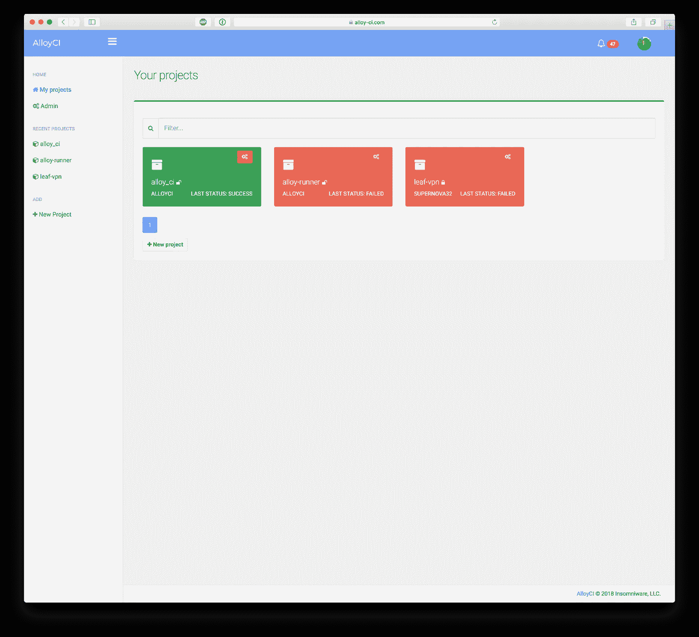
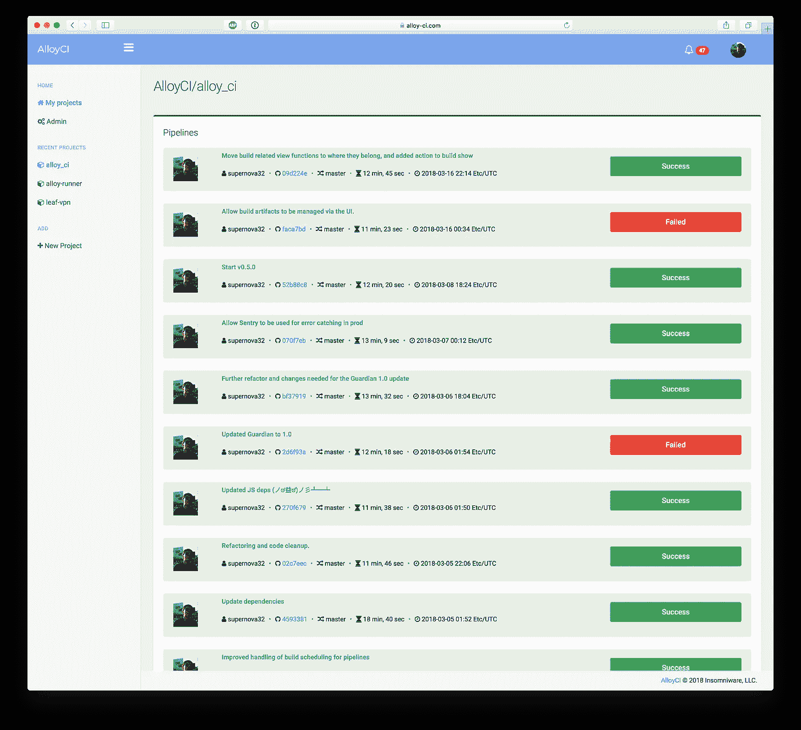
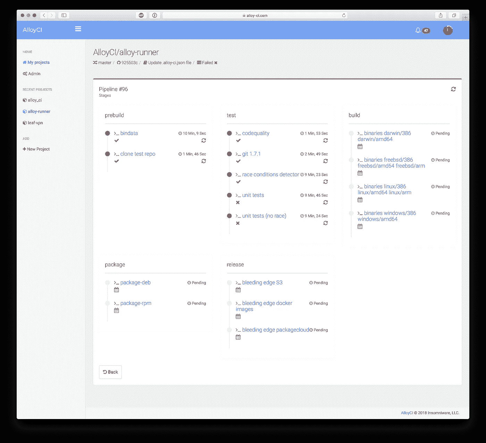
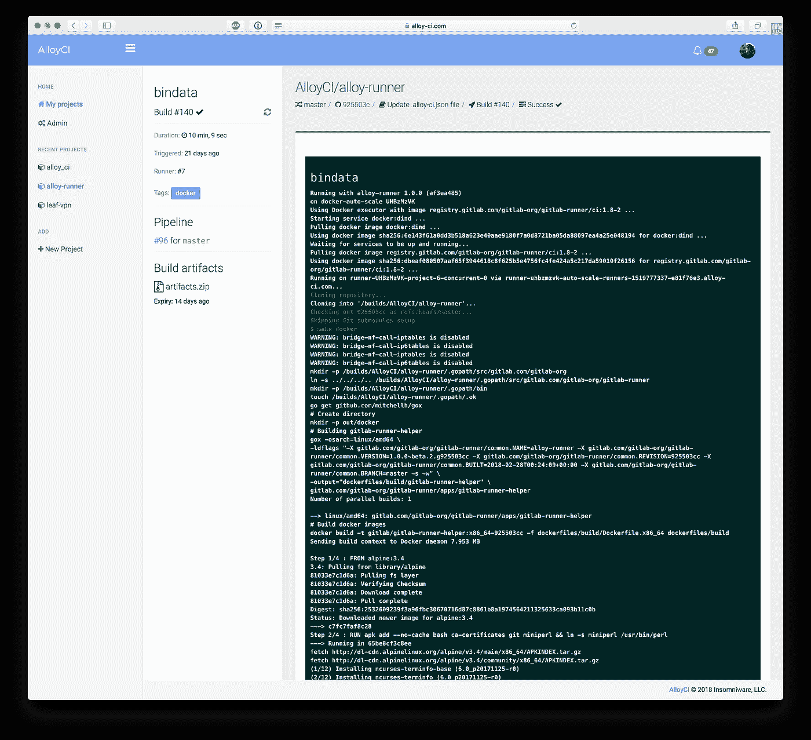
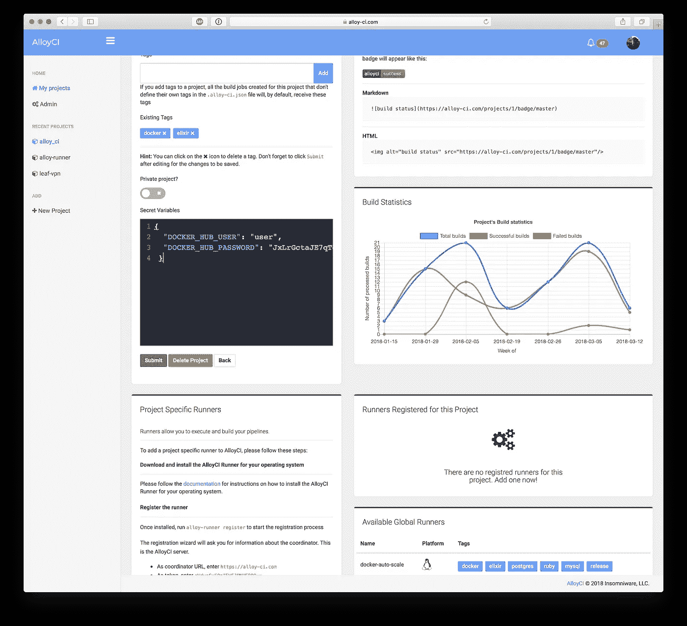

# AlloyCI v0.5 发布！

> 原文：<https://medium.com/hackernoon/alloyci-v0-5-released-4d42520ad626>

## 未来的重大变化

Photo by [Kristopher Roller](https://unsplash.com/photos/zepnJQycr4U?utm_source=unsplash&utm_medium=referral&utm_content=creditCopyText) on [Unsplash](https://unsplash.com/search/photos/sky?utm_source=unsplash&utm_medium=referral&utm_content=creditCopyText)

本周是 [AlloyCI](https://hackernoon.com/tagged/alloyci) 的[首次提交](https://github.com/AlloyCI/alloy_ci/tree/b828881ea982f1a8598aa8f7282e96fa72c55498)一周年，为了庆祝它，我们发布了 v0.5 [版本](https://hackernoon.com/tagged/version)。有了它，我们离梦寐以求的 1.0 版更近了一步，届时 AlloyCI 将完全准备好(并完全支持)用于生产环境。

这个版本的 AlloyCI 有很多变化。最引人注目的是新的和改进的设计，以及对 GitHub Enterprise 的支持。

## 设计变更

在过去的一年里，我们一直使用 CoreUI 作为设计的基础。一开始，它似乎是一个很好的“管理”模板，提供了很多功能。不幸的是，它开始变得过时，并且很快变得臃肿。它与 AlloyCI 配合使用的方式并不理想，看起来也不美观。

我们认为是改变的时候了。新的设计给人的感觉干净、现代，而且易于观察。

一些元素保留了下来，比如使用卡片来代表项目，以及使用面板来分隔相关信息:

New projects view

使用颜色来表示身份也保留了下来，但使用了新的 pantone:

New pipelines view (single project)

为了更好地说明管道的不同阶段，并快速概述管道中每个构建的状态，builds 视图进行了彻底的重新设计:

New builds view (single pipeline)

单一构建视图也经历了重大变化。现在，每个构建都有自己的页面，左边是关于构建的专用的、总是可见的信息，右边是整个构建的输出(如果构建正在运行，它会自动更新)。

New build view

项目设置视图没有太大的变化，但它看起来仍然更整洁，并且现在将相关信息更紧密地分组:

Project settings view

# 新功能

## GitHub 企业

这个新版本的 AlloyCI 还具有许多新功能。这个版本最大的特点是对 GitHub Enterprise 的支持。日前 GitHub 发布了 2.13 版本，支持 GitHub Apps。这意味着 AlloyCI 将最终与 GHE 兼容。在对系统与 GitHub 通信的方式做了一些改变之后，主要是使端点可配置，实现了完全的兼容性。

## 创建

构建现在可以单独重新启动，而不必重新启动整个管道。将保留旧的生成数据，并为新的生成创建新的作业。

## 构建工件

其他主要的新特性围绕着构建工件。在此版本中，我们添加了:

*   工件可以从构建视图中管理和下载
*   过期的工件将每天被清理一次(或者以任何可配置的时间间隔)
*   如果用户愿意，文物可以永久保存

# 错误修复

此版本还修复了几个错误:

*   取消管道时，所有构建都被标记为已取消，现在只更新`created`、`running`或`pending`的构建。
*   升级到 Guardian 1.0 后，无法向现有用户添加其他身份验证方法。这个问题已经解决了。

这是这个版本的基本内容。未来的路线图包括为构建工件添加 S3 桶支持，这样它们就可以上传到 AmazonS3 或数字海洋空间等服务中。随着这种支持的实现，在 Heroku 上托管的 AlloyCI 安装也可以使用构建工件，这在现在是不可能的。

下次见！❤️