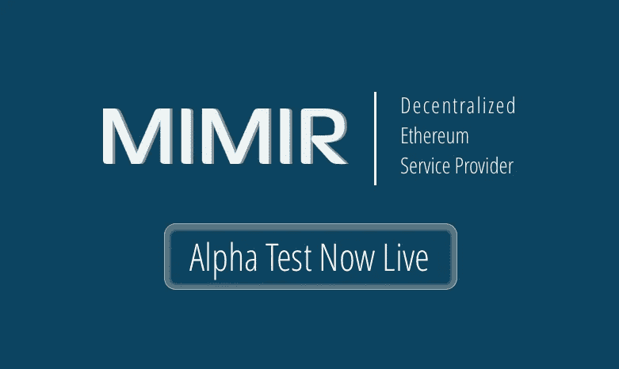

# MIMIR 区块链到互联网(B2i)桥的 Alpha 现已上线

> 原文：<https://medium.com/hackernoon/alpha-for-the-mimir-blockchain-to-internet-b2i-bridge-is-live-4c245e2bb66b>

**加入我们，通过利用现有节点为所有者创造创收机会，将“区块链带给链外的人”。**

作为全球首家去中心化以太坊服务提供商(DESP)，我们自豪地宣布 MIMIR 区块链解决方案的旗舰基础设施平台 MIMIR [区块链](https://hackernoon.com/tagged/blockchain)至互联网(B2i)桥的 alpha 版本现已在[alpha . MIMIR block chain . Solutions](https://alpha.mimirblockchain.solutions/)上线。MIMIR B2i Bridge 允许从任何联网设备直接访问基于以太坊的分散式应用生态系统，无需第三方信任，从而将区块链带入“脱链”状态；需要有限的或者在某些情况下不需要预装软件。

通过利用现有节点，MIMIR 桥将帮助 B2B 和 B2C 客户提高经济性，加快交易时间，并解决容量问题。这种创新的方法还将解决当前区块链的问题(即安全性、可伸缩性和可访问性)。

MIMIR B2i 令牌是 MIMIR B2i 桥解决方案背后的价值机制，将超越云和传统的区块链即服务(BaaS)产品。我们的令牌将会是第一个。作为加密货币的交换，用户将获得 MIMIR B2i 令牌，作为其自己的基础设施。我们的 B2i 代币将用于积极参与网络，旨在成为持有者的收入来源。

那为什么现在释放这个阿尔法？在数字身份被大规模破坏的时候(例如，最近的 Equifax、Yahoo，甚至是奇偶校验数据泄露)，我们认为区块链需要它的“网景”时刻来更容易、更安全地满足超过供应 48，000%的节点需求。

据 MIMR 首席执行官尼古拉斯·菲耶罗称，

> 归结起来就是有机会奖励诚实的人。听起来很简单，但是我们的 MIMIR B2i 桥可以做到这一点，它通过利益验证的证据来阻止恶意行为。说到底，我们认为区块链 [*技术*](https://hackernoon.com/tagged/technology) *可供每个不担心安全性或潜在可扩展性的人使用是至关重要的。如果可以，那将是区块链真正的网景时刻。”*

我们 alpha 测试的第一阶段现在对所有开发者开放。那些对早期 alpha 测试的整体改进做出贡献的参与者将有资格获得奖励，包括通过参与我们 alpha 测试的第二阶段获得更多奖励的邀请。

免责声明:本网站提供的内容是关于区块链世界相关主题的观点和评论。出于任何原因，您不打算也不应该依赖它，它是按“原样”提供的，没有任何类型的保证。您对自己的决定负责，并对任何内容进行正确的分析和验证。