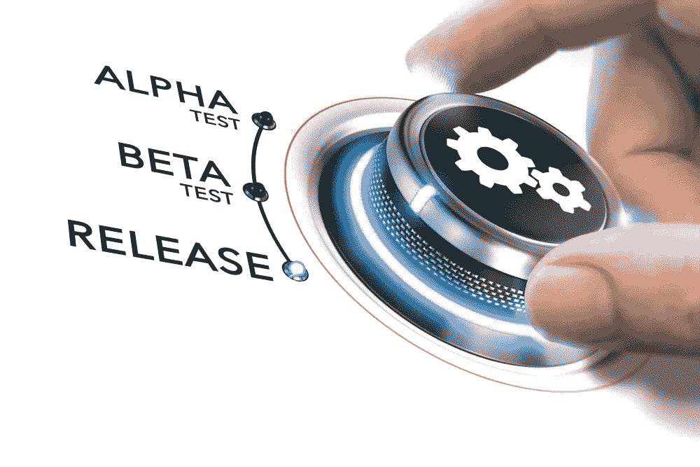
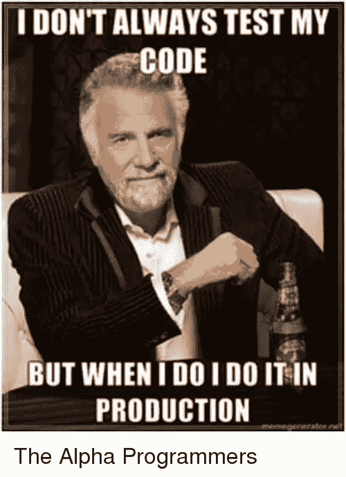

# 测试新应用程序的 Alpha 与 Beta 对比

> 原文：<https://medium.com/hackernoon/alpha-vs-beta-testing-a-new-app-42dd2f8f99e7>

> **TL；DR:** Alpha 测试是当一个封闭的团队尝试你的软件时；
> Beta 测试是指一群普通公众使用你的应用程序的早期版本；
> 
> 两者在软件开发中都很有用，并且服务于不同的目的；对经验哲学的一次简短探索可以提高你的测试。

应用程序开发人员可能犯的最大错误之一是没有分配足够的时间和资源进行测试。这不是一个愤怒的完美主义者的咆哮，研究表明 [88%的人停止使用有问题的应用](https://www.applause.com/blog/app-abandonment-bug-testing/)。

从商业角度来看，我想不出比失去一款应用或 SaaS 产品的 90%早期用户更糟糕的噩梦了。这些客户往往有很高的获取成本，失去他们可能会成就或毁掉一家自举式创业公司。

From [xkcd](https://xkcd.com/1428/)

作为 eTeam 的首席执行官，我强调测试对每个客户的商业重要性，并强调质量不应该被牺牲。虽然快速行动和打破常规是一个朗朗上口的口号，但更冷静的研究表明，创新者不会快速行动和打破常规。

让我们来看看希腊字母是如何入侵测试场景并切入流行语的。

# 什么是阿尔法测试？

不，alpha 测试不是决定你的代码有多酷。请不要让任何“阿尔法”程序员用这种方法来测试:

From [SIZZLE](http://onsizzle.com/i/idont-always-test-my-code-but-when-i-doi-do-20190297)

Alpha 测试是指你在一个封闭的团队中测试你的产品，通常是在现场和严格控制的条件下。这让你对发生的事情有了很大的控制，避免了泄露，并让你收集了大量的数据。明显的缺点是 alpha 测试的逻辑通常会限制您可以运行测试的组大小。

在现实世界中，alpha 测试通常是这样进行的:办公室里不参与应用程序开发的人被要求试用它。找到不熟悉应用程序的测试人员非常重要，因为这可能会让他们产生偏见。生产团队观察测试人员如何通过应用程序，登录并做他们需要做的任何事情。

这种逻辑是非常明显的，如果一个 alpha 测试人员在做某件事时有困难(做这件事的按钮在哪里？！？)，潜在用户也会遇到完全相同的问题。这个阶段对开发人员来说很重要，因为他们从测试人员那里得到直接的反馈，可以问问题，澄清问题并立即看到结果。

如果在测试过程中出现了很多 bug 和问题，Alpha 测试可以迭代完成。无论花多少披萨和啤酒来贿赂其他同事参加你的测试，都是你的主要限制因素——当然，还有时间。

不用说，每个应用程序都需要 alpha 测试。这并不一定是不祥的预感，大多数时候 alpha 测试是友好的！)第二双眼睛。

# 测试:把你的脚趾伸进水里

当你有了一个 MVP 的工作版本——一些粗糙的地方是可以的，但它需要实际工作，你就为 beta 测试做好了准备。简而言之，这是您的应用程序的非公开、有限发布。

组织一次好的测试需要获得一个目标用户的样本来安装应用程序并开始使用它。在这一轮测试中，您作为测试工程师的关注点发生了微妙的变化。你不能像在 alpha 测试中那样看着眼球，听着嘀咕的脏话。分析在这里扮演着更重要的角色。

在 beta 测试期间，确保分析显示应用程序的功能(如正常运行时间、加载速度等。)以及用户如何与应用程序进行交互。他们是否使用了所有的功能，他们是否能轻松导航，或者您是否注意到了瓶颈？

用户反馈是获取信息的另一个重要途径。尝试鼓励测试人员提交错误报告。尽管发现一个 bug 令人烦恼，但最好现在就修复它，而不是在发布你的 MVP 之后！

当然，当你的 beta 测试成功，你准备好应用程序上线时，总会有这样的感觉:

From [Giphy](https://giphy.com/gifs/vspink-yes-score-woot-ZUOlQXqO0qbAI)

# 顺便说一句，任何人都可以成为测试者

你知道吗，基本上任何人都可以成为 beta 测试者，即使你不是一个技术呆子>假设你爱苹果，你可以通过加入他们的 [beta 测试程序](https://beta.apple.com/sp/betaprogram/welcome)比你的朋友早几个月获得最新的 iOS。几乎每个科技公司都有类似的项目，这是一种帮助开发者开发更好产品的有趣方式。

# 向哲学致敬

在测试软件时获得最佳结果需要戴上正确的哲学帽子。一些最好的后端程序员是生活在抽象世界中的铁杆理性主义者。测试人员必须是激进的经验主义者。即使某个想法很棒，逻辑上行得通，它也必须经得起考验。这就是为什么我建议优秀的程序员[学习理性主义和经验主义](https://hackernoon.com/is-computer-engineering-really-going-to-be-automated-e6111412432e)。

这就是为什么 alpha 和 beta 测试如此重要，不仅仅是为了推出一个没有错误的应用程序，也是为了创造一个可持续的业务。想法和理论是伟大的，但事情必须在现实世界中工作。这就是为什么我们在 [eTeam](https://eteam.io/hireus) 有一种严格测试的文化，我们自己也是企业家，明白在构建你的应用时，测试不是一个可以逃避的地方。

最初发布在 [eTeam 的博客](https://eteam.io/blog/alpha-vs-beta-testing-a-new-app/)上。