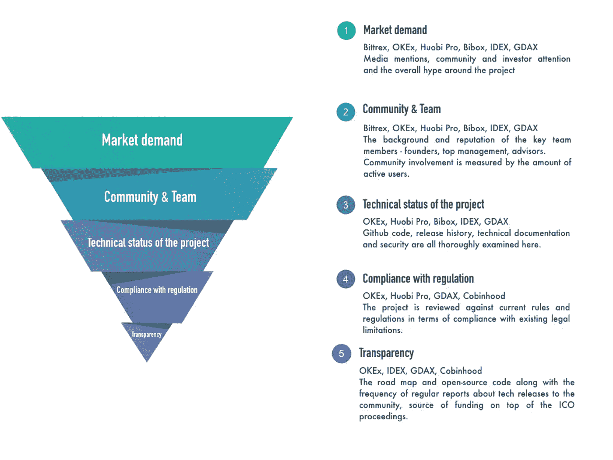

# Altcoins 黑名单:揭开秘密的面纱。

> 原文：<https://medium.com/hackernoon/altcoins-blacklist-lifting-the-veil-of-secrecy-cb8218750c26>

## 奥尔加·格里尼纳和瓦西里·苏马诺夫

随着市场下滑，加密交易所开始寻找更多的 [*创新方式*](https://www.bloomberg.com/news/articles/2018-09-11/crypto-exchanges-embrace-controversial-practices-as-demand-eases?srnd=technology-vp) *来维持运营。代币上市的领域长期以来一直因臭名昭著的谣言而过热:一位首席执行官泄露的* [*电子邮件*](https://news.bitcoin.com/binance-denies-400-btc-listing-quote-accuser-responds-you-are-a-fking-liar/) *指责币安向 400 名 BTC 收取代币上市费用，这可能是追逐这些交易量时事情变得多么疯狂的最新例子。上周，币安首先从交易平台上移除了 4 个不太幸运的替代币——BCN、CHAT、ICN、TRIG，随后发布了新的上市政策，最终据说是为了使上市费用透明。随着替代硬币市场出现红色和越来越多的可疑硬币，难怪加密交易所在选择硬币和进一步审核方面变得越来越挑剔。然而，即使有了最近受到称赞的币安慈善倡议，仍然有一些模糊的地方，比如为什么要引入捐赠费用？为了阐明上市的标准和过程以及摘牌的危险信号，我们坐下来与交易所的代表交谈，了解他们对现状的立场。*

**通用山寨币——密码产业的诅咒**

2017 年加密繁荣的主要驱动力无疑是在以太坊上运营的初创公司的指数级增长发行 [ERC20 令牌](https://cointelegraph.com/explained/erc-20-tokens-explained)。当然，标准 ERC20 协议的流行是由某些因素造成的:在以太坊网络上引导 dApps 的便利性和简易性，以及在分散网络实际推出之前令牌增长价值的潜力。这一浪潮肯定会产生后果:市场不够成熟，无法提供维持交易量所需的流动性，这让大多数加密交易所别无选择，只能让上市成为一个更复杂、更具选择性的程序，以保护这个空间免受通用令牌大军的冲击。现实情况是，惊人的 95%的初创公司引入了与他们的业务无关的令牌数字空白引入交易所只是为了操纵资产价格运行令人发指的[泵和转储计划](https://cointelegraph.com/news/pump-and-dump-in-crypto-cases-measures-warnings)。结果，上市程序变成了黑市，中介和游说者提供服务，最终迫使交易所提高上市费用，这可能是为了抵制新鲜出炉的“区块链创业公司”的浪潮。在 2018 年的过程中，没有太多变化:极度选择性上市的趋势仍然存在。此外，在过去的几个月里，大多数交易所的流动性一直在下降，这使得新代币的上市相当冒险。此外，有一份[报告](https://cointelegraph.com/news/volumes-on-most-major-cryptocurrency-exchanges-are-fake-or-inflated-study)清楚地证明了公开贸易量数据的虚假性，即实际上它们甚至更低。

**上市政策之谜**

当谈到定义上市标准时，事情变得模糊起来，因为迄今为止没有一家交易所公开发布这些标准。为了解决这个难题，我们分析了交易所最近在社交媒体上发布的公告，并采访了交易所的代表。结果，提取了这 5 个标准:

**交易所代表给出裁决**

然而，在现实中，事情比在 Twitter 上发布的声明要复杂得多。第一手内幕信息总是很有用，这就是为什么我们坐下来与 Coinmarketcap、Cobinhood 和 Exmo 的代表交谈，询问他们以下 8 个问题:

1.您是否在查看该代币是否已经在任何其他交易所交易过，以及它的交易量？

2.你是作为流动性提供者在运营吗？如果是，具体针对哪些实体？

3.你是否计划推出新类型的代币，比如 ERC721 和稳定硬币？

4.什么类型的代币在列表中占主导地位？公用事业、资产、加密货币？

5.当有人向你提出新的代币时，你会得到钱吗？你有什么反应？

6.最后，你是否考虑将表现不佳的代用币退市？

**上市门槛**

有些答案原来是躺在表面上的。因此，当被问及上市门槛时，[Alfa Tsai](https://www.linkedin.com/in/alfa-tsai-70a933115/)—[cobin hood](https://cobinhood.com/)的上市服务项目经理提到*在 ICO 筹集合法金额的资金，以确保该项目建立足够的流动性，*同时完全符合 SEC 的规定，*即由律师签发的 MOU 应特别声明上市的代币不是证券代币。这并不一定意味着代币不会上市，但是，美国用户将被禁止购买。然后是对智能合同和白皮书的审查，最后是对社交媒体和社区外联的检查。[负责](https://www.linkedin.com/in/djhorowitz/) [Coinmarketcap](https://coinmarketcap.com/) 内容的 Dan 也提到了*糟糕的网络流量、在社交媒体上糟糕的参与度、项目背后没有可证实的团队成员，以及主要危险信号中缺乏围绕项目的刺激*。*

**都是关于市场需求和公关**

最终，看起来交易所在决定代币的可信度时首先要考虑的是用户需求和潜在的公关利益。一个新增加的代币会带来额外的曝光率，提升交易所现有的社区吗？就公关而言，交易所和项目都受益于上市。然而，这个等式取决于它们中任何一个的受欢迎程度，令牌和交换社区以各种模式交互，一个支配另一个。自然，币安在列出一个缺乏追随者的令牌时几乎没有收获。无论是哪种情况，港交所总是会占据主导上市条款的强势地位，这一点可以从有关上市贿赂的现有传言这一事实得到证明。看起来我们在这里遇到了一种“第 22 条军规”的情况，因为需求与社区支持挂钩，而事实上，正是交易所最终围绕新推出的令牌建立了社区。在币安上市之前，你听说过很多代币吗？不太可能。交易所通过无缝地指出这个或那个令牌具有最佳投资潜力，在许多方面引导着全球加密社区。这种现象在这样的时候变得最为重要，因为此时市场出现亏损，交易量下降。

**社群才是王道**

很自然，在屎币的世界里，在对用户群的竞争日益激烈的情况下，每一家交易所都在维护自己产品的质量。对于那些更难留住用户的小型交易所来说尤其如此，因为它们的上市要求变得更加广泛。或者至少他们是这么说的。例如， [Exmo](https://exmo.com/) 提到了*庞大的 Telegram 用户群和每天至少 25 万的交易量，以及工作开源代码和团队*作为他们的首要标准。更重要的是，我们被告知，到目前为止，有 50 个项目符合这些初步要求，但有待进一步审查。

好吧，那么关于私下交易代币的指控呢？我们没有例外。我们的标准程序是安排与首席执行官或创始人会面，如果可能的话，当面了解对方。我们确实为我们的声誉而努力。Coinmarketcap 的 Dan 继续说道:*‘一个代币被交易所在 CMC 上挂牌是我们在挂牌时考虑的因素之一。这只是我们确保通过从受支持的交换中提取数据来准确更新卷的一种方式。我们在 7 月份取消了交易量的要求，并将专注于其他指标，我们将在上市代币时逐步发布这些指标。*

**ERC 721 正在发号施令**

当被问及探索新的代币类型，如 [ERC721s](https://cointelegraph.com/explained/non-fungible-tokens-explained) 和[稳定硬币](https://cointelegraph.com/news/stable-coins-analysis-is-there-a-viable-solution-for-the-future)时，交易所代表证实，不可替代的代币确实将在全球业务流程中发挥一些重要作用。相应地，*他们最有可能成为上市策略的主要焦点之一，前提是有像样的社区和流动性做后盾。*稳定硬币的一个显著特点是，交易所将它们视为资金存取的额外工具，最终导致交易量增加。*“尽管如此，硬币的合法合规性和稳定性仍是我们的首要任务，”* Exmo 总结道。他们还透露了即将在交易所推出第一台 ERC721 的计划。CMC 支持确认不可替代代币和稳定硬币上市计划的观点，因为他们继续看到更多的代币和稳定硬币，对它们的兴趣也越来越大。自然，某些代币在主要市场参与者中的受欢迎程度已成为主要驱动力。

**更多公司即将退市？**

显然，目前市场上大量的“死亡”代币是退市成为常规的生动前提。Bittrex 在一月份就开始了这种做法，现在每隔一个月发布一次关于待处理市场移除的定期更新。5 月份，Poloniex 紧随其后，创下了 17 个替代硬币的退市记录。没有任何解释，除了含糊地提到此后用户基数小而不足。自然，没有足够的资金来运作，任何交易所都无法运作，所以大多数人都在考虑 token 产生持续佣金流的潜力:交易越多，交易所赚取的佣金收入就越多。

Cobinhood 的 Alfa Tsai 透露，那些交易量低且不活跃的代币会自动进入风险群体。他将*“骗局令牌”定义为不及时跟上技术发展进度，没有可用的产品。*他没有指明任何具体的标志，但他证实*一些人最近被除名，更多的人将被解雇。然而,* Coinmarketcap 采取了一种相反的方法，声称他们更喜欢总体上避免摘牌，因为他们认为被放弃的项目仍然应该有公平的代表性，形成用户在关注加密货币领域时应该看到的完整画面。

底线呢？无论规模大小，任何交易所都在努力扩大用户基础，同时获得稳定的流动性。毫无疑问，今天，就技术实现和经济潜力而言，稳定的硬币和不可替代的代币正成为最有前途的数字资产。因此，大多数交易所的上市政策源于关键市场参与者对代币产生价值的需求。至于除名的例子，现在看来，更多的头将滚动。如果说有什么不同的话，那就是失去社区，这是几乎任何一家新成立的初创公司都无法承受的。这要么是他们的重大失败，要么是自然选择，这在该行业目前的情况下是不可避免的。

继续读:[https://t.me/technomadnotes](https://t.me/technomadnotes)