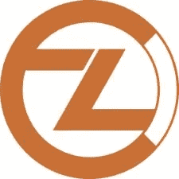
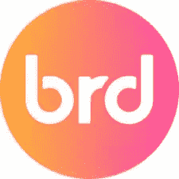
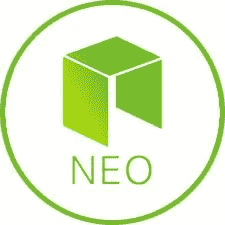

# 本周值得关注的另类硬币:希尔、ZCL、BRD、尼奥和瓦斯

> 原文：<https://medium.com/hackernoon/altcoins-worth-focusing-on-this-week-hire-zcl-brd-neo-and-gas-b0c22a18d0da>

下周值得立即关注的替代硬币是[租金](https://hitbtc.com/exchange/HIRE-to-ETH)、 [ZCL](https://coinmarketcap.com/currencies/zclassic/) 、 [BRD](https://coinmarketcap.com/currencies/bread/) 、[尼奥](https://coinmarketcap.com/currencies/neo/)和[汽油](https://coinmarketcap.com/currencies/gas/)。这些加密货币在短期内有重大事件、投机、公告和演示，将对其价格产生积极的影响。在这五种加密货币中，分析指出租用的短期回报最高(市值最小，价格跌幅最大)。这些硬币中的每一个都将是本周的重要考虑因素，因为它们以折扣价提供了完美的购买机会。

# 当前市场

整个星期市场上都充满了 FUD。这为精明的投资者提供了一个独特的买入机会。低买高卖。如果你没有“高卖”，现在还有时间“低买”报道援引历史上最著名的家族之一的罗斯柴尔德男爵的话说:

买入的时机是街上血流成河的时候。

这句 18 世纪的名言充分说明了今天的市场。如果你在比特币价格为 18000 美元时追逐市场，现在它的价格是这个价格的 50%,应该会有更多的资本流入。当人们害怕时，投资者应该积累，当人们欣喜若狂时，是时候卖出了。为了击败比特币的回报，我们专注于替代币。alt 在调整期间下降更多，但在反弹期间增加更多。

# HIREMATCH。IO——租用(合作、演示、新的交流和象征性燃烧)

HIRE token 在 HitBTC 上的交易量最高，其交易价格仅为几周前达成的 ICO 价格的一小部分。短期内提供如此强劲购买机会的原因是他们的定价和即将到来的新闻。我有机会与创始人之一 Armando Pantoja 直接交谈，他向我介绍了招聘方面一些非常重要的最新情况。这些更新预计将极大地影响短期和长期的价值和职位的雇用。

HIRE 即将宣布与外界猜测已久的 Recruiter.com 的主要合作条款。由于细节尚未正式公布，这是一个与现实世界中的公司合作的绝佳时机。Pantoja 将于 2018 年 4 月 18 日在拉斯韦加斯向 monster.com、ziprecruiter.com 和 indeed.com 的首席执行官和代表们展示。如果宣布与另一个寻找[区块链](https://hackernoon.com/tagged/blockchain)整合的主要招聘平台进行第二次或第三次合作，预计会出现巨大的北方价格趋势。在没有宣布具体细节的情况下，雇佣的硬币燃烧也在地平线上。

HIRE 是区块链招聘行业的首次整合，即将拥有现实世界的合作伙伴。它们只需 ICO 价格的一小部分(最初租用 1 次=2200 次，现在是 1 次=10，000 次)。他们的创始人将在一个月后向 ziprecruiter.com、monster.com 和 indeed.com 的高层管理人员介绍情况。最后，他们将宣布他们的计划，象征性地烧掉剩余的员工。象征性的焚烧，与 Recruiter.com 的合作关系(以及更多？！)，未来的交易所上市，在大型会议上在招聘负责人面前的演示，对新买家来说很棒的后 ICO 定价，以及刚刚修正的市场，为密码提供了独特的短期购买机会，很容易成为长期持有或短期投资。

# ZCLASSIC — ZCL (BTCP，期货分叉，低买高卖)

低买高卖。在过去的两周里，哪个硬币比其他硬币跌得多？ZCL。 [ZCL](https://zclassic.org/) 在比特币专用分叉之前交易价格超过 200 美元。ZCL 计划与比特币合作创建比特币私人(BTCP)，并于一周前成功结束。交易所仍在建立对 BTCP 钱包的支持，但许多个人已经成功地要求他们的 BTCP。BTCP 比 BTC 和 BCH 更快，同时提供了许多 BTC 人渴望的隐私功能。如果你没有 BTCP，它可能是迄今为止最好的比特币分叉，提供速度、BTC 品牌和匿名性。然而，让 BTCP 如此伟大的原因与本周让 ZCL 暴跌的原因类似。

ZCL 从 200 多美元的高点跌至不到 10 美元的低点，跌幅超过 95%。这是因为 BTCP 的价格被计入了 ZCL 的价格。许多个人和分析师预计 BTCP 的价值超过 100 美元，两者之间的差异就是 ZCL 的价值。ZCL 仍然保持着梦幻般的隐私技术，就像在大多数抛售中价格被高估一样。在此抛售期间，价格反应过度，然后市场受到 FUD 的打击。这造成了 BTC 价格的进一步下跌，推动低价竞标随之下跌。ZCL 受到了过度反应和 BTCP 福克抛售的打击；紧接着是一次秘密的市场调整。这使得 ZCL 处于一个低买高卖的绝佳位置。严格来说是推测性的，许多团队正在讨论采用 ZCL，将隐私技术添加到更具实用性的硬币中。如果这种情况发生，ZCL 的价值将会暴涨，类似于 BTCP 分叉之前发生的情况。

# 面包——BRD(token fest 赞助商)

在投资加密领域时，关键是在炒作蔓延之前击败“其他”投资者。 [BRD](https://token.breadapp.com/en/) 是 TokenFest 的代币赞助商，token fest 是三月最大的加密赛事。然而，BRD 平台和应用程序目前只有非常基本的功能。该应用程序确实很漂亮，但很少可以用它来完成。然而，最近几个月，他们已经极大地改进了他们的平台，增加了使用信用卡购买密码的能力，这是市场上最低的百分比之一。他们还暗示，除了比特币之外，钱包的界面还会增加其他硬币。面包钱包是一款适用于不同移动平台的移动钱包，允许用户将他们的密码带到任何他们想去的地方。

像 TokenFest 这样的大型活动为发布惊喜公告提供了绝佳的机会。几个月来，BRD 一直暗示将莱特币(LTC)和以太币(ETH)以及基于 ERC 20 的代币添加到他们的钱包中。尽管是推测性的，但他们很可能会在 10 天内为 TokenFest 会议发布一个重大声明。即使没有重大宣布，下一步也将是将这些其他令牌整合到他们的平台中。当 BRD 应用程序正式可以持有 LTC、ETH、ERC-20 支持的令牌等时，BRD 的价格和效用将显著增加。效用创造价值，当 BRD 应用增加功能，允许兑换 BRD 进行特定促销时，BRD 的价格将做出相应反应。

不管是哪种催化剂推动了 BRD 价格，短期 BRD 持有者都应该非常高兴。会议和赞助宣传将提供一个短期的泵和退出点，或者投资者可以选择通过宣布一个主要硬币的 BRD 应用程序的增加来持有。不管怎样，BRD 看起来是一个强劲的短线投资。

# 近地天体和气体(每月时间)

近地天体的价格飙升，导致近地天体持有者被空投到 ONT。自从空投市场修正后，NEO 在 ONT 空投者逃离时有少量抛售，现在准备好了一个完美的买入机会。近地天体通常被称为亚洲以太坊，随着近地天体平台上的 ico 越来越多，它们应该会继续发挥重要作用。如果放在钱包里或放在特定的交易所，NEO 会提供每日股息，给持有者额外的好处。为了在 NEO 网络上进行交易，个人用户使用 GAS。每月一次，在同一天向所有币安持有者提供天然气。特别是在那一天以及随后的几天，汽油价格大幅下跌，因为那些持有价值 5 美元的人卖出了它，即使价格是 4.40 美元。天然气 5 天前提供给持有者，价格下跌，然后 BTC 下跌。

天然气具有很强的周期性，尤其是在币安。既然抛售发生在本月初，预计在接下来的 20 天内，币安的下一次天然气股息之前，天然气的反弹将好于大多数情况。同样，近地天体向北移动的速度应该比天然气稍慢，但近地天体确实提供了天然气红利。当 NEO 宣布他们的 ico 的另一次空投或月底更快地接近时，GAS 和 NEO 应该以类似的方式向北移动，GAS 稍微超过 NEO。

# 结论——购买机会很多

目前的市场状况充满了绝佳的购买机会。租金低于他们的 ICO 价格，有消息称，他们的价值可能在短期内轻松翻三倍，同时可能是非常强劲的长期投资。ZCL 正处于前所未有的低谷，另一个开发团队可能会抓住他们，并将他们的技术应用于一种类似的需要隐私功能的主要加密货币。BRD 将在本月主办一次大型会议，并且很快会有许多重要的应用更新。如果你想在三月底之前寻找一个退出点，或者想长期持有 NEO，NEO 和 GAS 的位置非常适合月中购物。这些特定的密码具有巨大的潜力，希尔，ZCL，BRD，近地天体和气体本周领先。

*阅读国王之前的文章，了解他目前推荐哪些 ICO，或者直接与国王取得联系，可以在 Twitter (@JbtheCryptoKing)或者*[*Reddit*](https://redd.it/81hj5q)*(ICO 更新和每日报道)。*

**阅读原文或查看其他类似文章请访问:**[http://bitcoinist . com/5-altcoins-worth-paying-close-attention-for-March-10-2018-hire-zcl-brd-neo-gas/](http://bitcoinist.com/5-altcoins-worth-paying-close-attention-to-for-march-10-2018-hire-zcl-brd-neo-gas/)

*图片由 HireMatch、Bread、ZClassic、NEO、Pixabay 提供*

【Bitcoinist.com】免责声明:本文所表达的观点和意见仅代表作者本人，并不代表其观点和意见。本文中的主张不构成投资建议，也不应被视为投资建议。