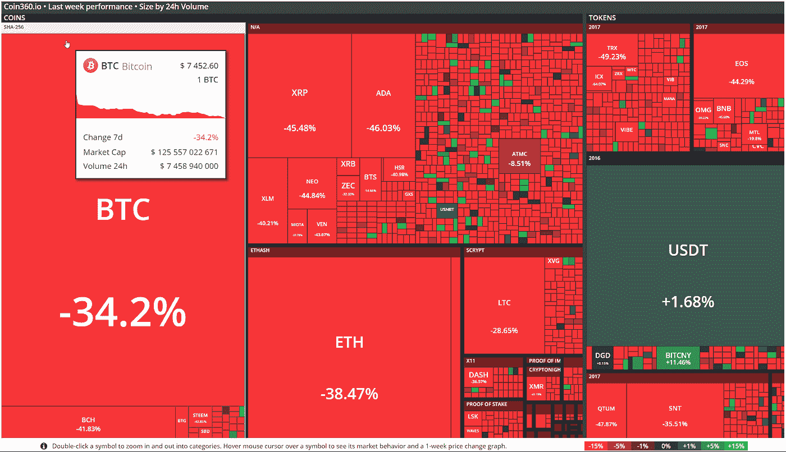

# 阿尔特。资本周刊-加密中的变化-2018 年 2 月 29 日至 5 日

> 原文：<https://medium.com/hackernoon/alte-capital-weekly-what-changed-in-crypto-29-5-february-2018-30c02773e86e>

欢迎来到我们的下一期“每周加密有何变化”。我们致力于分享我们上周在密码世界看到的最重要的东西。

> 每周一早上好好享受吧！

# 整个星期主要司机

对于 crypto 来说，这又是艰难的一周。我们已经看到了许多关于 crypto 的坏消息，这些消息导致一方面限制需求，另一方面限制购买(例如 facebook 广告禁令，阻止信用卡购买)，并通过增加不确定性(对 Tether 破产的怀疑)推动价格下降。

此外，信用卡封锁只会加剧价格下跌，因为许多美国客户事先并不知道这一点。因此，他们在过去的 3-4 天里买入，但后来交易被阻止了。人们从信用卡转向借记卡或银行转账还需要几天时间。其正常运行。

# 价格行为

在 2018 年开局火爆之后，cryptos 连续第二周暴跌，市值跌至近 3440 亿美元。是 2017 年 6-7 月以来最差的单周跌幅。本周多样化的投资组合没有帮助，因为几乎所有的硬币都有相似的感觉。从 30%到 50%不等。

Weekly drop in almost all coins and tokens (coin360.io)

# 最重要的事件

**银行禁止使用信用卡购物**

据《美国消费者新闻与商业频道》2 月 3 日报道，摩根大通、美国银行和花旗集团的客户不能使用信用卡购买加密货币。1 月 25 日，摩根大通向美国消费者新闻与商业频道证实，他使购买加密货币成为可能，但该政策很快被逆转。花旗集团还表示，它不再允许信用卡购买，并将在未来审查其政策，而美国银行也减少了信用卡购买加密货币，以应对政策审查。

**脸书禁止加密广告**

脸书禁止所有宣传加密货币的广告，以防止人们宣传经常与误导或欺骗性宣传行为相关的金融产品和服务。任何广告商(即使是那些有合法业务的广告商)都无法推广加密货币、ico 或二元期权。违反这一新政策的广告将在脸书和脸书销售广告的所有其他地方(Instagram，Audience Network)被禁止。企业家和投资者认为，此举不公平地惩罚了合法的加密货币公司和相关的加密产品。

**Bitfinex，聚光灯下的系绳**

世界上最大的加密货币交易所 Bitfinex 和 Tether(该交易所和许多其他交易所使用的令牌)受到美国商品期货交易委员会(CFTC)的审查。12 月 6 日，CFTC 给 Bitfinex 和 Tether 发了传票，要求他们做出解释。本周，彭博报道了这件事。Tether 声称其所有硬币都由美元支持(1:1 的汇率)。然而，专家们质疑每一项限制都有实际银行准备金支持的说法背后的准确性。

**AriseBank ICO 资产冻结**

美国证券交易委员会宣布，它已获得法院命令，停止并冻结可能是有史以来最大的首次硬币发行的资产。AriseBank 希望在两个月内融资 10 亿美元。法院批准了紧急资产冻结。SEC 已经指定了一家第三方托管机构来保护该公司的加密货币资产(比特币、莱特币、比特币、dogecoin 和 bitUSD)。

**南韩禁止匿名银行账户**

韩国禁止在加密货币交易中使用匿名银行账户。此举旨在阻止虚拟货币被用于洗钱等。每个匿名账户的持有人都必须以自己的名义将其与一个真实的银行账户关联起来。这些要求与美国的类似。未成年投资者和外国人也将被禁止在韩国开设加密货币账户。

**印度限制加密货币消费**

财政部长阿伦·贾特利(Arun Jaitley)表示，政府将尽一切努力停止在印度使用比特币和其他虚拟货币作为支付手段。他说，印度不承认它们为法定货币，并将鼓励区块链技术应用于支付系统。然而，很可能印度的交易所仍然是合法的，加密货币交易不会有问题。

> 我们的下一期“加密的变化”将于 2018 年 2 月 12 日发布

请访问我们的[网站](http://www.alte.capital)，在[推特](https://twitter.com/Alte_Capital)和[脸书](https://www.facebook.com/Alte.capital)上关注我们。