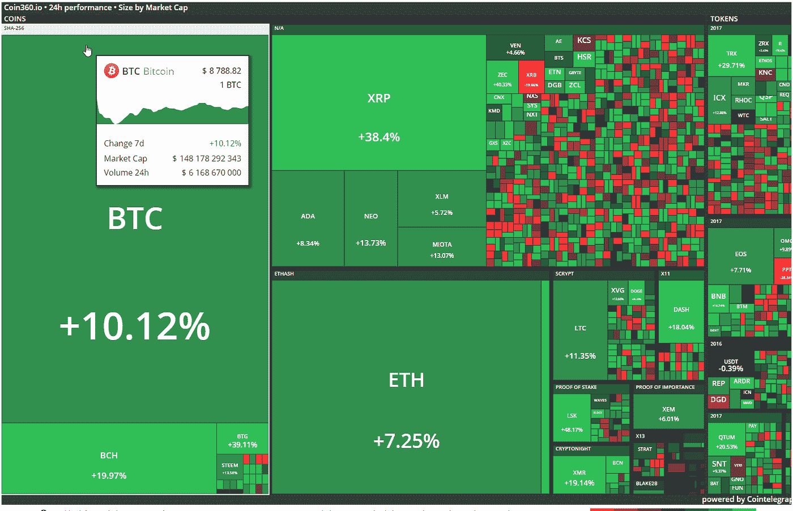
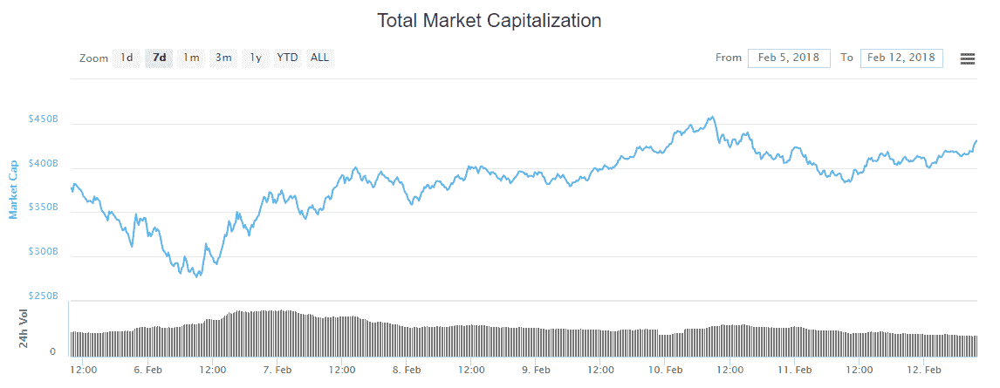

# 阿尔特。首都周刊:密码有何变化？2018 年 2 月 5 日至 12 日

> 原文：<https://medium.com/hackernoon/alte-capital-weekly-what-changed-in-crypto-5-12-february-2018-eca9dc8e9da5>

欢迎来到我们的下一期“每周加密有何变化”。每周一早上好好享受吧！

## 全周主要驱动因素:

上周我们可以观察到比特币暴跌至多周以来的最低水平后市场企稳，随后反弹。加密市场没有太多价格冲击消息。

更多发生在“经典”的股票和债券市场，我们可以观察到股市下跌和利率上升的结合。这样的组合在历史上和统计上都是罕见的。就股市从历史高点下跌的速度而言，最近的走势是前所未有的。然而，由于下跌的性质，许多投资者没有时间做出反应。

接下来的几天将会显示尽管股票问题，加密市场是否能遵循自己的方向。如果这将发生，我们可以看到有趣的时刻，加密可能成为良好的多样化选择(尽管波动性必须得到管理)。

## 价格行为

市值在下跌后也有所上升，在撰写本文时约为 4400 亿美元。

> 请访问我们的[网站](http://www.alte.capital)，在[推特](https://twitter.com/Alte_Capital)和[脸书](https://www.facebook.com/Alte.capital)上关注我们，分享这个故事。这对我们很有帮助。

# 最重要的事件

**法国和德国坚持对加密货币进行严格监管**

法国和德国财政部长仍要求对比特币和其他加密货币进行严格监管。据报道，法国财政部长布鲁诺·勒梅尔(Bruno Le Maire)和临时德国财政部长彼得·阿尔特迈尔(Peter Altmaier)给二十国集团(G20)的其他财政部长写了一封信，他们在信中认为，加密货币不仅对投资者来说有风险，而且还威胁到长期的全球金融稳定。

当然，这种情绪可以很容易地解释为来自传统金融机构的权威人士，他们正在经历来自快速增长和越来越受欢迎的加密货币市场的越来越大的压力，加密货币市场旨在扰乱传统金融结构。

欧洲央行董事会成员伊夫·默施(Yves Mersch)周四表示了他的负面意见，称加密货币不是货币，在可预见的未来也不会是货币。此外，国际清算机构(Agency for International Settlements)负责人奥古斯丁·卡斯滕斯(Agustin Carstens)表达了他根深蒂固的担忧，他要求各国央行关闭比特币，声称加密货币正在成为金融稳定的威胁。

**my ether wallet 创造者的新产品**

最初的开发者之一宣布，流行的以太坊 MyEtherWallet 网络钱包接口(MEW)发布了一个意想不到的替代产品——MyCrypto.com。围绕这些变化的环境继续在用户中引起许多怀疑和困惑。

MEW 已经成为最受欢迎的以太坊和 ERC20 网络钱包之一，并将与一个具有几乎相同界面的新项目一起继续存在。

**币安重返赛场**

受欢迎的加密货币交易所币安宣布，在技术问题导致重大延迟后，它完成了系统的现代化。该公司证实，所有功能将于 2 月 9 日恢复，并提供为期两周的 70%的交易费折扣。币安在短短六个月的时间里就在加密货币交易市场上赢得了国际声誉。

自 2018 年 1 月以来，币安是全球最大的交易平台。用户数量每小时增加 24 万。尽管在执行用于促进升级的复杂程序方面有所延迟，但币安通过社交媒体向用户保证，他们数据的完整性在任何时候都没有风险。该交易所在 2 月 8 日周四发生的技术问题期间，成功反驳了黑客攻击的指控。

**千禧一代更喜欢传统市场的加密货币**

根据 MarketWatch 的调查，超过 82%的 Y 一代人声称他们的投资决策受到了经济危机的影响。许多人失去了工作，同时也失去了大部分个人财产。只有 33%的千禧一代声称拥有自己的证券，而 X 一代(36-51 岁)和婴儿潮一代(52-70 岁)的这一比例分别为 51%和 48%。

虽然许多老年人认为动荡的数字货币市场对他们来说太过疯狂，但千禧一代更喜欢将钱投资于比特币和替代加密货币，而不是公认的资本和债券。许多年轻人在 2008 年金融危机后对传统股市感到失望，当时他们中的许多人刚刚高中毕业。

另一项研究询问参与者，如果他们只能投资一项投资，他们会将 5000 美元投资到哪里。13%的千禧一代选择了加密货币，而 45 岁至 64 岁的人只有 3%。

**SEC 和 CFTC 在美国开会**

与美国证券交易委员会(SEC)和期货商品期货委员会(CFTC)的会议于 2 月 6 日星期二举行。证交会主席 Jay Clayton 和 CFTC 主席 J. Christopher Giancarlo 的书面证词已经公布。在已经可以看到的长篇证词中，SEC 主席杰伊·克莱顿(Jay Clayton)重申了他对区分 ICO 作为证券和 ICO 作为其他金融工具的必要性的担忧，并指出市场在不久的将来仍然没有为比特币 ETF 做好准备。在这次活动中，来自不同司法管辖区的政治家和立法者表达了他们对加密货币监管方面国际合作的愿望，这应在 3 月份布宜诺斯艾利斯举行的 20 国集团峰会上集中进行。

> 我们的下一期“加密的变化”将于 2018 年 2 月 19 日发布